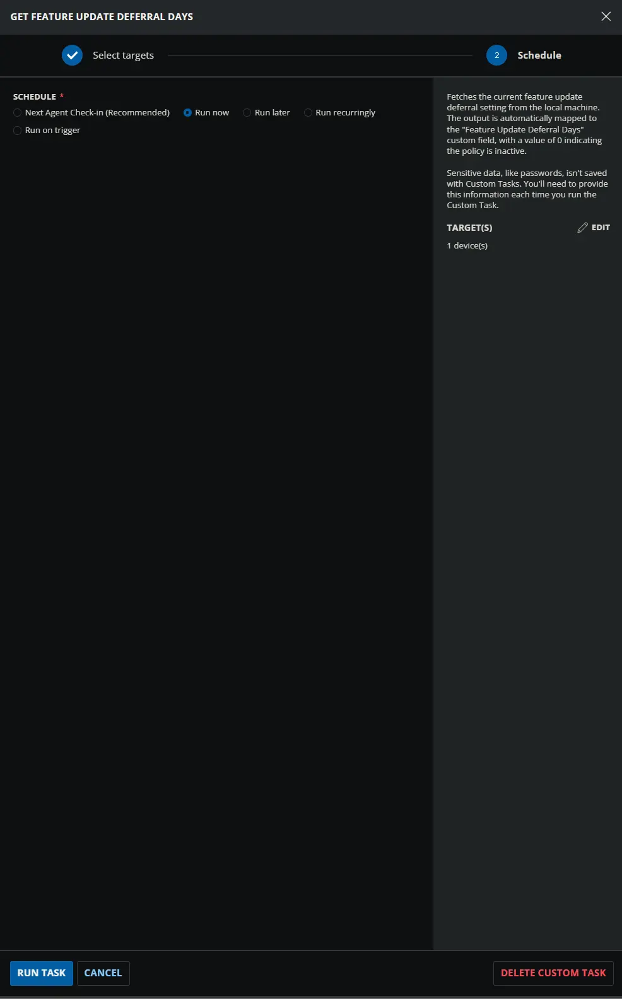
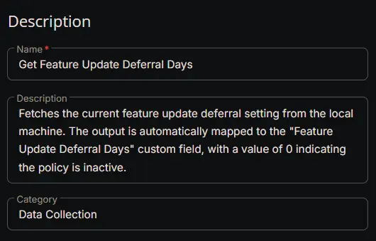
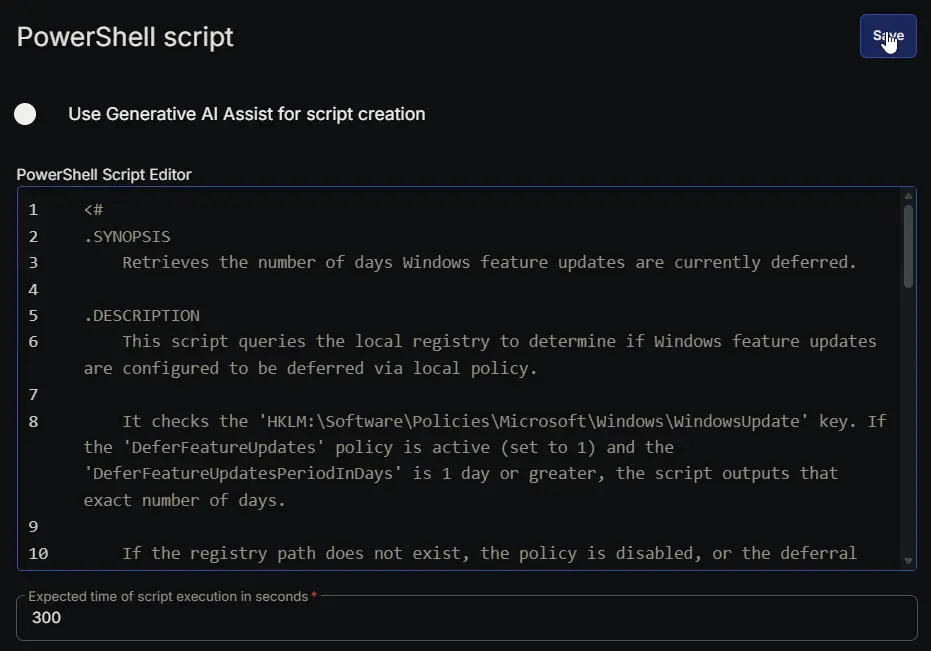
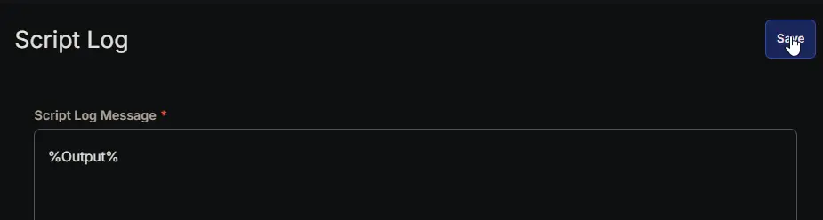
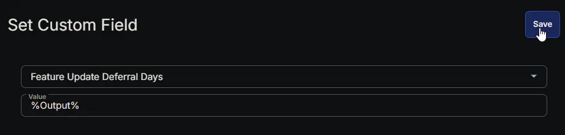
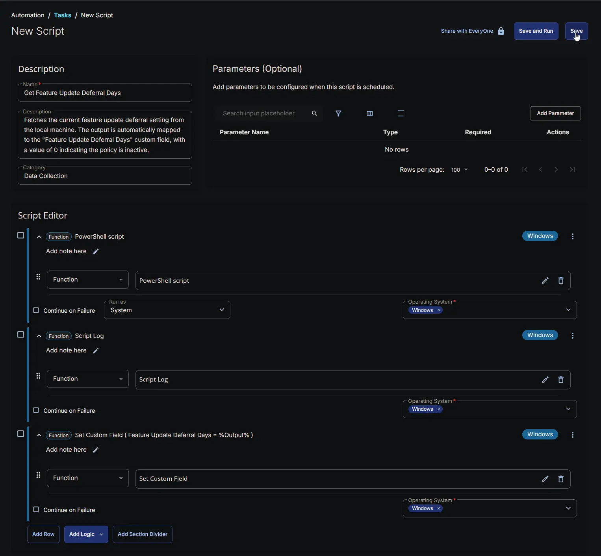
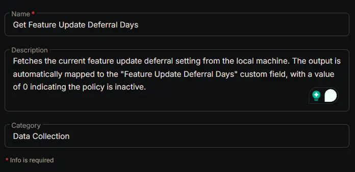
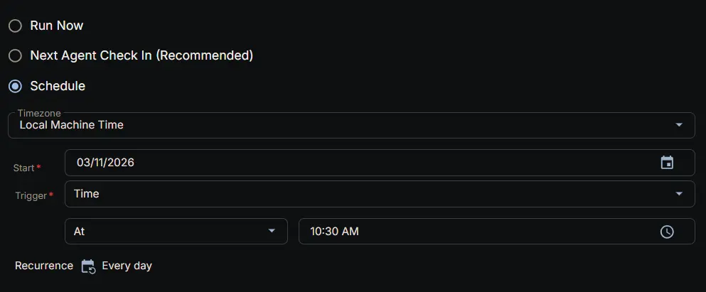
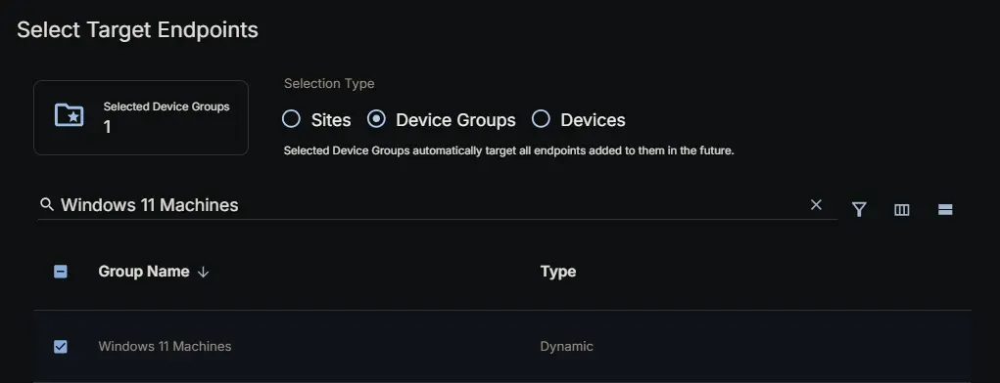
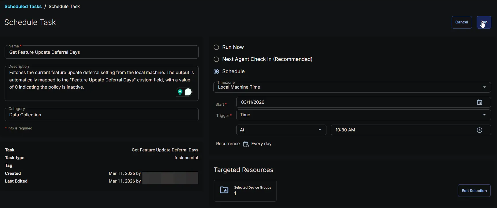

## Summary

Fetches the current feature update deferral setting from the local machine. The output is automatically mapped to the [Feature Update Deferral Days](/docs/c3d64c06-6c83-4d50-b0aa-71ae018d4c22) custom field, with a value of 0 indicating the policy is inactive.

## Sample Run

## Dependencies

- [Custom Field: Feature Update Deferral Days](/docs/c3d64c06-6c83-4d50-b0aa-71ae018d4c22)
- [Dynamic Group: Windows 11](/docs/1e54cc97-a5af-4dc9-9d79-00fd052c8454)
- [Solution: Manage Feature Update Deferral](/docs/800f96cd-5e64-48dd-bb9a-f17822db38e8)

## Custom Fields

| Name                | Example                                   | Level   | Type | Required | Description                                    |
|---------------------|-------------------------------------------|---------|------|----------|------------------------------------------------|
| [Feature Update Deferral Days](/docs/c3d64c06-6c83-4d50-b0aa-71ae018d4c22) | 100 | Endpoint | Text | Yes | Stores the current feature update deferral setting fetched by the script. |

## Task Setup Path

- **Tasks Path:** `AUTOMATION` ➞ `Tasks`  
- **Task Type:** `Script Editor`  

## Task Creation

### Description

- **Name:** `Get Feature Update Deferral Days`  
- **Description:** `Fetches the current feature update deferral setting from the local machine. The output is automatically mapped to the "Feature Update Deferral Days" custom field, with a value of 0 indicating the policy is inactive.`  
- **Category:** `Data Collection`

### Script Editor

#### Row 1: PowerShell script

- **Use Generative AI Assist for script creation:** `False`  
- **Expected time of script execution in seconds:** `300`  
- **Continue on Failure:** `False`  
- **Run as:** `System`  
- **Operating System:** `Windows`  
- **PowerShell Script Editor:**  

[PowerShell Script](https://github.com/ProVal-Tech/cw-rmm/blob/main/tasks/get-feature-update-deferral-days/script.ps1)

#### Row 2: Script Log

- **Script Log Message:** `%Output%`  
- **Continue on Failure:** `False`  
- **Operating System:** `Windows`

#### Row 3: Set Custom Field

- **Custom Field:** `Feature Update Deferral Days`  
- **Value:** `%Output%`  
- **Continue on Failure:** `False`  
- **Operating System:** `Windows`

## Completed Script

## Output

- Script Log
- Custom Field

## Scheduled Task

### Task Details

- **Name:** `Get Feature Update Deferral Days`  
- **Description:** `Fetches the current feature update deferral setting from the local machine. The output is automatically mapped to the "Feature Update Deferral Days" custom field, with a value of 0 indicating the policy is inactive.`  
- **Category:** `Data Collection`

### Schedule

- **Schedule Type:**  `Schedule`  
- **Timezone:** `Local Machine Time`  
- **Start:** `<Current Date>`  
- **Trigger:** `Time` `At` `<Current Time>`  
- **Recurrence:** `Every day`

### Targeted Resource

**Device Group:** `Windows 11 Machines`

### Completed Scheduled Task

## Changelog

### 2026-03-11

- Initial version of the document

