## Summary

This task lists the local administrators on windows machine and stores the result in a custom field [Local Admins List](/docs/03f2a420-5c70-4078-8b71-dc0fd7f6895d).

## Sample Run

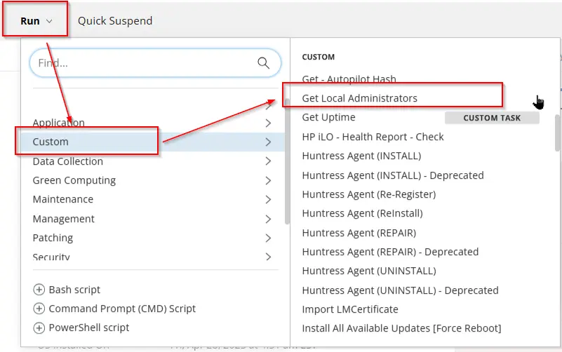

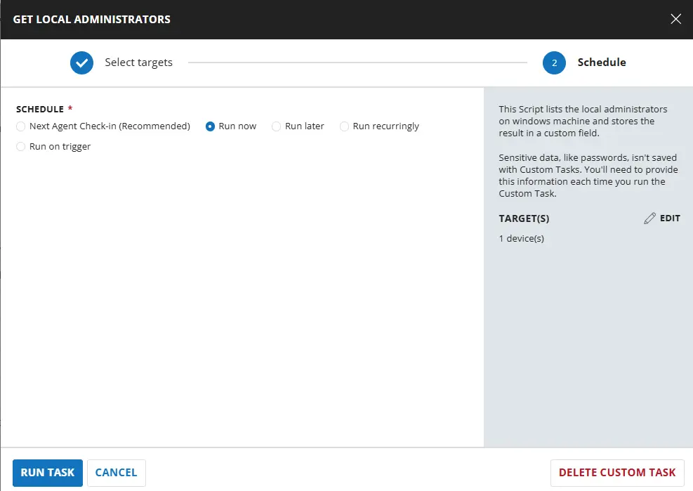

## Dependencies

- [Custom Field - Local Admins List](/docs/03f2a420-5c70-4078-8b71-dc0fd7f6895d)
- [Solution - Local Administrator Detection](/docs/7e3f8472-2908-4491-b495-b87bd7ad0fe6)

## Task Creation

### Script Details

#### Step 1

Navigate to `Automation` ➞ `Tasks`  


#### Step 2

Create a new `Script Editor` style task by choosing the `Script Editor` option from the `Add` dropdown menu  


The `New Script` page will appear on clicking the `Script Editor` button:  


#### Step 3

Fill in the following details in the `Description` section:  

- **Name:** `Get Local Administrators`  
- **Description:** `This script lists the local administrators on windows machine and stores the result in a custom field "Local Admins List".`  
- **Category:** `Custom`

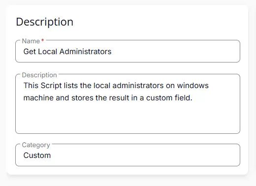

### Script Editor

Click the `Add Row` button in the `Script Editor` section to start creating the script  


A blank function will appear:  


#### Row 1 Function: PowerShell script

- **Use Generative AI Assist for script creation:** `False`  
- **Expected time of script execution in seconds:** `900`  
- **Operating System:** `Windows`  
- **Continue on Failure:** `True`  
- **PowerShell Script Editor:**

```PowerShell
using namespace System.DirectoryServices.AccountManagement

#requires -RunAsAdministrator
#requires -Version 5

try {
    $ErrorActionPreference = 'Stop'
    $adminGroupMembers = New-Object System.Collections.Generic.List[Object]
    $localMachinePath = 'WinNT://{0}' -f $env:COMPUTERNAME
    $localMachine = New-Object System.DirectoryServices.DirectoryEntry($localMachinePath)
    $adminsSID = (New-Object System.Security.Principal.SecurityIdentifier([System.Security.Principal.WellKnownSidType]::BuiltinAdministratorsSid, $null)).Value
    $localizedAdmin = (New-Object System.Security.Principal.SecurityIdentifier($adminsSID)).Translate([System.Security.Principal.NTAccount]).Value
    $localizedAdmin = $localizedAdmin -split '\\|\/' | Select-Object -Last 1
    $admGroup = $localMachine.Children.Find($localizedAdmin, 'group')
    $adminMembers = $admGroup.Invoke('members', $null)
    foreach ($groupMember in $adminMembers) {
        $member = New-Object System.DirectoryServices.DirectoryEntry($groupMember)
        $username = if ($member.path -match [regex]::escape($env:COMPUTERNAME)) {
            ($member.path -split '/')[-1]
        } else {
            $member.path -replace [regex]::escape('WinNT://'), ''
        }
        $adminGroupMembers.Add([PSCustomObject]@{
                Name = $username
            })
    }
    if ($adminGroupMembers.Count -eq 0) {
        return 'Result: No local administrator accounts were found.'
    }
    $adminGroupMembers.Name -join '|'
} catch {
    throw ('Result: Error fetching local administrators. Reason: {0}' -f $Error[0].Exception.Message)
}
```

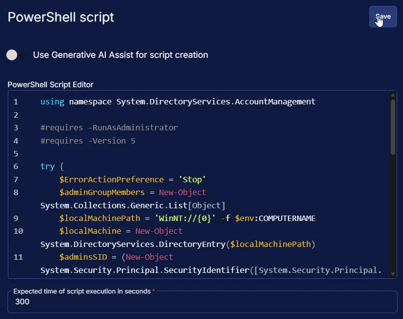

#### Row 2 Function: Script Log

- **Script Log Message:** `%Output%`  
- **Continue on Failure:** `False`  
- **Operating System:** `Windows`

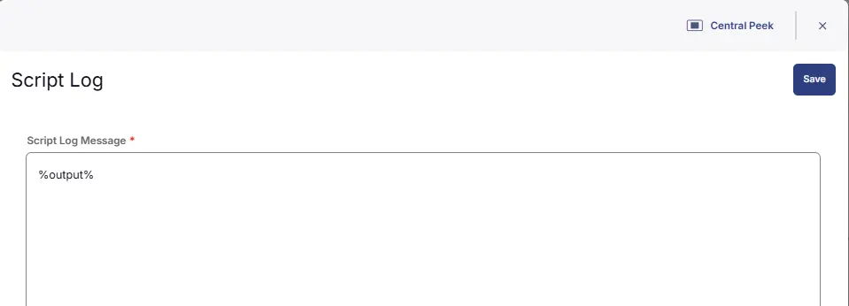

#### Step 3 Logic: If/Then

Click on `Add Logic` > select `If/Then`

#### Row 3a Condition: Output Contains

- **Condition:** `Output`  
- **Operator:** `Does not Contain`  
- **Input Values:** `Result:`

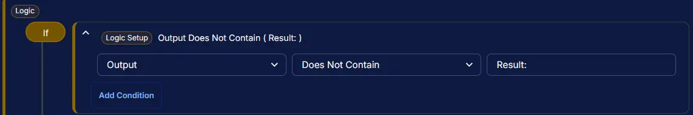

#### Row 3b Function: Set Custom Field

- Select `Local Admins List` from dropdown
- Add `%output%` in the Value

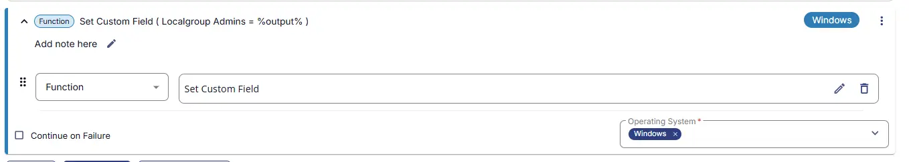

## Save Task

Click the `Save` button at the top-right corner of the screen to save the script.  


## Completed Task

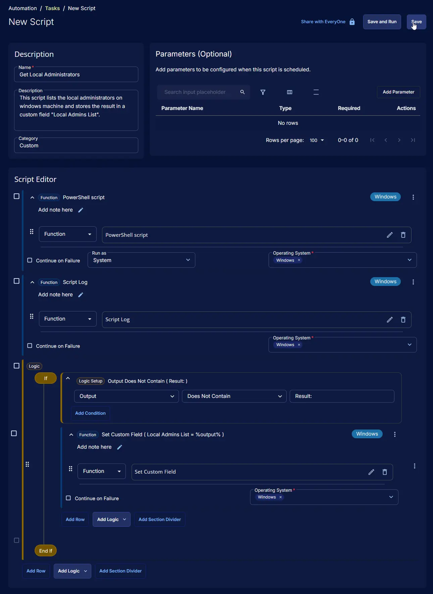

## Output

- Script Log

## Schedule Task

### Task Details

- **Name:** `Get Local Administrators`  
- **Description:** `This script lists the local administrators on windows machine and stores the result in a custom field "Local Admins List".`  
- **Category:** `Custom`

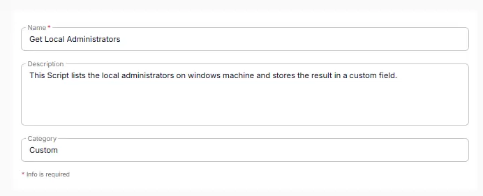

### Schedule

- **Schedule Type:**  `Schedule`  
- **Timezone:** `Local Machine Time`  
- **Start:** `<Current Date>`  
- **Trigger:** `Time` `At` `<Current Time>`  
- **Recurrence:** `Every day`

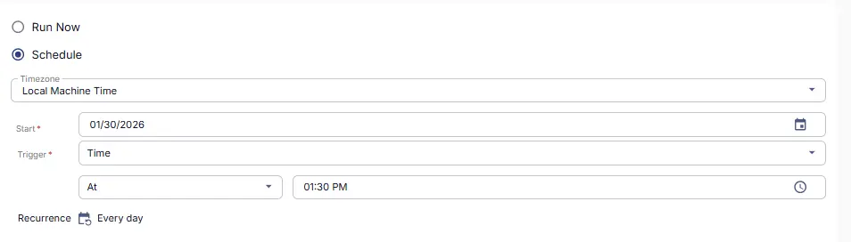

### Targeted Resource

**Device Group:** `Machines Opted for Local Admin Detection`

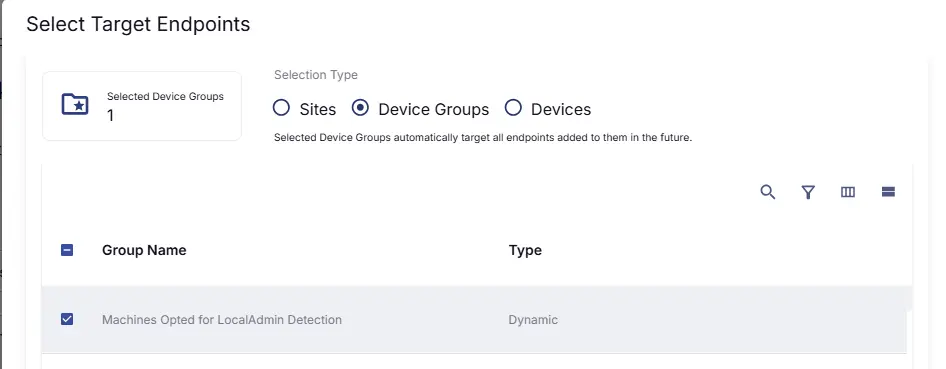

### Completed Scheduled Task

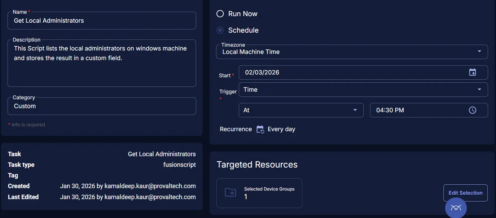

## Changelog

### 2026-03-26

- Updated the script to function independently of the system's OS language settings.

### 2026-01-30

- Initial version of the document
