## Summary

Connects to Microsoft Graph using a registered Microsoft Entra ID application and audits user accounts across a Microsoft 365 tenant to determine which authentication methods are registered.

The script provides a tenant-wide MFA overview by identifying and reporting the authentication methods registered for each Microsoft 365 account. It checks methods such as SMS/Voice, Microsoft Authenticator, Passkey, Windows Hello, Software OTP, and other supported authentication methods. The results show which methods are configured for each account and flag accounts that rely solely on SMS/Voice without another accepted authentication method, helping administrators identify users who may require stronger authentication.

The script generates a human-readable `Get-MFAUsers-result.txt` report and can optionally generate a Get-MFAUsers-result.csv file for spreadsheet analysis.

## How it Works

1. **Microsoft Graph Authentication**  
  The script connects to Microsoft Graph using the configured Microsoft Entra ID application credentials. The application authenticates against the Microsoft 365 tenant and obtains the permissions required to retrieve user and authentication method information.

2. **User Account Enumeration**  
  The script retrieves user accounts from the Microsoft 365 tenant and collects relevant account information, including User Principal Name, Display Name, account status, user type, and licensing information.

3. **Authentication Method Retrieval**  
  The script retrieves the authentication methods registered for each user. It evaluates multiple authentication methods, including SMS/Voice, Microsoft Authenticator, Passkey, Windows Hello, Software OTP, and other supported methods.

4. **Authentication Method Classification**  
  The retrieved authentication methods are grouped into standardized categories so each account can be easily reviewed. The results indicate whether each user has methods such as SMS/Voice, Authenticator, Passkey, Windows Hello, or Software OTP configured.

5. **MFA Status Evaluation**  
  The script evaluates the authentication methods associated with each account to determine the user's overall MFA configuration and identify whether additional authentication methods are available.

6. **Flagged Account Detection**  
  The script checks whether an account relies only on SMS/Voice authentication without another accepted authentication method. Accounts meeting this condition are marked as Flagged so they can be prioritized for MFA remediation.

7. **Result Generation**  
  The script returns the collected information as objects and generates a human-readable Get-MFAUsers-result.txt report containing the authentication status of each account.

8. **CSV Export**  
  If the -ExportCsv option is specified, the script additionally generates Get-MFAUsers-result.csv, providing detailed per-account results that can be used for spreadsheet analysis, reporting, or ticket documentation.

  **Note :** For more information on how script works visit [Agnostic Script : Get-MFAUsers](/docs/86026b1e-c2e4-48a1-8f4a-463f060b7496)

## Sample Run

### Sample Run 1 : `Reports every account in the tenant, flagging any whose only authentication method is SMS or a voice call.`

```
TenantID : contoso.onmicrosoft.com
ClientID : 11111111-1111-1111-1111-111111111111
ClientSecret : aBc...
```
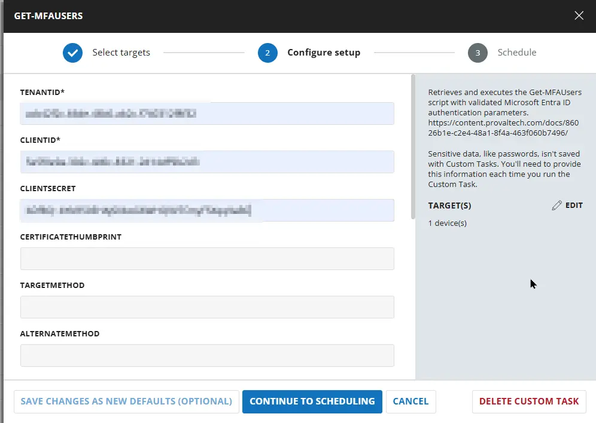

### Sample Run 2 : `Authenticates with a certificate held in the local certificate store instead of a client secret.`

```
TenantID : contoso.onmicrosoft.com
ClientID : 11111111-1111-1111-1111-111111111111
CertificateThumbprint : A1B2C3...
```
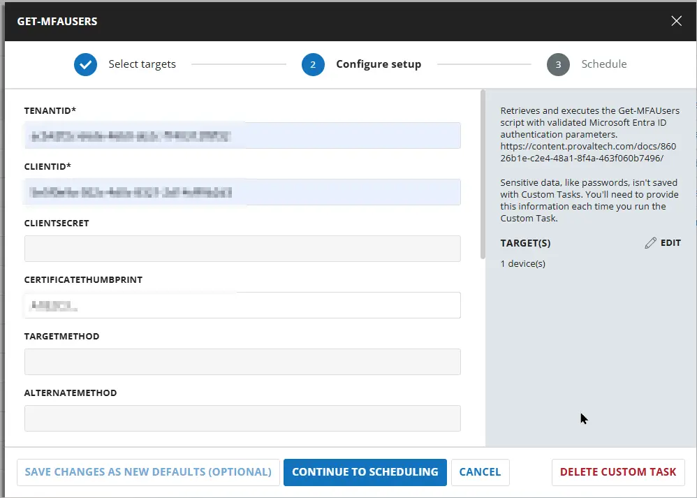

### Sample Run 3 : `Narrows the report to enabled member accounts that have nothing but a phone number, which is the usual shape for a remediation list.`

```
TenantID : contoso.onmicrosoft.com
ClientID : 11111111-1111-1111-1111-111111111111
ClientSecret : aBc...
FlaggedOnly : Yes
ExcludeDisabled : Yes
ExcludeGuest : Yes
```
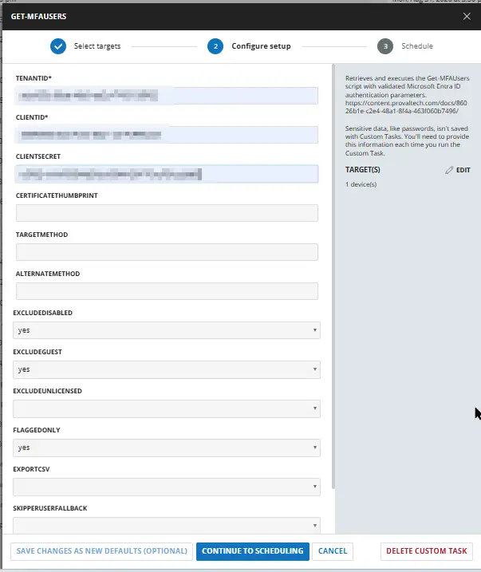

### Sample Run 4 : `Writes a detailed CSV report named Get-MFAUsers-result.csv under C:\ProgramData\_automation\script\Get-MFAUsers on the machine where the script is run, for opening in Excel.`

```
TenantID : contoso.onmicrosoft.com
ClientID : 11111111-1111-1111-1111-111111111111
ClientSecret : aBc...
ExportCsv : Yes
```
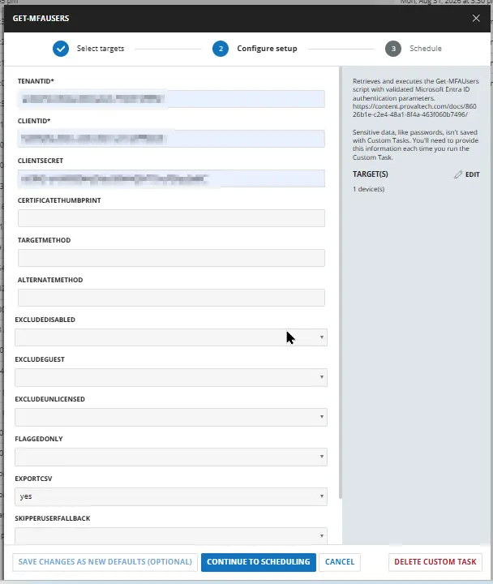

### Sample Run 5 : `Treats only phishing resistant methods as an acceptable alternative, so an account whose other method is the Authenticator app or a TOTP token is flagged as well.`

```
TenantID : contoso.onmicrosoft.com
ClientID : 11111111-1111-1111-1111-111111111111
ClientSecret : aBc...
AlternateMethod : Passkey,WindowsHello
```
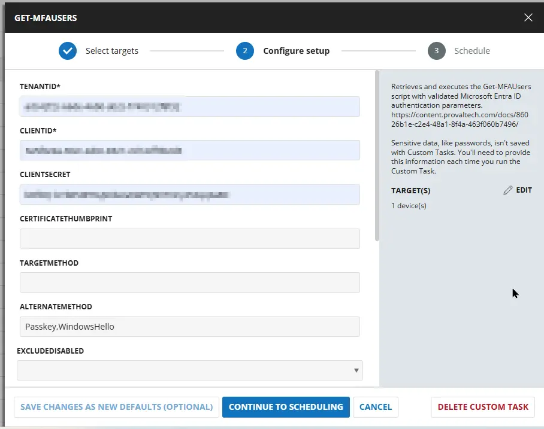

### Sample Run 6 : `Searches for a different method entirely: accounts whose only method is a TOTP token.`

```
TenantID : contoso.onmicrosoft.com
ClientID : 11111111-1111-1111-1111-111111111111
ClientSecret : aBc...
TargetMethod : SoftwareOtp
AlternateMethod : AuthenticatorApp,Passkey,WindowsHello
```
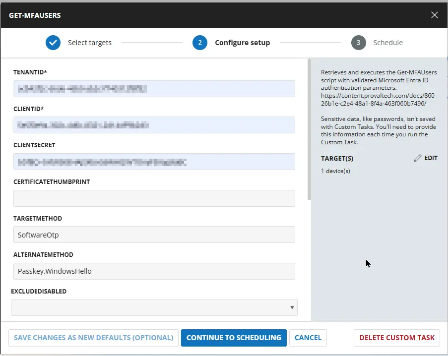

## Dependencies

- [Agnostic Script : Get-MFAUsers](/docs/86026b1e-c2e4-48a1-8f4a-463f060b7496)


## User Parameters

| Name | Example | Accepted Values | Required | Default | Type | Description |
| ---- | ------- | --------------- | -------- | ------- | ---- | ----------- |
| TenantId | `contoso.onmicrosoft.com` | | `True` |  | 	String | The tenant to report on. Accepts the tenant GUID or any verified domain. | 
| ClientId | `11111111-1111-1111-1111-111111111111` | | `True` |  | 	String |  The tenant to report on. Accepts the tenant GUID or any verified domain. | 
| ClientSecret | `aBc....` | | `Partially True` |  | String | A client secret belonging to the app registration. It is Mutually exclusive with CertificateThumbprint which means either `ClientSecret` or `CertificateThumbprint` for authentication. |
| CertificateThumbprint | `A1B2C3...`| | `Partially True` |  | String | The thumbprint of a certificate uploaded to the app registration and present with its private key in Cert:\CurrentUser\My or Cert:\LocalMachine\My. Required in the Certificate parameter set. Mutually exclusive with ClientSecret. It is Mutually exclusive with CertificateThumbprint which means either `ClientSecret` or `CertificateThumbprint` for authentication. |
| TargetMethod |  `SmsVoice` | `SmsVoice`, `Email`, `SoftwareOtp`, `HardwareOtp`, `AuthenticatorApp`, `Passkey`, `WindowsHello`, `Certificate` | `False`| | String | The method classes being searched for. An account must hold at least one of them to be flagged.|
| AlternateMethod | | `AuthenticatorApp`, `Passkey`, `WindowsHello`, `SoftwareOtp`, `HardwareOtp`, `Certificate` |  `False`| | String | The method classes whose presence means the account is not dependent on the target method, and so is not flagged. | 
| ExcludeDisabled | | | `False`| | Flag | Select it to Omit accounts where `accountEnabled` is false.  | 
| ExcludeGuest | | | `False`| | Flag | Select it to Omit accounts whose userType is `Guest`. |
| ExcludeUnlicensed | | | `False`| | Flag | Select it to Omit accounts with no assigned licenses. Useful for dropping service and resource accounts. |
| FlaggedOnly |  | | `False`| | Flag | Select it to Return and report only the accounts where Flagged is true. |
| ExportCsv | | | `False`| | Flag | Writes a detailed CSV report named `Get-MFAUsers-result.csv` under `C:\ProgramData\_automation\script\Get-MFAUsers` on the machine where the script is run, beside the log file, when this parameter is selected. By default, the CSV file is not created because the returned results already contain all per-account details. | 
| SkipPerUserFallback | | | `False`| | Flag | Select it to not call the per-user authentication methods API for accounts missing from the registration report. Those accounts are still returned, with `DataSource` set to `Unavailable` and every method column $null rather than `$false`. |
| MaxFallbackUser | `800` | | `False`| `500` | Number Value | The largest number of accounts to resolve individually through the per-user API. Accounts beyond the cap are returned with `DataSource` set to `Unavailable`, and the report says how many were left unresolved. Range is 0-100000. | 


## Task Creation

### Script Details

#### Step 1

Navigate to `Automation` ➞ `Tasks`  


#### Step 2

Create a new `Script Editor` style task by choosing the `Script Editor` option from the `Add` dropdown menu  


The `New Script` page will appear on clicking the `Script Editor` button:  


#### Step 3

Fill in the following details in the `Description` section:  

- **Name:** `Get-MFAUsers`  
- **Description:** `Reports the MFA methods registered by every account in a Microsoft 365 tenant and flags the accounts whose only authentication method is SMS or a voice call.`  
`https://content.provaltech.com/docs/bbb02e19-ad03-499f-bc73-962cd0641680/`
- **Category:** `Custom`

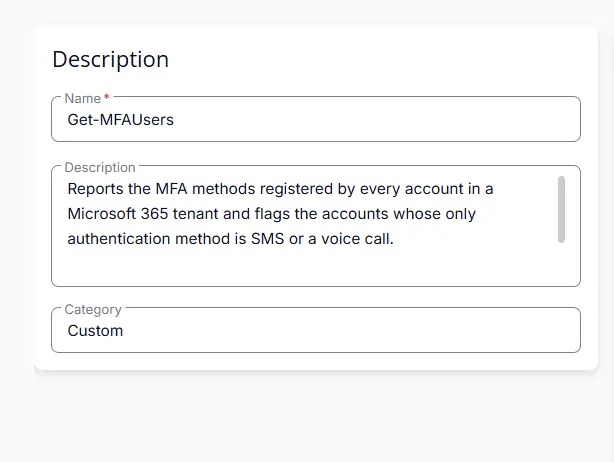

### Parameters

#### TenantId

Locate the `Add Parameter` button on the right-hand side of the screen and click on it to create a new parameter.  


The `Add New Script Parameter` page will appear on clicking the `Add Parameter` button.  


- Set `TenantId` in the `Parameter Name` field.
- Enable the `Required Field` button.
- Select `Text String` from the `Parameter Type` dropdown menu.
- Click the `Save` button.


#### ClientId

Locate the `Add Parameter` button on the right-hand side of the screen and click on it to create a new parameter.  


The `Add New Script Parameter` page will appear on clicking the `Add Parameter` button.  

- Set `ClientId` in the `Parameter Name` field.
- Enable the `Required Field` button.
- Select `Text String` from the `Parameter Type` dropdown menu.
- Click the `Save` button.

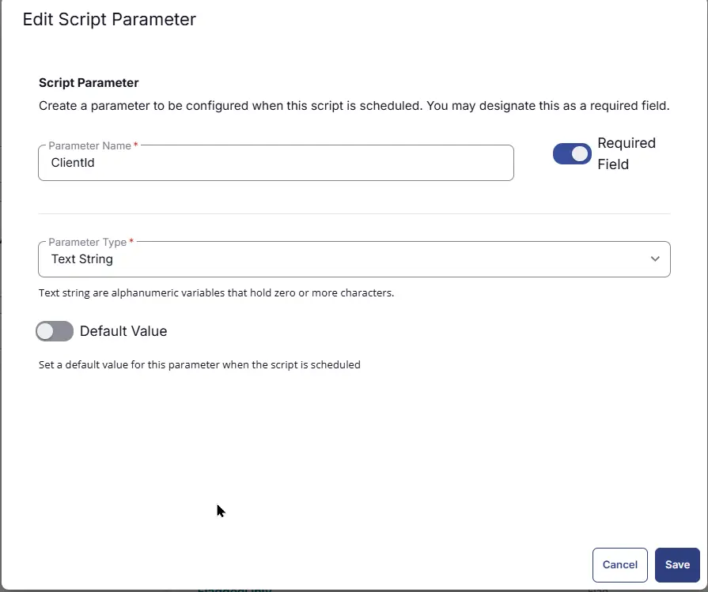

#### ClientSecret

Locate the `Add Parameter` button on the right-hand side of the screen and click on it to create a new parameter.  


The `Add New Script Parameter` page will appear on clicking the `Add Parameter` button.  

- Set `ClientSecret` in the `Parameter Name` field.
- Disable the `Required Field` button.
- Select `Text String` from the `Parameter Type` dropdown menu.
- Click the `Save` button.

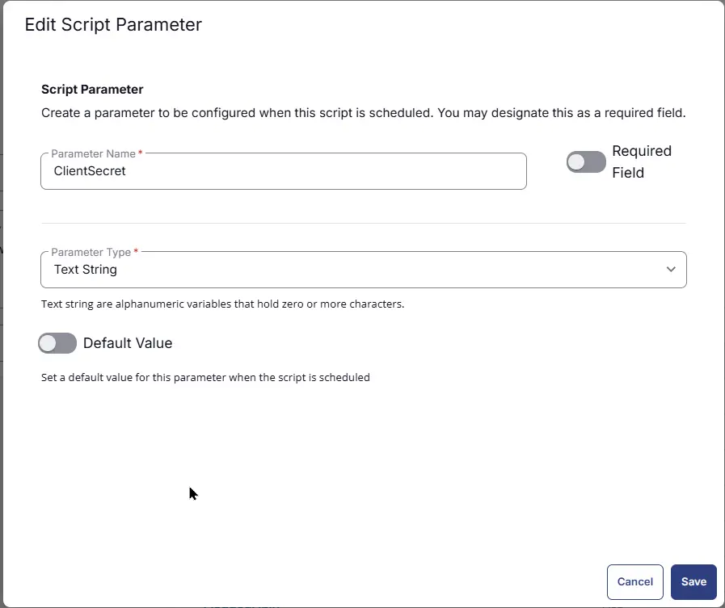

#### CertificateThumbprint

Locate the `Add Parameter` button on the right-hand side of the screen and click on it to create a new parameter.  


The `Add New Script Parameter` page will appear on clicking the `Add Parameter` button.  

- Set `CertificateThumbprint` in the `Parameter Name` field.
- Disable the `Required Field` button.
- Select `Text String` from the `Parameter Type` dropdown menu.
- Click the `Save` button.

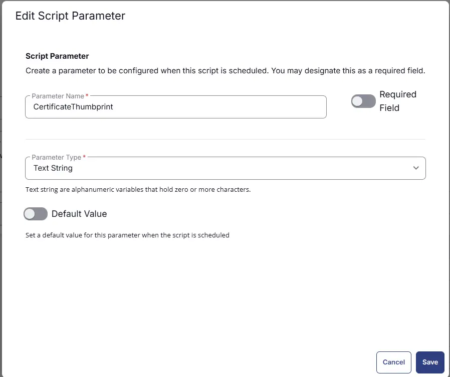

#### TargetMethod

Locate the `Add Parameter` button on the right-hand side of the screen and click on it to create a new parameter.  


The `Add New Script Parameter` page will appear on clicking the `Add Parameter` button.  

- Set `TargetMethod` in the `Parameter Name` field.
- Disable the `Required Field` button.
- Select `Text String` from the `Parameter Type` dropdown menu.
- Click the `Save` button.

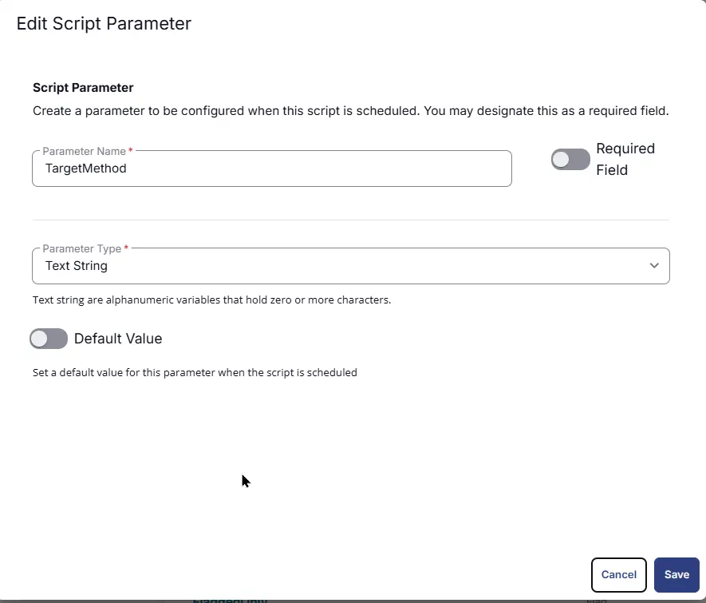

#### AlternateMethod

Locate the `Add Parameter` button on the right-hand side of the screen and click on it to create a new parameter.  


The `Add New Script Parameter` page will appear on clicking the `Add Parameter` button.  

- Set `AlternateMethod` in the `Parameter Name` field.
- Disable the `Required Field` button.
- Select `Text String` from the `Parameter Type` dropdown menu.
- Click the `Save` button.


#### ExcludeDisabled

Locate the `Add Parameter` button on the right-hand side of the screen and click on it to create a new parameter.  


The `Add New Script Parameter` page will appear on clicking the `Add Parameter` button.  

- Set `ExcludeDisabled` in the `Parameter Name` field.
- Disable the `Required Field` button.
- Select `Flag` from the `Parameter Type` dropdown menu.
- Click the `Save` button.

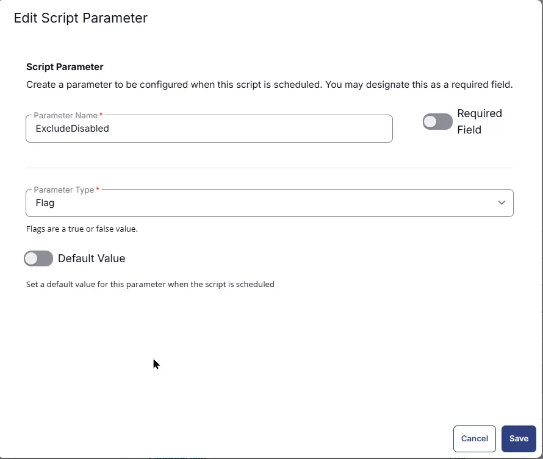

#### ExcludeGuest

Locate the `Add Parameter` button on the right-hand side of the screen and click on it to create a new parameter.  


The `Add New Script Parameter` page will appear on clicking the `Add Parameter` button.  

- Set `ExcludeGuest` in the `Parameter Name` field.
- Disable the `Required Field` button.
- Select `Flag` from the `Parameter Type` dropdown menu.
- Click the `Save` button.


#### ExcludeUnlicensed

Locate the `Add Parameter` button on the right-hand side of the screen and click on it to create a new parameter.  


The `Add New Script Parameter` page will appear on clicking the `Add Parameter` button.  

- Set `ExcludeUnlicensed` in the `Parameter Name` field.
- Disable the `Required Field` button.
- Select `Flag` from the `Parameter Type` dropdown menu.
- Click the `Save` button.


#### FlaggedOnly

Locate the `Add Parameter` button on the right-hand side of the screen and click on it to create a new parameter.  


The `Add New Script Parameter` page will appear on clicking the `Add Parameter` button.  

- Set `FlaggedOnly` in the `Parameter Name` field.
- Disable the `Required Field` button.
- Select `Flag` from the `Parameter Type` dropdown menu.
- Click the `Save` button.

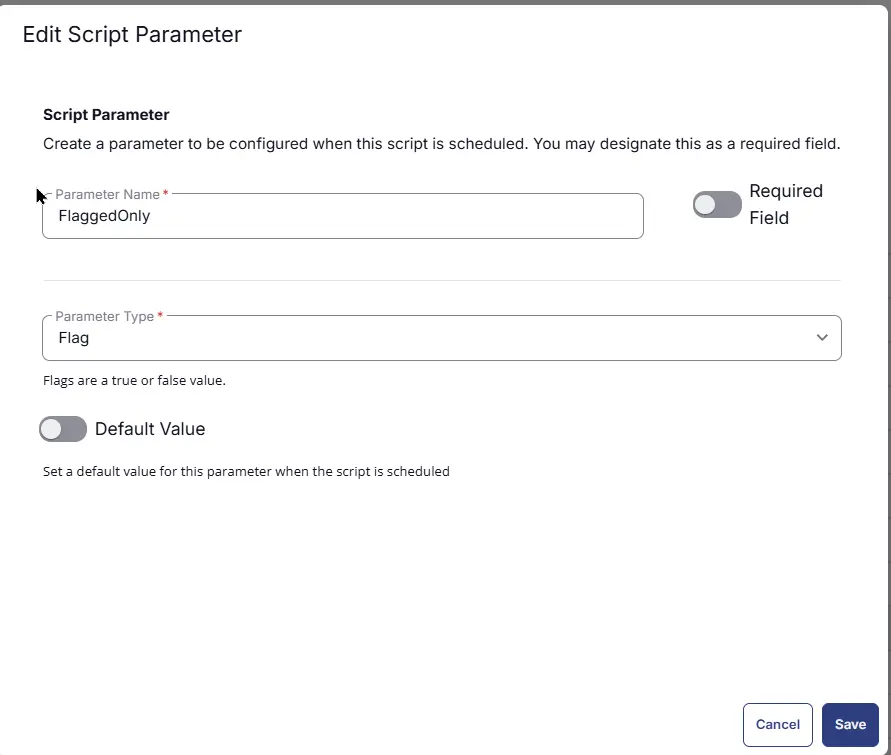

#### ExportCsv

Locate the `Add Parameter` button on the right-hand side of the screen and click on it to create a new parameter.  


The `Add New Script Parameter` page will appear on clicking the `Add Parameter` button.  

- Set `ExportCsv` in the `Parameter Name` field.
- Disable the `Required Field` button.
- Select `Flag` from the `Parameter Type` dropdown menu.
- Click the `Save` button.


#### SkipPerUserFallback

Locate the `Add Parameter` button on the right-hand side of the screen and click on it to create a new parameter.  


The `Add New Script Parameter` page will appear on clicking the `Add Parameter` button.  

- Set `SkipPerUserFallback` in the `Parameter Name` field.
- Disable the `Required Field` button.
- Select `Flag` from the `Parameter Type` dropdown menu.
- Click the `Save` button.


#### MaxFallbackUser

Locate the `Add Parameter` button on the right-hand side of the screen and click on it to create a new parameter.  


The `Add New Script Parameter` page will appear on clicking the `Add Parameter` button.  

- Set `MaxFallbackUser` in the `Parameter Name` field.
- Disable the `Required Field` button.
- Select `Flag` from the `Parameter Type` dropdown menu.
- Click the `Save` button.

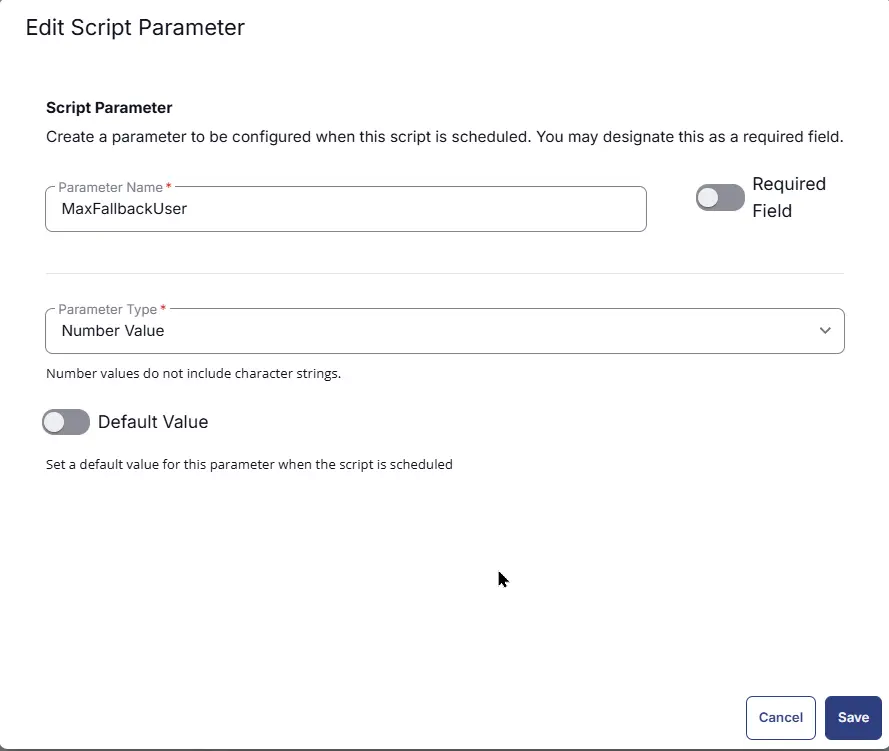

### Script Editor

Click the `Add Row` button in the `Script Editor` section to start creating the script  


A blank function will appear:  


#### Row 1 Function: PowerShell Script

- **Use Generative AI Assist for script creation:** `False`
- **Expected time of script execution in seconds:** `1200`
- **Continue on Failure:** `False`
- **Run As:** `System`
- **Operating System:** `Windows`
- **PowerShell Script Editor:**

Navigate to the [`cw-rmm` repository](https://github.com/ProVal-Tech/cw-rmm), open the script linked below, copy the raw code, and paste it into the RMM script editor:
  
  [PowerShell Script](https://github.com/ProVal-Tech/cw-rmm/blob/main/tasks/get-mfausers/script.ps1)


#### Row 2 Function: Script Log

- **Continue on Failure:** `False`
- **Operating System:** `Windows`
- **Script Log Message:** `%Output%`

## Save Task

Click the `Save` button at the top-right corner of the screen to save the script.  


## Completed Task

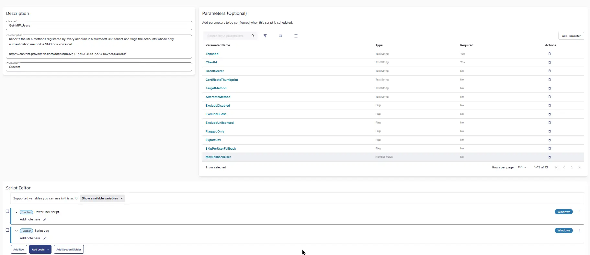

## Output

- Script Logs

## Changelog

### 2026-08-26

- Initial version of the document
