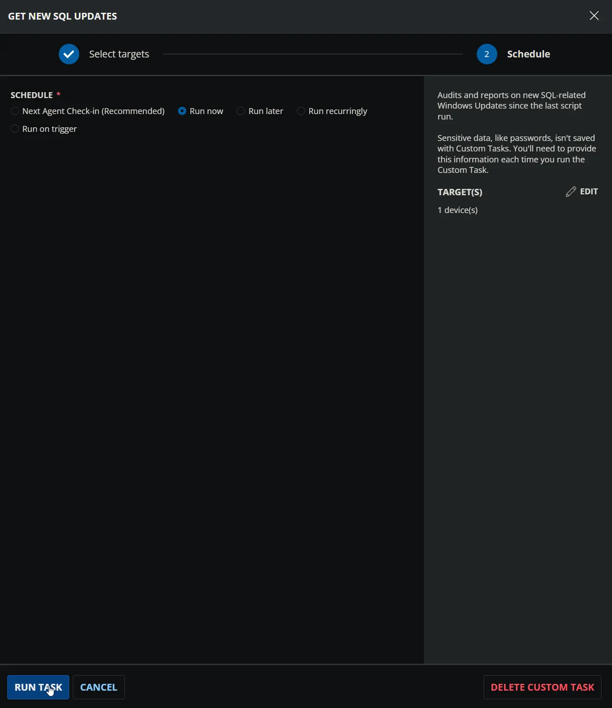
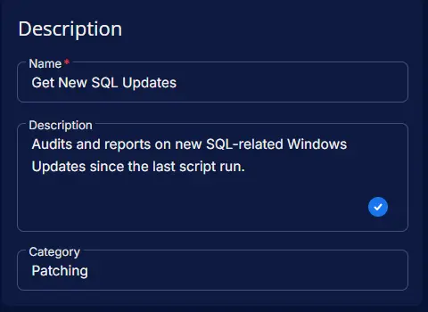
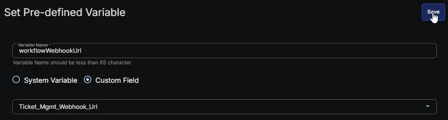
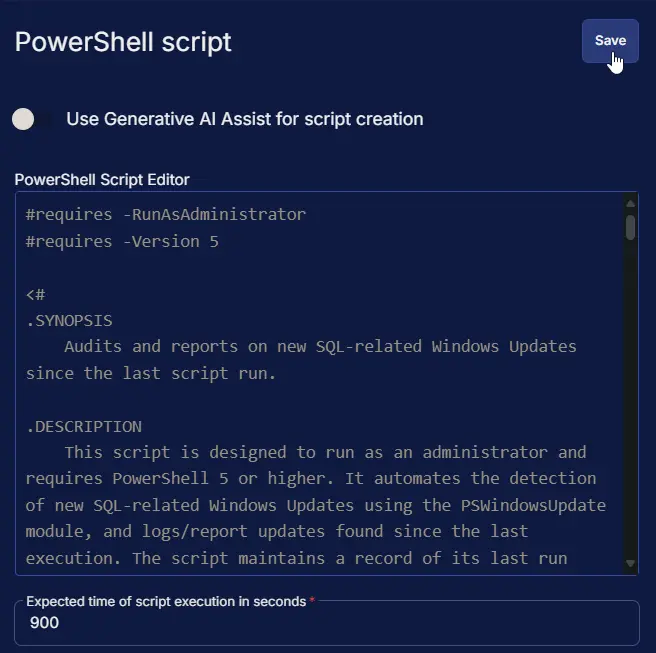
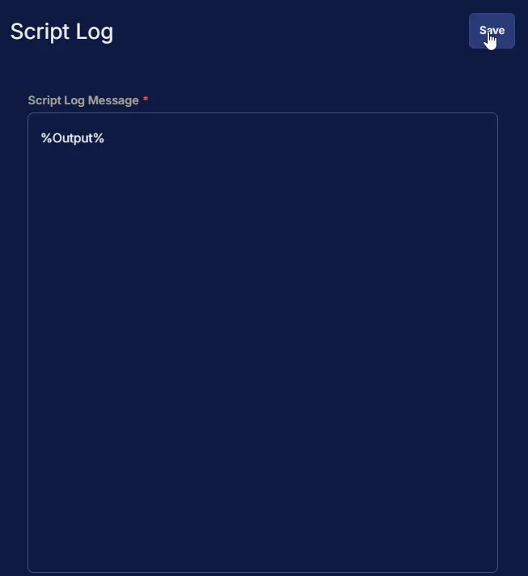
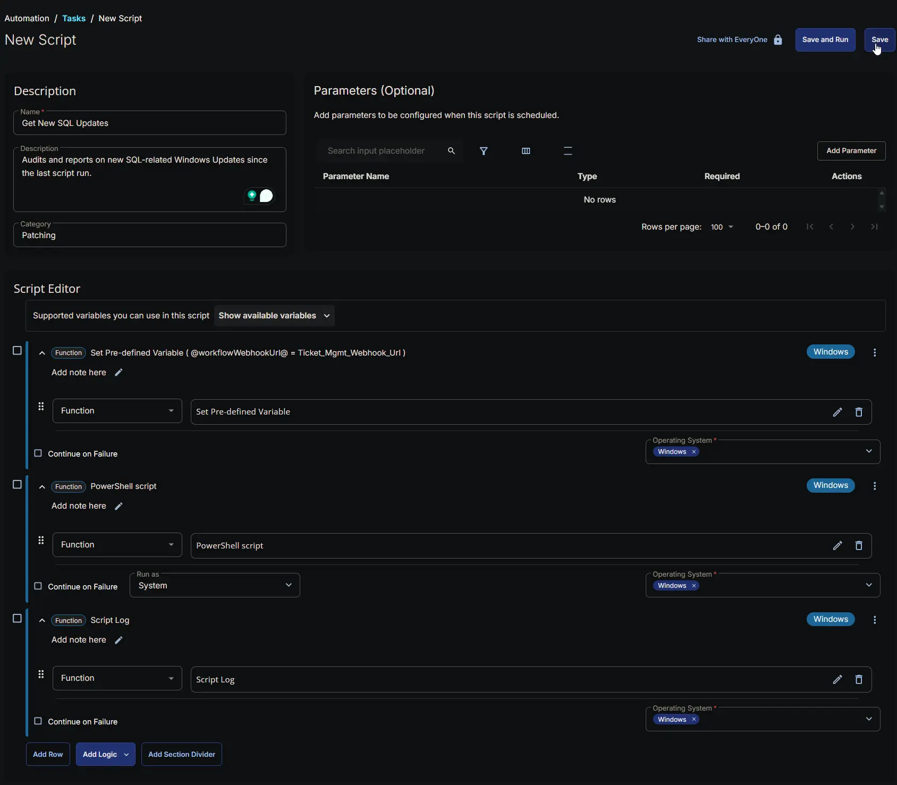
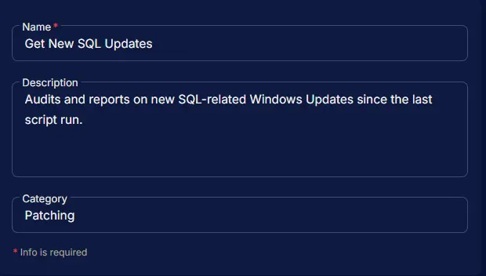
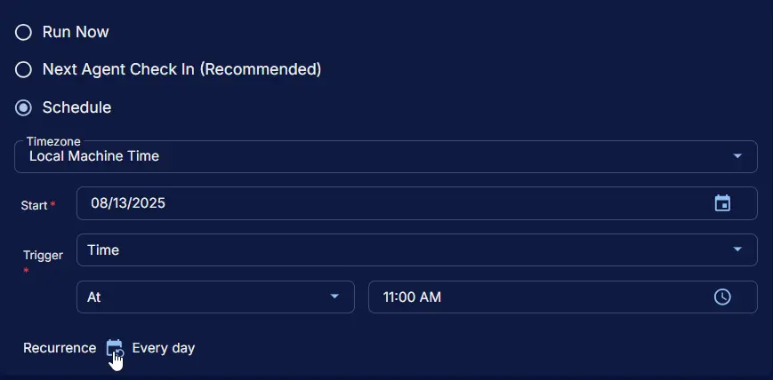
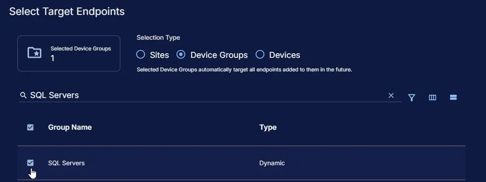
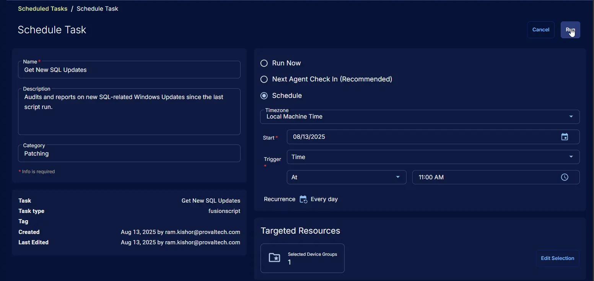

---
id: '3b44e58d-1764-414b-94fd-05fedddd511d'
slug: /3b44e58d-1764-414b-94fd-05fedddd511d
title: 'Get New SQL Updates'
title_meta: 'Get New SQL Updates'
keywords: ['sql', 'sql-server', 'sql-server-patching']
description: 'Audits and reports on new SQL-related Windows Updates since the last script run.'
tags: ['auditing', 'mssql', 'patching']
draft: false
unlisted: false
last_update:
  date: 2026-08-12
---

## Summary

Audits and reports on new SQL-related Windows Updates available for installation since the last execution. On its first run, the script retrieves updates released within the past 90 days. Detection uses the native Windows Update API and falls back to the PSWindowsUpdate module only when the API scan fails or returns no results.

The script also manages the ConnectWise ticket lifecycle by firing webhooks to the CWRMM Ticket Management for Monitors workflow:

- **Ticket created:** When one or more SQL updates released after the last successful run are detected on the machine.
- **Ticket closed:** When no SQL updates remain available for installation on the machine (all previously reported updates have been installed).
- **No action:** When SQL updates are still available but were already reported on a previous run (no new releases since the last run).

Because a Create webhook fires on every run that detects newly released updates, a machine can have multiple open tickets when patches are released on different days. For example, a patch released and detected today opens a ticket; a second patch released tomorrow and detected on the next run opens another ticket while the first one remains open.

If neither detection method completes, the scan is treated as an unknown state rather than a clean machine: the script fails without triggering a webhook and without advancing the last run date, so pending updates remain eligible for reporting on the next run.

**Note:** Script requires PowerShell 5+.

## Sample Run



## Dependencies

- [Custom Field: Ticket_Mgmt_Webhook_Url](/docs/8e55deb6-bef8-4501-9e64-7b25e7fcd1ab)
- [Group: SQL Servers](/docs/85ffcde0-01c8-4e6b-8c08-51371f80ae9c)
- [Triggers: CWRMM Ticket Management for Monitors](/docs/05c811e6-c6d0-4652-b4b6-2aa83f9605c7)
- [Workflow: CWRMM Ticket Management for Monitors](/docs/57daa951-2acc-4be7-a025-0d0ca729ef57)
- [PowerShell: Install-PSGalleryModule](/docs/858fa597-2e08-4da4-ad6d-27ca62858547)
- [Solution: New SQL Updates](/docs/08281245-9380-4946-b1a6-099aebfffd6f)

## Task Setup Path

**Tasks Path:** `AUTOMATION` ➞ `Tasks`  
**Task Type:** `Script Editor`

## Task Creation

### Description

- **Name:** `Get New SQL Updates`  
- **Description:** `Audits and reports on new SQL-related Windows Updates since the last script run.`  
- **Category:** `Patching`



### Script Editor

#### Step 1: Row -> Set Pre-defined Variable ( @workflowWebhookUrl@ = Ticket_Mgmt_Webhook_Url )

- **Variable Name:** `workflowWebhookUrl`  
- **Custom Field:** `Ticket_Mgmt_Webhook_Url`  
- **Operating System:** `Windows`  
- **Continue on Failure:** `False`  
- **PowerShell Script Editor:**



#### Step 2: Row -> PowerShell script

- **Use Generative AI Assist for script creation:** `False`  
- **Expected time of script execution in seconds:** `900`  
- **Operating System:** `Windows`  
- **Continue on Failure:** `False`  
- **PowerShell Script Editor:**

[PowerShell Script](https://github.com/ProVal-Tech/cw-rmm/blob/main/tasks/get-new-sql-updates/script.ps1)




#### Step 3: Row -> Script Log

- **Script Log Message:** `%Output%`  
- **Continue on Failure:** `False`  
- **Operating System:** `Windows`



## Completed Script



## Output

- Script Log
- Ticket

## Ticketing

**Subject:** `SQL Updates pending review for <Computer Name> at <Client Name>`  
**Ticket Body:** `<Output of the ticket body>`
**Ticket Body Example:**

```PlainText
1 new SQL Update(s) detected since 2025-05-15 07:41:50.

Detected Updates:


KB           : KB5063757
Title        : Security Update for SQL Server 2019 RTM CU (KB5063757)
Description  : Security issues have been identified in the SQL Server 2019 RTM CU that could allow an attacker to
               compromise your system and gain control over it. You can help protect your computer by installing this
               update from Microsoft. After you install this item, you may have to restart your computer.
ReleaseDate  : 8/12/2025 12:00:00 AM
IsMandatory  : False
MsrcSeverity : Important
```

## Schedule Task

### Task Details

- **Name:** `Get New SQL Updates`  
- **Description:** `Audits and reports on new SQL-related Windows Updates since the last script run.`  
- **Category:** `Patching`



### Schedule

- **Schedule Type:**  `Schedule`  
- **Timezone:** `Local Machine Time`  
- **Start:** `<Current Date>`  
- **Trigger:** `Time` `At` `<Current Time>`  
- **Recurrence:** `Every day`



### Targeted Resource

**Device Group:** `SQL Servers`



### Completed Scheduled Task



## Changelog

### 2026-08-12

- Updated the script to use the ConnectWise workflow webhook for ticketing instead of the task's built-in ticketing function.
- Switched primary update detection to the native Windows Update API; the PSWindowsUpdate module is now installed and imported only as a fallback when the API scan fails or returns no updates.

### 2025-08-13

- Initial version of the document

