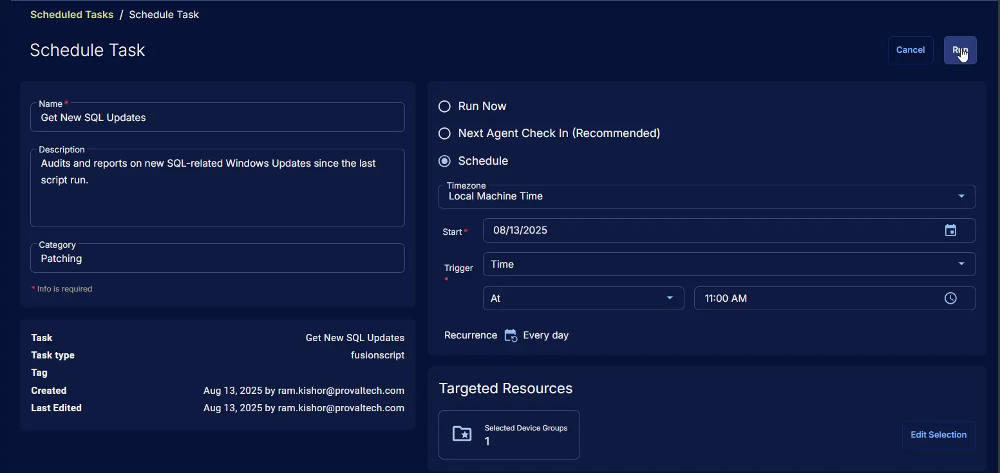

## Summary

Audits and generates a report on newly installed SQL-related Windows Updates since the last execution. On its first run, the script retrieves updates released within the past 90 days.

**Note:** Script requires PowerShell 5+.

## Sample Run


## Dependencies

- [SQL Servers](/docs/85ffcde0-01c8-4e6b-8c08-51371f80ae9c)
- [New SQL Updates](/docs/08281245-9380-4946-b1a6-099aebfffd6f)

## Task Setup Path

**Tasks Path:** `AUTOMATION` ➞ `Tasks`  
**Task Type:** `Script Editor`

## Task Creation

### Description

**Name:** `Get New SQL Updates`  
**Description:** `Audits and reports on new SQL-related Windows Updates since the last script run.`  
**Category:** `Patching`


### Script Editor

#### Step 1: Row -> PowerShell script

**Use Generative AI Assist for script creation:** `False`  
**Expected time of script execution in seconds:** `900`  
**Operating System:** `Windows`  
**Continue on Failure:** `True`  
**PowerShell Script Editor:**

```PowerShell
#requires -RunAsAdministrator
#requires -Version 5

<#
.SYNOPSIS
    Audits and reports on new SQL-related Windows Updates since the last script run.

.DESCRIPTION
    This script is designed to run as an administrator and requires PowerShell 5 or higher. It automates the detection of new SQL-related Windows Updates using the PSWindowsUpdate module, and logs/report updates found since the last execution. The script maintains a record of its last run date in a persistent storage table, enabling incremental update checks.

    Key functionalities:
    - Ensures required modules (Strapper, PSWindowsUpdate) are installed and updated.
    - Sets up secure TLS protocols for module downloads.
    - Configures PowerShell repository trust and NuGet provider.
    - Imports and initializes the Strapper environment for persistent object storage.
    - Tracks the last run date using a custom table ('sqlUpdatesAudit') via Strapper.
    - Queries for SQL-related updates using Get-WindowsUpdate, filtering for updates released since the last run.
    - Logs and returns a formatted report of detected updates, including KB, title, description, release date, mandatory status, and severity.

.PARAMETER None
    All configuration is handled internally; no parameters are required.

.NOTES
    - Requires administrator privileges.
    - Requires PowerShell 5+.
    - Uses Strapper for persistent storage and PSWindowsUpdate for update querying.
    - Designed for Windows environments.

.EXAMPLE
    Run the script as administrator:
        powershell.exe -File .\Get-NewSQLUpdates.ps1

    Output:
        Displays and logs new SQL updates detected since the last run.

#>

#region Globals
$ProgressPreference = 'SilentlyContinue'
$modulesUsed = @(
    'Strapper',
    'PSWindowsUpdate'
)
#endRegion

#region Variables
$tableName = 'sqlUpdatesAudit'
#endRegion

#region Module Setup
Set-ExecutionPolicy -ExecutionPolicy Bypass -Scope Process -Force -ErrorAction SilentlyContinue
$supportedTLSversions = [enum]::GetValues('Net.SecurityProtocolType')
if ( ($supportedTLSversions -contains 'Tls13') -and ($supportedTLSversions -contains 'Tls12') ) {
    [System.Net.ServicePointManager]::SecurityProtocol = [System.Net.ServicePointManager]::SecurityProtocol::Tls13 -bor [System.Net.SecurityProtocolType]::Tls12
} elseif ( $supportedTLSversions -contains 'Tls12' ) {
    [System.Net.ServicePointManager]::SecurityProtocol = [System.Net.SecurityProtocolType]::Tls12
} else {
    Write-Information 'TLS 1.2 or TLS 1.3 is not supported on this system. Please install ''KB3140245'' to fix this issue.' -InformationAction Continue
    if ($PSVersionTable.PSVersion.Major -lt 3) {
        Write-Information 'PowerShell 2 / .NET 2.0 does not support TLS 1.2.' -InformationAction Continue
    }
}
Get-PackageProvider -Name 'NuGet' -ForceBootstrap | Out-Null
Set-PSRepository -Name 'PSGallery' -InstallationPolicy Trusted
#endRegion

#region Install Modules
foreach ($module in $modulesUsed) {
    try {
        Update-Module -Name $module -ErrorAction Stop
    } catch {
        Install-Module -Name $module -Repository 'PSGallery' -SkipPublisherCheck -Force
        Get-Module -Name $module -ListAvailable | Where-Object { $_.Version -ne (Get-InstalledModule -Name $module).Version } | ForEach-Object { Uninstall-Module -Name $module -MaximumVersion $_.Version }
    }
}
#endRegion

#region Strapper Module
(Import-Module -Name 'Strapper') 3>&1 2>&1 1>$null
(Set-StrapperEnvironment) 3>&1 2>&1 1>$null
#endRegion

#region PSWindowsUpdate Module
try {
    Import-Module -Name 'PSWindowsUpdate' -Force -ErrorAction Stop
} catch {
    Write-Log -Text ('Failed to import the PSWindowsUpdate module. Reason: {0}' -f $Error[0].Exception.Message) -Level Error
    throw ('Failed to import the PSWindowsUpdate module. Reason: {0}' -f $Error[0].Exception.Message)
}
#endRegion

#region get last script run date
$lastRun = try { Get-StoredObject -TableName $tableName -ErrorAction Stop } catch { $null }
if ($lastRun) {
    [datetime]$lastRunDate = $lastRun.LastRunDate
} else {
    [datetime]$lastRunDate = (Get-Date).AddDays(-90)
}
$lastRun = @{
    LastRunDate = (Get-Date).ToString('yyyy-MM-dd HH:mm:ss')
}
try {
    $lastRun | Write-StoredObject -TableName $tableName -Clobber -Depth 2
} catch {
    Write-Log -Text ('Failed to write the last run date. Reason: {0}' -f $Error[0].Exception.Message) -Level Error
}
#endRegion

#region Get SQL Updates
try {
    $sqlUpdates = Get-WindowsUpdate -Title 'SQL' -ErrorAction Stop | Where-Object { $_.LastDeploymentChangeTime -gt $lastRunDate }
} catch {
    Reset-WUComponents -ErrorAction SilentlyContinue | Out-Null
    try {
        $sqlUpdates = Get-WindowsUpdate -Title 'SQL' -ErrorAction Stop | Where-Object { $_.LastDeploymentChangeTime -gt $lastRunDate }
    } catch {
        Write-Log -Text ('Failed to retrieve SQL updates. Reason: {0}' -f $Error[0].Exception.Message) -Level Error
        throw ('Failed to retrieve SQL updates. Reason: {0}' -f $Error[0].Exception.Message)
    }
}

if ($sqlUpdates) {
    $detectedUpdates = $sqlUpdates |
        Select-Object -Property KB, Title, Description, @{ Name = 'ReleaseDate'; Expression = { $_.LastDeploymentChangeTime } }, IsMandatory, MsrcSeverity
    Write-Log -Text @"
$($detectedUpdates.KB.Count) new SQL Update(s) detected since $($lastRunDate.ToString('yyyy-MM-dd HH:mm:ss')).

Detected Updates:

$($detectedUpdates | Format-List | Out-String)
"@ -Level Information

    return @"
$($detectedUpdates.KB.Count) new SQL Update(s) detected since $($lastRunDate.ToString('yyyy-MM-dd HH:mm:ss')).

Detected Updates:

$($detectedUpdates | Format-List | Out-String)
"@
} else {
    Write-Log -Text ('No new SQL Update(s) detected since {0}.' -f $($lastRunDate.ToString('yyyy-MM-dd HH:mm:ss'))) -Level Information
    return 'No new SQL Update(s) detected since {0}.' -f $lastRunDate.ToString('yyyy-MM-dd HH:mm:ss')
}
#endRegion
```


#### Step 2: Row -> Script Log

**Script Log Message:** `%Output%`  
**Continue on Failure:** `False`  
**Operating System:** `Windows`


#### Step 3: Logic -> If/Then


#### Step 3a: Condition -> Output Contains ( Detected Updates: )

**Condition:** `Output`  
**Operator:** `Contains`  
**Input Values:** `Detected Updates:`


#### Step 3b: Row -> Create Ticket

**Subject:** `New SQL Update(s) detected`  
**Description:** `%Output%`  
**Priority:** `Medium`  
**Continue on Failure:** `False`  
**Operating System:** `Windows`


## Completed Script


## Output

- Script Log
- Ticket

## Ticketing

**Subject:** `New SQL Update(s) detected`  
**Ticket Body:** `<Output of the ticket body>`
**Ticket Body Example:**

```PlainText
1 new SQL Update(s) detected since 2025-05-15 07:41:50.

Detected Updates:


KB           : KB5063757
Title        : Security Update for SQL Server 2019 RTM CU (KB5063757)
Description  : Security issues have been identified in the SQL Server 2019 RTM CU that could allow an attacker to
               compromise your system and gain control over it. You can help protect your computer by installing this
               update from Microsoft. After you install this item, you may have to restart your computer.
ReleaseDate  : 8/12/2025 12:00:00 AM
IsMandatory  : False
MsrcSeverity : Important
```

## Schedule Task

### Task Details

**Name:** `Get New SQL Updates`  
**Description:** `Audits and reports on new SQL-related Windows Updates since the last script run.`  
**Category:** `Patching`


### Schedule

**Schedule Type:**  `Schedule`  
**Timezone:** `Local Machine Time`  
**Start:** `<Current Date>`  
**Trigger:** `Time` `At` `<Current Time>`  
**Recurrence:** `Every day`


### Targeted Resource

**Device Group:** `SQL Servers`


### Completed Scheduled Task

