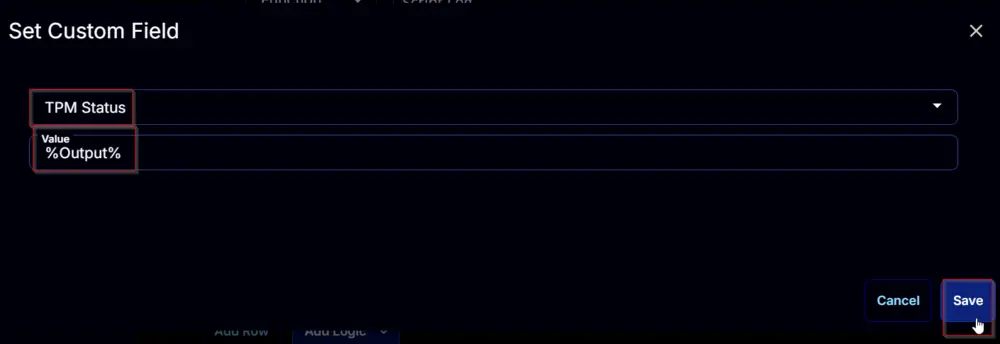

## Summary

Fetches the TPM Status of the machine and stores it in the [TPM Status](/docs/55cb2f37-6e43-4ae5-bc96-a94b5f2d4144) custom field.

## Sample Run


## Dependencies

[CW RMM - Custom Field - Endpoint - TPM Status](/docs/55cb2f37-6e43-4ae5-bc96-a94b5f2d4144)  
Create the dependent Custom Field before creating the task.

## Task Creation

Create a new `Script Editor` style script in the system to implement this Task.


**Name:** `Get TPM Status`  
**Description:** `Fetches the TPM Status of the machine and stores it in the TPM Status custom field.`  
**Category:** Security


## Task

Navigate to the Script Editor Section and start by adding a row. You can do this by clicking the `Add Row` button at the bottom of the script page.


A blank function will appear.


### Row 1 Function: PowerShell Script

Search and select the `PowerShell Script` function.


The following function will pop up on the screen:


Paste in the following PowerShell script and set the `Expected time of script execution in seconds` to `300` seconds. Click the `Save` button.

```PowerShell
try {
    $tpmResults = Get-Tpm -ErrorAction Stop
} catch {
    throw "The script did not return the expected result. Reason: $($Error[0].Exception.Message)"
}
return "TpmEnabled: $($tpmResults.TpmEnabled) | TpmActivated: $($tpmResults.TpmActivated) | TpmReady: $($tpmResults.TpmReady) | TpmPresent: $($tpmResults.TpmPresent) | RestartPending: $($tpmResults.RestartPending)"
```


### Row 2 Function: Script Log

Add a new row by clicking the `Add Row` button.


A blank function will appear.


Search and select the `Script Log` function.


The following function will pop up on the screen:


In the script log message, simply type `%output%` and click the `Save` button.


### Row 3 Function: Set Custom Field

Add a new row by clicking the `Add Row` button.


A blank function will appear.


Search and select the `Set Custom Field` function.


The following function will pop up on the screen:


- Search and select the Computer-Level Custom Field `TPM Status` from the Custom Field dropdown menu.
- Set `%Output%` in the `Value` field.
- Click the `Save` button.



Click the `Save` button at the top-right corner of the screen to save the script.


## Completed Script


## Output

- Script log  


- Custom Field  
  
Example: `TpmEnabled: True | TpmActivated: True | TpmReady: True | TpmPresent: True | RestartPending: False`
