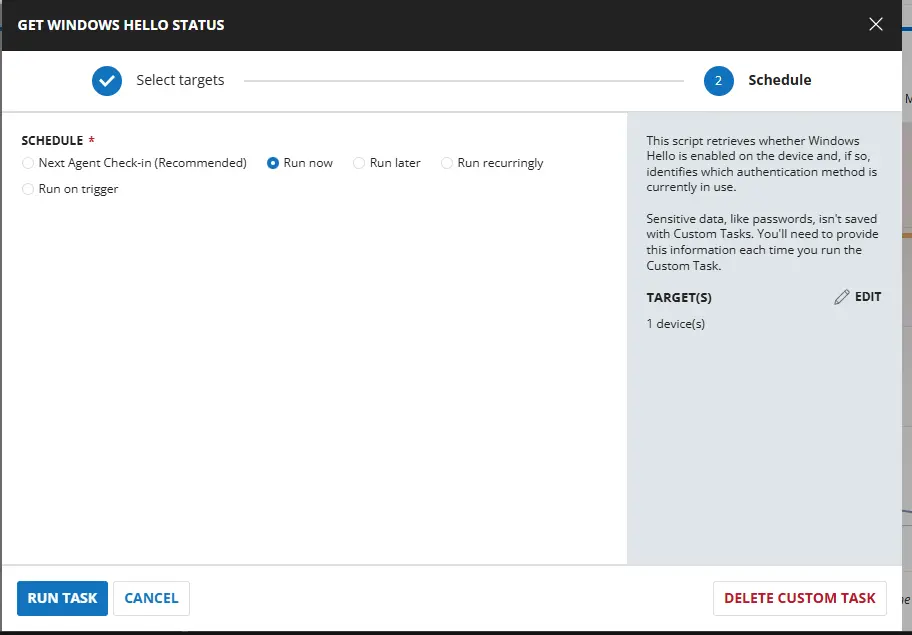
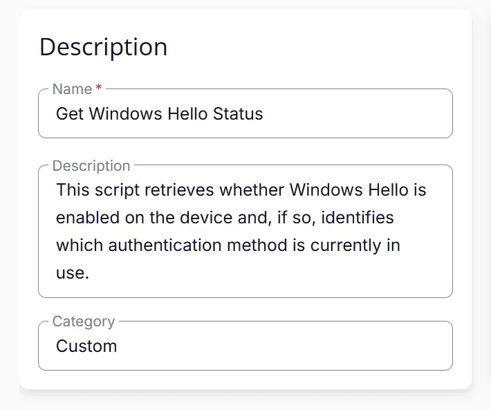
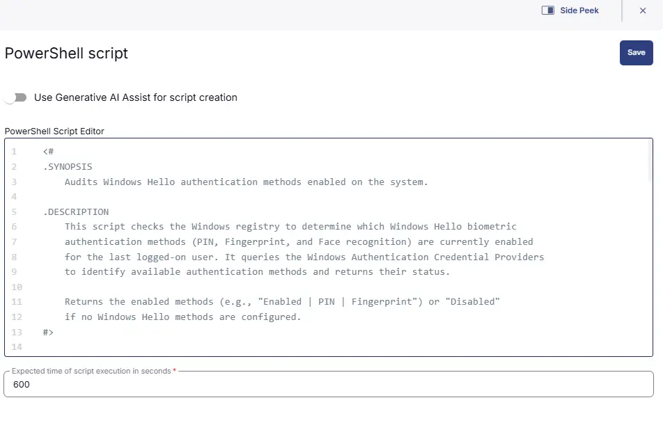
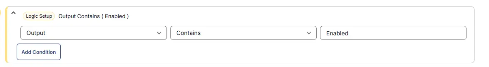
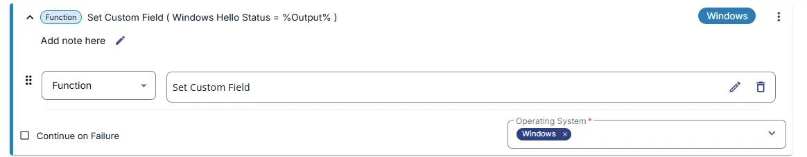
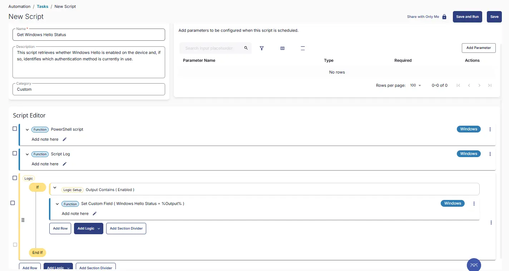
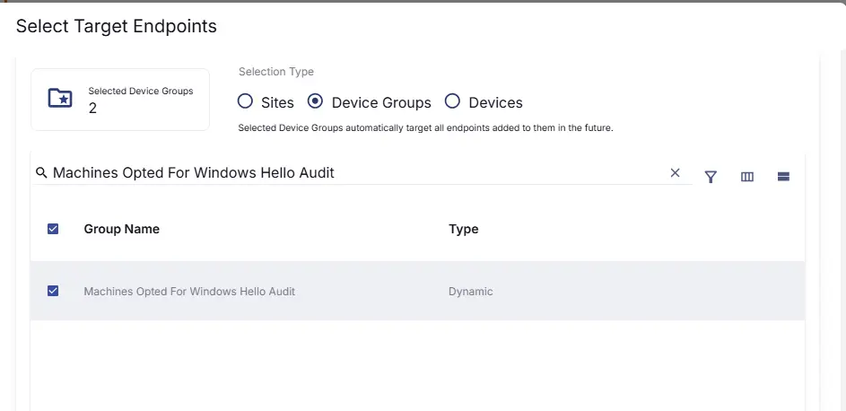
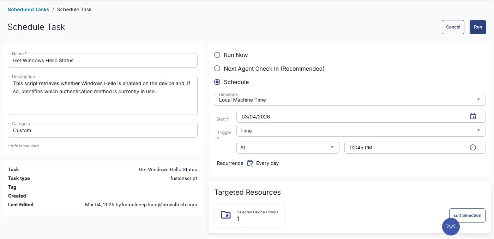

## Summary
This script retrieves whether Windows Hello is enabled on the device and, if so, identifies which authentication method is currently in use.

## Sample Run


## Dependencies

- [Solution - Windows Hello Audit](/docs/1ec129b5-f607-41ab-b451-b54a2078950c)

## Task Creation

### Script Details

#### Step 1

Navigate to `Automation` ➞ `Tasks`  


#### Step 2

Create a new `Script Editor` style task by choosing the `Script Editor` option from the `Add` dropdown menu  


The `New Script` page will appear on clicking the `Script Editor` button:  


#### Step 3

Fill in the following details in the `Description` section:  

**Name:** `Get Windows Hello Status`  
**Description:** `This script retrieves whether Windows Hello is enabled on the device and, if so, identifies which authentication method is currently in use.`  
**Category:** `Custom`




### Script Editor

Click the `Add Row` button in the `Script Editor` section to start creating the script  


A blank function will appear:  


#### Row 1 Function: `PowerShell Script`

Search and select the `PowerShell Script` function.  
 
  

The following function will pop up on the screen:  
  

Paste in the following PowerShell script and set the `Expected time of script execution in seconds` to `600` seconds. Click the `Save` button.

```powershell
<#
.SYNOPSIS
    Audits Windows Hello authentication methods enabled on the system.

.DESCRIPTION
    This script checks the Windows registry to determine which Windows Hello biometric 
    authentication methods (PIN, Fingerprint, and Face recognition) are currently enabled 
    for the last logged-on user. It queries the Windows Authentication Credential Providers 
    to identify available authentication methods and returns their status.
    
    Returns the enabled methods (e.g., "Enabled | PIN | Fingerprint") or "Disabled" 
    if no Windows Hello methods are configured.
#>

try {
    # Get Last Logged-On User SID
    $logonUIPath = "HKLM:\SOFTWARE\Microsoft\Windows\CurrentVersion\Authentication\LogonUI"
    if (-not (Test-Path $logonUIPath)) {
        return "Unable to determine"
    }

    $lastUserSID = (Get-ItemProperty -Path $logonUIPath -ErrorAction Stop).LastLoggedOnUserSID

    if ([string]::IsNullOrWhiteSpace($lastUserSID)) {
        return "Unable to determine"
    }

    # Credential Provider GUIDs
    $providers = @{
        PIN         = "{D6886603-9D2F-4EB2-B667-1971041FA96B}"
        Fingerprint = "{BEC09223-B018-416D-A0AC-523971B639F5}"
        Face        = "{8AF662BF-65A0-4D0A-A540-A338A999D36F}"
    }

    $basePath = "HKLM:\SOFTWARE\Microsoft\Windows\CurrentVersion\Authentication\Credential Providers"

    $enabledMethods = @()

    foreach ($method in $providers.Keys) {

        $providerPath = Join-Path $basePath $providers[$method]

        if (Test-Path $providerPath) {

            $userKeys = Get-ChildItem -Path $providerPath -ErrorAction SilentlyContinue

            foreach ($key in $userKeys) {

                if ($key.PSChildName -eq $lastUserSID) {

                    $props = Get-ItemProperty -Path $key.PSPath -ErrorAction SilentlyContinue

                    if ($props.LogonCredsAvailable -eq 1) {
                        $enabledMethods += $method
                    }
                }
            }
        }
    }
    if ($enabledMethods.Count -gt 0) {
        return "Enabled | " + ($enabledMethods -join " | ")
    }
    else {
        return "Disabled"
    }
}
catch {
    return "Error"
}


```



### Row 2 Function: Script Log

Add a new row by clicking the `Add Row` button.  
  

A blank function will appear.  
  

Search and select the `Script Log` function.  
  
 

In the script log message, simply type `%output%` and click the `Save` button.  


#### Step 3 Logic: If/Then

Click on `Add Logic` > select `If/Then`

#### Row 3a Condition: Output Contains

- **Condition:** `Output`  
- **Operator:** `Contains`  
- **Input Values:** `Enabled`



#### Row 3b Function: Set Custom Field

- Select `Windows Hello Status` from dropdown
- Add `%output%` in the Value




## Save Task

Click the `Save` button at the top-right corner of the screen to save the script.  


## Completed Task



## Output
- Script Log
- Custom Field

## Schedule Task

### Task Details

**Name:** `Get Windows Hello Status`  
**Description:** `This script retrieves whether Windows Hello is enabled on the device and, if so, identifies which authentication method is currently in use.`  
**Category:** `Custom`


### Schedule

- **Schedule Type:**  `Schedule`  
- **Timezone:** `Local Machine Time`  
- **Start:** `<Current Date>`  
- **Trigger:** `Time` `At` `<Current Time>`  
- **Recurrence:** `Every day`


### Targeted Resource

**Device Group:** `'Machines Opted For Windows Hello Audit`



### Completed Scheduled Task

