## Summary

The script will check and return the health status of the HP iLO devices, writing the output in a script log. It is a CW RMM implementation of [Get-HPiLOHealthReport](/docs/71faa943-e504-4e87-b8d1-39471af44780), an agnostic script.

## Sample Run

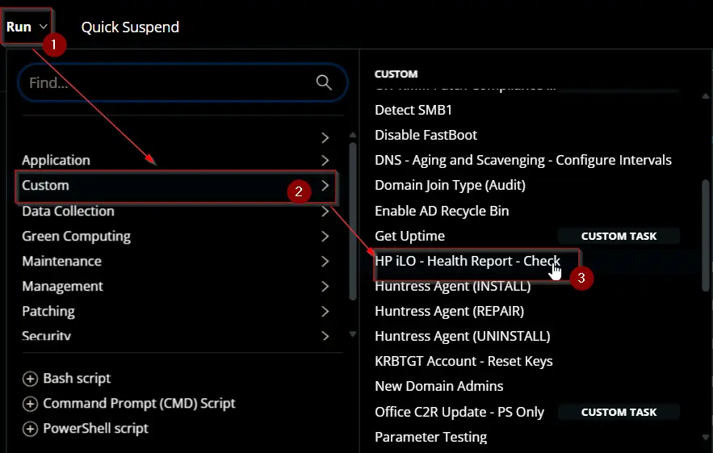

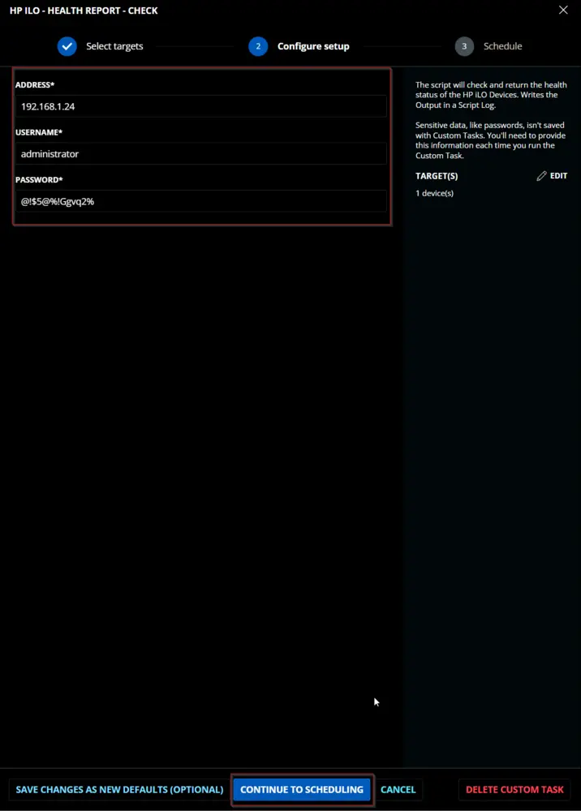

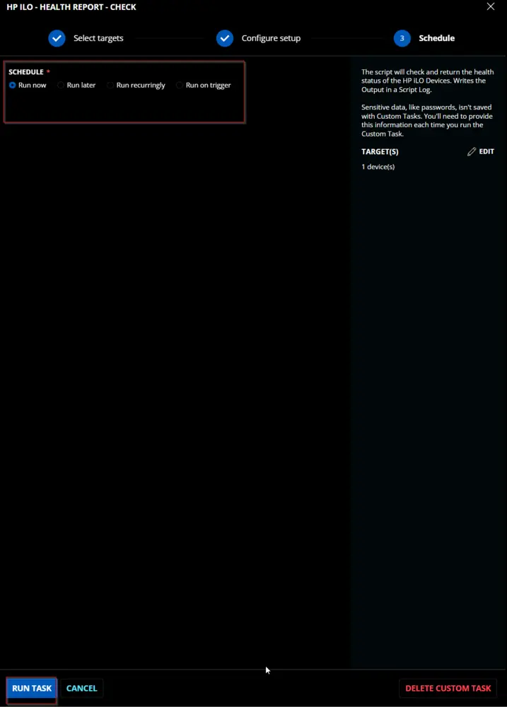

## Dependencies

[Get-HPiLOHealthReport](/docs/71faa943-e504-4e87-b8d1-39471af44780)

## User Parameters

| Name        | Example                     | Required | Type        | Description                                                                                     |
|-------------|-----------------------------|----------|-------------|-------------------------------------------------------------------------------------------------|
| `Address`   | 192.168.2.16, 192.168.7.13:54 | True     | Text String | IP address of the iLO device. Port number must be added if a custom port is being used.       |
| `Username`  | Administrator               | True     | Text String | Admin username to connect with the iLO device.                                               |
| `Password`  | @!#f2GW@f2!$                | True     | Text String | Password for the admin user.                                                                    |

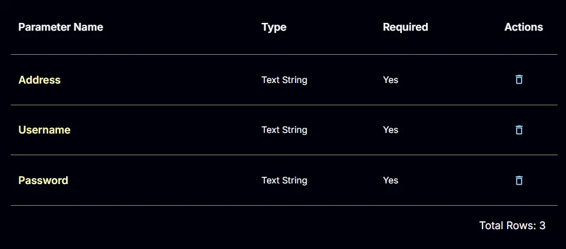

## Task Creation

Create a new `Script Editor` style script in the system to implement this task.

**Name:** `HP iLO - Health Report - Check`  
**Description:** `The script will check and return the health status of the HP iLO devices, writing the output in a script log.`  
**Category:** Custom

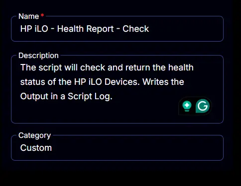

## Parameters

### Address

Add a new parameter by clicking the `Add Parameter` button present at the top-right corner of the screen.

This screen will appear.

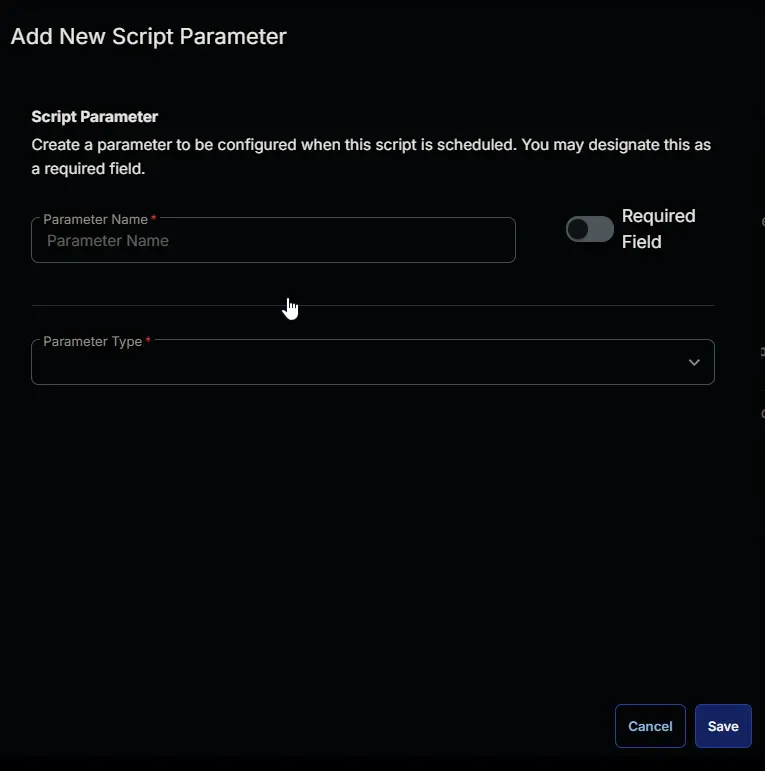

- Set `Address` in the `Parameter Name` field.
- Select `Text String` from the `Parameter Type` dropdown menu.
- Enable the `Required Field` button.
- Click the `Save` button.

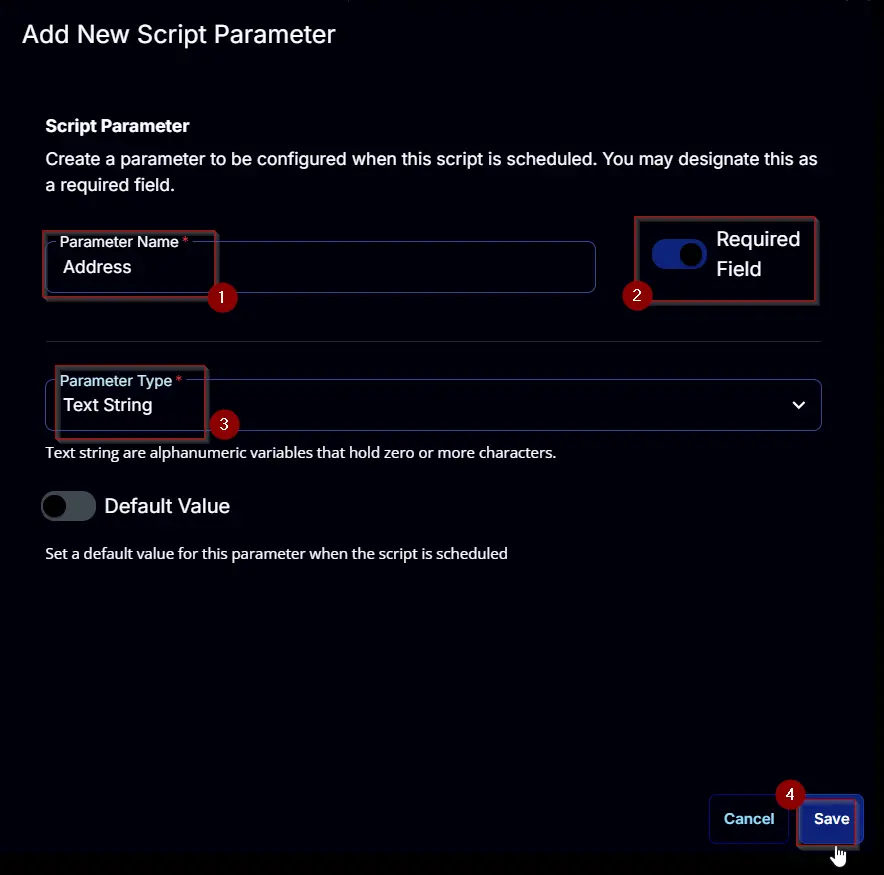

### Username

Add a new parameter by clicking the `Add Parameter` button present at the top-right corner of the screen.

This screen will appear.

- Set `Username` in the `Parameter Name` field.
- Select `Text String` from the `Parameter Type` dropdown menu.
- Enable the `Required Field` button.
- Click the `Save` button.

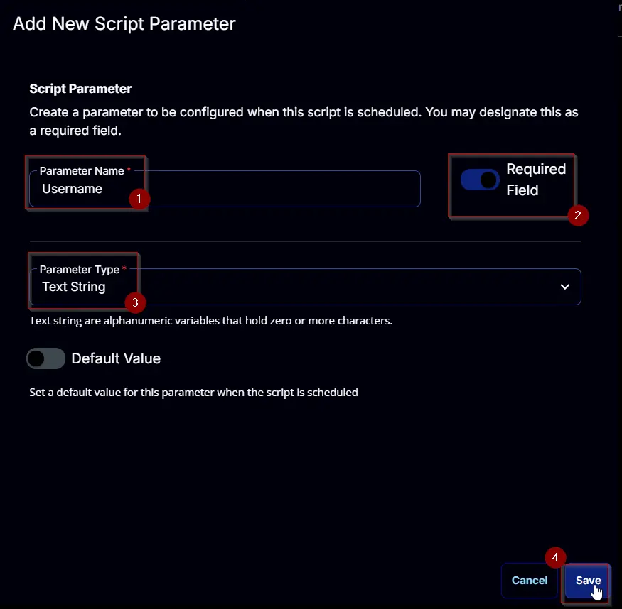

### Password

Add a new parameter by clicking the `Add Parameter` button present at the top-right corner of the screen.

This screen will appear.

- Set `Password` in the `Parameter Name` field.
- Select `Text String` from the `Parameter Type` dropdown menu.
- Enable the `Required Field` button.
- Click the `Save` button.

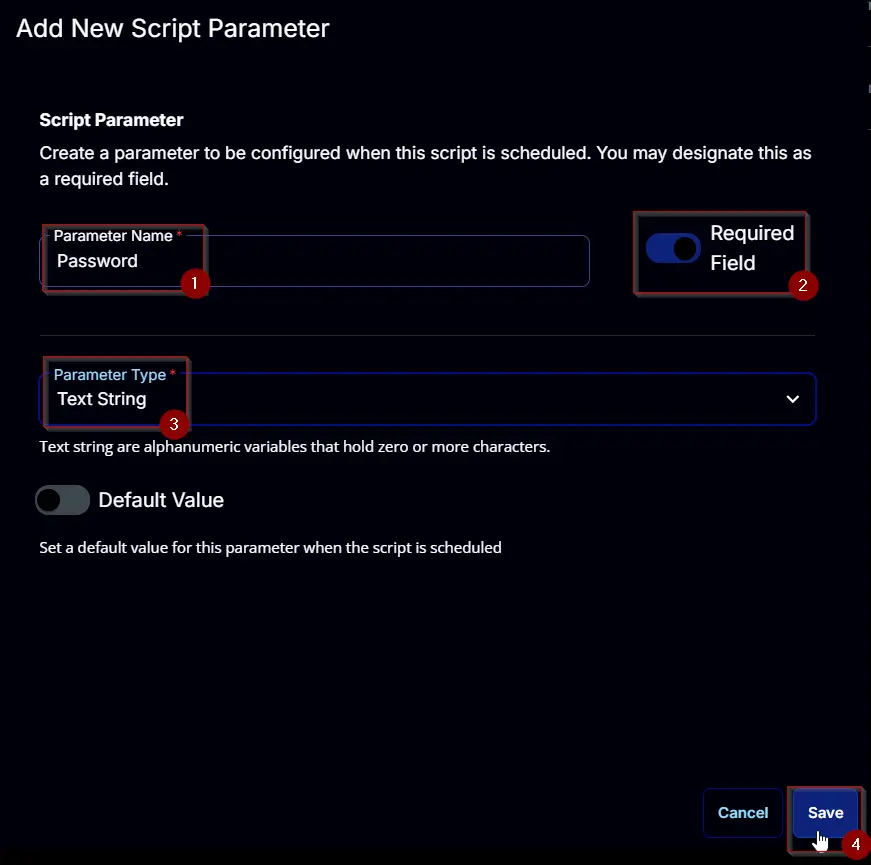

## Task

Navigate to the Script Editor section and start by adding a row. You can do this by clicking the `Add Row` button at the bottom of the script page.

A blank function will appear.

### Row 1 Function: PowerShell Script

Search and select the `PowerShell Script` function.

The following function will pop up on the screen:

Paste in the following PowerShell script and set the `Expected time of script execution in seconds` to `900` seconds. Click the `Save` button.

[PowerShell Script](https://github.com/ProVal-Tech/cw-rmm/blob/main/tasks/hp-ilo-health-report-check/script.ps1)

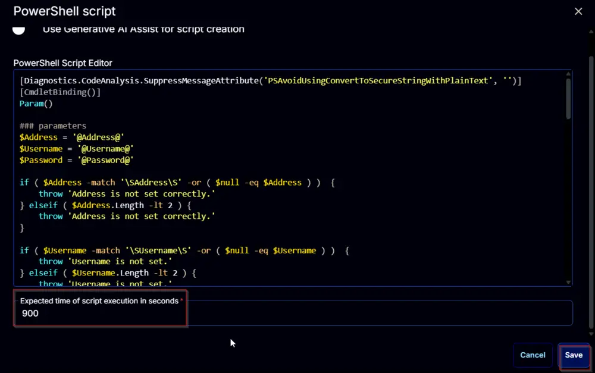

### Row 2 Function: Script Log

Add a new row by clicking the `Add Row` button.

A blank function will appear.

Search and select the `Script Log` function.

In the script log message, simply type `%output%` and click the `Save` button.

Click the `Save` button at the top-right corner of the screen to save the script.

## Completed Script

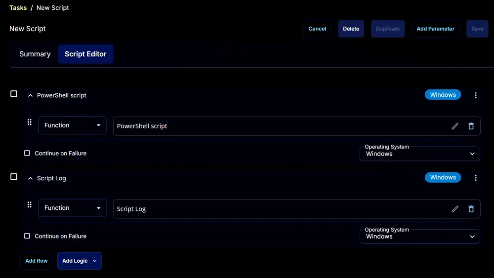

## Output

- Script log

## Changelog

### 2025-04-10

- Initial version of the document

