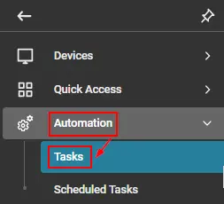
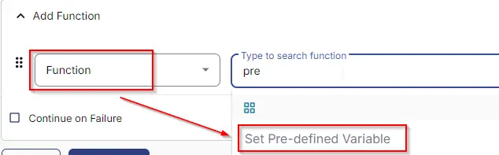
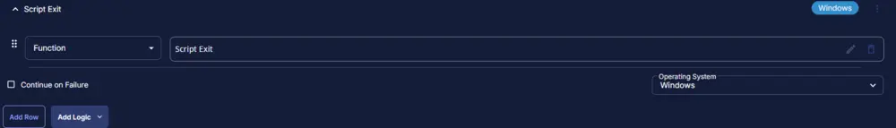

## Summary

This task will first check if Huntress is installed. If it is not, the script will attempt to install the agent and log the result for MAC machines.

## Create Script

Please create a new "PowerShell" style script to implement this task.

  
  

**Name:** Huntress Agent (Install) - MAC  
**Description:** This task will check if Huntress is installed. If not, it will attempt to install the agent and log the result for MAC machines.  
**Category:** Custom  

  

## Script

### Row 1 Function: Script Log

  

Input the following:

```Shell
The script will detect the Huntress Agent, and if the agent is not found, it will install the agent.  

acct_key : @acct_key@  
org_key: @ORG_Key@  
tags: ['installation', 'logging']

Attempting to download the file using acct_key from the Huntress website as below:  
https://huntress.io/script/darwin/@acctKey, and once downloaded, the agent will be attempted to install.
```

### Row 2 Function: Set Pre-defined Variable

- Select `Set Pre-Defined Variable` Function  
  

- Select `Custom Field`  
- Input `acct_key` as Variable name  
- Select `Huntress Acct_Key` custom field from the dropdown  
- Click Save  

  

### Row 3 Function: Set Pre-defined Variable

- Select `Set Pre-Defined Variable` Function  
  

- Select `Custom Field`  
- Input `ORG_Key` as Variable name  
- Select `Huntress Org_Key` custom field from the dropdown  
- Click Save  

  

### Row 4 Function: Set Pre-defined Variable

- Select `Set Pre-Defined Variable` Function  
  

- Select `Custom Field`  
- Input `Tags` as Variable name  
- Select `Huntress Tag` custom field from the dropdown  
- Click Save  

  

## Row 5 Function: Bash Script

  

Paste the following PowerShell script and set the expected script execution time to 900 seconds.  
```
#!/bin/bash

# Check if Huntress is installed
if command -v huntress &> /dev/null
then
    echo "Huntress agent is installed already."
    exit 0
else
    echo "Huntress is not installed. Proceeding with installation."
fi

# Download the Huntress installation script
curl -o /tmp/HuntressMacInstall.sh -L "https://huntress.io/script/darwin/@acctKey@"

# Execute the installation script
bash /tmp/HuntressMacInstall.sh -a @acctKey@ -o "@orgKey@" -t "@tags@"

# Revalidate if Huntress is installed
if command -v huntress &> /dev/null
then
    echo "Huntress agent is installed successfully."
else
    echo "Failed to install Huntress."
fi
```

  

## Step 6 Function: Script Log

- Add a new row in the If Section of the If-Else part by clicking the Add Row button  
- Search and select the `Script Log` function.  
- Input the following:  

```shell
%Output%
```
  
  

## Step 7 Logic: If/Then

- Add a new `If/Then/Else` logic from the Add Logic dropdown menu.  
  

### Row 7a Condition: Output Contains

- Type `Huntress agent is installed` in the Value box.  
  

### Row 7b Function: Set Custom Field

- Add a new row in the If Section of the If-Else part by clicking the Add Row button  
- Search and select the `Set Custom Field` function.  
  

- Search and select the `Huntress Deploy_Result` Custom Field.  
- Type `Successfully Installed` in the `Value` box and click the Save button.  

### Row 7c Function: Script Exit

- Add a new row in the If Section of the If-Else part by clicking the Add Row button  
- Search and select the `Script Exit` function.  
- Leave the value blank to allow the script to exit on success.  

  
  

## Step 8 Function: Script Exit

- Add a new row in the If Section of the If-Else part by clicking the Add Row button  
- Search and select the `Script Log` function.  
- Input the following:  

```shell
Huntress Agent failed to install. Refer to the logs: %Output%
```
  
  

## Step 10: Complete Script

  

## Script Deployment

This task must be scheduled on `Deploy Huntress - MAC`, the group for auto-deployment. The script can also be run manually if required.

Go to Automations > Tasks.  
Search for Huntress Agent Install.  
Then click on Schedule and select the Target:  

  

Select the group "Deploy Huntress - MAC" and save the selection.  

  

Once selected, click on Run to schedule the script as per requirement.

## Output

- Script log