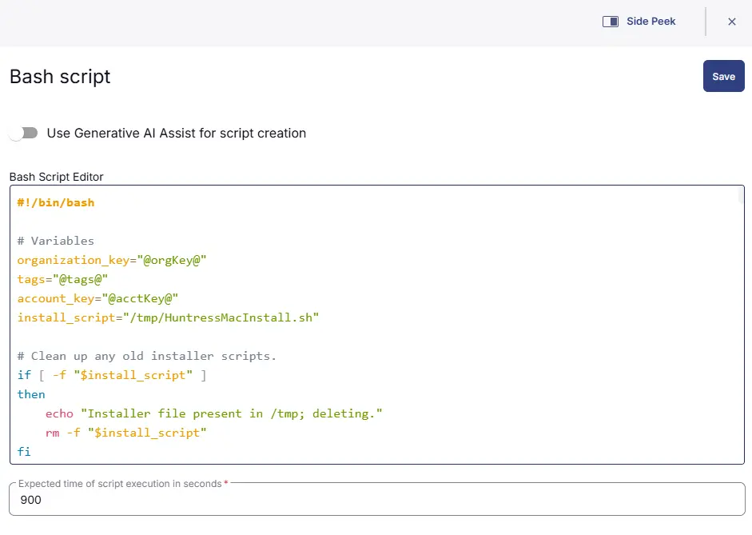
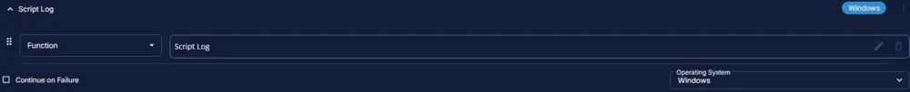
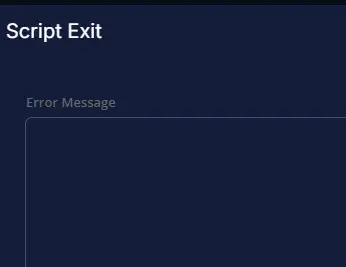

## Summary

This task will first check if Huntress is installed. If it is not, the script will attempt to install the agent and log the result for MAC machines.

**Note:** `Huntress Agent requires macOS 13.0.0 or later.`

## Create Script

- Go to `Automation` > `Tasks`
- At the top-right corner, click on the `Add` dropdown menu and select `Script Editor`

Task Details:

- **Name:** Huntress Agent (Install) - MAC  
- **Description:** This task will check if Huntress is installed. If not, it will attempt to install the agent and log the result for MAC machines.  
- **Category:** Custom  

  

## Script

### Row 1 Function: Set Pre-defined Variable

- Select `Set Pre-Defined Variable` Function  
  

- Select `Custom Field`  
- Input `acctKey` as Variable name  
- Select `Huntress Acct_Key` or (`Huntress Account Key`) custom field from the dropdown  
- Click `Save`  

  

### Row 2 Function: Set Pre-defined Variable

- Select `Set Pre-Defined Variable` Function  
  

- Select `Custom Field`  
- Input `orgKey` as Variable name  
- Select `Huntress Org_Key` custom field from the dropdown  
- Click `Save`  

  

### Row 3 Function: Set Pre-defined Variable

- Select `Set Pre-Defined Variable` Function  
  

- Select `Custom Field`  
- Input `tags` as Variable name  
- Select `Huntress Tag` custom field from the dropdown  
- Click `Save`  

  

### Row 4 Function: Script Log

  

Input the following:

```PlainText
The script will detect the Huntress Agent and if the agent is not found then it will install the agent.

acct_key : @acctKey@
org_key: @orgKey@
Tags: @tags@

Attempting to download the file using acct_key from the huntress website as below:

https://huntress.io/script/darwin/@acctKey@, and once downloaded the agent will be attempted to install.
```

## Row 5 Function: Bash Script

  

Paste the following PowerShell script and set the expected script execution time to 900 seconds. Set this step to `Continue on Failure`

```bash
#!/bin/bash

# Variables
organization_key="@orgKey@"
tags="@tags@"
account_key="@acctKey@"
install_script="/tmp/HuntressMacInstall.sh"

# Clean up any old installer scripts.
if [ -f "$install_script" ]
then
    echo "Installer file present in /tmp; deleting."
    rm -f "$install_script"
fi

# Write the Huntress installation script
# Usually downloaded from "https://huntress.io/script/darwin/$account_key"
# Writing it instead because downloaded file is not running the download command silently
# CW RMM script fails if the curl command returns any output
cat >"$install_script"<<'EOF'
#!/bin/bash

declare account_key
declare organization_key
declare tags
declare api_url
declare eetee_url
declare allow_http=false
declare verbose=0
declare interactive=1
declare install_system_extension=0
declare -a ARGS
declare portal_url="https://huntress.io"
declare package_file=
ARGS=()

usage() {
    cat <<USAGE
Usage: $0 [options...] --account_key <account_key> --organization_key <organization_key>

-a, --account_key      <account_key>      The account key to use for this agent install
-o, --organization_key <organization_key> The org key to use for this agent install
-t, --tags             <tags>             A comma-separated list of agent tags
-v, --verbose                             Print info during install
    --batch_only                          Do not prompt the user for missing info
    --install_system_extension            Install system extension (will prompt user to approve)
-h, --help                                Print this message

USAGE
}

while [[ $# -gt 0 ]]; do
    key="$1"

    case $key in
        -a|--account_key)
            account_key="$2"
            shift
            shift
            ;;
        --batch_only)
            interactive=0
            shift
            ;;
        -o|--organization_key)
            organization_key="$2"
            shift
            shift
            ;;
        -t|--tags)
            tags="$2"
            shift
            shift
            ;;
        --install_system_extension)
            install_system_extension=1
            shift
            ;;
        -v|--verbose)
            verbose=1
            shift
            ;;
        -h|--help)
            usage
            exit
            ;;
        # these are more or less hidden options. Only used for debugging
        -f|--package-file)
            package_file="$2"
            shift
            shift
            ;;
        -p|--portal_url|--portal-url)
            portal_url="$2"
            shift
            shift
            ;;
        -u|--api_url|--api-url)
            api_url="$2"
            allow_http=true
            shift
            shift
            ;;
        --eetee_url|--eetee-url)
            eetee_url="$2"
            allow_http=true
            shift
            shift
            ;;
        *)
            ARGS+=($1)
            shift
            ;;
    esac
done

set -- "${ARGS[@]}"

# ask the user for the account key if not passed in and we are
# "interactive" (see --batch_only)
if [[ -z $account_key && $interactive -eq 1 ]]
then
    echo -n "Account Key: "
    read account_key
fi

# ask the user for the organization key if not passed in and we are
# "interactive" (see --batch_only)
if [[ -z $organization_key && $interactive -eq 1 ]]
then
    echo -n "Organization Key: "
    read organization_key
fi

# account key and organization key are required
if [[ -z $account_key || -z $organization_key ]]
then
    echo Error: --account_key and --organization_key are both required
    echo
    usage
    exit 1
fi

declare installer_config="/tmp/hagent.yaml"

[[ $verbose -eq 1 ]] && echo creating "$installer_config"...

# create the hagent.yaml file used by the postinstall script to build
# the AgentConfig.plist file
cat >"$installer_config" <<CONFIG
account_key: $account_key
organization_key: $organization_key
api_url: $api_url
allow_http: $allow_http
install_system_extension: $install_system_extension
tags: $tags
CONFIG

if [ -n "$eetee_url" ]; then
    echo "eetee_url: $eetee_url" >>"$installer_config"
fi

huntress_pkg=/tmp/HuntressAgent.pkg

if [ -n "$package_file" ]; then
  if [ -f "$package_file" ]; then
    cp -f "$package_file" "$huntress_pkg"
  else
    echo "$package_file" was not found
    exit 1
  fi
else
  # download the HuntressAgent.pkg file from S3
  status_code=$(curl -f -L -o "$huntress_pkg" -w %{http_code} "$portal_url/download/darwin/$account_key" --silent)

  if [ $? != 0 ]; then
    if [ "$status_code" = "400" ]; then
      echo "Account Key not valid."
    elif [ "$status_code" = "404" ]; then
      echo "File not found on S3."
    elif [ "$status_code" = "409" ]; then
      echo "The macOS Beta has not been enabled for this account."
    fi
    exit 1
  elif ! [ -f "$huntress_pkg" ]; then
    echo "File download failed."
    exit 1
  fi
fi

[[ $verbose -eq 1 ]] && echo running the installer...

# run the install
installer -pkg "$huntress_pkg" -target / || echo "Installation failed."

[[ $verbose -eq 1 ]] && echo cleaning up...

rm "$installer_config"
rm "$huntress_pkg"
EOF

if [ ! -f "$install_script" ]
then
    echo "Failed to download the installer script."
    exit 1
else
    echo "Downloaded the installer script."
fi

# Execute the installation script
chmod +x "$install_script"
if [ -z "$tags" ]
then
    /bin/bash "$install_script" --account_key "$account_key" --organization_key "$organization_key" --verbose
else 
    /bin/bash "$install_script" --account_key "$account_key" --organization_key "$organization_key" -tags "$tags" -verbose
fi

# Revalidate if Huntress is installed
if [ -d "/Applications/Huntress.app" ]
then
    echo "Huntress agent is installed successfully."
    exit 0
else
    echo "Failed to install Huntress."
    exit 1
fi
```

  

## Step 6 Function: Script Log

- Add a new row by clicking the `Add Row` button  
- Search and select the `Script Log` function.  
- Input the following:  

```shell
%Output%
```

  
  

## Step 7 Logic: If/Then

- Add a new `If/Then` logic from the `Add Logic` dropdown menu.  
  

### Row 7a Condition: Output Contains

- Type `Huntress agent is installed` in the Value box.  
  

### Row 7b Function: Set Custom Field

- Add a new row in the `If` Section by clicking the `Add Row` button  
- Search and select the `Set Custom Field` function.  
  

- Search and select the `Huntress Deploy_Result` Custom Field.  
- Type `Successfully Installed` in the `Value` box and click the Save button.  

### Row 7c Function: Script Exit

- Add a new row in the `If` Section by clicking the `Add Row` button  
- Search and select the `Script Exit` function.  
- Leave the value blank to allow the script to exit on success.  

       
  

## Step 8 Function: Script Exit

- Add a new row after the `If/Then` Section by clicking the `Add Row` button  
- Search and select the `Script Log` function.  
- Input the following:  

```shell
Huntress Agent failed to install. Refer to the logs: %Output%
```

  
  

## Completed Script

  

## Script Deployment

This task must be scheduled on `Deploy Huntress - MAC`, the group for auto-deployment. The script can also be run manually if required.

- Go to `Automations` > `Tasks`.  
- Search for `Huntress Agent (Install) - MAC`.  
- Then click on Schedule and select the Target:  

  

Select the group "Deploy Huntress - MAC" and save the selection.  

  

Once selected, click on Run to schedule the script as per requirement.

## Output

- Script log
