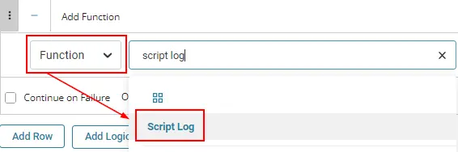
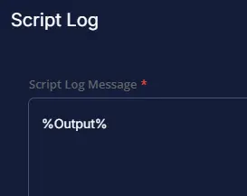
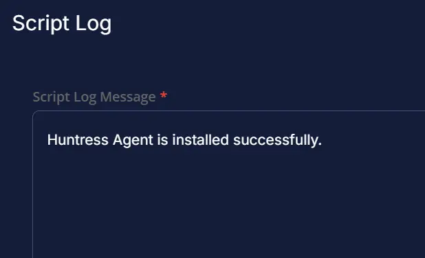
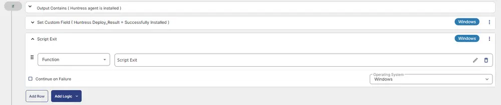

## Summary

Installs the Huntress agent on the Windows machine if it's not already installed.

## Dependencies

- [Custom Fields - Huntress Acct_Key](/docs/b8ce44cf-a4a7-4b17-a292-43615b2b192a)  
- [Custom Fields - Huntress Org_Key](/docs/00d66215-fe07-4bae-b6cb-d96a73486694)  
- [Custom Fields - Huntress Tag](/docs/30690dec-ecd0-448f-8429-24a5d2854953)  
- [Custom Fields - Huntress Deploy_Result](/docs/822e9dc0-d455-4706-8482-175b85dbd491)  
- [Device Group - Deploy Huntress](/docs/c19dc248-c6a0-4f9c-88c5-b3058245d74a)  

## Create Script

Please create a new "PowerShell" style script to implement this script.

  
  

**Name:** Huntress Agent Install  
**Description:** This task will check first if Huntress is installed. If not, it attempts to install the agent and log the result.  
**Category:** Custom  

  

## Script

### Row 1 Function: Script Log

  

Input the following:

```Shell
This script will detect the Huntress Agent and if the agent is not found then it will install the agent.
acct_key : @acct_key@
org_key: @ORG_Key@
Tags: @Tags@
Attempting to download the file using acct_key from the huntress website as below:
https://raw.githubusercontent.com/huntresslabs/deployment-scripts/main/Powershell/InstallHuntress.powershellv2.ps1, and once downloaded the agent will be attempted to install.
```

### Row 2 Function: Set Pre-defined Variable

- Select `Set Pre-Defined Variable` Function

  

- Select `Custom Field`
- Input `acct_key` as Variable name
- Select `Huntress Acct_Key` custom field from the drop-down
- Click Save

  

### Row 3 Function: Set Pre-defined Variable

- Select `Set Pre-Defined Variable` Function

  

- Select `Custom Field`
- Input `ORG_Key` as Variable name
- Select `Huntress Org_Key` custom field from the drop-down
- Click Save

  

### Row 4 Function: Set Pre-defined Variable

- Select `Set Pre-Defined Variable` Function

  

- Select `Custom Field`
- Input `Tags` as Variable name
- Select `Huntress Tag` custom field from the drop-down
- Click Save

  

### Row 5 Function: PowerShell Script

  

Paste in the following PowerShell script and set the expected script execution time to `1500` seconds.

```PowerShell
$installed = Get-ChildItem -Path HKLM:\SOFTWARE\Microsoft\Windows\CurrentVersion\Uninstall, HKLM:\SOFTWARE\Wow6432Node\Microsoft\Windows\CurrentVersion\Uninstall | Get-ItemProperty | Where-Object {$_.DisplayName -match 'Huntress' } | Select-Object -ExpandProperty DisplayName
if ($installed -match 'Huntress') {
    Write-Output 'Huntress agent is installed already.'
} else {
    #region Setup - Variables
    $PS1URL = 'https://raw.githubusercontent.com/huntresslabs/deployment-scripts/main/Powershell/InstallHuntress.powershellv2.ps1'
    $WorkingDirectory = 'C:\ProgramData\_Automation\Script\Invoke-HuntressAgentCommand'
    $PS1Path = "$WorkingDirectory\Invoke-HuntressAgentCommand.ps1"
    $AcctKey = '@acct_key@'
    $OrgKey = '@Org_Key@'
    $Tags = '@tags@'
    $Parameters = @{}

    if ($AcctKey -ne '' -and $AcctKey -notmatch '@acct_key') {
        $Parameters['acctkey'] = $AcctKey
    } else {
        return 'Account Key Missing'
    }

    if ($OrgKey -ne '' -and $OrgKey -notmatch '@Org_key') {
        $Parameters['orgkey'] = $OrgKey
    } else {
        $Parameters['orgkey'] = ''
    }

    if ($Tags -ne '' -and $Tags -notmatch '@tags') {
        $Parameters['tags'] = $Tags
    } else {
        $Parameters['tags'] = ''
    }

    #endregion

    #region Setup - Folder Structure
    if ( !(Test-Path $WorkingDirectory) ) {
        try {
            New-Item -Path $WorkingDirectory -ItemType Directory -Force -ErrorAction Stop | Out-Null
        } catch {
            return "ERROR: Failed to Create $WorkingDirectory. Reason: $($Error[0].Exception.Message)"
        }
    } if (-not ( ( ( Get-Acl $WorkingDirectory ).Access | Where-Object { $_.IdentityReference -Match 'EveryOne' } ).FileSystemRights -Match 'FullControl' ) ) {
        $ACl = Get-Acl $WorkingDirectory
        $AccessRule = New-Object System.Security.AccessControl.FileSystemAccessRule('Everyone', 'FullControl', 'ContainerInherit, ObjectInherit', 'none', 'Allow')
        $Acl.AddAccessRule($AccessRule)
        Set-Acl $WorkingDirectory $Acl
    }

    #region write script
    [Net.ServicePointManager]::SecurityProtocol = [enum]::ToObject([Net.SecurityProtocolType], 3072)
    try {
    Invoke-WebRequest -Uri $PS1URL -OutFile $PS1path -UseBasicParsing -ErrorAction Stop
} catch {
    if (!(Test-Path -Path $PS1Path )) {
        throw ('Failed to download the script from ''{0}'', and no local copy of the script exists on the machine. Reason: {1}' -f $PS1URL, $($Error[0].Exception.Message))
    }
}
    #endregion

    #region Execution
    if ($Parameters) {
        & $PS1Path @Parameters
    } else {
        & $PS1Path
    }
    #endregion

    Start-Sleep -Seconds 300
    $installed = Get-ChildItem -Path HKLM:\SOFTWARE\Microsoft\Windows\CurrentVersion\Uninstall, HKLM:\SOFTWARE\Wow6432Node\Microsoft\Windows\CurrentVersion\Uninstall | Get-ItemProperty | Where-Object {$_.DisplayName -match 'Huntress' } | Select-Object -ExpandProperty DisplayName
    if ($installed -match 'Huntress') {
        Write-Output 'Huntress agent is installed successfully.'
    } else {
        Write-Output 'ERROR: Failed to install Huntress agent.'
    }
}
```

  

### Step 6 Function: Script Log

- Add a new row in the If Section of the If-Else part by clicking the Add Row button
- Search and select the `Script Log` function.
- Input the following  

```Shell
%Output%
```

  
  

### Step 7 Logic: If Then Else

- Add a new `If/Then/Else` logic from the Add Logic dropdown menu.

  

### ROW 7a Condition: Output Contains

- Type `Huntress agent is installed` in the Value box.

  

### ROW 7b Function: Set Custom Field

- Add a new row in the If Section of the If-Else part by clicking the Add Row button
- Search and select the `Set Custom Field` function.

  

- Search and select the `Huntress Deploy_Result` Custom Field.
- Type `Successfully Installed` in the `Value` box and click the Save button.

  

### ROW 7c Function: Script Log

- Add a new row in the If Section of the If-Else part by clicking the Add Row button
- Search and select the `Script Exit` function.
- Leave it blank

```Shell
Huntress Agent is installed successfully.
```

  
  

### ROW 7d Function: Script Exit

- Add a new row in the If Section of the If-Else part by clicking the Add Row button
- Search and select the `Script Exit` function.
- Leave it blank

```Shell

```

  
  

### Step 7e Logic: If/Then

Add a new `If/Then` logic from the `Add Logic` dropdown menu inside the `Else` section.  

  

### Row 7e(i) Condition: Output Contains

- Select `Output` from the drop-down
- Type `ERROR:` in the Value box.
- Select another condition with the `OR` Operator
- Type `Account Key Missing` in the Value box.

  

### Row 7e(ii) Function: Set Custom Field

Add another row by selecting the `ADD ROW` button in the `Else` section of the internal `If/Then` section.  

- Search and select the `Set Custom Field` function.

  

- Search and select the `Huntress Deploy_Result` Custom Field.
- Type `%Output%` in the `Value` box and click the Save button.

  

### Row 7e(iii) Function: Script Exit

Add another row by selecting the `ADD ROW` button in the `Else` section of the internal `If/Then` section.  

- Search and select the `Script Exit` function.
- Input the following  

```Shell
Failed to install Huntress. Refer to the below log:
%Output%
```

The final task should look like the screenshot below.

  

## Script Deployment

This task has to be scheduled on the `Deploy Huntress` group for auto deployment. The script can also be run manually if required.

Go to Automations > Tasks.  
Search for Huntress Agent Install.  
Then click on Schedule and provide the parameter details as necessary for the script completion.

  

## Output

- Script log

## FAQ

**Note:**  
For the Huntress deployment, the Huntress_Acct_Key is mandatory to be filled at the company level.

  

The other custom fields can be left blank.

**Note:**  
Huntress_Acct_Key and Huntress_Org_Key are the company custom fields, whereas the Huntress_Tags is the site-level custom field.