## Summary

This task reinstalls the Huntress Agent.

## Create Script

Please create a new PowerShell style script to implement this task.

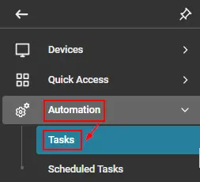  
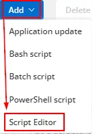  

**Name:** Huntress Agent (ReInstall)  
**Description:** This task reinstalls the Huntress Agent.  
**Category:** Custom  

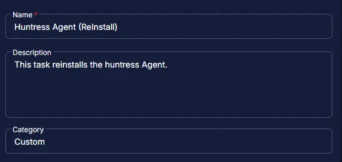  

## Script

## Row 1 Function: Script Log

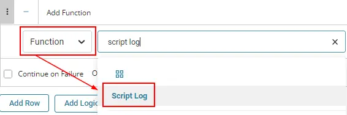  

Input the following:

The script will detect the required keys for the Huntress reinstallation:  

```Shell
The script will detect the required keys for the huntress reinstallation:
acct_key : @acct_key@
org_key: @ORG_Key@
Tags: @Tags@
Attempting to download the ps1 from the below link:
https://raw.githubusercontent.com/huntresslabs/deployment-scripts/main/Powershell/InstallHuntress.powershellv2.ps1, and once downloaded the agent will be attempted to reinstall.
```

## Row 2 Function: Set Pre-defined Variable

- Select `Set Pre-Defined Variable` Function

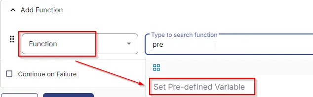  

- Select `Custom Field`
- Input `acct_key` as Variable name
- Select `Huntress Acct_Key` custom field from the dropdown
- Click Save

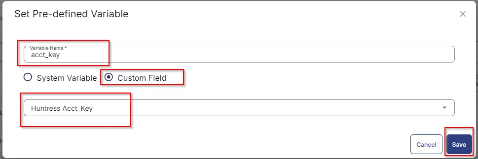  

## Row 3 Function: Set Pre-defined Variable

- Select `Set Pre-Defined Variable` Function

  

- Select `Custom Field`
- Input `ORG_Key` as Variable name
- Select `Huntress Org_Key` custom field from the dropdown
- Click Save

  

## Row 4 Function: Set Pre-defined Variable

- Select `Set Pre-Defined Variable` Function

  

- Select `Custom Field`
- Input `Tags` as Variable name
- Select `Huntress Tag` custom field from the dropdown
- Click Save

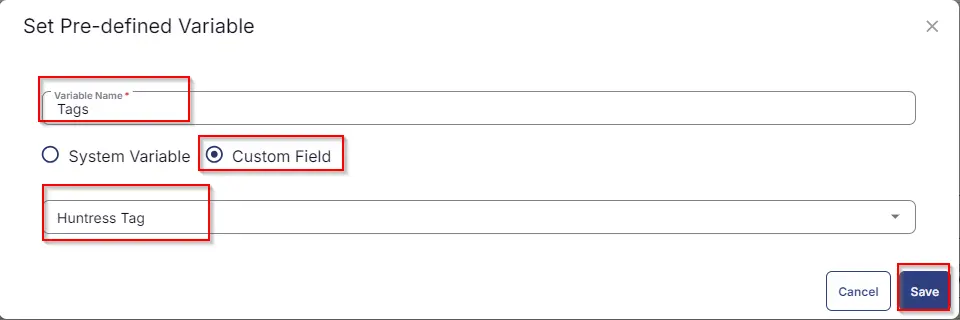  

## Row 5 Function: PowerShell Script

  

Paste in the following PowerShell script and set the expected script execution time to 900 seconds.

```PowerShell
#region Setup - Variables
$PS1URL = 'https://raw.githubusercontent.com/huntresslabs/deployment-scripts/main/Powershell/InstallHuntress.powershellv2.ps1'
$WorkingDirectory = 'C:\ProgramData\_Automation\Script\Invoke-HuntressAgentCommand'
$PS1Path =  "$WorkingDirectory\Invoke-HuntressAgentCommand.ps1"
$AcctKey = '@acctkey@'
$OrgKey = '@orgkey@'
$Tags = '@tags@'
$Parameters = @{}

    if ($AcctKey -ne '' -and $AcctKey -notmatch '@acct_key') {
        $Parameters['reinstall'] = $true
        $Parameters['acctkey'] = $AcctKey
    } else {
        return 'Account Key Missing'
    }

    if ($OrgKey -ne '' -and $OrgKey -notmatch '@Org_key') {
        $Parameters['orgkey'] = $OrgKey
    } else {
        $Parameters['orgkey'] = ''
    }

    if ($Tags -ne '' -and $Tags -notmatch '@tags') {
        $Parameters['tags'] = $Tags
    } else {
        $Parameters['tags'] = ''
    }

    #endregion

#region Setup - Folder Structure
if ( !(Test-Path $WorkingDirectory) ) {
    try {
        New-Item -Path $WorkingDirectory -ItemType Directory -Force -ErrorAction Stop | Out-Null
    } catch {
        return "ERROR: Failed to Create $WorkingDirectory. Reason: $($Error[0].Exception.Message)"
    }
} if (-not ( ( ( Get-Acl $WorkingDirectory ).Access | Where-Object { $_.IdentityReference -Match 'EveryOne' } ).FileSystemRights -Match 'FullControl' ) ) {
    $ACl = Get-Acl $WorkingDirectory
    $AccessRule = New-Object System.Security.AccessControl.FileSystemAccessRule('Everyone', 'FullControl', 'ContainerInherit, ObjectInherit', 'none', 'Allow')
    $Acl.AddAccessRule($AccessRule)
    Set-Acl $WorkingDirectory $Acl
}

#region write script
[Net.ServicePointManager]::SecurityProtocol = [enum]::ToObject([Net.SecurityProtocolType], 3072)
$response = Invoke-WebRequest -Uri $PS1URL -UseBasicParsing
if (($response.StatusCode -ne 200) -and (!(Test-Path -Path $PS1Path))) {
    return "ERROR: No pre-downloaded installer exists and installer $PS1URL failed to download. Exiting."
} elseif ($response.StatusCode -eq 200) {
    Remove-Item -Path $PS1Path -ErrorAction SilentlyContinue
    [System.IO.File]::WriteAllLines($PS1Path, $response.Content)
}
if (!(Test-Path -Path $PS1Path)) {
    return 'ERROR: An error occurred and huntress installer was unable to be downloaded. Exiting.'
}
#endregion

#region Execution
if ($Parameters) {
    & $PS1Path @Parameters
} else {
    & $PS1Path
}
#endregion
```

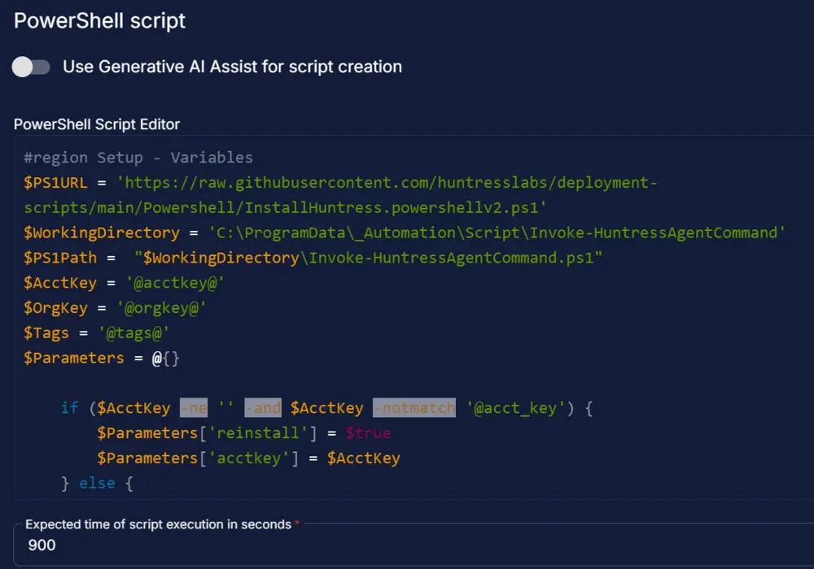  

## Step 6 Function: Script Log

- Add a new row in the If Section of the If-Else block by clicking the Add Row button
- Search and select the `Script Log` function.
- Input the following  

```plaintext
%Output%
```

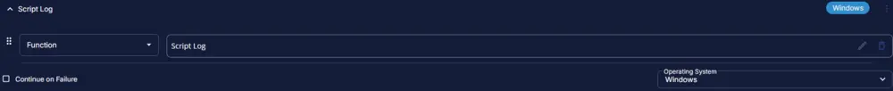  
  

## Step 7 Logic: If/Then

- Add a new `If/Then/Else` logic from the Add Logic dropdown menu.  

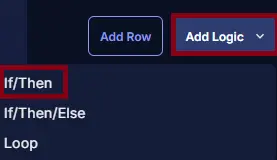  

## Row 7a Condition: Output Contains

- Type `denied` in the Value box.
- Add another condition with the OR operator and type `ERROR:` in the Value box.
- Add another condition with the OR operator and type `Account Key Missing` in the Value box.

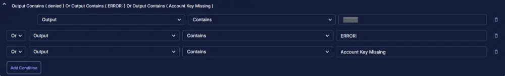  

## Row 7b Function: Script Exit

- Add a new row in the If Section of the If-Else block by clicking the Add Row button
- Search and select the `Script Exit` function.
- Input the following  

```plaintext
Failed to repair Huntress Agent. Command Result: %Output%
```

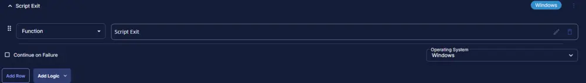  
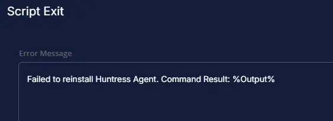  

## Step 8 Function: Script Log

- Add a new row in the If Section of the If-Else block by clicking the Add Row button
- Search and select the `Script Log` function.
- Input the following  

```plaintext
Successfully repaired Huntress Agent.
```

  
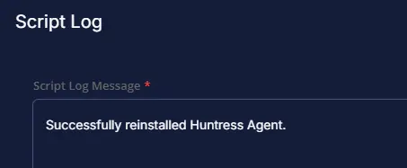  

## Step 9 Function: Script Exit

- Add a new row in the If Section of the If-Else block by clicking the Add Row button
- Search and select the `Script Exit` function.
- Leave it blank  

```plaintext

```

  
  

## Step 10: Complete Script

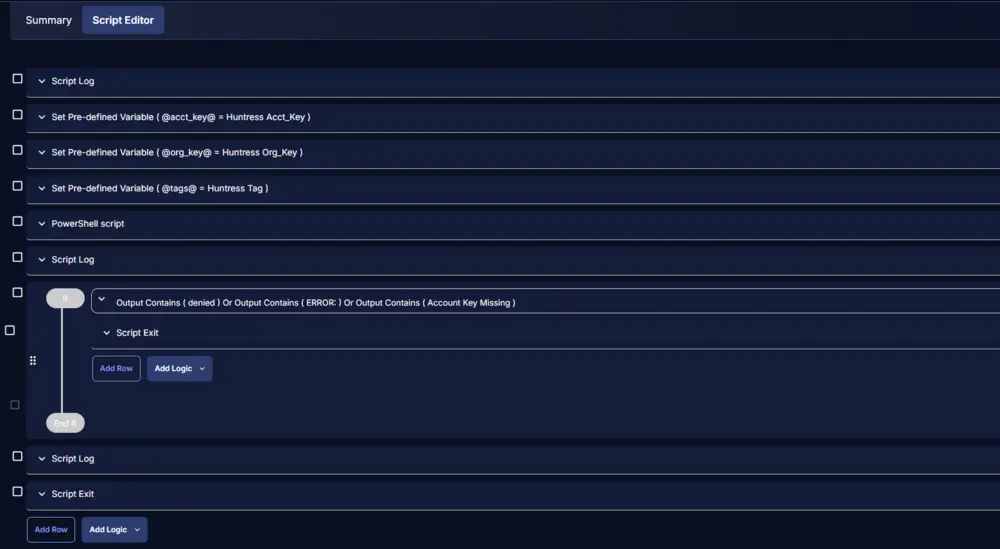  

## Script Deployment

For now, the task has been created to run manually on the machines.

Go to Automations > Tasks.  
Search for Huntress Agent (ReInstall).  
Then click on Schedule and provide the parameters details as necessary for the script completion.

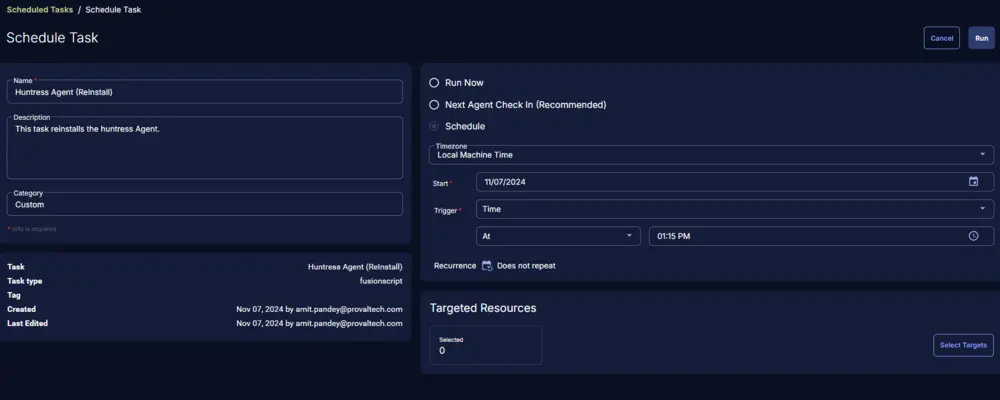  

## Output

- Script log