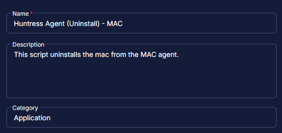
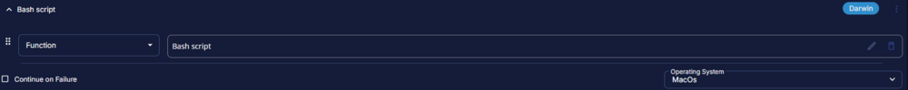
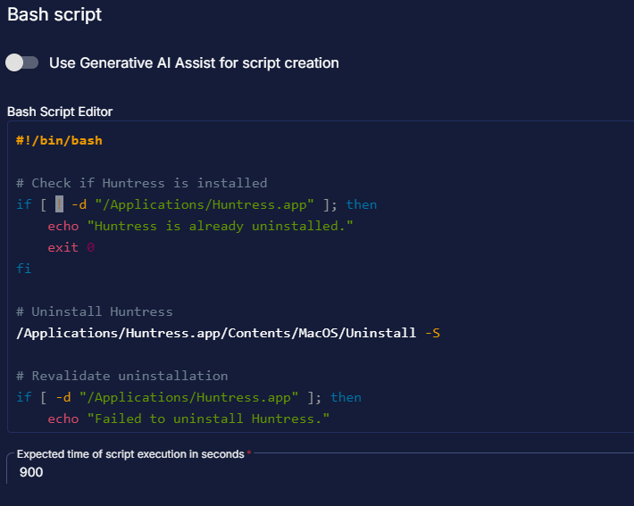
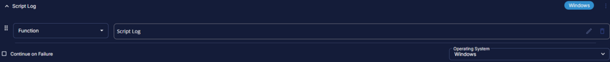
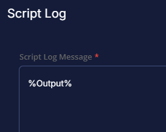
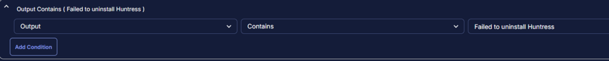
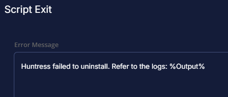
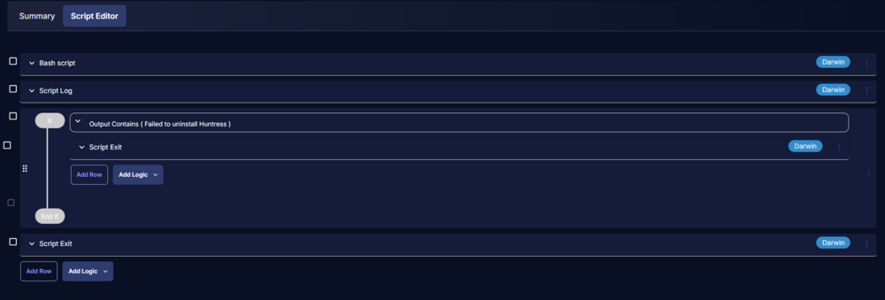
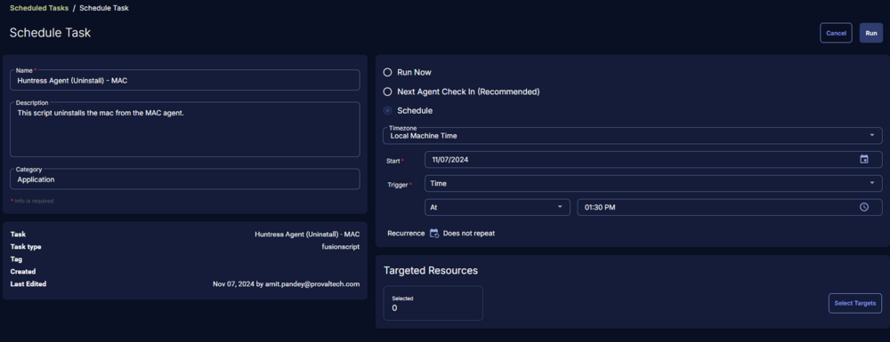

## Summary

This script uninstalls the Huntress agent from a Mac system.

## Create Script

Please create a new "PowerShell" style script to implement this process.

  
  

**Name:** Huntress Agent (Uninstall) - MAC  
**Description:** This script uninstalls the Huntress agent from a Mac system.  
**Category:** Custom  

  

# Script

## Row 1 Function: Bash Script

  

Paste the following Bash script and set the expected script execution time to 900 seconds.

```
#!/bin/bash

# Check if Huntress is installed
if [ ! -d "/Applications/Huntress.app" ]; then
    echo "Huntress is already uninstalled."
    exit 0
fi

# Uninstall Huntress
/Applications/Huntress.app/Contents/MacOS/Uninstall -S

# Revalidate uninstallation
if [ -d "/Applications/Huntress.app" ]; then
    echo "Failed to uninstall Huntress."
else
    echo "Huntress uninstalled successfully."
fi
```

  

## Step 2 Function: Script Log

- Add a new row in the If Section of the If/Else part by clicking the Add Row button.
- Search and select the `Script Log` function.
- Input the following:  

```
%Output%
```

  
  

## Step 3 Logic: If/Then

- Add a new `If/Then/Else` logic from the Add Logic dropdown menu.  

  

## Row 3a Condition: Output Contains

- Type `Failed to uninstall Huntress` in the Value box.  

  

## Row 3b Function: Script Exit

- Add a new row in the If Section of the If/Else part by clicking the Add Row button.
- Search and select the `Script Exit` function.
- Input the following:  

```
Huntress failed to uninstall. Refer to the logs: %Output%
```

  
  

## Step 4 Function: Script Exit

- Add a new row in the If Section of the If/Else part by clicking the Add Row button.
- Search and select the `Script Exit` function.
- Leave it blank  

```
```

  
  

## Step 5: Complete Script

  

## Script Deployment

For now, the task has been created to run manually on the machines.  
Go to Automations > Tasks.  
Search for Huntress Agent (Uninstall) - MAC.  
Then click on Schedule and provide the necessary parameters for script completion.  

  

## Output

- Script log

