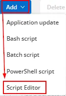
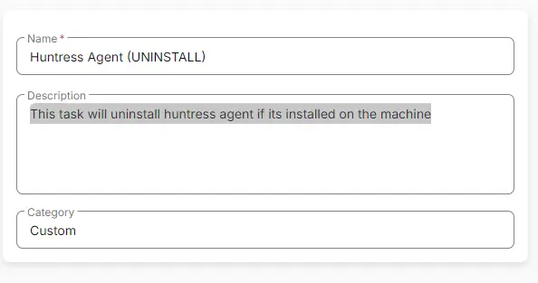
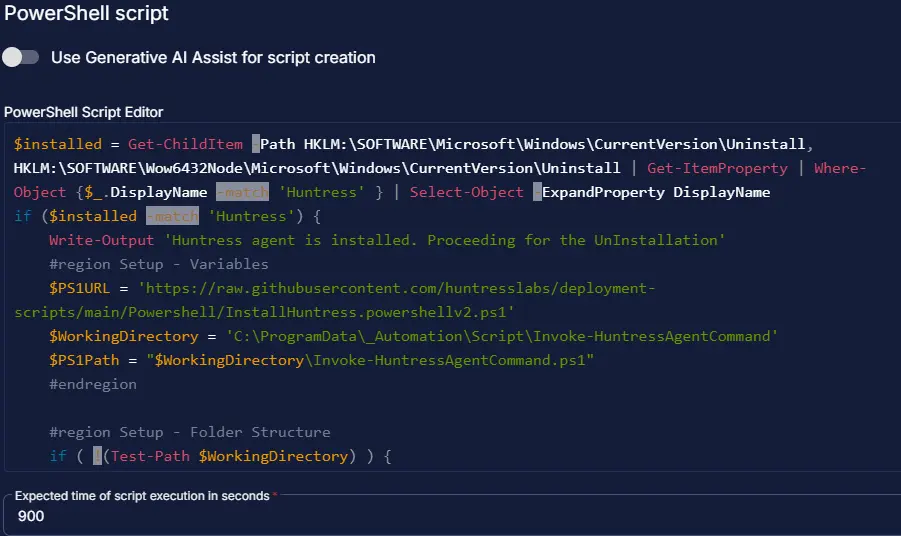
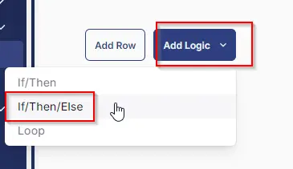
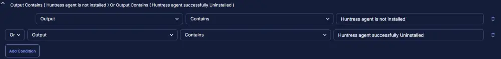
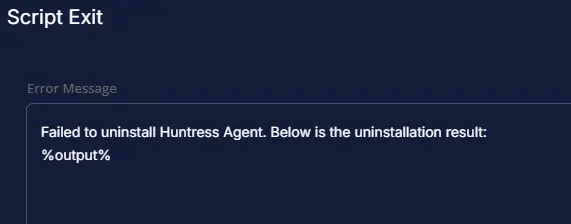
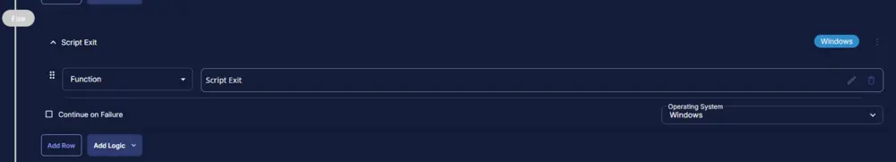
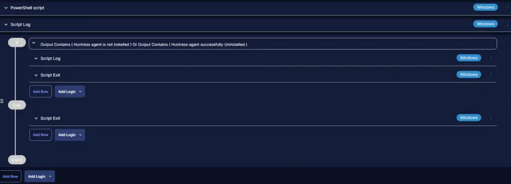
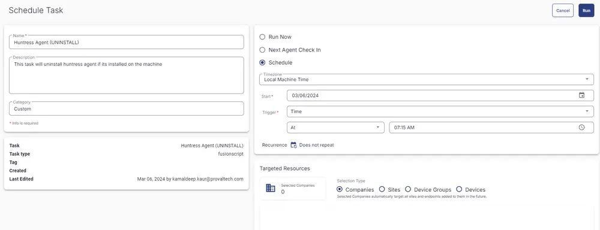

## Summary

This document outlines the steps to uninstall the Huntress agent from a Windows machine if it is installed.

## Dependencies

- None. This script can be run on any Windows device.

## Create Script

To implement this script, please create a new PowerShell script.

  
  

**Name:** Huntress Agent (UNINSTALL)  
**Description:** This task will uninstall the Huntress agent if it is installed on the machine.  
**Category:** Custom  

  

## Script

## Row 1 Function: PowerShell Script

Click on "Add Row" and select the PowerShell Script function.

  

Paste in the following PowerShell script and set the expected script execution time to 900 seconds.

[PowerShell Script](https://github.com/ProVal-Tech/cw-rmm/blob/main/tasks/huntress-agent-uninstall/script.ps1)

  

## Step 2 Logic: If Then Else

### IF Condition

- Add a new `If/Then/Else` logic from the "Add Logic" dropdown menu.

  

### ROW 2a Condition: Output Contains

- Type `Huntress agent is not installed` in the Value box.
- Select another condition with OR operation and type `Huntress agent successfully uninstalled` in the value box.

  

### ROW 2b Function: Script Log

- Add a new row in the If Section of the If/Else part by clicking the "Add Row" button.
- Search and select the `Script Log` function.
- Input the following:

[Bash Script 1](https://github.com/ProVal-Tech/cw-rmm/blob/main/tasks/huntress-agent-uninstall/script1.sh)

  

### Step 2c Function: Script Exit

- Add another row by selecting the "ADD ROW" button.
- Search and select the `Script Exit` function.
- Leave it blank.

  
  

### Step 2d Function: Script Exit

- Add another row by selecting the "ADD ROW" button in the `Else` section.
- Search and select the `Script Exit` function.
- Input the following:

[Bash Script 2](https://github.com/ProVal-Tech/cw-rmm/blob/main/tasks/huntress-agent-uninstall/script2.sh)

  
  

The final task should look like the screenshot below.

  

## Script Deployment

For now, the task has been created to run manually on the machines.

Go to Automations > Tasks.  
Search for "Huntress Agent Install."  
Then click on "Schedule" and provide the parameters details as necessary for the script completion.

  

## Output

- Script log

## Changelog

### 2025-04-10

- Initial version of the document

