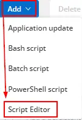
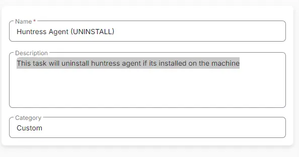
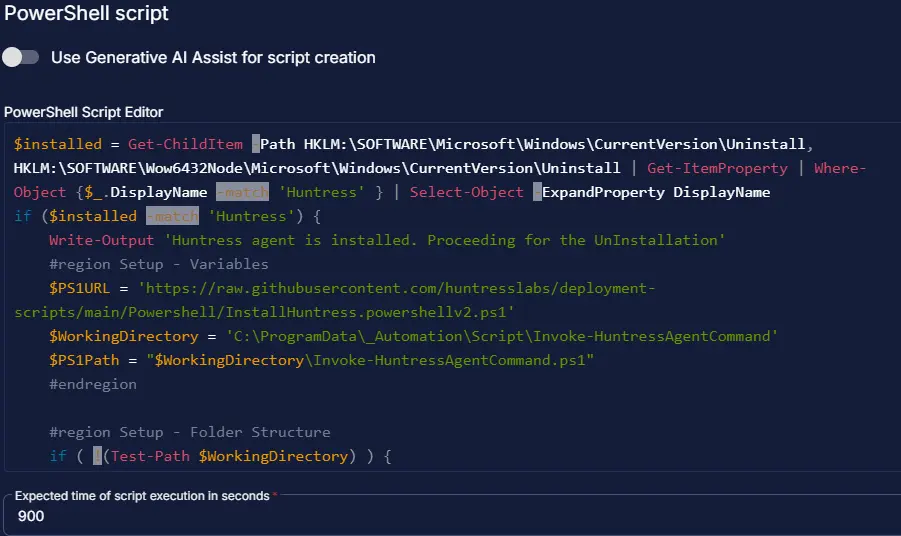
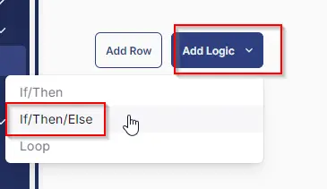
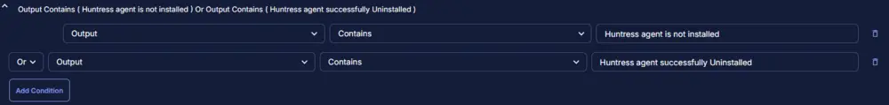
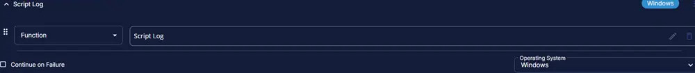
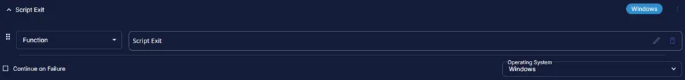
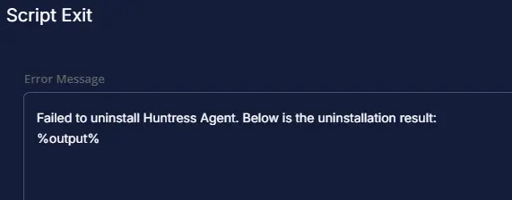
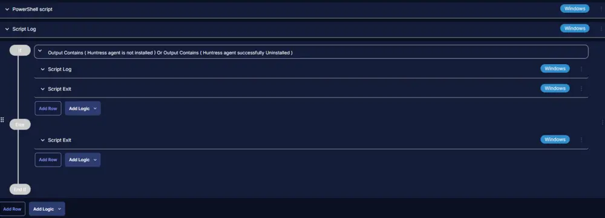

## Summary

This document outlines the steps to uninstall the Huntress agent from a Windows machine if it is installed.

## Dependencies

- None. This script can be run on any Windows device.

## Create Script

To implement this script, please create a new PowerShell script.

  
  

**Name:** Huntress Agent (UNINSTALL)  
**Description:** This task will uninstall the Huntress agent if it is installed on the machine.  
**Category:** Custom  

  

## Script

## Row 1 Function: PowerShell Script

Click on "Add Row" and select the PowerShell Script function.

  

Paste in the following PowerShell script and set the expected script execution time to 900 seconds.

```PowerShell
$installed = Get-ChildItem -Path HKLM:\SOFTWARE\Microsoft\Windows\CurrentVersion\Uninstall, HKLM:\SOFTWARE\Wow6432Node\Microsoft\Windows\CurrentVersion\Uninstall | Get-ItemProperty | Where-Object {$_.DisplayName -match 'Huntress' } | Select-Object -ExpandProperty DisplayName
if ($installed -match 'Huntress') {
    Write-Output 'Huntress agent is installed. Proceeding for the UnInstallation'
    #region Setup - Variables
    $PS1URL = 'https://raw.githubusercontent.com/huntresslabs/deployment-scripts/main/Powershell/InstallHuntress.powershellv2.ps1'
    $WorkingDirectory = 'C:\ProgramData\_Automation\Script\Invoke-HuntressAgentCommand'
    $PS1Path = "$WorkingDirectory\Invoke-HuntressAgentCommand.ps1"
    #endregion

    #region Setup - Folder Structure
    if ( !(Test-Path $WorkingDirectory) ) {
        try {
            New-Item -Path $WorkingDirectory -ItemType Directory -Force -ErrorAction Stop | Out-Null
        } catch {
            return "ERROR: Failed to Create $WorkingDirectory. Reason: $($Error[0].Exception.Message)"
        }
    } if (-not ( ( ( Get-Acl $WorkingDirectory ).Access | Where-Object { $_.IdentityReference -Match 'EveryOne' } ).FileSystemRights -Match 'FullControl' ) ) {
        $ACl = Get-Acl $WorkingDirectory
        $AccessRule = New-Object System.Security.AccessControl.FileSystemAccessRule('Everyone', 'FullControl', 'ContainerInherit, ObjectInherit', 'none', 'Allow')
        $Acl.AddAccessRule($AccessRule)
        Set-Acl $WorkingDirectory $Acl
    }

    #region write script
    [Net.ServicePointManager]::SecurityProtocol = [enum]::ToObject([Net.SecurityProtocolType], 3072)
    $response = Invoke-WebRequest -Uri $PS1URL -UseBasicParsing
    if (($response.StatusCode -ne 200) -and (!(Test-Path -Path $PS1Path))) {
        return "ERROR: No pre-downloaded installer exists and installer $PS1URL failed to download. Exiting."
    } elseif ($response.StatusCode -eq 200) {
        Remove-Item -Path $PS1Path -ErrorAction SilentlyContinue
        [System.IO.File]::WriteAllLines($PS1Path, $response.Content)
    }
    if (!(Test-Path -Path $PS1Path)) {
        return 'ERROR: An error occurred and huntress installer was unable to be downloaded. Exiting.'
    }
    #endregion

    #region Execution
    & $PS1Path -uninstall
    #endregion

    Start-Sleep -Seconds 300
    $installed = Get-ChildItem -Path HKLM:\SOFTWARE\Microsoft\Windows\CurrentVersion\Uninstall, HKLM:\SOFTWARE\Wow6432Node\Microsoft\Windows\CurrentVersion\Uninstall | Get-ItemProperty | Where-Object {$_.DisplayName -match 'Huntress' } | Select-Object -ExpandProperty DisplayName
    if ($installed -match 'Huntress') {
        Write-Output 'Huntress agent failed to Uninstall.'
    } else {
        Write-Output 'Huntress agent successfully Uninstalled.'
    }
} else {
    Write-Output 'Huntress agent is not installed'
}
```

  

## Step 2 Logic: If Then Else

### IF Condition

- Add a new `If/Then/Else` logic from the "Add Logic" dropdown menu.

  

### ROW 2a Condition: Output Contains

- Type `Huntress agent is not installed` in the Value box.
- Select another condition with OR operation and type `Huntress agent successfully uninstalled` in the value box.

  

### ROW 2b Function: Script Log

- Add a new row in the If Section of the If/Else part by clicking the "Add Row" button.
- Search and select the `Script Log` function.
- Input the following:

```Shell
Huntress agent is successfully uninstalled.
```

  

### Step 2c Function: Script Exit

- Add another row by selecting the "ADD ROW" button.
- Search and select the `Script Exit` function.
- Leave it blank.

  
  

### Step 2d Function: Script Exit

- Add another row by selecting the "ADD ROW" button in the `Else` section.
- Search and select the `Script Exit` function.
- Input the following:

```Shell
Failed to uninstall Huntress Agent. Below is the uninstallation result:
%output%
```

  
  

The final task should look like the screenshot below.

  

## Script Deployment

For now, the task has been created to run manually on the machines.

Go to Automations > Tasks.  
Search for "Huntress Agent Install."  
Then click on "Schedule" and provide the parameters details as necessary for the script completion.

  

## Output

- Script log