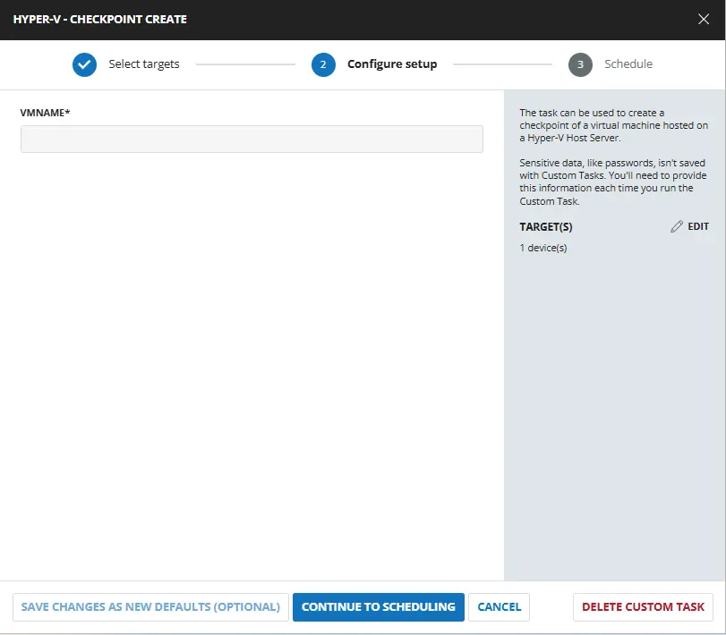
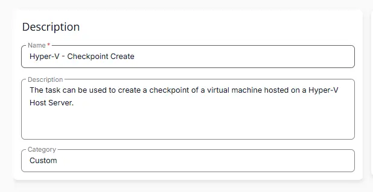
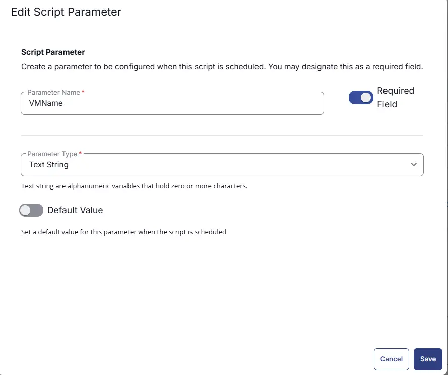
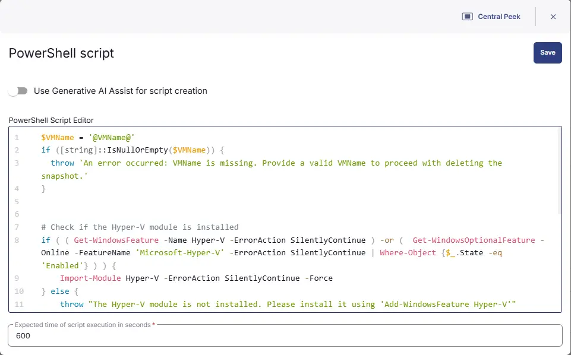
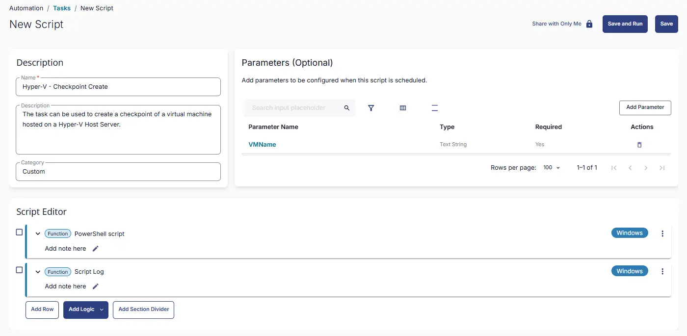

## Summary
The task can be used to create a checkpoint of a virtual machine hosted on a Hyper-V Host Server.

## Sample Run

 

## User Parameters

| Name        | Example                     | Required | Type        | Description                                 |
|-------------|-----------------------------|----------|-------------|---------------------------------------------|
| VMName  | DEV_Test-win10   | True     | Text String | Name of the virtual machine for which to create the checkpoint |

## Task Creation

### Script Details

#### Step 1

Navigate to `Automation` ➞ `Tasks`  


#### Step 2

Create a new `Script Editor` style task by choosing the `Script Editor` option from the `Add` dropdown menu  


The `New Script` page will appear on clicking the `Script Editor` button:  


#### Step 3

Fill in the following details in the `Description` section:  

**Name:** `Hyper-V - Checkpoint Create`  
**Description:** `The task can be used to create a checkpoint of a virtual machine hosted on a Hyper-V Host Server.`  
**Category:** `Custom`

 

### Parameters

### VMName

The `Add New Script Parameter` page will appear on clicking the `Add Parameter` button.  


- Set `VMName` in the `Parameter Name` field.
- Enable the `Required Field` button.
- Select `Text String` from the `Parameter Type` dropdown menu.
- Click the `Save` button.

 

### Script Editor

Click the `Add Row` button in the `Script Editor` section to start creating the script  


A blank function will appear:  


#### Row 1 Function: `PowerShell Script`

Search and select the `PowerShell Script` function.  
 
  

The following function will pop up on the screen:  
  

Paste in the following PowerShell script and set the `Expected time of script execution in seconds` to `600` seconds. Click the `Save` button.

```powershell
$VMName = '@VMName@'
if ([string]::IsNullOrEmpty($VMName)) {
  throw 'An error occurred: VMName is missing. Provide a valid VMName to proceed with deleting the snapshot.'
}


# Check if the Hyper-V module is installed
if ( ( Get-WindowsFeature -Name Hyper-V -ErrorAction SilentlyContinue ) -or (  Get-WindowsOptionalFeature -Online -FeatureName 'Microsoft-Hyper-V' -ErrorAction SilentlyContinue | Where-Object {$_.State -eq 'Enabled'} ) ) { 
    Import-Module Hyper-V -ErrorAction SilentlyContinue -Force
} else {
    throw "The Hyper-V module is not installed. Please install it using 'Add-WindowsFeature Hyper-V'"
}

# Check if the VM exists
$VM = Get-VM -Name $VMName -ErrorAction SilentlyContinue
if ( !( $VM ) ) {
    throw "Virtual machine '$VMName' not found. Please provide a valid virtual machine name."
}

# Create a checkpoint of the virtual machine
try {
    Checkpoint-VM -VM $VM -SnapshotName "Checkpoint_$(Get-Date -Format 'yyyyMMdd_HHmmss')" -Confirm:$false
    return "Checkpoint created successfully for virtual machine '$VMName'"
} catch {
    throw "Error creating checkpoint: $_"
}
```

 


### Row 2 Function: Script Log

Add a new row by clicking the `Add Row` button.  
  

A blank function will appear.  
  

Search and select the `Script Log` function.  
  
 

In the script log message, simply type `%output%` and click the `Save` button.  


## Save Task

Click the `Save` button at the top-right corner of the screen to save the script.  


## Completed Task

 

## Output

- Script Logs

## Changelog

### 2026-03-20

- Initial version of the document
