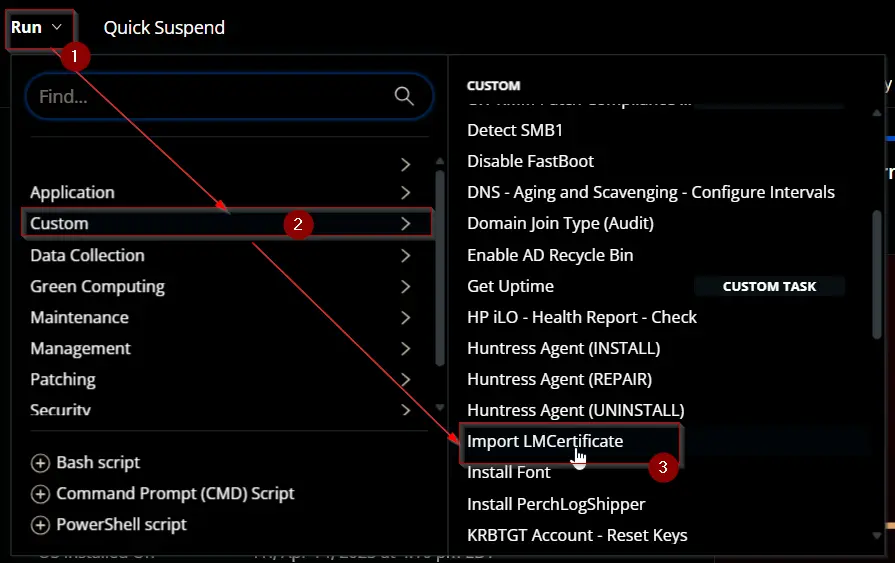
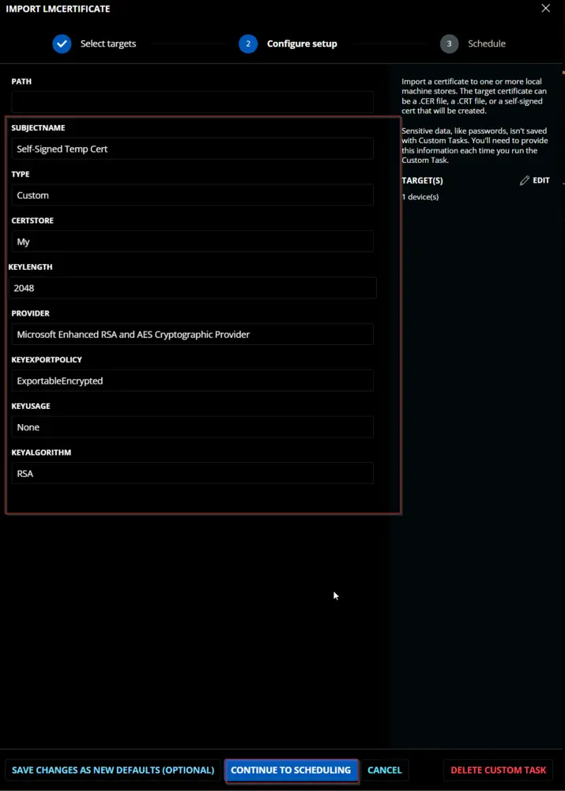
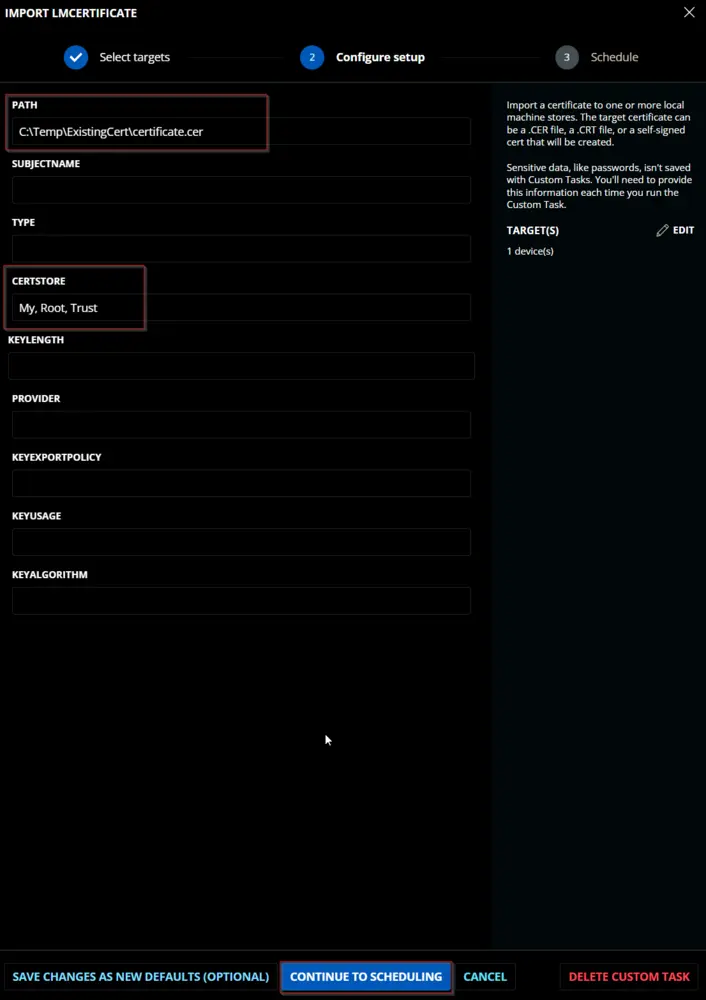
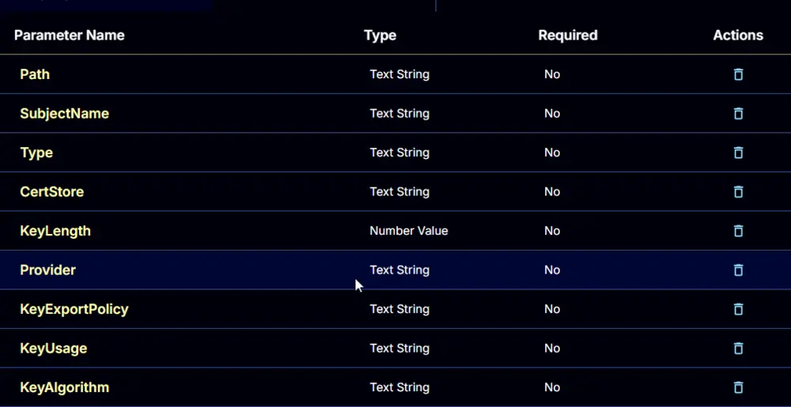
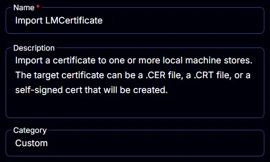
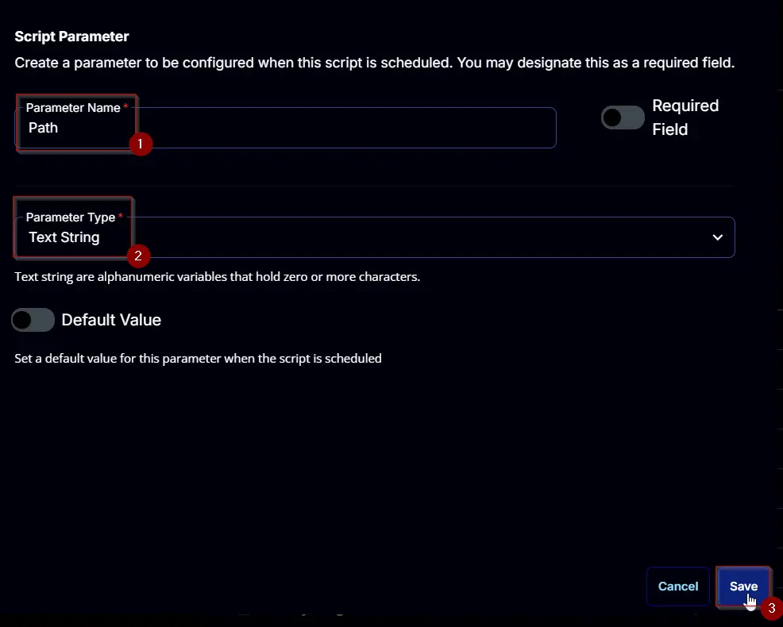
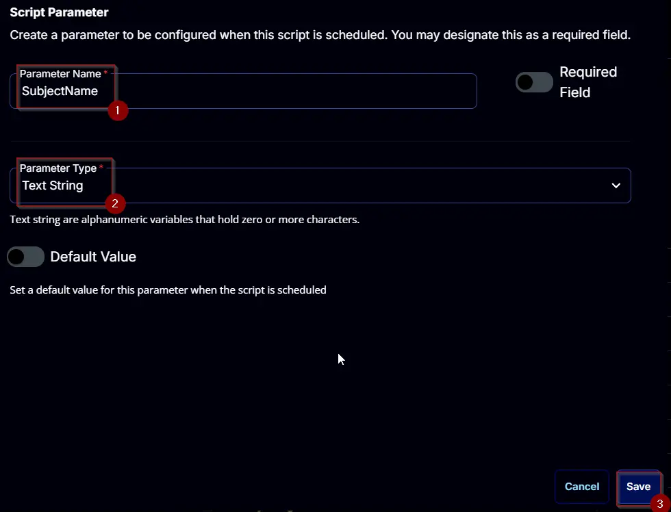
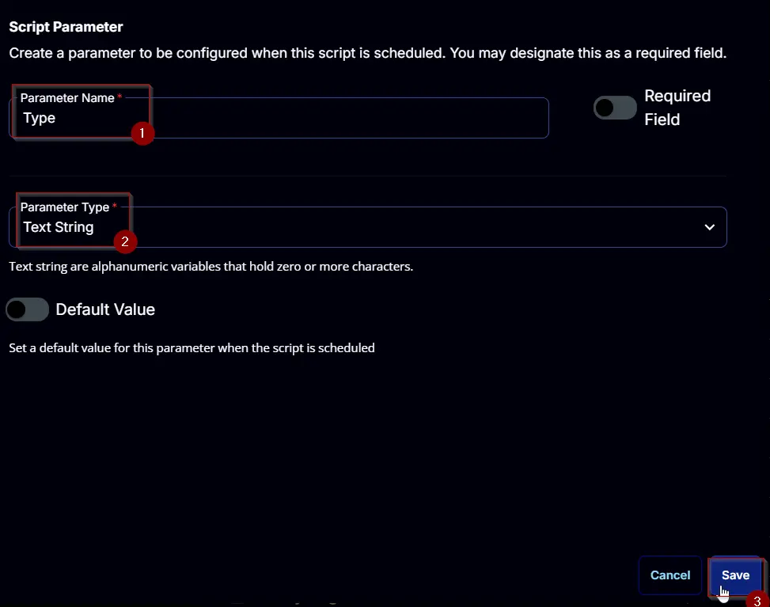
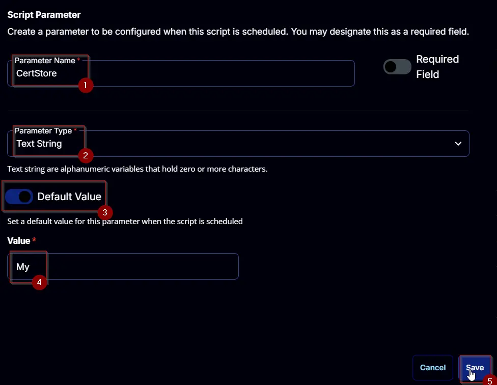
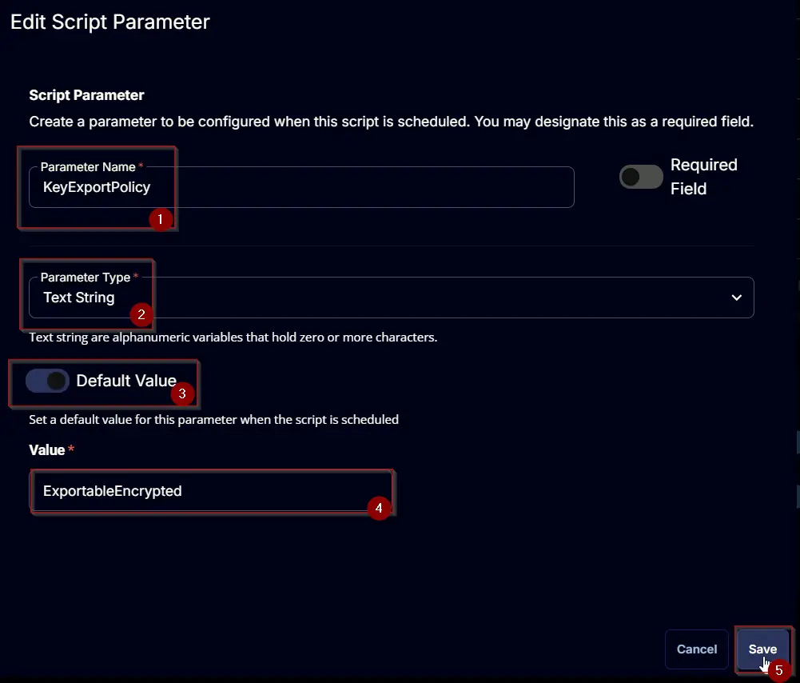

## Summary

Import a certificate to one or more local machine stores. The target certificate can be a .CER file, a .CRT file, or a self-signed certificate that will be created.

CW RMM implementation of [Import-LMCertificate](/docs/550036d9-941a-4b10-a550-fd0a81ba3d14) agnostic script.

## Sample Run



To create and import a self-signed certificate:  


To import a certificate placed in a local folder:  
  


## Dependencies

[Import-LMCertificate](/docs/550036d9-941a-4b10-a550-fd0a81ba3d14)

## User Parameters

### For Certificate Stored on Local Machine

| Name       | Example                                      | Accepted Values                                                                                                   | Required | Default | Type        | Description                                                                 |
|------------|----------------------------------------------|-------------------------------------------------------------------------------------------------------------------|----------|---------|-------------|-----------------------------------------------------------------------------|
| Path       | `C:\Users\MyUser\Downloads\ThisStrangeCert.cer` |                                                                                                                   | True     |         | Text String | The path to a certificate file to import.                                  |
| CertStore  | `My`                                         | <ul><li>My</li><li>ROOT</li><li>trust</li><li>CA</li><li>TrustedPublisher</li><li>Disallowed</li><li>AuthRoot</li><li>TrustedPeople</li><li>REQUEST</li><li>SmartCardRoot</li><li>AddressBook</li><li>UserdDS</li></ul> | True     | My      | Text String | The set of LocalMachine stores to store the target certificate in.         |

### To Create and Import a Self-Signed Certificate

| Name             | Example                                | Accepted Values                                                                                                                                                                                                                                                                                                                                 | Required | Default                                  | Type          | Description                                                                 |
|------------------|----------------------------------------|----------------------------------------------------------------------------------------------------------------------------------------------------------------------------------------------------------------------------------------------------------------------------------------------------------------------------------------------|----------|------------------------------------------|---------------|-----------------------------------------------------------------------------|
| SubjectName      | ThisNewCert                           | <ul><li>True</li></ul>                                                                                                                                                                                                                                                                                                                     | True     | Text String                              | The subject name for the created certificate.                              |
| Type             | Custom                                | <ul><li>CodeSigningCert</li><li>Custom</li><li>DocumentEncryptionCert</li><li>DocumentEncryptionCertLegacyCsp</li><li>SSLServerAuthentication</li></ul>                                                                                                                                                                                    | True     | Text String                              | The type of certificate to create.                                         |
| CertStore        | My                                    | <ul><li>My</li><li>Root</li><li>Trust</li><li>CA</li><li>TrustedPublisher</li><li>Disallowed</li><li>AuthRoot</li><li>TrustedPeople</li><li>REQUEST</li><li>SmartCardRoot</li><li>AddressBook</li><li>UserdDS</li></ul>                                                                                                                   | True     | My                                       | The set of LocalMachine stores to store the target certificate in.         |
| KeyLength        | 2048                                  | <ul><li>KeyLength % 1024 = 0</li><li>1024</li><li>2048</li><li>3072</li><li>4096</li><li>5120</li><li>6144</li><li>7168</li><li>8192</li></ul>                                                                                                                                                                                            | True     | 2048                                      | Number Value  | The length of the key for the created certificate.                          |
| Provider         | Microsoft Enhanced RSA and AES Cryptographic Provider | <ul><li>Microsoft Base Cryptographic Provider v1.0</li><li>Microsoft Base DSS and Diffie-Hellman Cryptographic Provider</li><li>Microsoft Base DSS Cryptographic Provider</li><li>Microsoft Base Smart Card Crypto Provider</li><li>Microsoft DH SChannel Cryptographic Provider</li><li>Microsoft Enhanced Cryptographic Provider v1.0</li><li>Microsoft Enhanced DSS and Diffie-Hellman Cryptographic Provider</li><li>Microsoft Enhanced RSA and AES Cryptographic Provider</li><li>Microsoft RSA SChannel Cryptographic Provider</li><li>Microsoft Strong Cryptographic Provider</li></ul> | True     | Microsoft Enhanced RSA and AES Cryptographic Provider | Text String   | The provider for the created certificate.                                   |
| KeyExportPolicy  | ExportableEncrypted                   | <ul><li>Exportable</li><li>ExportableEncrypted</li><li>NonExportable</li></ul>                                                                                                                                                                                                                                                             | True     | ExportableEncrypted                      | Text String   | The export policy for the created certificate.                              |
| KeyUsage         | None                                  | <ul><li>CertSign</li><li>CRLSign</li><li>DataEncipherment</li><li>DecipherOnly</li><li>DigitalSignature</li><li>EncipherOnly</li><li>KeyAgreement</li><li>KeyEncipherment</li><li>None</li><li>NonRepudiation</li></ul>                                                                                                                    | True     | None                                     | Text String   | The Key Usage for a created certificate.                                    |
| KeyAlgorithm     | RSA                                   | <ul><li>RSA</li><li>ECDSA_nistP256</li><li>ECDSA_nistP384</li><li>ECDSA_brainpoolP256r1</li><li>ECDSA_brainpoolP384r1</li><li>ECDSA_brainpoolP512r1</li><li>ECDSA_nistP192</li><li>ECDSA_nistP224</li><li>ECDSA_nistP521</li><li>ECDSA_secP160k1</li><li>ECDSA_secP160r1</li><li>ECDSA_secP160r2</li><li>ECDSA_secP192k1</li><li>ECDSA_secP192r1</li><li>ECDSA_secP224k1</li><li>ECDSA_secP224r1</li><li>ECDSA_secP256k1</li><li>ECDSA_secP256r1</li><li>ECDSA_secP384r1</li><li>ECDSA_secP521r1</li><li>ECDSA_brainpoolP160r1</li><li>ECDSA_brainpoolP160t1</li><li>ECDSA_brainpoolP192r1</li><li>ECDSA_brainpoolP192t1</li><li>ECDSA_brainpoolP224r1</li><li>ECDSA_brainpoolP224t1</li><li>ECDSA_brainpoolP256r1</li><li>ECDSA_brainpoolP256t1</li><li>ECDSA_brainpoolP320r1</li><li>ECDSA_brainpoolP320t1</li><li>ECDSA_brainpoolP384r1</li><li>ECDSA_brainpoolP384t1</li><li>ECDSA_brainpoolP512r1</li><li>ECDSA_brainpoolP512t1</li><li>ECDSA_ec192wapi</li><li>ECDSA_nistP192</li><li>ECDSA_nistP224</li><li>ECDSA_nistP256</li><li>ECDSA_nistP384</li><li>ECDSA_nistP521</li><li>ECDSA_secP160k1</li><li>ECDSA_secP160r1</li><li>ECDSA_secP160r2</li><li>ECDSA_secP192k1</li><li>ECDSA_secP192r1</li><li>ECDSA_secP224k1</li><li>ECDSA_secP224r1</li><li>ECDSA_secP256k1</li><li>ECDSA_secP256r1</li><li>ECDSA_secP384r1</li><li>ECDSA_secP521r1</li><li>ECDSA_wtls7</li><li>ECDSA_wtls9</li><li>ECDSA_wtls12</li><li>ECDSA_x962P192v1</li><li>ECDSA_x962P192v2</li><li>ECDSA_x962P192v3</li><li>ECDSA_x962P239v1</li><li>ECDSA_x962P239v2</li><li>ECDSA_x962P239v3</li><li>ECDSA_x962P256v1</li></ul>                                                                                                                            | True     | RSA                                      | Text String   | The Key Algorithm for the created certificate.                              |



## Task Creation

Create a new `Script Editor` style script in the system to implement this Task.  
  


**Name:** `Import LMCertificate`  
**Description:** `Import a certificate to one or more local machine stores. The target certificate can be a .CER file, a .CRT file, or a self-signed certificate that will be created.`  
**Category:** `Custom`  


## Parameters

### Path

Add a new parameter by clicking the `Add Parameter` button present at the top-right corner of the screen.  


This screen will appear.  


- Set `Path` in the `Parameter Name` field.
- Select `Text String` from the `Parameter Type` dropdown menu.
- Click the `Save` button.



### SubjectName

Add a new parameter by clicking the `Add Parameter` button present at the top-right corner of the screen.  


This screen will appear.  


- Set `SubjectName` in the `Parameter Name` field.
- Select `Text String` from the `Parameter Type` dropdown menu.
- Click the `Save` button.



### Type

Add a new parameter by clicking the `Add Parameter` button present at the top-right corner of the screen.  


This screen will appear.  


- Set `Type` in the `Parameter Name` field.
- Select `Text String` from the `Parameter Type` dropdown menu.
- Click the `Save` button.



### CertStore

Add a new parameter by clicking the `Add Parameter` button present at the top-right corner of the screen.  


This screen will appear.  


- Set `CertStore` in the `Parameter Name` field.
- Select `Text String` from the `Parameter Type` dropdown menu.
- Enable the `Default Value` button.
- Set `My` in the `Value` field.
- Click the `Save` button.



### KeyLength

Add a new parameter by clicking the `Add Parameter` button present at the top-right corner of the screen.  


This screen will appear.  


- Set `KeyLength` in the `Parameter Name` field.
- Select `Number Value` from the `Parameter Type` dropdown menu.
- Enable the `Default Value` button.
- Set `2048` in the `Value` field.
- Click the `Save` button.


### Provider

Add a new parameter by clicking the `Add Parameter` button present at the top-right corner of the screen.  


This screen will appear.  


- Set `Provider` in the `Parameter Name` field.  
- Select `Text String` from the `Parameter Type` dropdown menu.  
- Enable the `Default Value` button.  
- Set `Microsoft Enhanced RSA and AES Cryptographic Provider` in the `Value` field.  
- Click the `Save` button.

### KeyExportPolicy

Add a new parameter by clicking the `Add Parameter` button present at the top-right corner of the screen.  


This screen will appear.  


- Set `KeyExportPolicy` in the `Parameter Name` field.  
- Select `Text String` from the `Parameter Type` dropdown menu.  
- Enable the `Default Value` button.  
- Set `ExportableEncrypted` in the `Value` field.  
- Click the `Save` button.



### KeyUsage

Add a new parameter by clicking the `Add Parameter` button present at the top-right corner of the screen.  


This screen will appear.  


- Set `KeyUsage` in the `Parameter Name` field.  
- Select `Text String` from the `Parameter Type` dropdown menu.  
- Enable the `Default Value` button.  
- Set `None` in the `Value` field.  
- Click the `Save` button.

### KeyAlgorithm

Add a new parameter by clicking the `Add Parameter` button present at the top-right corner of the screen.  


This
This screen will appear.  


- Set `KeyAlgorithm` in the `Parameter Name` field.  
- Select `Text String` from the `Parameter Type` dropdown menu.  
- Enable the `Default Value` button.  
- Set `RSA` in the `Value` field.  
- Click the `Save` button.

## Task

Navigate to the Script Editor Section and start by adding a row. You can do this by clicking the `Add Row` button at the bottom of the script page.  

A blank function will appear.

### Row 1 Function: PowerShell Script

Search and select the `PowerShell Script` function.

Paste in the following PowerShell script and set the `Expected time of script execution in seconds` to `300` seconds. Click the `Save` button.

```PowerShell
#region parameters
$path = '@Path@'
$subjectName = '@SubjectName@'
$type = '@Type@'
$certStore = '@CertStore@'
$keyLength = '@KeyLength@'
$provider = '@Provider@'
$keyExportPolicy = '@KeyExportPolicy@'
$keyUsage = '@KeyUsage@'
$keyAlgorithm = '@KeyAlgorithm@'
$Parameters = @{}
if ( $path -match ':\\' ) {
    $Parameters.Add('Path', $path)
} elseif ( ($subjectName -NotMatch '\SSubjectName\S') -and ($subjectName -match '[A-z0-9_]') ) {
    $Parameters.Add('SubjectName', $subjectName)
    if ( $type -in ('CodeSigningCert', 'Custom', 'DocumentEncryptionCert', 'DocumentEncryptionCertLegacyCsp', 'SSLServerAuthentication') ) {
        $Parameters.Add('Type', $type)
    } else {
        throw 'Supported Types for a Selft Signed Certificate are: ''CodeSigningCert'', ''Custom'', ''DocumentEncryptionCert'', ''DocumentEncryptionCertLegacyCsp'', ''SSLServerAuthentication''.'
    }
    if ( ($keyLength -notmatch '^[0-9]{4,}$') -or ([String]::IsNullOrWhiteSpace($keyLength)) ) {
        $keyLength = 2048
    } elseif ( $keyLength % 1024 -ne 0) {
        $keyLength = 2048
    }
    $Parameters.Add('KeyLength', $keyLength)
    if ( [String]::IsNullOrWhiteSpace($provider) ) {
        $provider = 'Microsoft Enhanced RSA and AES Cryptographic Provider'
    } elseif ( !((Get-ChildItem 'HKLM:\SOFTWARE\Microsoft\Cryptography\Defaults\Provider').PSChildName -contains $provider) ) {
        $provider = 'Microsoft Enhanced RSA and AES Cryptographic Provider'
    }
    $Parameters.Add('Provider', $provider)
    if ( $keyExportPolicy -notin ('Exportable', 'ExportableEncrypted', 'NonExportable') ) {
        $keyExportPolicy = 'ExportableEncrypted'
    }
    $Parameters.Add('KeyExportPolicy', $keyExportPolicy)
    if ( $keyUsage -notin ('CertSign', 'CRLSign', 'DataEncipherment', 'DecipherOnly', 'DigitalSignature', 'EncipherOnly', 'KeyAgreement', 'KeyEncipherment', 'None', 'NonRepudiation') ) {
        $keyUsage = 'None'
    }
    $Parameters.Add('KeyUsage', $keyUsage)
    $ecdsaList = ((certutil -displayEccCurve | Select-String -Pattern '\d+\.').Line | Select-String -Pattern '.*?\s').Matches.Value | ForEach-Object { "ECDSA_$($_.Trim())" }
    if ( [String]::IsNullOrWhiteSpace($keyAlgorithm)  ) {
        $KeyAlgorithm = 'RSA'
    } elseif ( !($ecdsaList -contains $KeyAlgorithm) ) {
        $KeyAlgorithm = 'RSA'
    }
    $Parameters.Add('KeyAlgorithm', $keyAlgorithm)
} else {
    throw 'Invalid input parameters. Either the ''SubjectName'' for the Self Signed Certificate or the ''Path'' to the Certificate must be provided.'
}
if ( ($certStore -match '\SCertStore\S') -or ([String]::IsNullOrWhiteSpace($certStore)) ) {
    $stores = 'My'
} else {
    $certstore = $($certstore -split ',').trim()
    $stores = @()
    foreach ($store in $certstore) {
        if ( ('My', 'ROOT', 'trust', 'CA', 'TrustedPublisher', 'Disallowed', 'AuthRoot', 'TrustedPeople', 'REQUEST', 'SmartCardRoot', 'AddressBook', 'UserdDS') -contains $store ) {
            $stores += $store
        }
    }
    if ( !($stores) ) {
        $stores = 'My'
    }
}
$Parameters.Add('CertStore', $stores)
#endregion
#region Setup - Variables
$ProjectName = 'Import-LMCertificate'
[Net.ServicePointManager]::SecurityProtocol = [enum]::ToObject([Net.SecurityProtocolType], 3072)
$BaseURL = 'https://file.provaltech.com/repo'
$PS1URL = "$BaseURL/script/$ProjectName.ps1"
$WorkingDirectory = "C:\ProgramData\_automation\script\$ProjectName"
$PS1Path = "$WorkingDirectory\$ProjectName.ps1"
$WorkingPath = $WorkingDirectory
$LogPath = "$WorkingDirectory\$ProjectName-log.txt"
$ErrorLogPath = "$WorkingDirectory\$ProjectName-Error.txt"
#endregion
#region Setup - Folder Structure
New-Item -Path $WorkingDirectory -ItemType Directory -ErrorAction SilentlyContinue | Out-Null
$response = Invoke-WebRequest -Uri $PS1URL -UseBasicParsing
if (($response.StatusCode -ne 200) -and (!(Test-Path -Path $PS1Path))) {
    throw "No pre-downloaded script exists and the script '$PS1URL' failed to download. Exiting."
} elseif ($response.StatusCode -eq 200) {
    Remove-Item -Path $PS1Path -ErrorAction SilentlyContinue
    [System.IO.File]::WriteAllLines($PS1Path, $response.Content)
}
if (!(Test-Path -Path $PS1Path)) {
    throw 'An error occurred and the script was unable to be downloaded. Exiting.'
}
#endregion
#region Execution
if ($Parameters) {
    & $PS1Path @Parameters
} else {
    & $PS1Path
}
#endregion
#region log verification
if ( !(Test-Path $LogPath) ) {
    throw 'PowerShell Failure. A Security application seems to have restricted the execution of the PowerShell Script.'
}
if ( Test-Path $ErrorLogPath ) {
    $ErrorContent = ( Get-Content -Path $ErrorLogPath )
    throw $ErrorContent
}
Get-Content -Path $LogPath
#endregion
```

### Row 2 Function: Script Log

Add a new row by clicking the `Add Row` button.

A blank function will appear.  

Search and select the `Script Log` function.  

In the script log message, simply type `%Output%` and click the `Save` button

Click the `Save` button at the top-right corner of the screen to save the script.

## Output

- Script Log