## Summary
This script automates the deployment and update of the AutoElevate on windows and macintosh machines by downloading the latest installer, running the installation silently, and validating that the agent has been successfully installed.

## Sample Run

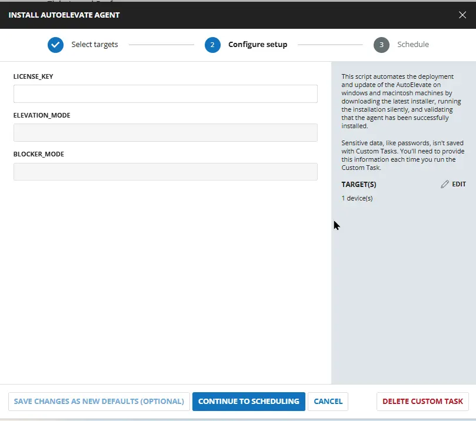

## Dependencies

- [Solution : AutoElevate Deployment](/docs/4a95cdd5-dec1-4d8e-aa3a-0ee4dd7c0273)
- [AE Blocker Mode](/docs/42e621c4-24fa-469e-9ea9-9109f8928388) 
- [AE Elevation Mode](/docs/7561b830-134d-4e7b-9dab-30518d724dd0)
- [AE Company Short Initials](/docs/30bbb34e-579f-4186-97b3-f30a46a3fbe7)
- [AE License Key](/docs/5481f063-b0be-431d-b745-6b6ffe7b4246)

## User Parameters

| Name | Type | Option Type | Options | Required | Default | Description |
|----------|--------|--------|-------|---------|--------|--------|
|License_Key| Text String | - | - | False | - | Add AutoElevate License Key. It is required for installing and registering the AutoElevate agent. If not provided script will use the values from [Custom Field: AE License Key](/docs/5481f063-b0be-431d-b745-6b6ffe7b4246)| 
|Elevation_Mode|DropDown| String | `Audit`,`Live`,`Policy`| False | - | Choose the Auto Elevate Elevation Mode to determine how privilege elevation requests are handled on the device once the agent is installed. If not provided script will use the values from [Custom Field: AE Elevation Mode](/docs/7561b830-134d-4e7b-9dab-30518d724dd0) |
|Blocker_Mode | DropDown| String | `Audit`,`Live`,`Disabled`| False | - | Select the Auto Elevate Blocker Mode configuration to configure for the end user at the time of installation. If not provided script will use the values from [Custom Field: AE Blocker Mode](/docs/42e621c4-24fa-469e-9ea9-9109f8928388) |


## Task Creation

### Script Details

#### Step 1

Navigate to `Automation` ➞ `Tasks`  


#### Step 2

Create a new `Script Editor` style task by choosing the `Script Editor` option from the `Add` dropdown menu  


The `New Script` page will appear on clicking the `Script Editor` button:  


#### Step 3

Fill in the following details in the `Description` section:  

**Name:** `Install AutoElevate Agent`  
**Description:** `This script automates the deployment and update of the AutoElevate on windows and macintosh machines by downloading the latest installer, running the installation silently, and validating that the agent has been successfully installed.`  
**Category:** `Custom`

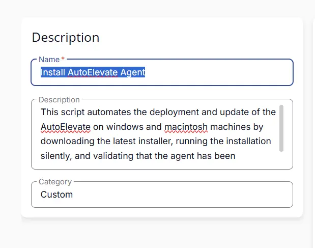

### Parameters

#### License_Key

Add a new parameter by clicking the `Add Parameter` button on the right-hand side of the screen and click on it to create a new parameter.  


The `Add New Script Parameter` page will appear on clicking the `Add Parameter` button.  


- Set `License_Key` in the `Parameter Name` field.
- Select `Text String` from the `Parameter Type` dropdown menu.
- Click the `Save` button.

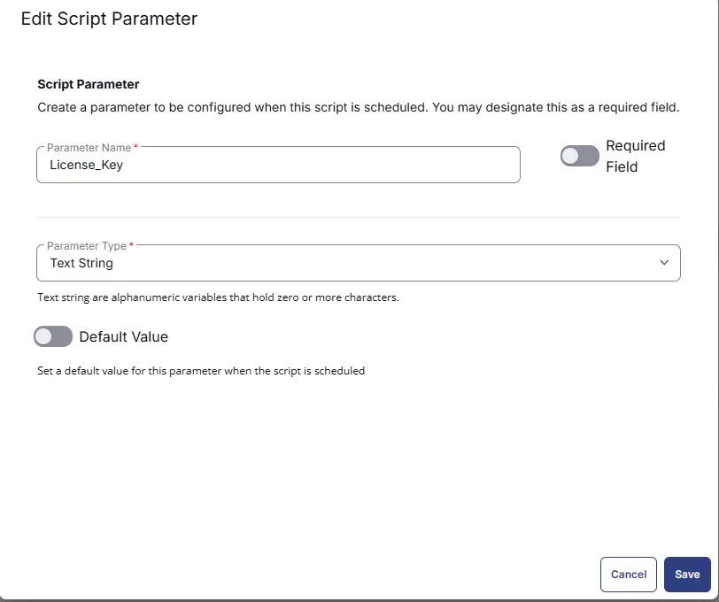

#### Elevation_Mode

Add a new parameter by clicking the `Add Parameter` button on the right-hand side of the screen and click on it to create a new parameter.  


The `Add New Script Parameter` page will appear on clicking the `Add Parameter` button.  


- Set `Elevation_Mode` in the `Parameter Name` field.
- Select `Dropdown` from the `Parameter Type` dropdown menu.
- Select `String` as the Option Type.
- Add  `Audit`,`Live`,`Policy` in the options.
- Click the `Save` button.

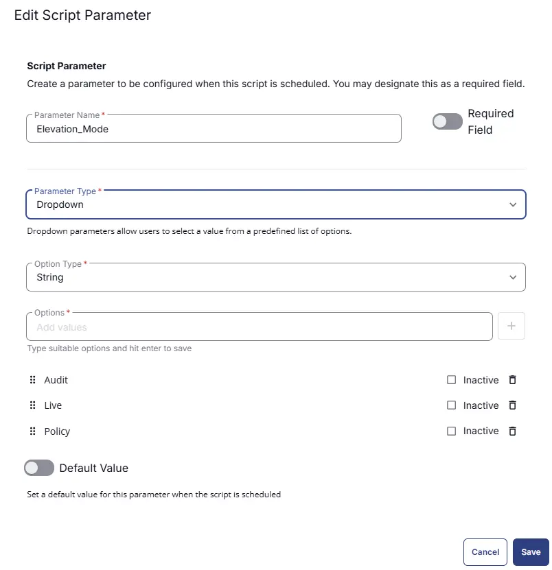

#### Blocker_Mode

Add a new parameter by clicking the `Add Parameter` button on the right-hand side of the screen and click on it to create a new parameter.  


The `Add New Script Parameter` page will appear on clicking the `Add Parameter` button.  


- Set `Blocker_Mode` in the `Parameter Name` field.
- Select `Dropdown` from the `Parameter Type` dropdown menu.
- Select `String` as the Option Type.
- Add  `Audit`,`Live`,`Disabled` in the options.
- Click the `Save` button.

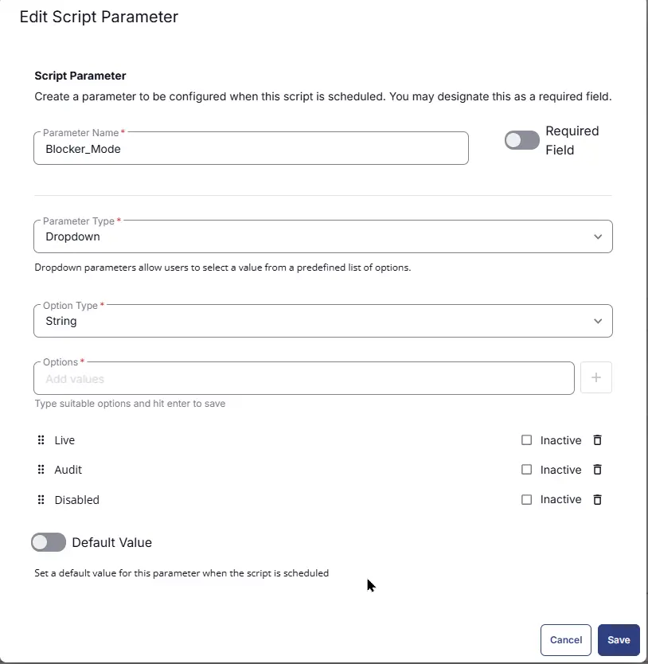

### Script Editor

Click the `Add Row` button in the `Script Editor` section to start creating the script  


A blank function will appear:  


#### **Row 1 Function: Set Pre-defined Variable (@CF_License_Key@ = AE License Key)**

- **Notes:** `<Leave it Blank>` 
- **Continue on Failure:** `False`
- **Operating System:** `Windows`, `MacOS`
- **Variable Name:** `CF_License_Key`
- **Custom Field:** `AE License Key`

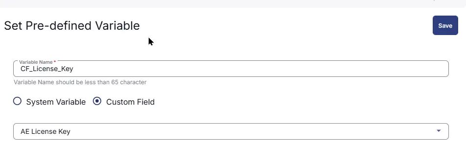

#### **Row 2 Function: Set Pre-defined Variable (@CF_Elevation_Mode@ = AE Elevation Mode)**

- **Notes:** `<Leave it Blank>` 
- **Continue on Failure:** `False`
- **Operating System:** `Windows`
- **Variable Name:** `CF_Elevation_Mode`
- **Custom Field:** `AE Elevation Mode`

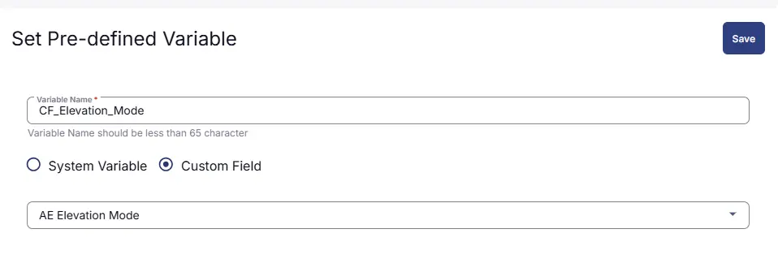

#### **Row 3 Function: Set Pre-defined Variable (@CF_Blocker_Mode@ = AE Blocker Mode)**

- **Notes:** `<Leave it Blank>` 
- **Continue on Failure:** `False`
- **Operating System:** `Windows`
- **Variable Name:** `CF_Blocker_Mode`
- **Custom Field:** `AE Blocker Mode`

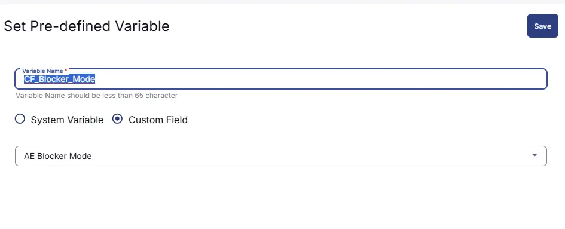

#### **Row 4 Function: Set Pre-defined Variable (@CF_Company_Initials@ = AE Company Short Initials)**

- **Notes:** `<Leave it Blank>` 
- **Continue on Failure:** `False`
- **Operating System:** `Windows`
- **Variable Name:** `CF_Company_Initials`
- **Custom Field:** `AE Company Short Initials`

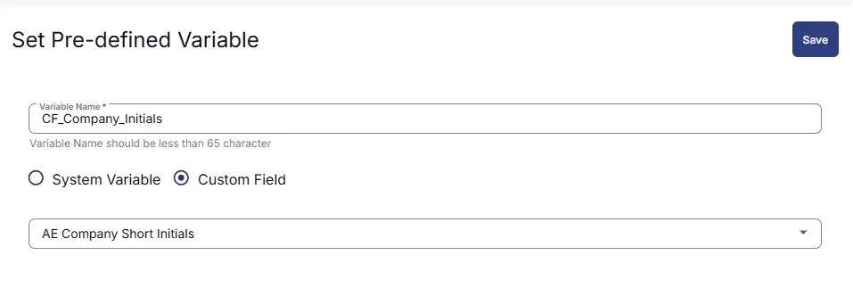

#### **Row 5 Function: PowerShell script**

- **Notes:** `<Leave it Blank>`  
- **Use Generative AI Assist for script creation:** `False`  
- **Expected time of script execution in seconds:** `600`  
- **Continue on Failure:** `False`  
- **Run As:** `System`  
- **Operating System:** `Windows`  
- **PowerShell Script Editor:**

```PowerShell
<#
.SYNOPSIS
Installs or upgrades the AutoElevate Agent on a Windows endpoint using the provided configuration parameters.

.DESCRIPTION
This script downloads and installs the AutoElevate MSI agent on a Windows machine. It validates required configuration values such as license key, company information, location, elevation mode, and blocker mode before proceeding with the installation.

The script supports both script-level parameters and NinjaOne custom fields for configuration values. If a parameter is not provided, the script will attempt to retrieve the value from the associated custom field.

The installation process includes:
- Validating and determining company initials.
- Configuring AutoElevate Elevation Mode (`Audit`, `Live`, or `Policy`).
- Configuring AutoElevate Blocker Mode (`Audit`, `Live`, or `Disabled`).
- Validating the AutoElevate license key.
- Creating a working directory for installer storage.
- Downloading the latest AutoElevate MSI installer.
- Installing or upgrading the AutoElevate Agent silently.
- Verifying that the AutoElevate service is installed successfully.

The script stores installation files and logs under:
C:\ProgramData\_Automation\Script\AEInstall

An installation log is generated at:
C:\AEInstallLog.log

The script will return an error and exit with a non-zero status code if required parameters are missing, the installer download fails, or the AutoElevate service is not detected after installation.
#>


# COMPANY NAME
$COMPANY_NAME = '%companyname%'

# LOCATION NAME
$LOCATION_NAME = '%sitename%'

# COMPANY INITIALS
$Client__CompanyInitials = '@CF_Company_Initials@'

if (!($Client__CompanyInitials -eq '' -or $Client__CompanyInitials -match '@CF_Company_Initials')){
    $Company_Initials = $Client__CompanyInitials
} else {
    $Company_Initials = $COMPANY_NAME.Trim().Substring(0, [Math]::Min(3, $COMPANY_NAME.Trim().Length))
}

# ELEVATION MODE
$Param_Elevation_Mode = '@Elevation_Mode@'
$Client__Elevation_Mode = '@CF_Elevation_Mode@'

if ($Param_Elevation_Mode -match '^(Audit|Live|Policy)$') {
    $ELEVATION_MODE = $Param_Elevation_Mode
} elseif ($Client__Elevation_Mode -match '^(Audit|Live|Policy)$') {
    $ELEVATION_MODE = $Client__Elevation_Mode
} else {
    $ELEVATION_MODE = 'Audit'
}

# BLOCKER MODE
$Param_Blocker_Mode = '@Blocker_Mode@'
$Client__Blocker_Mode = '@CF_Blocker_Mode@'

if ($Param_Blocker_Mode -match '^(Audit|Live|Disabled)$') {
    $BLOCKER_MODE = $Param_Blocker_Mode
} elseif ($Client__Blocker_Mode -match '^(Audit|Live|Disabled)$') {
    $BLOCKER_MODE = $Client__Blocker_Mode
} else {
    $BLOCKER_MODE = 'Disabled'
}

$BLOCKER_MODE = switch ($BLOCKER_MODE)
{
    'Live'     { 'Live' }
    'Audit'    { 'Audit' }
    'Disabled' { 'Disabled' }
    default    { 'Disabled' }
}

# LICENSE KEY
# LICENSE KEY
$Param_License_Key = '@License_Key@'
$Client_License_Key = '@CF_License_Key@'

if (!($Param_License_Key -eq '' -or $Param_License_Key -match '@License_')) {
    $LICENSE_KEY = $Param_License_Key
} elseif (!($Client_License_Key -eq '' -or $Client_License_Key -match '@CF_License_Key')){
    $LICENSE_KEY = $Client_License_Key
}
else {
    Write-Output 'ERROR: License Key is required to install AutoElevate. Please provide a valid license key.'
    Write-Output "CompanyName     : $COMPANY_NAME"
    Write-Output "LocationName    : $LOCATION_NAME"
    Write-Output "ElevationMode   : $ELEVATION_MODE"
    Write-Output "BlockerMode     : $BLOCKER_MODE"
    Write-Output "CompanyInitials : $Company_Initials"
    exit 1
}

# Set $DebugPrintEnabled = 1 to enabled debug log printing to see what's going on.
$DebugPrintEnabled = 0

# You don't need to change anything below this line...

$InstallerName = 'AESetup.msi'
$projectName = 'AEInstall'
$workingDirectory = '{0}\_Automation\Script\{1}' -f $env:ProgramData, $projectName
$InstallerPath = '{0}\{1}' -f $workingDirectory, $InstallerName
$DownloadBase = 'https://autoelevate-installers.s3.us-east-2.amazonaws.com'
$DownloadURL = $DownloadBase + '/current/' + $InstallerName
$ServiceName = 'AutoElevateAgent'
$ScriptFailed = 'Script Failed!'

#Region Working Directory
if (-not (Test-Path -Path $workingDirectory))
{
    New-Item -Path $workingDirectory -ItemType Directory | Out-Null
}
#EndRegion

function Get-TimeStamp
{
    return "[{0:MM/dd/yy} {0:HH:mm:ss}]" -f (Get-Date)
}

function Confirm-ServiceExists ($service) {
    if (Get-Service $service -ErrorAction SilentlyContinue) {
        return $true
    }
    return $false
}

function Debug-Print ($msg) {
    if ($DebugPrintEnabled -eq 1) {
        Write-Output "$(Get-TimeStamp) [DEBUG] $msg"
    }
}

function Get-Installer {
    Debug-Print('Downloading installer...')
    $WebClient = New-Object System.Net.WebClient 
    try {
        $WebClient.DownloadFile($DownloadURL, $InstallerPath)
    } catch {
        $ErrorMessage = $_.Exception.Message
        Write-Output "$(Get-TimeStamp) $ErrorMessage"
    }
    if ( ! (Test-Path $InstallerPath)) {
        $DownloadError = "Failed to download the AutoElevate Installer from $DownloadURL"
        Write-Output "$(Get-TimeStamp) $DownloadError"
        throw $ScriptFailed
    }
    Debug-Print("Installer downloaded to $InstallerPath...")
}

function Install-Agent{
    Debug-Print('Checking for AutoElevateAgent service...')
    if (Confirm-ServiceExists -Service $ServiceName)
    {
        Write-Output "$(Get-TimeStamp) Service exists. Continuing with possible upgrade..."
    }
    else
    {
        Write-Output "$(Get-TimeStamp) Service does not exist. Continuing with initial installation..."
    }

    Debug-Print('Checking for installer file...')

    if (-not (Test-Path -Path $InstallerPath))
    {
        $InstallerError = "The installer was unexpectedly removed from $InstallerPath"
        Write-Output "$(Get-TimeStamp) $InstallerError"
        Write-Output ("$(Get-TimeStamp) A security product may have quarantined the installer. Please check your logs. If the issue continues to occur, please send the log to the AutoElevate. Team for help at support@autoelevate.com")
        throw $ScriptFailed
    }

    Debug-Print('Executing installer...')

    $Arguments = "/i `"$InstallerPath`" /quiet /lv C:\AEInstallLog.log LICENSE_KEY=`"$LICENSE_KEY`" COMPANY_NAME=`"$COMPANY_NAME`" LOCATION_NAME=`"$LOCATION_NAME`" ELEVATION_MODE=`"$ELEVATION_MODE`" BLOCKER_MODE=`"$BLOCKER_MODE`" COMPANY_INITIALS=`"$Company_Initials`""

    Start-Process -FilePath C:\Windows\System32\msiexec.exe -ArgumentList $Arguments -Wait
}

function Verify-Installation
{
    Debug-Print('Verifying Installation...')

    if (-not (Confirm-ServiceExists -Service $ServiceName))
    {
        $VerificationError = "The AutoElevateAgent service is not running. Installation failed!"
        Write-Output "$(Get-TimeStamp) $VerificationError"

        throw $ScriptFailed
    }
}

function main
{
    Debug-Print('Checking for LICENSE_KEY...')

    if ($LICENSE_KEY -eq '__LICENSE_KEY_HERE__' -or $LICENSE_KEY -eq '')
    {
        Write-Warning "$(Get-TimeStamp) LICENSE_KEY not set, exiting script!"
        exit 1
    }

    if ($COMPANY_NAME -eq '__COMPANY_NAME_HERE___' -or $COMPANY_NAME -eq '')
    {
        Write-Warning "$(Get-TimeStamp) COMPANY_NAME not specified, exiting script!"
        exit 1
    }

    if ($LOCATION_NAME -eq '__LOCATION_NAME_HERE__' -or $LOCATION_NAME -eq '')
    {
        Write-Warning "$(Get-TimeStamp) LOCATION_NAME not specified, exiting script!"
        exit 1
    }
    Write-Output "$(Get-TimeStamp) LocationName: $LOCATION_NAME"
    Write-Output "$(Get-TimeStamp) ElevationMode: $ELEVATION_MODE" 
    Write-Output "$(Get-TimeStamp) BlockerMode: $BLOCKER_MODE"
    Write-Output "$(Get-TimeStamp) CompanyName: $COMPANY_NAME" 
    Get-Installer
    Install-Agent
    Verify-Installation

    Write-Output "$(Get-TimeStamp) AutoElevate Agent successfully installed!"
}

try
{
    main
} 
catch 
{
    $ErrorMessage = $_.Exception.Message
    Write-Output "$(Get-TimeStamp) $ErrorMessage"
    exit 1
}
```
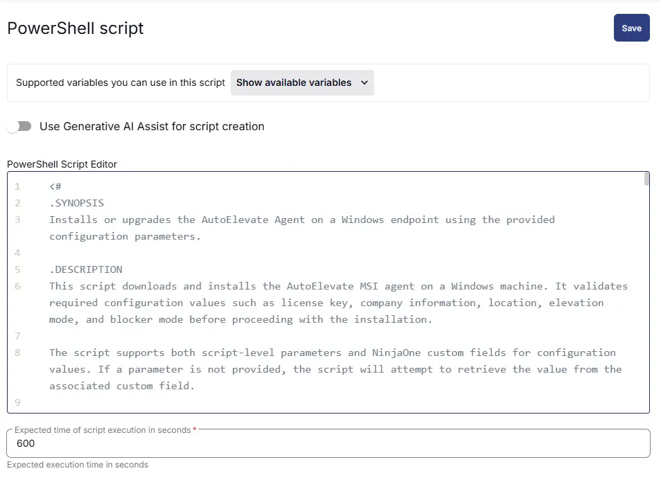

#### **Row 6 Function: Command Prompt (CMD) Script**

- **Notes:** `<Leave it Blank>`  
- **Use Generative AI Assist for script creation:** `False`  
- **Expected time of script execution in seconds:** `600`  
- **Continue on Failure:** `False`  
- **Run As:** `System`  
- **Operating System:** `MacOS`  
- **Command Prompt Script Editor:**

```Shell
#!/bin/bash

# -----------------------------------------------------------------------------
# Synopsis:
# Installs the AutoElevate agent on macOS devices using the provided license key,
# organization name, and location details.
#
# Description:
# This script validates the AutoElevate license key from either a runtime
# variable or NinjaOne custom field, downloads the latest AutoElevate installer,
# applies required installer modifications, and deploys the AutoElevate agent.
#
# The script supports macOS environments and automatically handles macOS-specific
# command requirements while passing the configured license key, organization,
# and location information to the installer.
#
# Requirements:
# - macOS device
# - Internet connectivity to download the AutoElevate installer
# - Valid AutoElevate license key
# - Administrative privileges required for installation
#
# Exit Codes:
# 0 - AutoElevate installation completed successfully
# 1 - Missing license key, installer download failure, or installation failure
# Other - AutoElevate installer returned an error code
# -----------------------------------------------------------------------------

# Retrieve License Key
Param_License_Key='@License_Key@'
Client_License_Key='@CF_License_Key@'

if [[ -n "$Client_License_Key" && "$Client_License_Key" != @CF_License_Key@ ]]; then
    LICENSE_KEY="$Client_License_Key"
elif [[ -n "$Param_License_Key" && "$Param_License_Key" != @License_* ]]; then
    LICENSE_KEY="$Param_License_Key"
else
    echo "ERROR: License Key is required to install AutoElevate. Please provide a valid license key."
    exit 1
fi


# Retrieve Organization and Location Details
AE_CLIENT='%companyname%'
AE_LOCATION='%locationname%'

# Installer Details
INSTALLER_URL="https://autoelevate-installers.s3.us-east-2.amazonaws.com/current/AEInstaller.sh"
INSTALLER_PATH="/tmp/ae-cli-install"

# Download Installer
echo "Downloading AutoElevate installer..."

curl -k -fsSL -o "$INSTALLER_PATH" "$INSTALLER_URL"

if [[ $? -ne 0 || ! -f "$INSTALLER_PATH" ]]; then
    echo "ERROR: Failed to download AutoElevate installer."
    exit 1
fi

# Patch Internal Curl Commands
echo "Patching installer curl commands..."

OS_TYPE=$(uname)

if [[ "$OS_TYPE" == "Darwin" ]]; then
    # macOS BSD sed syntax
    sed -i '' 's/curl /curl -k /g' "$INSTALLER_PATH"
else
    # Linux GNU sed syntax
    sed -i 's/curl /curl -k /g' "$INSTALLER_PATH"
fi

# Make Installer Executable
chmod +x "$INSTALLER_PATH"

# Run Installer
echo "Installing AutoElevate agent..."

"$INSTALLER_PATH" "$LICENSE_KEY" "$AE_CLIENT" "$AE_LOCATION"
EXIT_CODE=$?

# Installation Result
if [[ $EXIT_CODE -ne 0 ]]; then
    echo "ERROR: AutoElevate installation failed with exit code $EXIT_CODE."
    exit $EXIT_CODE
fi

echo "AutoElevate installation completed successfully."
exit 0
```
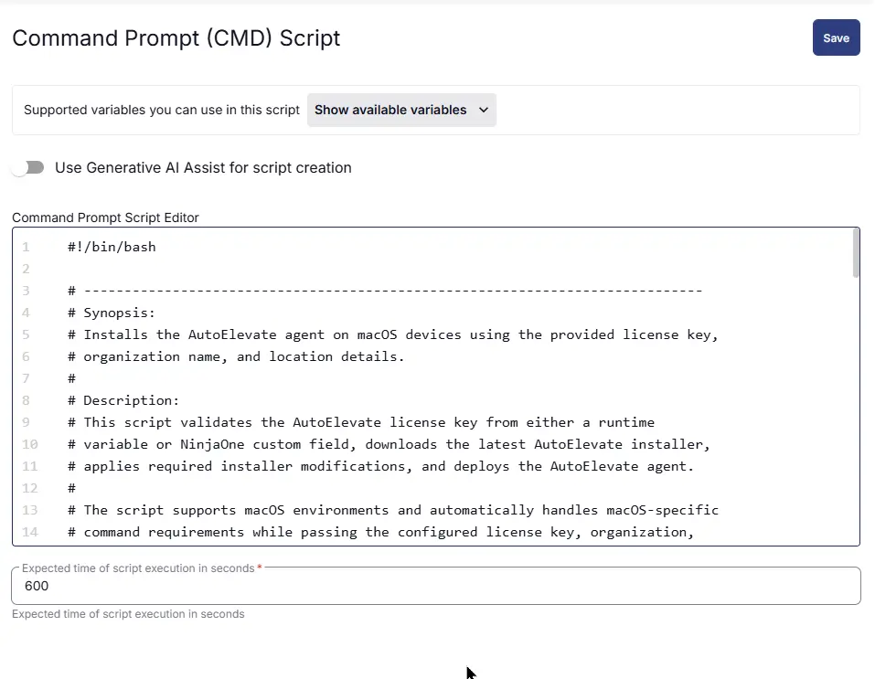

#### **Row 7 Function: Script Log**

- **Notes:** `<Leave it Blank>`  
- **Continue on Failure:** `False`  
- **Operating System:** `Windows,MacOS`  
- **Script Log Message:** `%Output%`  

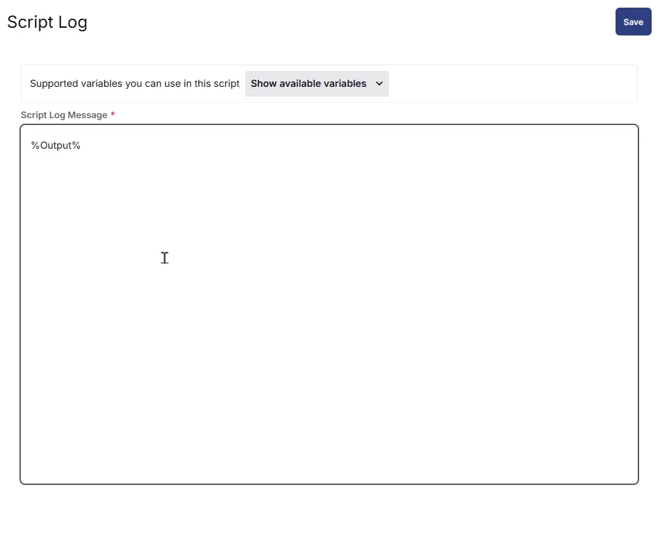

## Save Task

Click the `Save` button at the top-right corner of the screen to save the script.  


## Completed Task

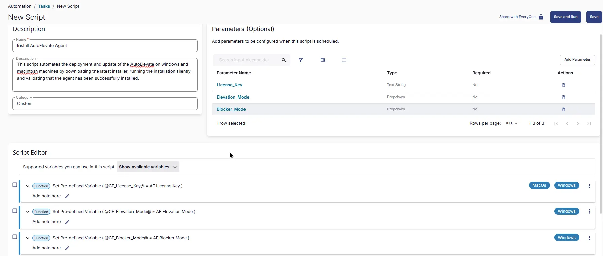
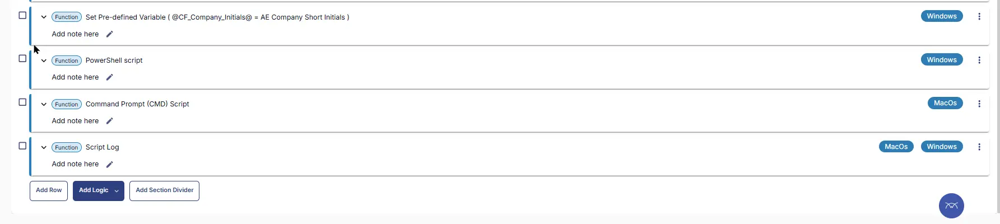

## Output

- Script Logs

## Schedule Task

### Task Details

**Name:** `Install AutoElevate Agent`  
**Description:** `This script automates the deployment and update of the AutoElevate on windows and macintosh machines by downloading the latest installer, running the installation silently, and validating that the agent has been successfully installed.`  
**Category:** `Custom`

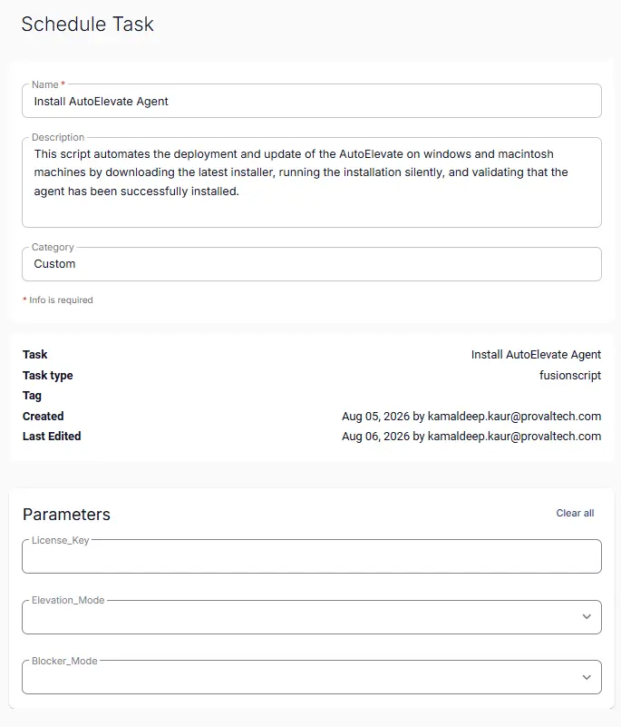

### Schedule

- **Schedule Type:**  `Schedule`  
- **Timezone:** `Local Machine Time`  
- **Start:** `<Current Date>`  
- **Trigger:** `Time` `At` `<Current Time>`  
- **Recurrence:** `Every day`
- **Execute at next agent check-in:** `True`
- **Stop After:** `22`
- **Unit:** `Hour(s)`

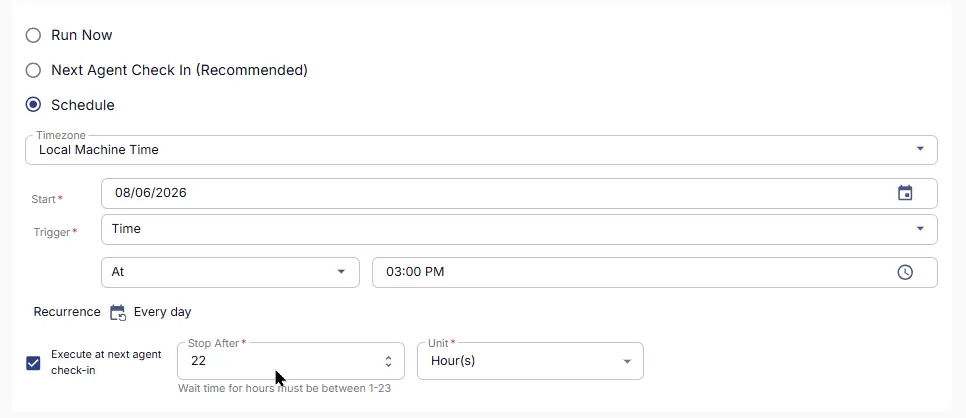

### Targeted Resource

**Device Group:** `Deploy AutoElevate Agent`

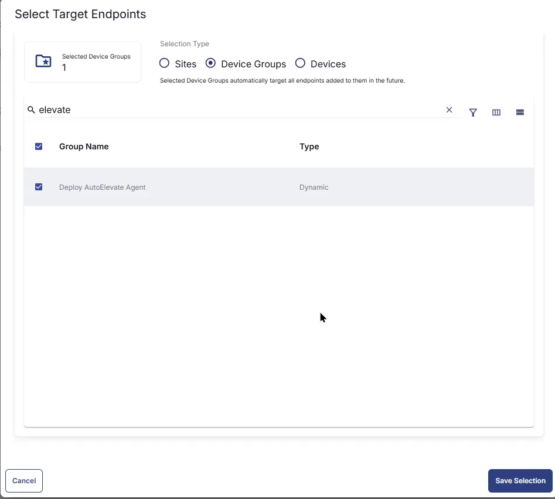

### Completed Scheduled Task

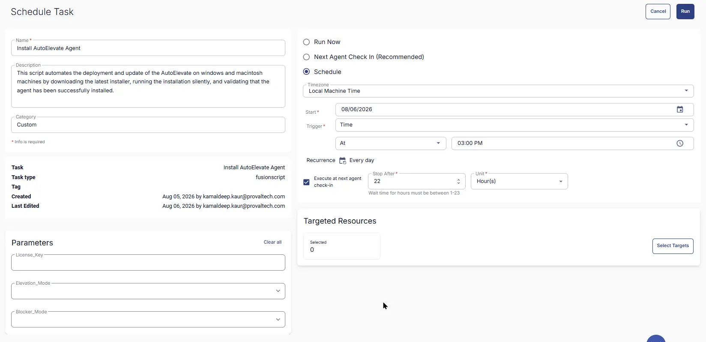

## Changelog

### 2026-08-10

- Initial version of the document
