## Summary

Installs the BlackPoint SNAP Agent on Windows and macOS machines. It uses agnostic script [Install-SnapAgent](/docs/0cf14533-c145-4a77-8ea7-8c70476768a9) for BlackPoint SnapAgent installation on windows machine

## Sample Run

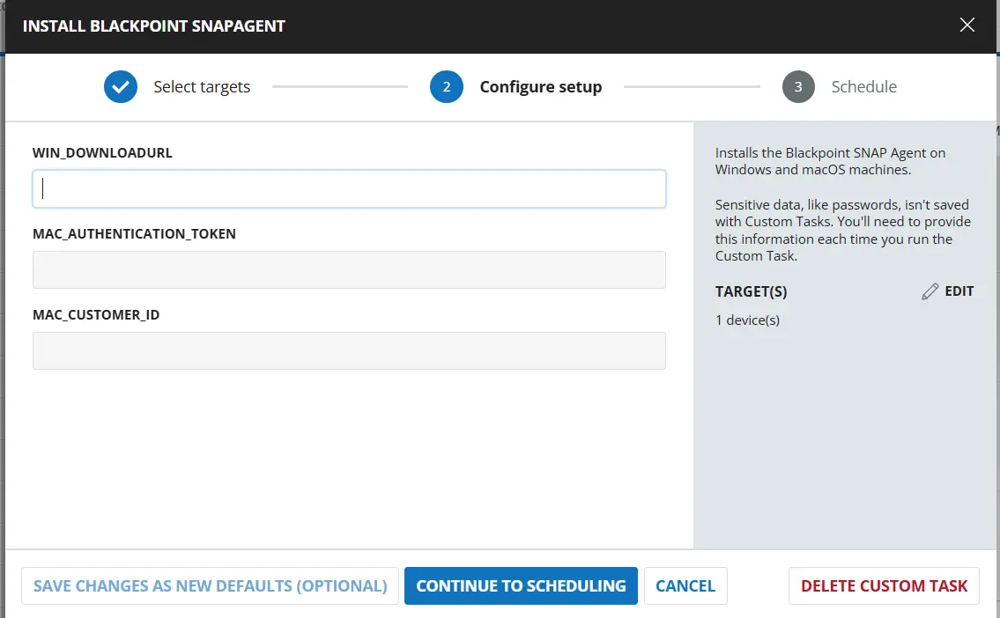  

## Dependencies

- [Agnostic: Install-SnapAgent](/docs/0cf14533-c145-4a77-8ea7-8c70476768a9)  
- [Solution: BlackPoint SnapAgent Deployment](/docs/b99808e9-5148-47f6-9da4-bc4eeb590f2a) 

## User Parameters

| Name | Example | Required | Type | Description |
|------|---------|----------|------|-------------|
| Win_DownloadUrl | [https://file.something.com/SnapAgent/SnapAgent_Installer.exe](https://file.something.com/SnapAgent/SnapAgent_Installer.exe) | False | Text String | Download URL for the installer. |
| MAC_Authentication_Token | `788jkhdfhhadf9` | False | Text String | Unique BlackPoint authentication token used to install the BlackPoint SNAP Agent on macOS endpoints. The client custom field `BP_MAC_Authentication_Token` takes precedence over this parameter value for client machines. |
| Mac_Customer_ID | `78134783489` | False | Text String | Unique BlackPoint Account UID used to identify and link endpoints to the correct BlackPoint account. This is for MAC agents. The client custom field `BP_Mac_Customer_ID` takes precedence over this parameter value for client machines. |

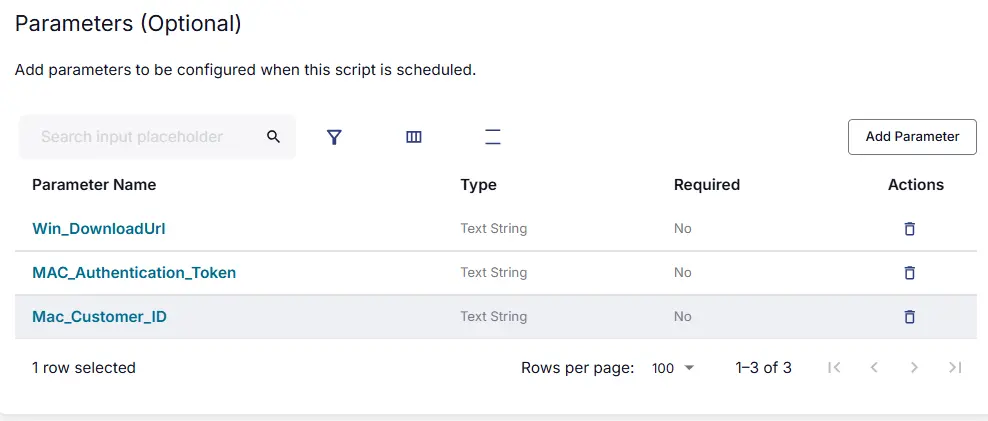  

## Task Creation

Create a new `Script Editor` style script in the system to implement this task.  
  

  

- **Name:** `Install BlackPoint SnapAgent`  
- **Description:** `Installs the BlackPoint SnapAgent on Windows and macOS machines.`  
- **Category:** `Application`  

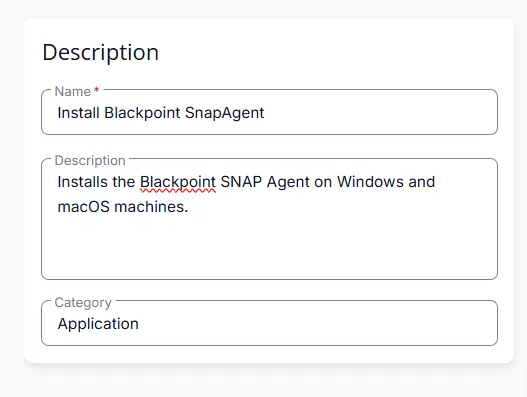  

## Parameters

### Win_DownloadUrl

Add a new parameter by clicking the `Add Parameter` button present at the top-right corner of the screen.  
  

This screen will appear.  
  

- Set `Win_DownloadUrl` in the `Parameter Name` field.
- Disable the `Required Field` button.
- Select `Text String` from the `Parameter Type` dropdown menu.
- Click the `Save` button.

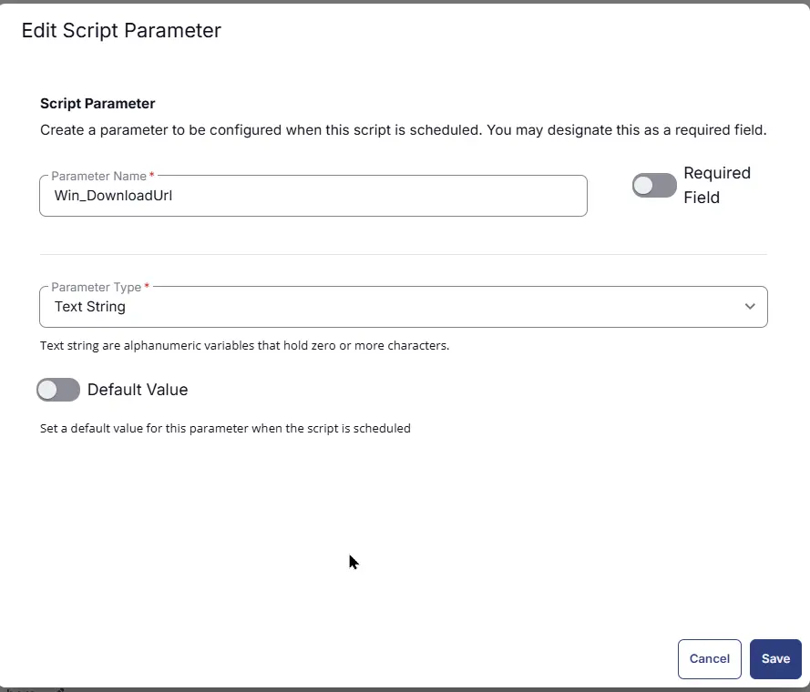  

### MAC_Authentication_Token

Add a new parameter by clicking the `Add Parameter` button present at the top-right corner of the screen.  
  

This screen will appear.  
  

- Set `MAC_Authentication_Token` in the `Parameter Name` field.
- Disable the `Required Field` button.
- Select `Text String` from the `Parameter Type` dropdown menu.
- Click the `Save` button.

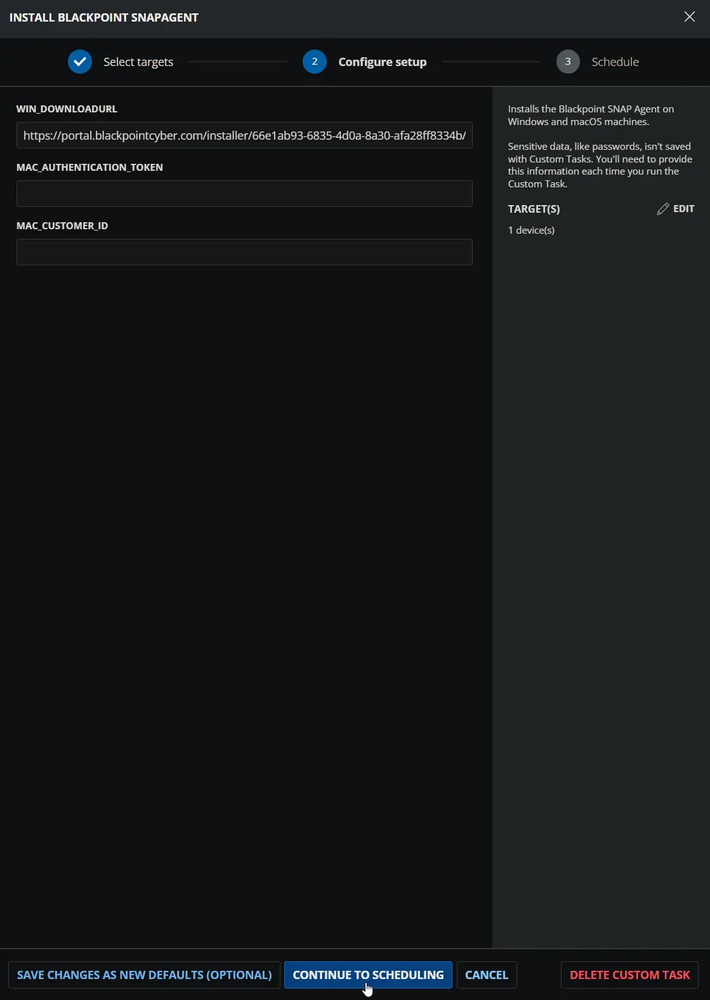  

### Mac_Customer_ID

Add a new parameter by clicking the `Add Parameter` button present at the top-right corner of the screen.  
  

This screen will appear.  
  

- Set `Mac_Customer_ID` in the `Parameter Name` field.
- Disable the `Required Field` button.
- Select `Text String` from the `Parameter Type` dropdown menu.
- Click the `Save` button.

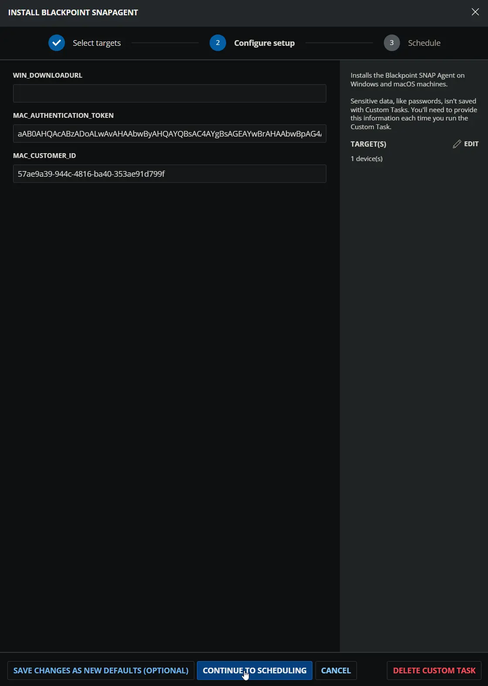  

## Task

Navigate to the Script Editor section and start by adding a row. You can do this by clicking the `Add Row` button at the bottom of the script page.  
  

A blank function will appear.  
  

#### **Row 1 Function: Set Pre-defined Variable (@Client_DownloadURL@ = BP_WIN_URL)**

- **Notes:** `<Leave it Blank>` 
- **Continue on Failure:** `False`
- **Operating System:** `Windows`
- **Variable Name:** `Client_DownloadURL`
- **Custom Field:** `BP_WIN_URL`

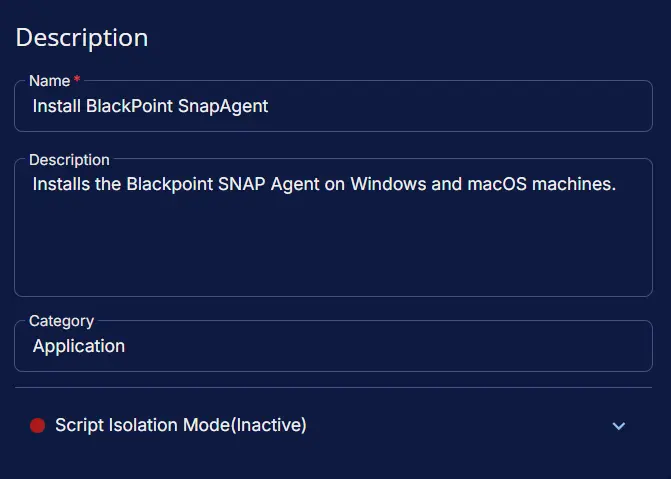  

#### **Row 2 Function: Set Pre-defined Variable (@Client_Authentication_Token@ = BP_MAC_Authentication_Token)**

- **Notes:** `<Leave it Blank>` 
- **Continue on Failure:** `False`
- **Operating System:** `MacOS`
- **Variable Name:** `Client_Authentication_Token`
- **Custom Field:** `BP_MAC_Authentication_Token`

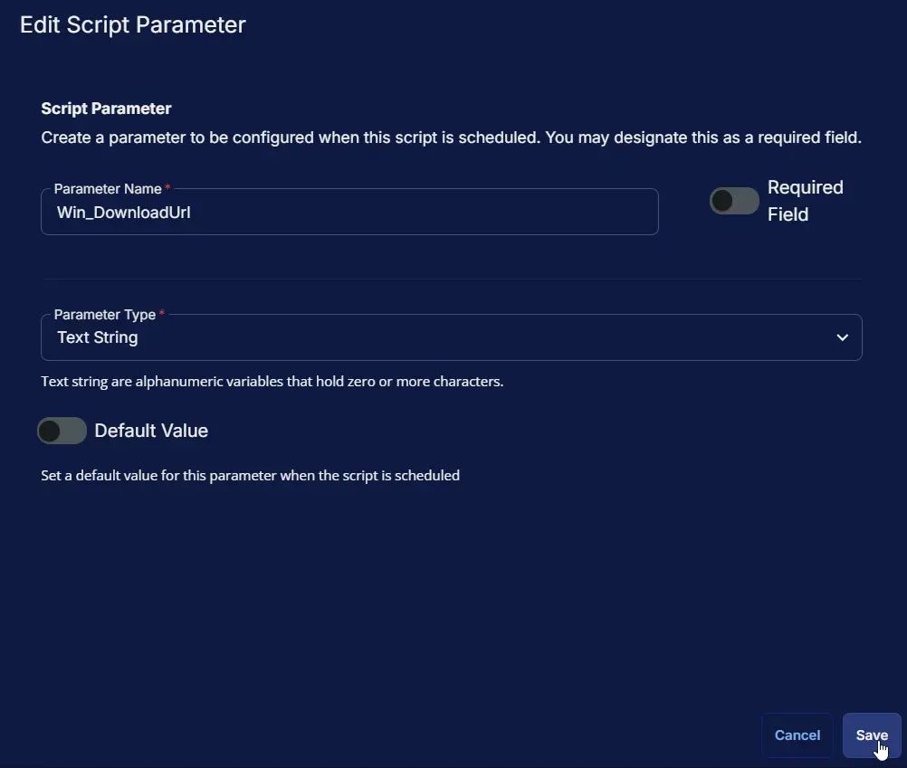  

#### **Row 3 Function: Set Pre-defined Variable (@Client_Customer_ID@ = BP_Mac_Customer_ID)**

- **Notes:** `<Leave it Blank>` 
- **Continue on Failure:** `False`
- **Operating System:** `MacOS`
- **Variable Name:** `Client_Customer_ID`
- **Custom Field:** `BP_Mac_Customer_ID`

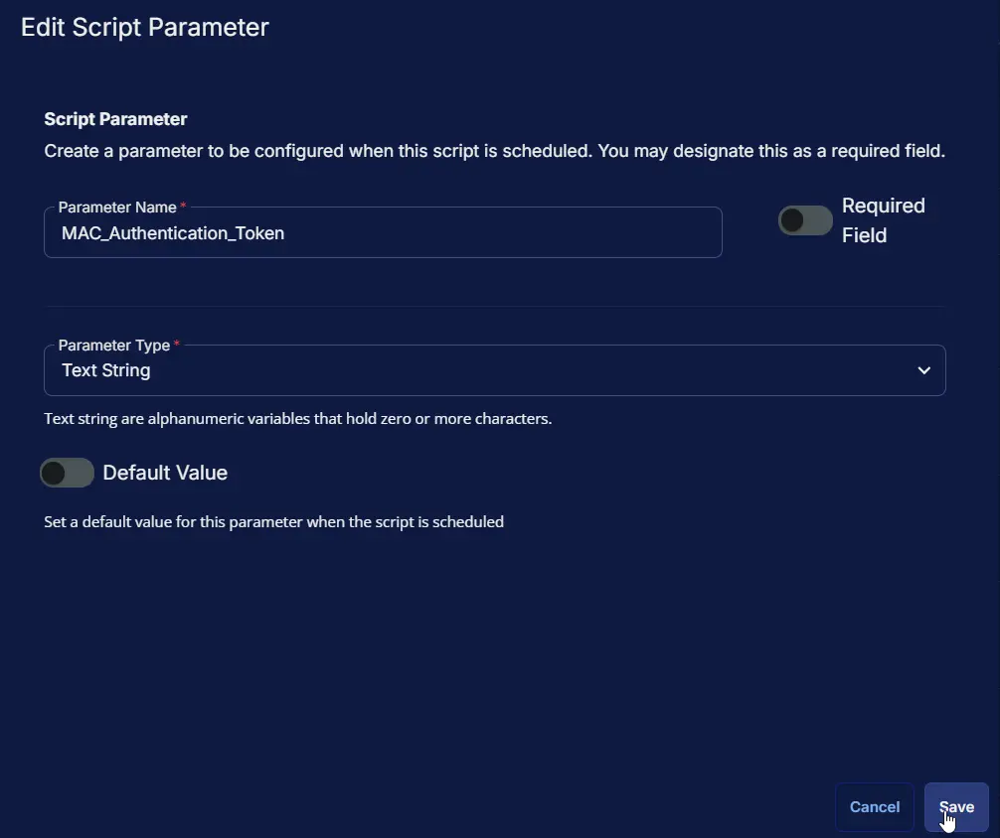  

### Row 4 Function: PowerShell Script

- **Notes:** `<Leave it Blank>`  
- **Use Generative AI Assist for script creation:** `False`  
- **Expected time of script execution in seconds:** `600`  
- **Continue on Failure:** `False`  
- **Run As:** `System`  
- **Operating System:** `Windows`  
- **PowerShell Script Editor:**

```PowerShell
<#
.SYNOPSIS
    Downloads, validates, and executes the BlackPoint SNAP Agent deployment script.

.DESCRIPTION
    This script retrieves the BlackPoint SNAP Agent download URL from either the
    client-specific or global parameter, with the client-specific URL taking
    precedence when configured.

    It downloads the deployment script from the approved content repository,
    validates its Authenticode signature against the approved ProVal certificate
    thumbprints, and executes the script with the validated download URL.

    The script also configures TLS 1.2/1.3 for secure repository communication,
    maintains a dedicated working directory, and validates script execution by
    reviewing the generated log and error files.

    Script execution is stopped if the download URL is invalid, the deployment
    script cannot be retrieved, the code signature validation fails, or an error
    log is generated.

.NOTES
    Client-specific download URLs take precedence over the global download URL.
    The deployment script must have a valid, timestamped Authenticode signature
    matching an approved ProVal certificate thumbprint.

    The script uses the ProVal content repository to retrieve the deployment
    payload and approved certificate thumbprints. The working files and logs are
    stored under the ProgramData automation directory.

    Execution is dependent on successful signature validation and is designed to
    prevent execution of an untrusted or modified deployment script.
#>

#region globals
$ProgressPreference = 'SilentlyContinue'
$WarningPreference = 'SilentlyContinue'
$VerbosePreference = 'SilentlyContinue' # Change to 'Continue' for debugging to see detailed execution logs.
#endregion

#region basic variables
$projectName = 'Install-SnapAgent' 
$workingDirectory = '{0}\_Automation\Script\{1}' -f $env:ProgramData, $projectName
$scriptPath = '{0}\{1}.ps1' -f $workingDirectory, $projectName
$baseUrl = 'https://contentrepo.net/repo'
$scriptUrl = '{0}/script/{1}.ps1' -f $baseUrl, $projectName
$logPath = '{0}\{1}-log.txt' -f $workingDirectory, $projectName
$errorLogPath = '{0}\{1}-error.txt' -f $workingDirectory, $projectName
$logContentReplacePattern = '{0}$' -f $projectName
$thumbprintFileName = 'ProValCertThumbprints'
$thumbprintSource = '{0}/config/{1}.json' -f $baseUrl, $thumbprintFileName
#endregion

#region parameters
$Param_URL = '@Win_DownloadUrl@'
$Client_URL = '@Client_DownloadURL@'

if($Client_URL -match ':\/\/'){
    $URL = $Client_URL
} elseif ($param_URL -match ':\/\/' ){
    $URL = $param_URL
} else {
    throw 'Invalid download URL.'
}

$Parameters = @{
    URL = $Url
}
#endregion

#region mandatory function
#DO NOT change the function name. This function validates script code signatures.
#The function must return $true when the signature is valid, otherwise $false.
function Test-PayloadSignature {
    <#
    .SYNOPSIS
        Validates a script file code signature.
    .DESCRIPTION
        Verifies that the script is signed, the signature is valid, and the signer certificate thumbprint matches the expected value.
    .PARAMETER FilePath
        Full path to the script file to validate.
    .PARAMETER ExpectedThumbprint
        Expected thumbprint of the trusted code-signing certificate.
    .OUTPUTS
        Returns $true for a valid signature, otherwise returns $false.
    #>
    [CmdletBinding()]
    [OutputType([System.Boolean])]
    param (
        [Parameter(Mandatory = $true, HelpMessage = 'Full path to the script file to validate.')]
        [string]$FilePath,
        [Parameter(Mandatory = $true, HelpMessage = 'Expected thumbprint of the trusted code-signing certificate.')]
        [string[]]$ExpectedThumbprint
    )

    try {
        $signature = Get-AuthenticodeSignature -FilePath $FilePath -ErrorAction Stop
        if ($signature.Status -eq 'Valid') {
            $cert = $signature.SignerCertificate
            if ($cert -and ($ExpectedThumbprint -contains $cert.Thumbprint)) {
                if ($signature.TimeStamperCertificate) {
                    return $true
                } else {
                    Write-Error -Message ('Invalid Signature: The script ''{0}'' is signed, but the signature is not timestamped. This can cause the signature to become invalid after certificate expiration.' -f $FilePath)
                    return $false
                }
            } else {
                Write-Error -Message ('Invalid Signature: The script ''{0}'' is signed, but the signer certificate thumbprint does not match the expected value.' -f $FilePath)
                return $false
            }
        } else {
            Write-Error -Message ('Invalid Signature: The script ''{0}'' is unsigned or has an invalid signature.' -f $FilePath)
            return $false
        }
    } catch {
        return $false
    }
}
#endregion

#region set tls policy
#DO NOT change this block. It sets TLS policy to ensure secure download communication with the content repository.
$supportedTlsVersions = [enum]::GetValues('Net.SecurityProtocolType')
if (($supportedTlsVersions -contains 'Tls13') -and ($supportedTlsVersions -contains 'Tls12')) {
    [System.Net.ServicePointManager]::SecurityProtocol =
    [Enum]::ToObject([Net.SecurityProtocolType], 12288) -bor
    [Enum]::ToObject([Net.SecurityProtocolType], 3072)
    Write-Verbose -Message 'TLS policy set to allow TLS 1.2 and TLS 1.3.'
} else {
    [Net.ServicePointManager]::SecurityProtocol = [Enum]::ToObject([Net.SecurityProtocolType], 3072)
    Write-Verbose -Message 'TLS policy set to TLS 1.2 only because TLS 1.3 is not supported on this system.'
}
#endregion

#region get approved thumbprints
$proValCertThumbprint = @()
try {
    $proValCertThumbprint = Invoke-RestMethod -Uri $thumbprintSource -UseBasicParsing -ErrorAction Stop
} catch {
    throw ('Failed to retrieve approved thumbprints. Reason: {0}' -f $Error[0].Exception.Message)
}
#endregion


#region working Directory
#DO NOT change this block. It creates the working directory when it does not already exist.
if (-not (Test-Path -Path $workingDirectory)) {
    try {
        New-Item -Path $workingDirectory -ItemType Directory -Force -ErrorAction Stop | Out-Null
        Write-Verbose -Message ('Created working directory: {0}' -f $workingDirectory)
    } catch {
        throw ('Failed to create working directory {0}. Reason: {1}' -f $workingDirectory, $Error[0].Exception.Message)
    }
} else {
    Write-Verbose -Message ('Working directory already exists: {0}' -f $workingDirectory)
}
#endregion

#region download script
#DO NOT change this block. It downloads the script from the content repository, refreshing the local copy when available.
try {
    Invoke-WebRequest -Uri $scriptUrl -OutFile $scriptPath -UseBasicParsing -ErrorAction Stop
    Write-Verbose -Message ('Downloaded script from {0} to {1}' -f $scriptUrl, $scriptPath)
} catch {
    if (-not (Test-Path -Path $scriptPath)) {
        throw ('Failed to download script from ''{0}'', and no local copy exists on this machine. Reason: {1}' -f $scriptUrl, $Error[0].Exception.Message)
    } else {
        Write-Verbose -Message ('Failed to download script from ''{0}'', but a local copy is available at: {1}' -f $scriptUrl, $scriptPath)
    }
}
#endregion

#region validate code signature
#DO NOT change this block. It validates the downloaded script signature before execution.
if (-not (Test-PayloadSignature -FilePath $scriptPath -ExpectedThumbprint $proValCertThumbprint -ErrorAction Continue)) {
    throw ('Invalid Signature: Script ''{0}'' failed code-signature validation. Execution has been stopped.' -f $scriptPath)
} else {
    Write-Verbose -Message ('Script ''{0}'' passed code-signature validation.' -f $scriptPath)
}
#endregion

#region execute script
if ($parameters.Count -gt 0) {
    Write-Verbose -Message ('Executing script ''{0}'' with parameters: {1}' -f $scriptPath, (($parameters.GetEnumerator() | ForEach-Object { ('{0}={1}' -f $_.Key, $_.Value) }) -join '; ' | Out-String))
    & $scriptPath @parameters
} else {
    Write-Verbose -Message ('Executing script ''{0}'' without parameters.' -f $scriptPath)
    & $scriptPath
}
#endregion

#region log validation
#DO NOT change this block. It validates the script execution by checking for the expected log files and outputs their content for verification.
if (-not (Test-Path -Path $logPath)) {
    throw ('Failed to run the agnostic script ''{0}''. A security application seems to have interrupted the script.' -f $scriptPath)
} else {
    $content = Get-Content -Path $logPath
    $logContent = $content[ $($($content.IndexOf($($content -match $logContentReplacePattern)[-1])) + 1)..$($content.length - 1) ]
    Write-Information -MessageData ('Log Content:{1}{0}' -f ($logContent | Out-String -ErrorAction SilentlyContinue), [Environment]::NewLine) -InformationAction Continue
}

if (Test-Path -Path $errorLogPath) {
    $errorLogContent = Get-Content -Path $errorLogPath -ErrorAction SilentlyContinue
    throw ('Error log Content:{1}{0}' -f ($errorLogContent | Out-String -ErrorAction SilentlyContinue), [Environment]::NewLine)
}
#endregion
```

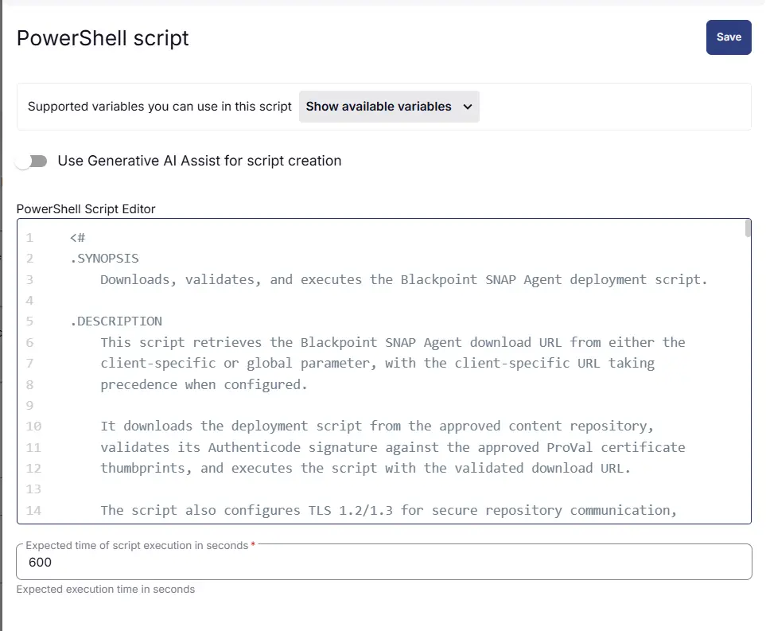  

#### **Row 5 Function: Command Prompt (CMD) Script**

- **Notes:** `<Leave it Blank>`  
- **Use Generative AI Assist for script creation:** `False`  
- **Expected time of script execution in seconds:** `600`  
- **Continue on Failure:** `False`  
- **Run As:** `System`  
- **Operating System:** `MacOS`  
- **Command Prompt Script Editor:**

```Shell
# -----------------------------------------------------------------------------
# SYNOPSIS
#     Installs the BlackPoint SNAP Agent on macOS devices using the BlackPoint
#     deployment installer.
#
# DESCRIPTION
#     This script retrieves the BlackPoint SNAP authentication token and
#     customer ID from the configured client or parameter values, checks whether
#     the SNAP Agent is already installed, downloads the BlackPoint installer,
#     and performs the installation with the provided credentials.
#
#     The script verifies the installation by checking for the
#     snap-agent.plist file and removes the downloaded installer after
#     installation.
# -----------------------------------------------------------------------------

Param_Auth_Token="MAC_Authentication_Token"
Param_Customer_ID="Mac_Customer_ID"

Client_Auth_Token="Client_Authentication_Token"
Client_Customer_ID="Client_Customer_ID"

# --- Retrieve Authentication Token ---
if [ -n "$Client_Auth_Token" ]; then
    BP_Mac_Auth_Token="$Client_Auth_Token"
elif [ -n "$Param_Auth_Token" ]; then
    BP_Mac_Auth_Token="$Param_Auth_Token"
else
    echo "ERROR: Authentication token is not configured."
    exit 1
fi

# --- Retrieve Customer ID ---
if [ -n "$Client_Customer_ID" ]; then
    BP_Mac_Customer_ID="$Client_Customer_ID"
elif [ -n "$Param_Customer_ID" ]; then
    BP_Mac_Customer_ID="$Param_Customer_ID"
else
    echo "ERROR: Customer ID is not configured."
    exit 1
fi


echo "Setting Auth_Token to: $BP_Mac_Auth_Token"
echo "Setting Customer_ID to: $BP_Mac_Customer_ID"

# --- CHECK IF ALREADY INSTALLED (EXIT) ---
if [ -f "/Library/LaunchDaemons/snap-agent.plist" ]; then
    echo "snap-agent.plist FOUND — BlackPoint SNAP is already installed. Exiting."
    exit 0
fi

echo "snap-agent.plist NOT found — starting installation..."

# --- Download Installer to /tmp ---
installerPath="/tmp/download-install.sh"
downloadURL="https://bpc-deploy-scripts.s3.amazonaws.com/macos/download-install.sh"

echo "Downloading BlackPoint SNAP installer from: $downloadURL"
httpStatus=$(curl -L -s -w "%{http_code}" -o "$installerPath" "$downloadURL")

if [ "$httpStatus" != "200" ]; then
  echo "ERROR: Failed to download the installer (HTTP: $httpStatus)"
  exit 1
fi

if [ ! -s "$installerPath" ]; then
  echo "ERROR: Installer file is empty."
  exit 1
else
  echo "Installer downloaded successfully to: $installerPath"
fi

# --- Make Executable ---
chmod +x "$installerPath"

# --- Install BlackPoint SNAP ---
echo "Starting installation..."
sh "$installerPath" --token "$BP_Mac_Auth_Token" --customer "$BP_Mac_Customer_ID"
echo "sh "$installerPath" --token "$BP_Mac_Auth_Token" --customer "$BP_Mac_Customer_ID""

# --- Verify Installation ---
if [ -f "/Library/LaunchDaemons/snap-agent.plist" ]; then
    echo "snap-agent.plist FOUND. BlackPoint SNAP service is installed."
else
    echo "snap-agent.plist NOT found."
fi


# --- Clean Up ---
rm -f "$installerPath"
echo "Installer removed from /tmp."

echo "BlackPoint SNAP installation completed successfully."
exit 0
```
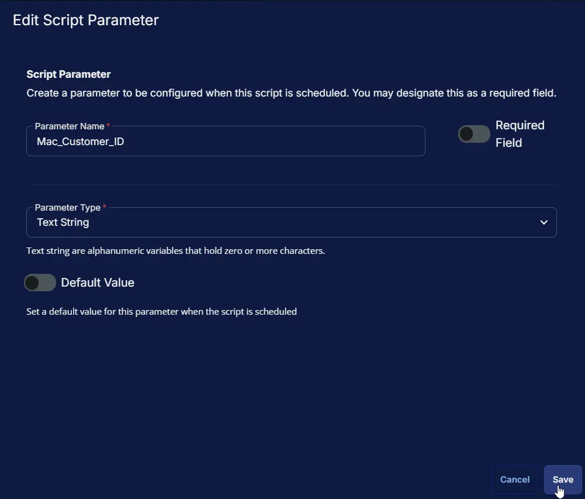  

### Row 6 Function: Script Log


- **Notes:** `<Leave it Blank>`  
- **Continue on Failure:** `False`  
- **Operating System:** `Windows,MacOS`  
- **Script Log Message:** `%Output%`  

  


## Completed Task

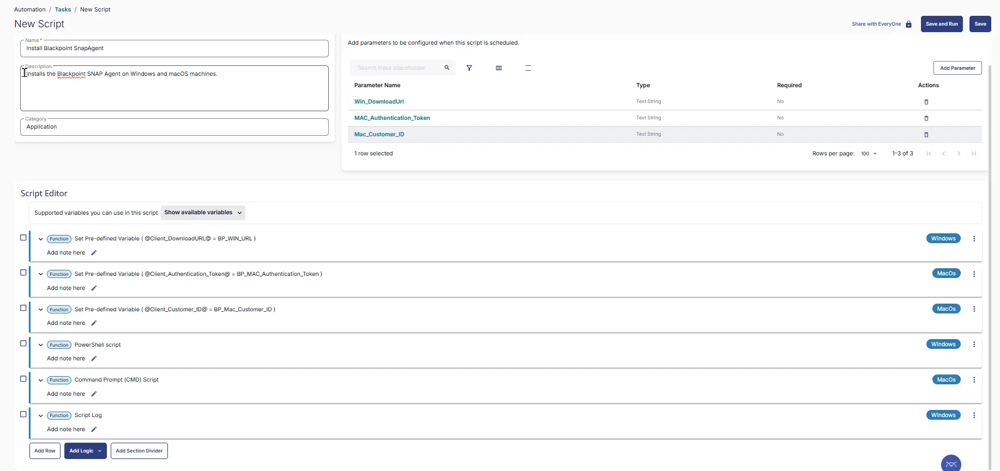  

## Output

- Script log

## Schedule Task

### Task Details

**Name:** `Install BlackPoint SnapAgent`  
**Description:** `Installs the BlackPoint SNAP Agent on Windows and macOS machines.`  
**Category:** `Application`  
  

### Schedule

- **Schedule Type:**  `Schedule`  
- **Timezone:** `Local Machine Time`  
- **Start:** `<Current Date>`  
- **Trigger:** `Time` `At` `<Current Time>`  
- **Recurrence:** `Every day`
- **Execute at next agent check-in:** `True`
- **Stop After:** `22`
- **Unit:** `Hour(s)`

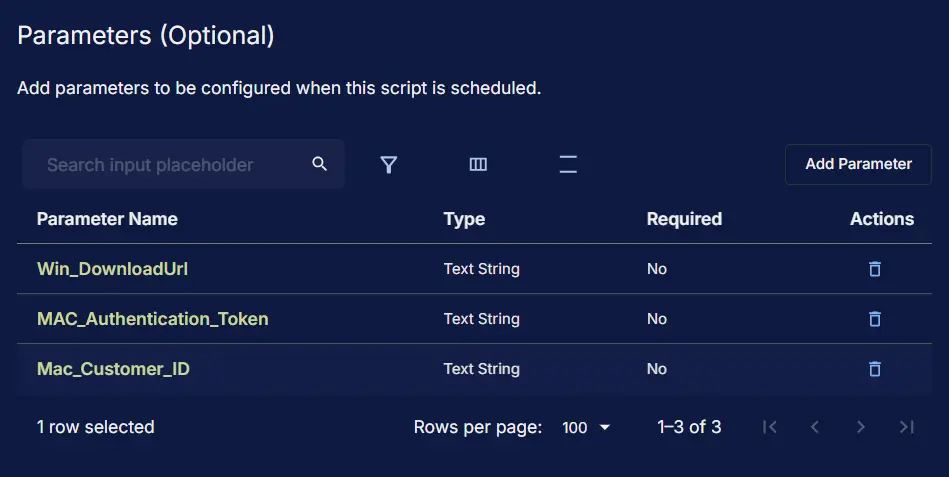 

### Targeted Resource

**Device Group:** `Deploy BlackPoint SnapAgent`

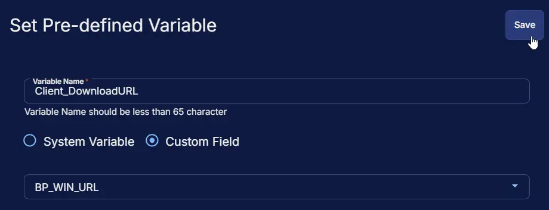 

### Completed Scheduled Task

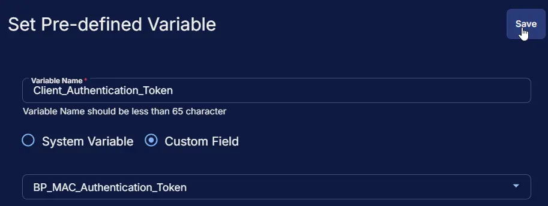 

## Changelog

### 2026-08-18

- Updated the script to include MAC installation as well.

### 2025-04-10

- Initial version of the document
