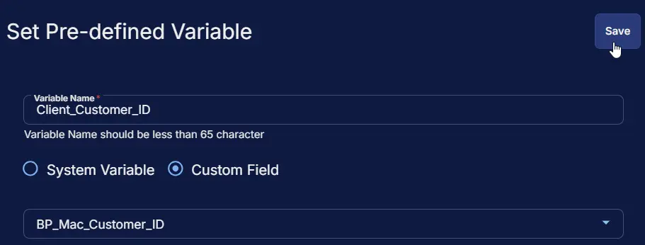
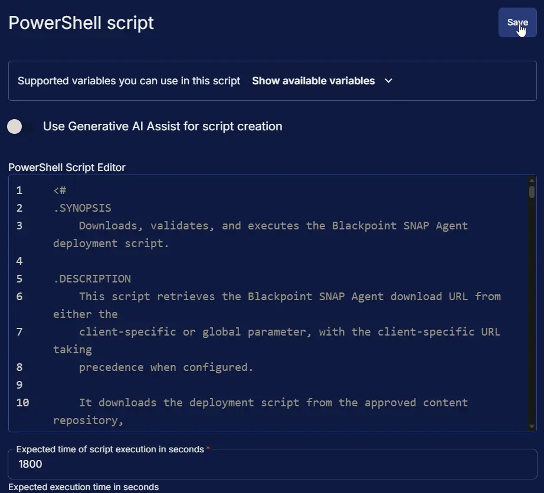
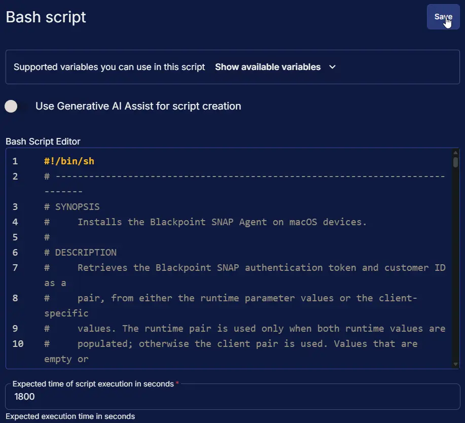
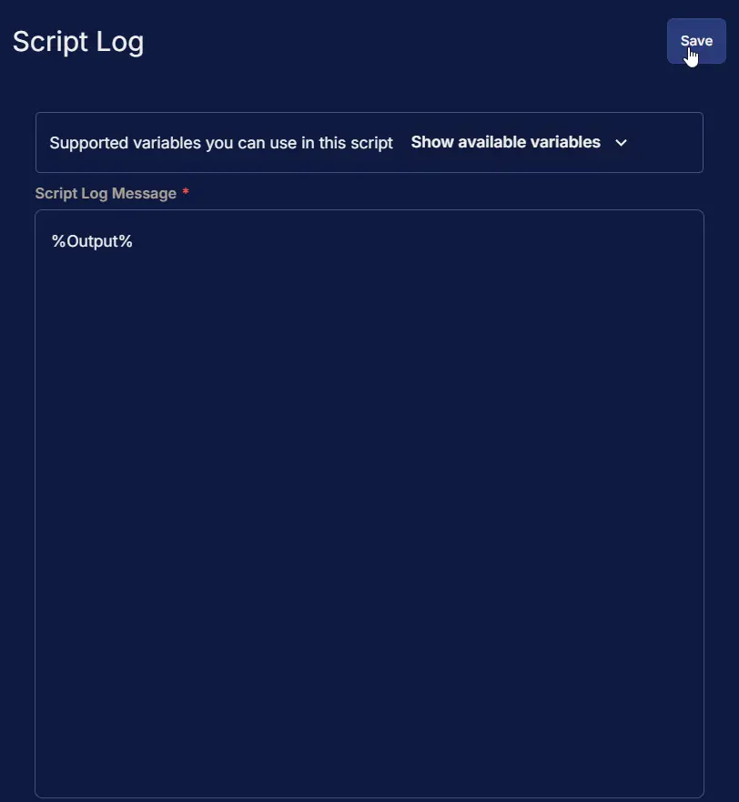
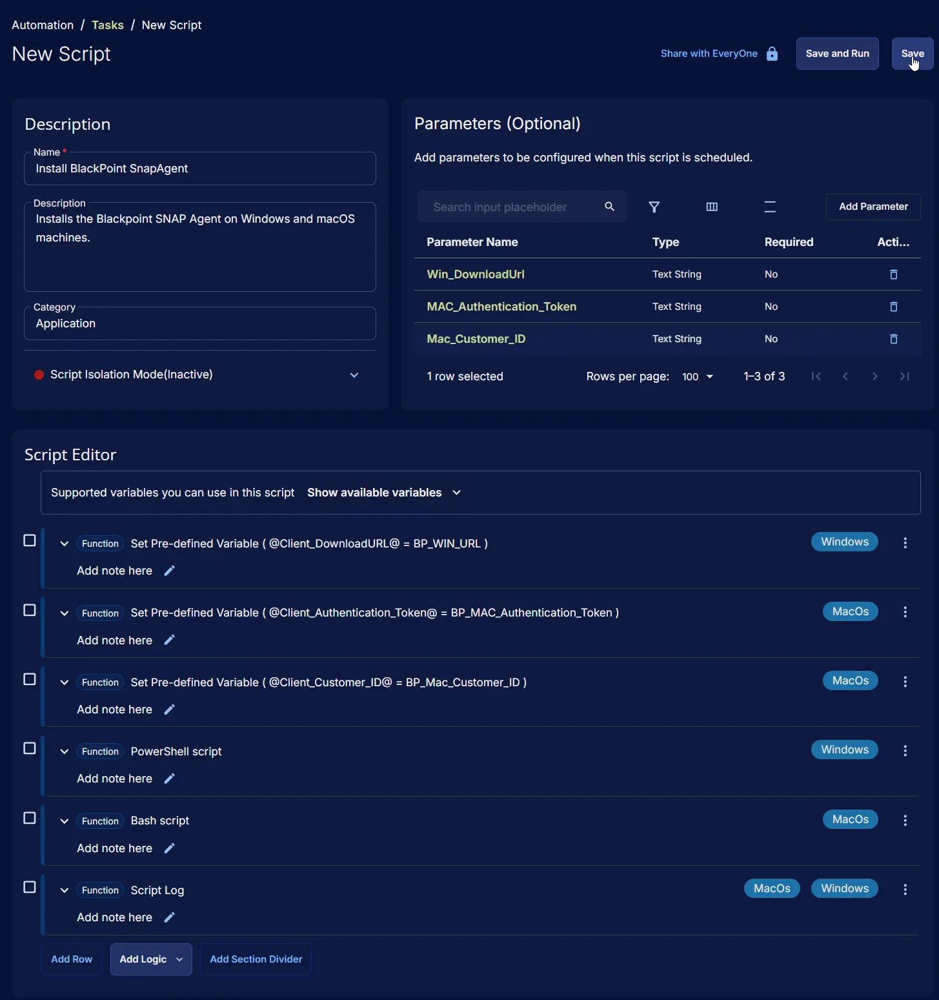
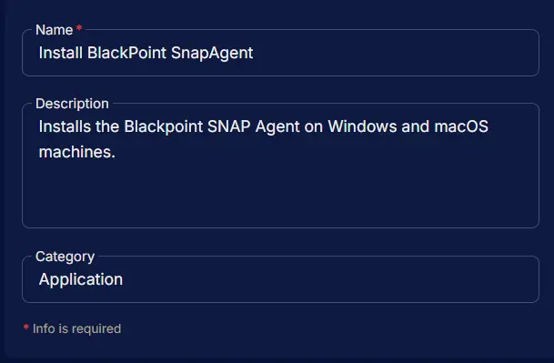
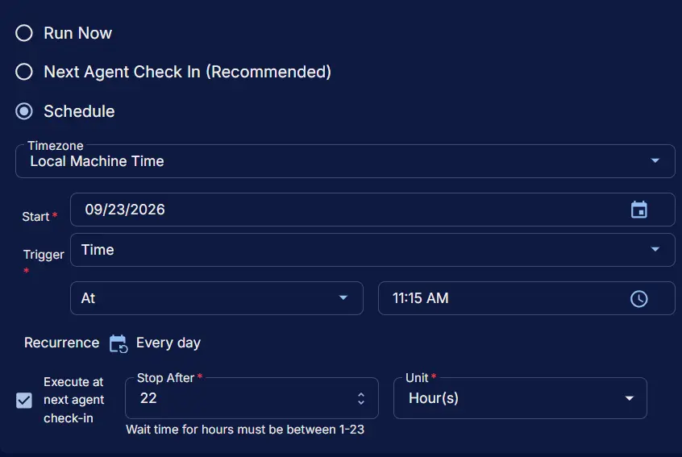
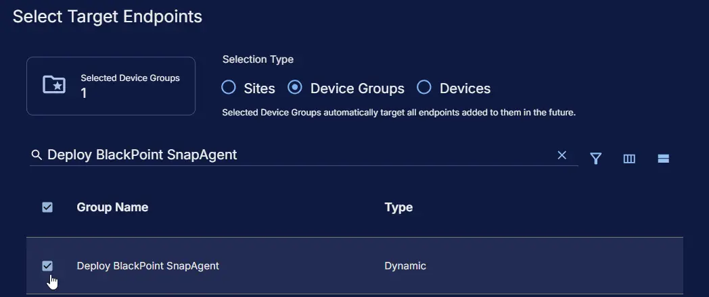
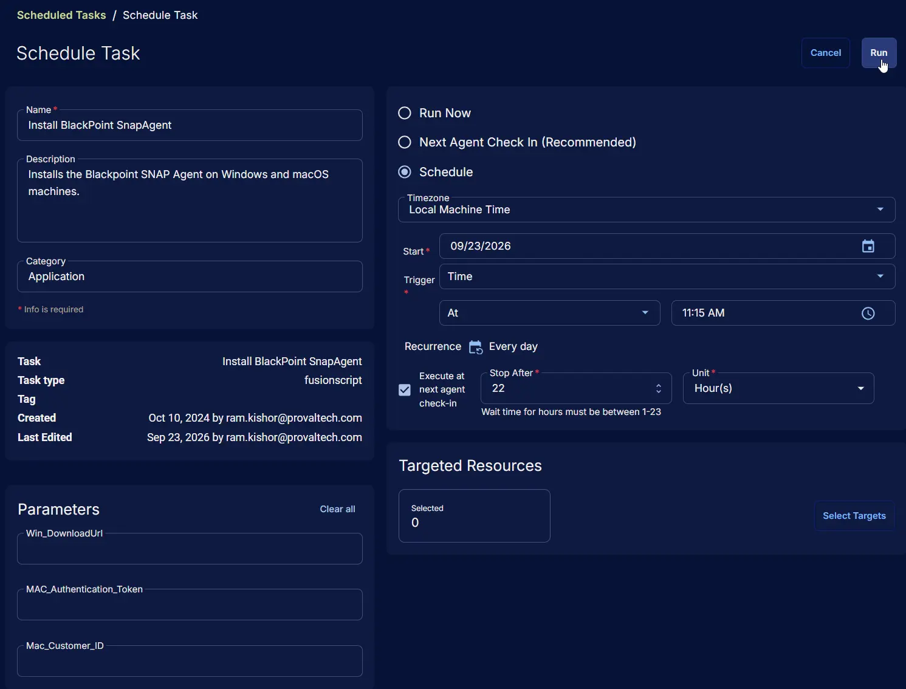

## Summary

Installs the Blackpoint SNAP Agent on Windows and macOS machines.

On Windows, the task uses the agnostic script [Install-SnapAgent](/docs/0cf14533-c145-4a77-8ea7-8c70476768a9) with the installer download URL from the `Win_DownloadUrl` parameter or the `BP_WIN_URL` custom field.

On macOS, the task runs a Bash script that:

- Exits without making changes if `/Library/LaunchDaemons/snap-agent.plist` already exists.
- Resolves the authentication token and customer ID as a pair. The `MAC_Authentication_Token` and `Mac_Customer_ID` parameters are used when both are populated; otherwise, the `BP_MAC_Authentication_Token` and `BP_Mac_Customer_ID` custom fields are used. If only one of the two parameters is populated, it is ignored and a warning is written to the log.
- Confirms that the customer ID is a valid UUID.
- Downloads the Blackpoint deployment installer and removes any `license.yaml` left behind by a previous incomplete installation, so the supplied credentials are always applied.
- Runs the Blackpoint installer and verifies the installation by checking for `snap-agent.plist` and confirming that the service is loaded.

Every macOS failure path exits with a non-zero code and writes an `ERROR:` line to the script log.

## Sample Run

**Windows:**  

**macOS:**  

## Dependencies

- [Agnostic: Install-SnapAgent](/docs/0cf14533-c145-4a77-8ea7-8c70476768a9)
- [Solution: BlackPoint SnapAgent Deployment](/docs/b99808e9-5148-47f6-9da4-bc4eeb590f2a)

## User Parameters

| Name | Example | Accepted Values | Required | Default | Type | Description |
|------|---------|-----------------|----------|---------|------|-------------|
| Win_DownloadUrl | `https://file.something.com/SnapAgent/SnapAgent_Installer.exe` | Direct download URL of the installer | `No` | | `Text String` | Download URL for the Windows installer. Used on Windows only. When provided, it takes precedence over the `BP_WIN_URL` custom field. |
| MAC_Authentication_Token | `abc.xyz` | Blackpoint authentication token | `No` | | `Text String` | Blackpoint authentication token for macOS endpoints. Must be provided together with `Mac_Customer_ID`. When both are populated, they take precedence over the `BP_MAC_Authentication_Token` and `BP_Mac_Customer_ID` custom fields. |
| Mac_Customer_ID | `00000000-0000-0000-0000-000000000000` | UUID | `No` | | `Text String` | Blackpoint customer ID that links macOS endpoints to the correct Blackpoint customer. Must be provided together with `MAC_Authentication_Token`. When both are populated, they take precedence over the `BP_MAC_Authentication_Token` and `BP_Mac_Customer_ID` custom fields. |

## Custom Fields

| Name | Level | Type | Required | Description |
|------|-------|------|----------|-------------|
| BP_WIN_URL | Company | Text | No | Download URL for the Windows installer. Used when the `Win_DownloadUrl` parameter is not provided. |
| BP_MAC_Authentication_Token | Company | Text | No | Blackpoint authentication token for macOS endpoints. Used together with `BP_Mac_Customer_ID` when the `MAC_Authentication_Token` and `Mac_Customer_ID` parameters are not both provided. |
| BP_Mac_Customer_ID | Company | Text | No | Blackpoint customer ID (UUID) for macOS endpoints. Used together with `BP_MAC_Authentication_Token` when the `MAC_Authentication_Token` and `Mac_Customer_ID` parameters are not both provided. |

**Note:** Either the custom fields or the user parameters must be populated for the installation to proceed. On macOS, the authentication token and customer ID are always taken from the same source.

## Task Setup Path

- **Tasks Path:** `AUTOMATION` ➞ `Tasks`  
- **Task Type:** `Script Editor`  

## Task Creation

### Description

- **Name:** `Install BlackPoint SnapAgent`  
- **Description:** `Installs the Blackpoint SNAP Agent on Windows and macOS machines.`  
- **Category:** `Application`  
- **Script Isolation Mode:** `Inactive`

### Parameters

| Parameter Name | Required Field | Parameter Type | Default Value |
| -------------- | -------------- | -------------- | ------------- |
| Win_DownloadUrl | Disabled | Text String | |
| MAC_Authentication_Token | Disabled | Text String | |
| Mac_Customer_ID | Disabled | Text String | |

**Win_DownloadUrl:**  

**MAC_Authentication_Token:**  

**Mac_Customer_ID:**  

### Script Editor

#### Row 1: Set Pre-defined Variable ( @Client_DownloadURL@ = BP_WIN_URL )

- **Variable Name:** `Client_DownloadURL`  
- **Type:** `Custom Field`  
- **Custom Field:** `BP_WIN_URL`  
- **Continue on Failure:** `False`  
- **Operating System:** `Windows`

#### Row 2: Set Pre-defined Variable ( @Client_Authentication_Token@ = BP_MAC_Authentication_Token )

- **Variable Name:** `Client_Authentication_Token`  
- **Type:** `Custom Field`  
- **Custom Field:** `BP_MAC_Authentication_Token`  
- **Continue on Failure:** `False`  
- **Operating System:** `MacOS`

#### Row 3: Set Pre-defined Variable ( @Client_Customer_ID@ = BP_Mac_Customer_ID )

- **Variable Name:** `Client_Customer_ID`  
- **Type:** `Custom Field`  
- **Custom Field:** `BP_Mac_Customer_ID`  
- **Continue on Failure:** `False`  
- **Operating System:** `MacOS`

#### Row 4: PowerShell script

- **Use Generative AI Assist for script creation:** `False`  
- **Expected time of script execution in seconds:** `1800`  
- **Continue on Failure:** `False`  
- **Run As:** `System`  
- **Operating System:** `Windows`  
- **PowerShell Script Editor:**

[PowerShell Script](https://github.com/ProVal-Tech/cw-rmm/blob/main/tasks/install-blackpoint-snapagent/script.ps1)

#### Row 5: Bash script

- **Use Generative AI Assist for script creation:** `False`  
- **Expected time of script execution in seconds:** `1800`  
- **Continue on Failure:** `False`  
- **Run As:** `System`  
- **Operating System:** `MacOS`  
- **Bash Script Editor:**

[Bash Script](https://github.com/ProVal-Tech/cw-rmm/blob/main/tasks/install-blackpoint-snapagent/script.sh)

#### Row 6: Script Log

- **Script Log Message:** `%Output%`  
- **Continue on Failure:** `False`  
- **Operating System:** `Windows`, `MacOS`

## Completed Script

## Output

- Script Log

## Schedule Task

### Task Details

- **Name:** `Install BlackPoint SnapAgent`  
- **Description:** `Installs the Blackpoint SNAP Agent on Windows and macOS machines.`  
- **Category:** `Application`

### Schedule

- **Schedule Type:** `Schedule`  
- **Timezone:** `Local Machine Time`  
- **Start:** `<Current Date>`  
- **Trigger:** `Time` `At` `<Current Time>`  
- **Recurrence:** `Every day`  
- **Execute at next agent check-in:** `True`  
- **Stop After:** `22`  
- **Unit:** `Hour(s)`

### Targeted Resource

**Device Group:** `Deploy BlackPoint SnapAgent`

### Completed Scheduled Task

## Changelog

### 2026-09-23

- Rewrote the document in the current format.
- Corrected the documented credential precedence for macOS: the user parameters take precedence over the custom fields when both are populated, and the authentication token and customer ID are always taken from the same source.
- Updated the macOS script to validate the customer ID format, remove a stale `license.yaml` before installing, download the installer to a secure temporary file, and confirm that the service is loaded after installation.
- Corrected Row 5 to the `Bash script` function and set the Script Log row to run on both Windows and macOS.
- Fixed potential issues with the `PowerShell script`.

### 2026-08-25

- Updated the script to include MAC installation as well.

### 2025-04-10

- Initial version of the document
