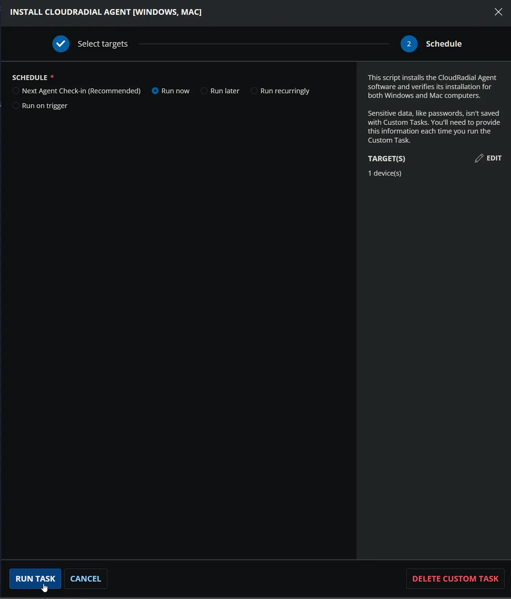
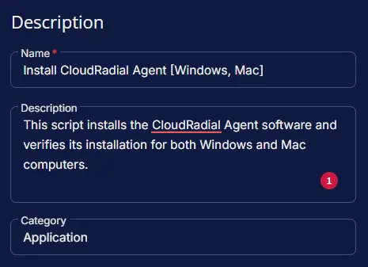
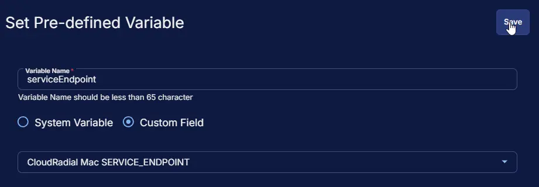
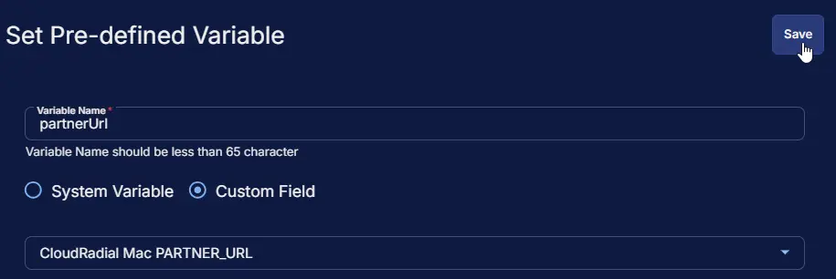
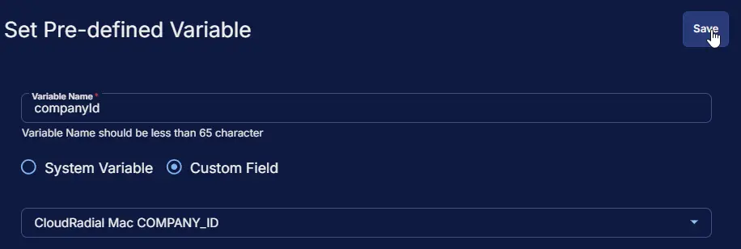
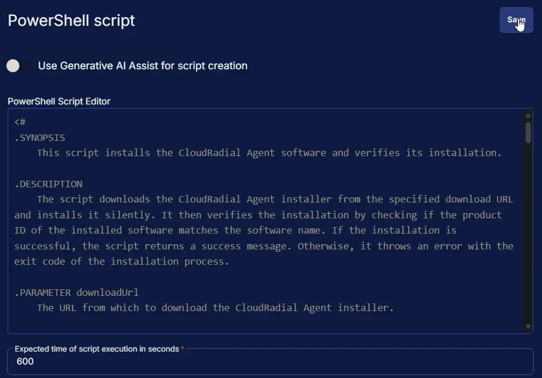
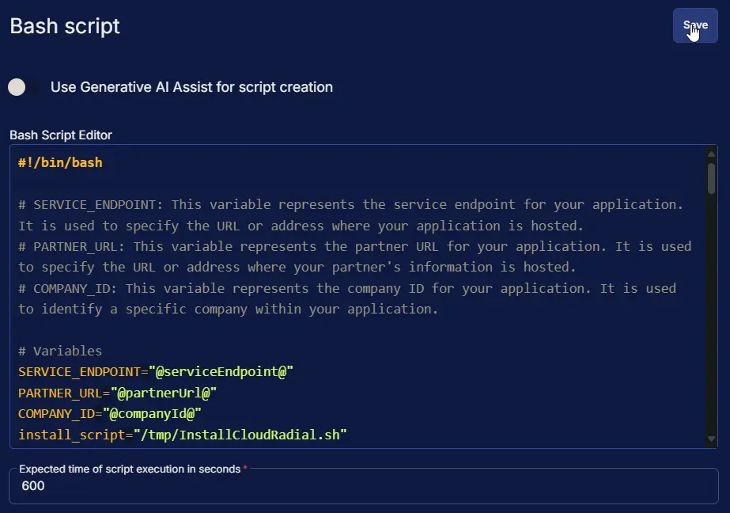
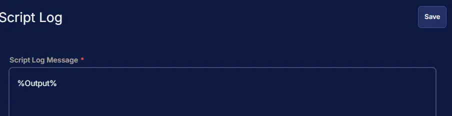
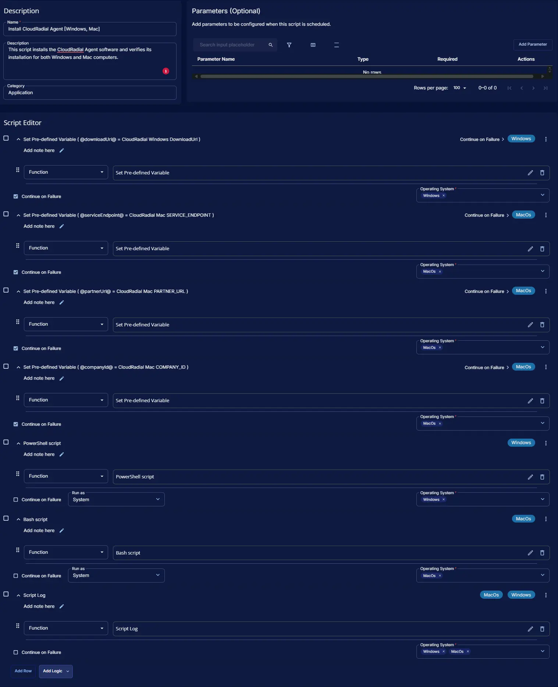

## Summary

This script installs the CloudRadial Agent software and verifies its installation for both Windows and Mac computers.

## Dependencies

- [Custom Field - CloudRadial Windows DownloadUrl](/docs/a254a58c-314c-4fed-964d-d5a64a7a2e61)
- [Custom Field - CloudRadial Mac SERVICE_ENDPOINT](/docs/65ed6aaa-5ab5-4a82-8f15-ef27a609ce68)
- [Custom Field - CloudRadial Mac PARTNER_URL](/docs/227670ae-62cc-48cb-918a-febbf75711d3)
- [Custom Field - CloudRadial Mac COMPANY_ID](/docs/3e4d904f-841c-4888-8b16-b54c4d7cf65c)
- [Solution - CloudRadial Agent Deployment](/docs/9e861bf3-2a05-46ef-9f7f-a46f33b675c5)

## Sample Run



## Custom Fields

| Name                | Level   | Type | Required | Description                                    |
|---------------------|---------|------|----------|------------------------------------------------|
| CloudRadial Windows DownloadUrl | Company | Text | Yes (for Windows) | The URL from which to download the CloudRadial Agent installer for the client's windows machines. |
| CloudRadial Mac SERVICE_ENDPOINT|  Company  | Text | Yes (for Mac) | Represents the service endpoint for your application. It is used to specify the URL or address where your application is hosted. |
| CloudRadial Mac PARTNER_URL |  Company  | Text | Yes (for Mac) | Represents the partner URL for your application. It is used to specify the URL or address where your partner's information is hosted. |
| CloudRadial Mac COMPANY_ID |  Company  | Text | Yes (for Mac) | Represents the company ID for your application. It is used to identify a specific company within your application. |

## Task Setup Path

- **Tasks Path:** `AUTOMATION` ➞ `Tasks`  
- **Task Type:** `Script Editor`  

## Task Creation

### Description

- **Name:** `Install CloudRadial Agent [Windows, Mac]`  
- **Description:** `This script installs the CloudRadial Agent software and verifies its installation for both Windows and Mac computers.`  
- **Category:** `Application`



### Script Editor

#### Row 1: Set Pre-defined Variable ( @downloadUrl@ = CloudRadial Windows DownloadUrl )

- **Variable Name:** `downloadUrl`  
- **Type:** `Custom Field`  
- **Custom Field:** `CloudRadial Windows DownloadUrl`  
- **Continue on Failure:** `True`  
- **Operating System:** `Windows`


#### Row 2: Set Pre-defined Variable ( @serviceEndpoint@ = CloudRadial Mac SERVICE_ENDPOINT )

- **Variable Name:** `serviceEndpoint`  
- **Type:** `Custom Field`  
- **Custom Field:** `CloudRadial Mac SERVICE_ENDPOINT`  
- **Continue on Failure:** `True`  
- **Operating System:** `MacOs`



#### Row 3: Set Pre-defined Variable ( @partnerUrl@ = CloudRadial Mac PARTNER_URL )

- **Variable Name:** `partnerUrl`  
- **Type:** `Custom Field`  
- **Custom Field:** `CloudRadial Mac PARTNER_URL`  
- **Continue on Failure:** `True`  
- **Operating System:** `MacOs`



#### Row 4: Set Pre-defined Variable ( @companyId@ = CloudRadial Mac COMPANY_ID )

- **Variable Name:** `companyId`  
- **Type:** `Custom Field`  
- **Custom Field:** `CloudRadial Mac COMPANY_ID`  
- **Continue on Failure:** `True`  
- **Operating System:** `MacOs`



#### Row 5: PowerShell script

- **Use Generative AI Assist for script creation:** `False`  
- **Expected time of script execution in seconds:** `600`  
- **Continue on Failure:** `False`  
- **Run As:** `System`  
- **Operating System:** `Windows`  
- **PowerShell Script Editor:**  

```PowerShell
<#
.SYNOPSIS
    This script installs the CloudRadial Agent software and verifies its installation.

.DESCRIPTION
    The script downloads the CloudRadial Agent installer from the specified download URL and installs it silently. It then verifies the installation by checking if the product ID of the installed software matches the software name. If the installation is successful, the script returns a success message. Otherwise, it throws an error with the exit code of the installation process.

.PARAMETER downloadUrl
    The URL from which to download the CloudRadial Agent installer.

.OUTPUTS
    If the installation is successful, the script returns a success message.
    If the installation fails, the script throws an error with the exit code of the installation process.

.EXAMPLE
    PS C:\> .\Install-CloudRadial.ps1 -downloadUrl "https://example.com/cloudradial-agent.exe"
    This example installs the CloudRadial Agent software using the specified download URL.
#>

#region Globals
$ProgressPreference = 'SilentlyContinue'
$InformationPreference = 'Continue'
#endRegion

#region CW RMM Variables
$downloadUrl = '@downloadUrl@'
if ($downloadUrl -notmatch '\.exe') {
    throw 'Invalid download URL.'
}
$downloadUrl = $downloadUrl.Trim()
#endRegion

#region Set TLS Policy
$supportedTLSversions = [enum]::GetValues('Net.SecurityProtocolType')
if (($supportedTLSversions -contains 'Tls13') -and ($supportedTLSversions -contains 'Tls12')) {
    [System.Net.ServicePointManager]::SecurityProtocol = [System.Net.ServicePointManager]::SecurityProtocol::Tls13 -bor [System.Net.SecurityProtocolType]::Tls12
} elseif ($supportedTLSversions -contains 'Tls12') {
    [System.Net.ServicePointManager]::SecurityProtocol = [System.Net.SecurityProtocolType]::Tls12
} else {
    Write-Information '[Warn] TLS 1.2 and/or TLS 1.3 are not supported on this system. This download may fail!'
    if ($PSVersionTable.PSVersion.Major -lt 3) {
        Write-Information '[Warn] PowerShell 2 / .NET 2.0 doesn''t support TLS 1.2.'
    }
}
#endRegion

#region Variables
$softwareName = 'CloudRadial Agent'
$workingDirectory = '{0}\_automation\app\{1}' -f $env:ProgramData, $($softwareName -replace '\s', '')
$installerName = $($downloadUrl -split '/' | Select-Object -Last 1)
$installerPath = '{0}\{1}' -f $workingDirectory, $installerName
#endRegion

#region Functions
function Get-ProductId {
    [CmdletBinding()]
    param (
        [Parameter(Mandatory)][String]$SoftwareName
    )
    $uninstallPaths = @(
        'HKLM:\SOFTWARE\Microsoft\Windows\CurrentVersion\Uninstall',
        'HKLM:\SOFTWARE\Wow6432Node\Microsoft\Windows\CurrentVersion\Uninstall'
    )
    $uninstallInfo = Get-ChildItem $uninstallPaths -ErrorAction SilentlyContinue |
        Get-ItemProperty |
        Where-Object { 
            $_.DisplayName -match [Regex]::Escape($SoftwareName)
        }
    if ($uninstallInfo) {
        return $uninstallInfo.PSChildName
    } else {
        return $null
    }
}
#endRegion

#region Working Directory
if (!(Test-Path -Path $workingDirectory)) {
    try {
        New-Item -Path $workingDirectory -ItemType Directory -Force -ErrorAction Stop | Out-Null
    } catch {
        throw ('Failed to Create working directory {0}. Reason: {1}' -f $workingDirectory, $($Error[0].Exception.Message))
    }
}
#endRegion

#region Download Installer
try {
    Invoke-WebRequest -Uri $downloadUrl -OutFile $installerPath -UseBasicParsing -ErrorAction Stop
} catch {
    throw ('Failed to download {0} from {1}. Reason: {2}' -f $installerName, $downloadUrl, $($Error[0].Exception.Message))
}
Unblock-File -Path $installerPath -ErrorAction SilentlyContinue
#endRegion

#region Install
try {
    $procInfo = Start-Process -FilePath $installerPath -ArgumentList '/verysilent' -Wait -PassThru -ErrorAction Stop
} catch {
    throw ('Failed to install {0}. Reason: {1}' -f $softwareName, $($Error[0].Exception.Message))
}
#endRegion

#region Verify
if (Get-ProductId -SoftwareName $softwareName) {
    return ('{0} installation completed successfully.' -f $softwareName)
} else {
    throw ('{0} installation failed with exit code {1}.' -f $softwareName, $procInfo.ExitCode)
}
#endRegion

#region Cleanup
Remove-Item -Path $workingDirectory -Recurse -Force -ErrorAction SilentlyContinue
#endRegion
```



#### Row 6: Bash script

- **Use Generative AI Assist for script creation:** `False`  
- **Expected time of script execution in seconds:** `600`  
- **Continue on Failure:** `False`  
- **Run As:** `System`  
- **Operating System:** `MacOs`  
- **Bash Script Editor:**

```bash
#!/bin/bash

# SERVICE_ENDPOINT: This variable represents the service endpoint for your application. It is used to specify the URL or address where your application is hosted.
# PARTNER_URL: This variable represents the partner URL for your application. It is used to specify the URL or address where your partner's information is hosted.
# COMPANY_ID: This variable represents the company ID for your application. It is used to identify a specific company within your application.

# Variables
SERVICE_ENDPOINT="@serviceEndpoint@"
PARTNER_URL="@partnerUrl@"
COMPANY_ID="@companyId@"
install_script="/tmp/InstallCloudRadial.sh"

# Check CW RMM Variables
if [ -z "$SERVICE_ENDPOINT" ] || [ -z "$PARTNER_URL" ] || [ -z "$COMPANY_ID" ]
then
    echo "Please set the SERVICE_ENDPOINT, PARTNER_URL, and COMPANY_ID environment variables."
    exit 1
fi

# Clean up any old installer scripts.
if [ -f "$install_script" ]
then
    echo "Installer file present in /tmp; deleting."
    rm -f "$install_script"
fi

# Write the Cloud Radial installation script
cat >"$install_script"<<'EOF'
#!/bin/bash

# Variables
SERVICE_ENDPOINT="@serviceEndpoint@"
PARTNER_URL="@partnerUrl@"
COMPANY_ID="@companyId@"

# Check Variables
if [ -z "$SERVICE_ENDPOINT" ]; then
    echo "Please enter a valid service endpoint URL."
    exit 1
fi

if [ -z "$PARTNER_URL" ]; then
    echo "Please enter a valid partner URL."
    exit 1
fi

if [ -z "$COMPANY_ID" ]; then
    echo "Please enter a valid company ID."
    exit 1
fi

echo "CloudRadial Mac Agent Installer"
echo ""
echo "Service Endpoint: $SERVICE_ENDPOINT"
echo "Partner Url: $PARTNER_URL"
echo "Company Id: $COMPANY_ID"
echo "Security Key: "
echo ""

# Stop daemon if already running
launchctl unload /Library/LaunchDaemons/com.cloudradial.mac.agent.plist
plutil -remove KeepAlive /Library/LaunchDaemons/com.cloudradial.mac.agent.plist

# Download current package
if [[ $(uname -p) == 'arm' ]]; then
    curl "https://cloudradialagent.blob.core.windows.net/macagent/cloudradial.mac.agent-arm64.pkg" --output cloudradial.mac.agent-arm64.pkg --silent
    installer -pkg cloudradial.mac.agent-arm64.pkg -target /
else
    curl "https://cloudradialagent.blob.core.windows.net/macagent/cloudradial.mac.agent-x64.pkg" --output cloudradial.mac.agent-x64.pkg --silent
    installer -pkg cloudradial.mac.agent-x64.pkg -target /
fi

# Update plist with correct settings for partner and company
plutil -remove ProgramArguments /Library/LaunchDaemons/com.cloudradial.mac.agent.plist > /dev/null
plutil -insert ProgramArguments -xml "<array><string>/Library/LaunchDaemons/CloudRadial.Mac.Agent/CloudRadial.Mac.Agent</string><string>$SERVICE_ENDPOINT</string><string>$PARTNER_URL</string><string>$COMPANY_ID</string><string></string></array>" /Library/LaunchDaemons/com.cloudradial.mac.agent.plist

# Set to always run
plutil -remove KeepAlive /Library/LaunchDaemons/com.cloudradial.mac.agent.plist
plutil -insert KeepAlive -bool true /Library/LaunchDaemons/com.cloudradial.mac.agent.plist

# Load the daemon
launchctl load /Library/LaunchDaemons/com.cloudradial.mac.agent.plist

# Display daemon status
launchctl list cloudradial.mac.agent
EOF

# Check if the script was created
if [ ! -f "$install_script" ]
then
    echo "Failed to write the installer script."
    exit 1
else
    echo "Created the installer script."
fi

# Execute the installation script
chmod +x "$install_script"
/bin/bash "$install_script"

# Validate the installation
# Check if the launchctl list contains "cloudradial.mac.agent"
if launchctl list | grep -q "cloudradial.mac.agent"
then
    echo "CloudRadial MAC Agent installation completed successfully."
else
    echo "CloudRadial MAC Agent installation failed..."
    exit 1
fi

# Clean up the installer script
rm -f "$install_script"
```



#### Row 7: Script Log

- **Script Log Message:** `%Output%`  
- **Operating System:** `Windows`, `MacOs`



## Completed Script



## Output

- Script Log
