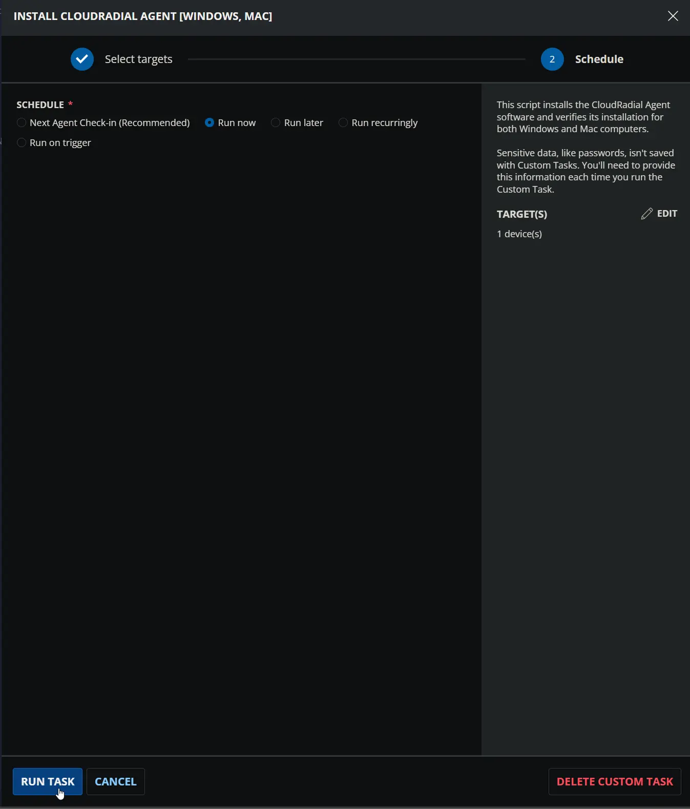
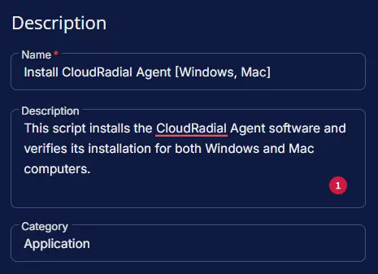
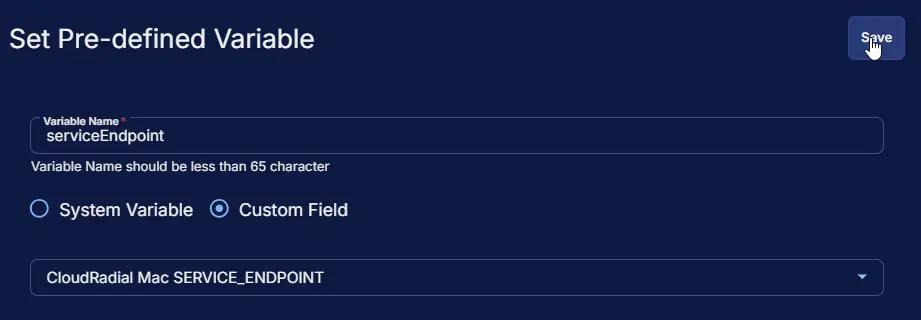
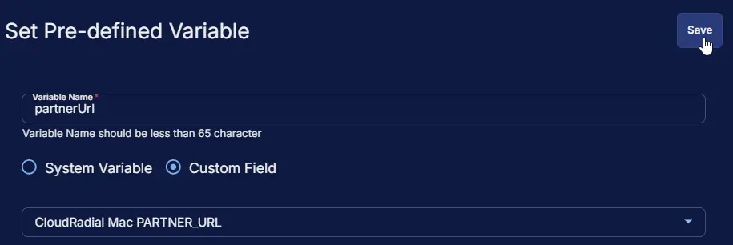
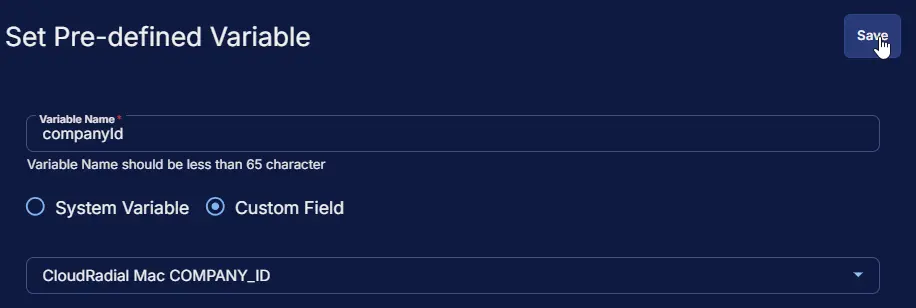
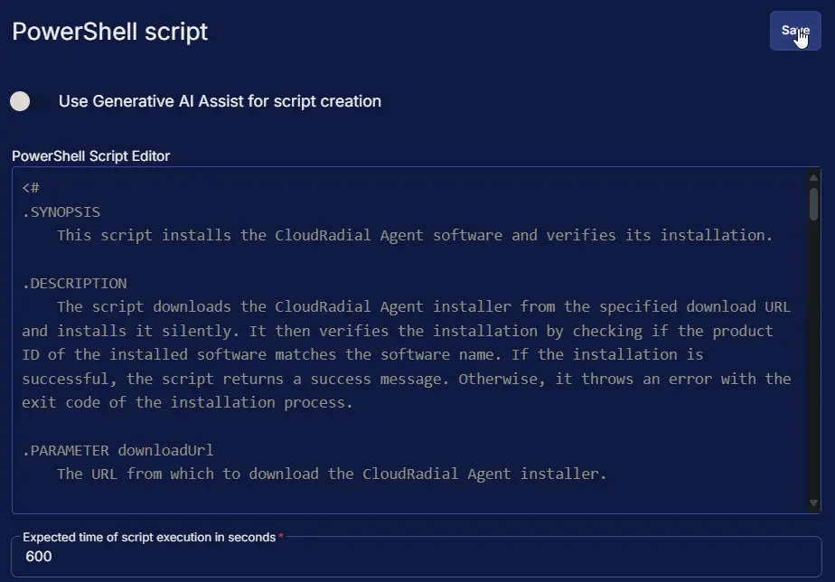
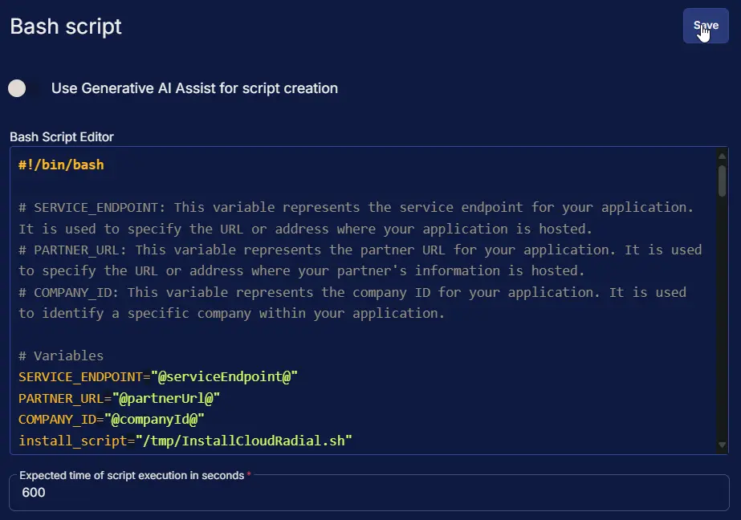
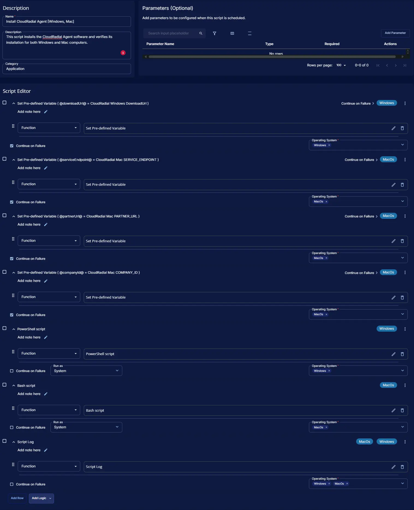

## Summary

This script installs the CloudRadial Agent software and verifies its installation for both Windows and Mac computers.

## Dependencies

- [Custom Field - CloudRadial Windows DownloadUrl](/docs/a254a58c-314c-4fed-964d-d5a64a7a2e61)
- [Custom Field - CloudRadial Mac SERVICE_ENDPOINT](/docs/65ed6aaa-5ab5-4a82-8f15-ef27a609ce68)
- [Custom Field - CloudRadial Mac PARTNER_URL](/docs/227670ae-62cc-48cb-918a-febbf75711d3)
- [Custom Field - CloudRadial Mac COMPANY_ID](/docs/3e4d904f-841c-4888-8b16-b54c4d7cf65c)
- [Solution - CloudRadial Agent Deployment](/docs/9e861bf3-2a05-46ef-9f7f-a46f33b675c5)

## Sample Run

## Custom Fields

| Name                | Level   | Type | Required | Description                                    |
|---------------------|---------|------|----------|------------------------------------------------|
| CloudRadial Windows DownloadUrl | Company | Text | Yes (for Windows) | The URL from which to download the CloudRadial Agent installer for the client's windows machines. |
| CloudRadial Mac SERVICE_ENDPOINT|  Company  | Text | Yes (for Mac) | Represents the service endpoint for your application. It is used to specify the URL or address where your application is hosted. |
| CloudRadial Mac PARTNER_URL |  Company  | Text | Yes (for Mac) | Represents the partner URL for your application. It is used to specify the URL or address where your partner's information is hosted. |
| CloudRadial Mac COMPANY_ID |  Company  | Text | Yes (for Mac) | Represents the company ID for your application. It is used to identify a specific company within your application. |

## Task Setup Path

- **Tasks Path:** `AUTOMATION` ➞ `Tasks`  
- **Task Type:** `Script Editor`  

## Task Creation

### Description

- **Name:** `Install CloudRadial Agent [Windows, Mac]`  
- **Description:** `This script installs the CloudRadial Agent software and verifies its installation for both Windows and Mac computers.`  
- **Category:** `Application`

### Script Editor

#### Row 1: Set Pre-defined Variable ( @downloadUrl@ = CloudRadial Windows DownloadUrl )

- **Variable Name:** `downloadUrl`  
- **Type:** `Custom Field`  
- **Custom Field:** `CloudRadial Windows DownloadUrl`  
- **Continue on Failure:** `True`  
- **Operating System:** `Windows`

#### Row 2: Set Pre-defined Variable ( @serviceEndpoint@ = CloudRadial Mac SERVICE_ENDPOINT )

- **Variable Name:** `serviceEndpoint`  
- **Type:** `Custom Field`  
- **Custom Field:** `CloudRadial Mac SERVICE_ENDPOINT`  
- **Continue on Failure:** `True`  
- **Operating System:** `MacOs`

#### Row 3: Set Pre-defined Variable ( @partnerUrl@ = CloudRadial Mac PARTNER_URL )

- **Variable Name:** `partnerUrl`  
- **Type:** `Custom Field`  
- **Custom Field:** `CloudRadial Mac PARTNER_URL`  
- **Continue on Failure:** `True`  
- **Operating System:** `MacOs`

#### Row 4: Set Pre-defined Variable ( @companyId@ = CloudRadial Mac COMPANY_ID )

- **Variable Name:** `companyId`  
- **Type:** `Custom Field`  
- **Custom Field:** `CloudRadial Mac COMPANY_ID`  
- **Continue on Failure:** `True`  
- **Operating System:** `MacOs`

#### Row 5: PowerShell script

- **Use Generative AI Assist for script creation:** `False`  
- **Expected time of script execution in seconds:** `600`  
- **Continue on Failure:** `False`  
- **Run As:** `System`  
- **Operating System:** `Windows`  
- **PowerShell Script Editor:**  

[PowerShell Script](https://github.com/ProVal-Tech/cw-rmm/blob/main/tasks/install-cloudradial-agent-windows-mac/script.ps1)

#### Row 6: Bash script

- **Use Generative AI Assist for script creation:** `False`  
- **Expected time of script execution in seconds:** `600`  
- **Continue on Failure:** `False`  
- **Run As:** `System`  
- **Operating System:** `MacOs`  
- **Bash Script Editor:**

[Bash Script](https://github.com/ProVal-Tech/cw-rmm/blob/main/tasks/install-cloudradial-agent-windows-mac/script.sh)

#### Row 7: Script Log

- **Script Log Message:** `%Output%`  
- **Operating System:** `Windows`, `MacOs`

## Completed Script

## Output

- Script Log

## Changelog

### 2025-10-08

- Initial version of the document

