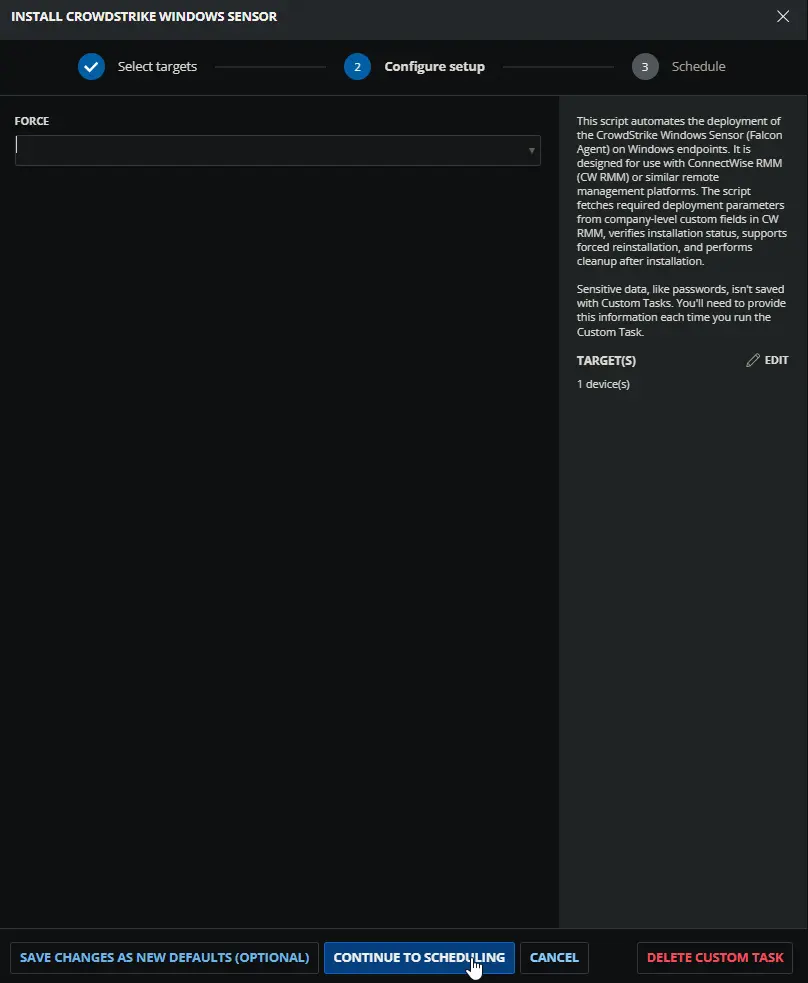
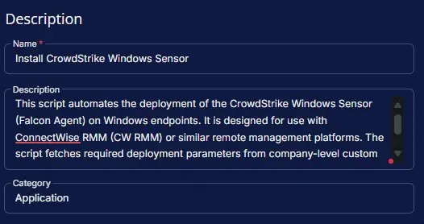
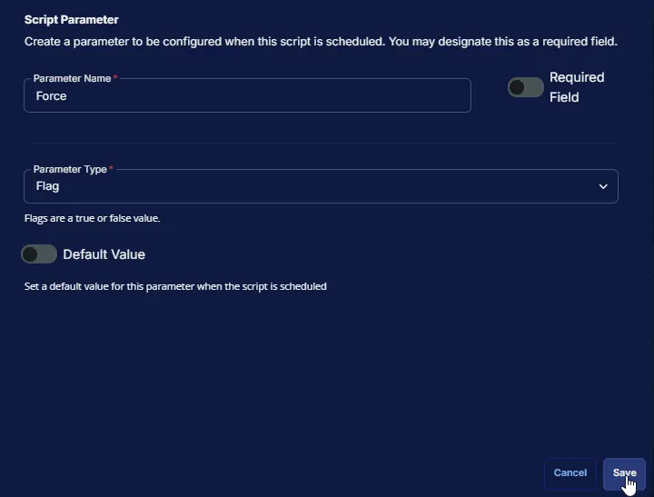
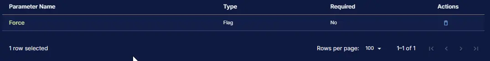
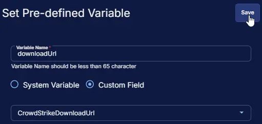
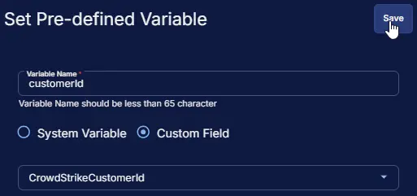
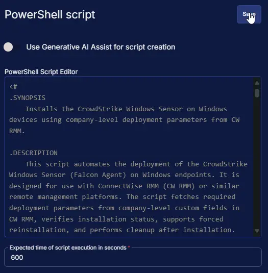
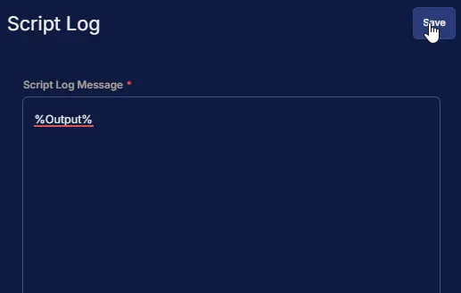
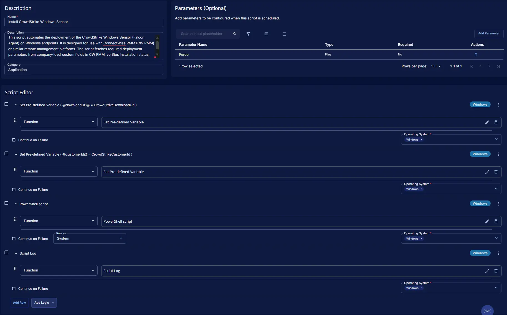

## Summary

This script automates the deployment of the CrowdStrike Windows Sensor (Falcon Agent) on Windows endpoints. It is designed for use with ConnectWise RMM (CW RMM) or similar remote management platforms. The script fetches required deployment parameters from company-level custom fields in CW RMM, verifies installation status, supports forced reinstallation, and performs cleanup after installation.

## Dependencies

- [CrowdStrikeDownloadUrl](/docs/ae84e56d-df98-42da-b293-7412c01d7db7)
- [CrowdStrikeCustomerId](/docs/28f5fdfd-c11e-4643-ae07-62d6f7007805)
- [Solution: Deploy CrowdStrike Windows Sensor](/docs/dec6391a-c159-4b45-8c3a-9df4d88dd1c5)

## Sample Run

## User Parameters

| Name             | Example   | Accepted Values     | Required | Default | Type       | Description                                                                 |
|------------------|-----------|---------------------|----------|---------|------------|-----------------------------------------------------------------------------|
| Force   | `Yes`       | `Yes`, `No`             | `No`       | `No`      | `Flag`       |  If enabled, the script will reinstall the sensor even if it is already present.  If not enabled, the script will skip installation if the sensor is detected. |

## Custom Fields

| Name                | Level   | Type | Required | Description                                    |
|---------------------|---------|------|----------|------------------------------------------------|
| CwordStrikeCustomerId | Company | Text | Yes | Set download Url for downloading the installer for CrowdStrike Windows Sensor. |
| CrowdStrikeDownloadUrl |  Company  | Text | Yes      | Set CrowdStrike Customer ID for the company. |

## Task Setup Path

- **Tasks Path:** `AUTOMATION` ➞ `Tasks`  
- **Task Type:** `Script Editor`  

## Task Creation

### Description

- **Name:** `Install CrowdStrike Windows Sensor`  
- **Description:** `This script automates the deployment of the CrowdStrike Windows Sensor (Falcon Agent) on Windows endpoints. It is designed for use with ConnectWise RMM (CW RMM) or similar remote management platforms. The script fetches required deployment parameters from company-level custom fields in CW RMM, verifies installation status, supports forced reinstallation, and performs cleanup after installation.`  
- **Category:** `Application`

### Parameters

| Parameter Name | Required Field | Parameter Type | Default Value |
| -------------- | -------------- | -------------- | ------------- |
| Force | Disabled | Flag | Disabled |

**Force:**  
    

### Script Editor

#### Row 1: Set Pre-defined Variable ( @downloadUrl@ = CrowdStrikeDownloadUrl )

- **Variable Name:**  `downloadUrl`  
- **Type:**  `Custom Field`  
- **Custom Field:**  `CrowdStrikeDownloadUrl`  
- **Continue on Failure:** `False`  
- **Operating System:** `Windows`

#### Row 2: Set Pre-defined Variable ( @customerId@ = CrowdStrikeCustomerId )

- **Variable Name:**  `customerId`  
- **Type:**  `Custom Field`  
- **Custom Field:**  `CrowdStrikeCustomerId`  
- **Continue on Failure:** `False`  
- **Operating System:** `Windows`

#### Row 3: PowerShell script

- **Use Generative AI Assist for script creation:** `False`  
- **Expected time of script execution in seconds:** `600`  
- **Continue on Failure:** `False`  
- **Run As:** `System`  
- **Operating System:** `Windows`  
- **PowerShell Script Editor:**  

[PowerShell Script](https://github.com/ProVal-Tech/cw-rmm/blob/main/tasks/install-crowdstrike-windows-sensor/script.ps1)

#### Row 4: Script Log

- **Script Log Message:** `%Output%`  
- **Operating System:** `Windows`

## Completed Script

## Output

- Script Log

## Changelog

### 2025-08-29

- Initial version of the document

