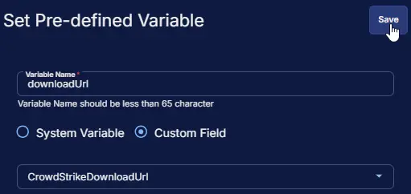
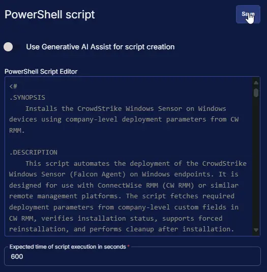

## Summary

This script automates the deployment of the CrowdStrike Windows Sensor (Falcon Agent) on Windows endpoints. It is designed for use with ConnectWise RMM (CW RMM) or similar remote management platforms. The script fetches required deployment parameters from company-level custom fields in CW RMM, verifies installation status, supports forced reinstallation, and performs cleanup after installation.

## Dependencies

- [CrordStrikeDownloadUrl](/docs/ae84e56d-df98-42da-b293-7412c01d7db7)
- [CrowdStrikeCustomerId](/docs/28f5fdfd-c11e-4643-ae07-62d6f7007805)
- [Solution: Deploy CrowdStrike Windows Sensor](/docs/dec6391a-c159-4b45-8c3a-9df4d88dd1c5)

## Sample Run


## User Parameters

| Name             | Example   | Accepted Values     | Required | Default | Type       | Description                                                                 |
|------------------|-----------|---------------------|----------|---------|------------|-----------------------------------------------------------------------------|
| Force   | `Yes`       | `Yes`, `No`             | `No`       | `No`      | `Flag`       |  If enabled, the script will reinstall the sensor even if it is already present.  If not enabled, the script will skip installation if the sensor is detected. |

## Custom Fields

| Name                | Level   | Type | Required | Description                                    |
|---------------------|---------|------|----------|------------------------------------------------|
| CwordStrikeCustomerId | Company | Text | Yes | Set download Url for downloading the installer for CrowdStrike Windows Sensor. |
| CrordStrikeDownloadUrl |  Company  | Text | Yes      | Set CrowdStrike Customer ID for the company. |

## Task Setup Path

- **Tasks Path:** `AUTOMATION` ➞ `Tasks`  
- **Task Type:** `Script Editor`  

## Task Creation

### Description

- **Name:** `Install CrowdStrike Windows Sensor`  
- **Description:** `This script automates the deployment of the CrowdStrike Windows Sensor (Falcon Agent) on Windows endpoints. It is designed for use with ConnectWise RMM (CW RMM) or similar remote management platforms. The script fetches required deployment parameters from company-level custom fields in CW RMM, verifies installation status, supports forced reinstallation, and performs cleanup after installation.`  
- **Category:** `Application`


### Parameters

| Parameter Name | Required Field | Parameter Type | Default Value |
| -------------- | -------------- | -------------- | ------------- |
| Force | Disabled | Flag | Disabled |

**Force:**  
    


### Script Editor

#### Row 1: Set Pre-defined Variable ( @downloadUrl@ = CrowdStrikeDownloadUrl )

- **Variable Name:**  `downloadUrl`  
- **Type:**  `Custom Field`  
- **Custom Field:**  `CrowdStrikeDownloadUrl`  
- **Continue on Failure:** `False`  
- **Operating System:** `Windows`



#### Row 2: Set Pre-defined Variable ( @customerId@ = CrowdStrikeCustomerId )

- **Variable Name:**  `customerId`  
- **Type:**  `Custom Field`  
- **Custom Field:**  `CrowdStrikeCustomerId`  
- **Continue on Failure:** `False`  
- **Operating System:** `Windows`


#### Row 3: PowerShell script

- **Use Generative AI Assist for script creation:** `False`  
- **Expected time of script execution in seconds:** `600`  
- **Continue on Failure:** `False`  
- **Run As:** `System`  
- **Operating System:** `Windows`  
- **PowerShell Script Editor:**  

```PowerShell
<#
.SYNOPSIS
    Installs the CrowdStrike Windows Sensor on Windows devices using company-level deployment parameters from CW RMM.

.DESCRIPTION
    This script automates the deployment of the CrowdStrike Windows Sensor (Falcon Agent) on Windows endpoints. It is designed for use with ConnectWise RMM (CW RMM) or similar remote management platforms. The script fetches required deployment parameters from company-level custom fields in CW RMM, verifies installation status, supports forced reinstallation, and performs cleanup after installation.

    The script performs the following steps:
    - Validates and retrieves the download URL and customer ID from company-level custom fields.
    - Checks if the CrowdStrike Windows Sensor is already installed.
    - Supports forced installation via a runtime variable.
    - Downloads the installer to a secure working directory.
    - Executes the installer silently with the provided customer ID.
    - Verifies successful installation by checking both the uninstall registry and the confirmation directory.
    - Cleans up temporary installer files.

.PARAMETER downloadUrl
    The URL to download the CrowdStrike Windows Sensor installer.
    This value is fetched from the CW RMM company-level custom field named "CrowdStrikeDownloadUrl".
    Must be a valid, absolute URI pointing to the installer executable.

.PARAMETER customerId
    The CrowdStrike Customer ID (CID) used for agent registration.
    This value is fetched from the CW RMM company-level custom field named "CrowdStrikeCustomerId".
    Must be a valid CrowdStrike CID assigned to your organization.

.PARAMETER Force
    A runtime variable in the CW RMM task that controls forced installation.
    If enabled, the script will reinstall the sensor even if it is already present.
    If not enabled, the script will skip installation if the sensor is detected.

.NOTES
    - Requires administrative privileges.
    - Designed for use with CW RMM or similar remote management platforms.
    - All deployment parameters must be provided via company-level custom fields in CW RMM.
    - The script checks both the uninstall registry and the confirmation directory to verify installation.

.EXAMPLE
    .\Install-CrowdStrikeWindowsSensor.ps1
    Installs the CrowdStrike Windows Sensor using the download URL and customer ID from company-level custom fields.

.EXAMPLE
    .\Install-CrowdStrikeWindowsSensor.ps1 -Force 'Yes'
    Forces reinstallation of the CrowdStrike Windows Sensor, even if it is already installed.

#>

#region Globals
$ErrorActionPreference = 'Stop'
$ProgressPreference = 'SilentlyContinue'
[Net.ServicePointManager]::SecurityProtocol = [Enum]::ToObject([Net.SecurityProtocolType], 3072)
#endRegion

#region Variables
$softwareName = 'CrowdStrike Windows Sensor'
$appName = 'WindowsSensor'
$workingDirectory = '{0}\_Automation\Script\{1}' -f $env:ProgramData, $appName
$appPath = '{0}\{1}.exe' -f $workingDirectory, $appName
$confirmationDirectory = 'C:\Windows\System32\drivers\CrowdStrike'
#endRegion

#region Function
function Test-CrowdStrikeInstall {
    [CmdletBinding()]
    [OutputType([bool])]
    param (
        [Parameter(Mandatory = $true)]
        [String]$SoftwareName,
        [Parameter(Mandatory = $true)]
        [Uri]$confirmationDirectory
    )

    $uninstallPaths = @(
        'HKLM:\SOFTWARE\Microsoft\Windows\CurrentVersion\Uninstall',
        'HKLM:\SOFTWARE\Wow6432Node\Microsoft\Windows\CurrentVersion\Uninstall'
    )
    $uninstallInfo = Get-ChildItem $uninstallPaths -ErrorAction SilentlyContinue |
        Get-ItemProperty |
        Where-Object {
            $_.DisplayName -match [Regex]::Escape($SoftwareName)
        }
    if ($uninstallInfo) {
        if (Test-Path -Path $confirmationDirectory) {
            return $true
        } else {
            return $false
        }
    } else {
        return $false
    }
}
#endRegion

#region CW RMM Variables
$downloadUrl = '@downloadUrl@'
$customerId = '@customerId@'
$force = '@Force@'
#endRegion

#region Set Script Variables
if ([String]::IsNullOrEmpty($downloadUrl) -or $downloadUrl -match 'downloadUrl@$' -or $downloadUrl -eq 'NA') {
    throw 'Invalid download Url. Set an appropriate download url in company-level custom field ''CrowdStrike Download URL'''
} elseif (![System.Uri]$downloadUrl.IsAbsoluteUri) {
    throw 'Invalid download Url. Set an appropriate download url in company-level custom field ''CrowdStrike Download URL'''
}

if ([String]::IsNullOrEmpty($customerId) -or $customerId -match 'customerId@$' -or $customerId -eq 'NA') {
    throw 'Invalid customer Id. Set an appropriate customer id in company-level custom field ''CrowdStrike Customer ID'''
}

if ($force -match '1|Yes|True') {
    $force = $true
} else {
    $force = $false
}
#endRegion

#region Install Check
if (-not (Test-CrowdStrikeInstall -SoftwareName $softwareName -confirmationDirectory $confirmationDirectory)) {
    Write-Information ('{0} is not installed. Proceeding with installation.' -f $softwareName) -InformationAction Continue
} elseif ($force) {
    Write-Information ('{0} is already installed and force parameter is enabled. Proceeding with installation.' -f $softwareName) -InformationAction Continue
} else {
    return ('{0} is already installed and force parameter is not enabled. Skipping installation.' -f $softwareName)
}
#endregion

#region Working Directory
if ( !(Test-Path -Path $workingDirectory) ) {
    try {
        New-Item -Path $workingDirectory -ItemType Directory -Force -ErrorAction Stop | Out-Null
    } catch {
        throw ('Failed to Create {0}. Reason: {1}' -f $workingDirectory, $($Error[0].Exception.Message))
    }
}
#endRegion

#region Download
try {
    Invoke-WebRequest -Uri $downloadURL -OutFile $appPath -UseBasicParsing -ErrorAction Stop
} catch {
    throw ('Failed to download {0}. Reason: {1}' -f $softwareName, $($Error[0].Exception.Message))
}
#endRegion

#region Install CrowdStrike Windows Sensor
$arguments = @(
    '/install',
    '/quiet',
    ('CID={0}' -f $customerId),
    'ProvNoWait=1'
)
try {
    $procInfo = Start-Process -FilePath $appPath -ArgumentList $arguments -Wait -PassThru
} catch {
    throw ('Failed to install {0}. Reason: {1}' -f $softwareName, $($Error[0].Exception.Message))
}
#endRegion

#region Install Verification
if (Test-CrowdStrikeInstall -SoftwareName $softwareName -confirmationDirectory $confirmationDirectory) {
    return ('{0} installation completed successfully.' -f $softwareName)
} else {
    throw ('{0} installation failed with exit code {1}.' -f $softwareName, $procInfo.ExitCode)
}
#endregion

#region Cleanup
Remove-Item -Path $appPath -Force -ErrorAction SilentlyContinue
#endregion
```



#### Row 4: Script Log

- **Script Log Message:** `%Output%`  
- **Operating System:** `Windows`


## Completed Script


## Output

- Script Log
