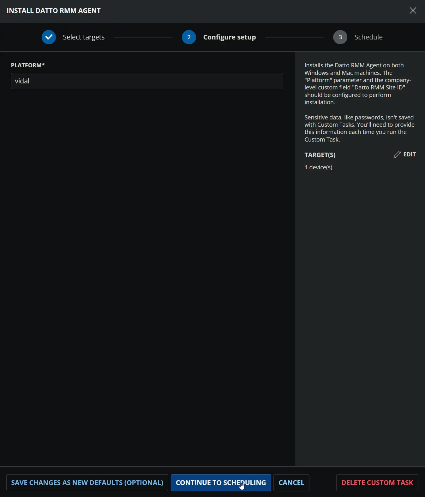
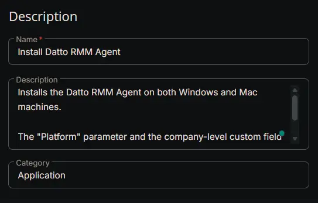
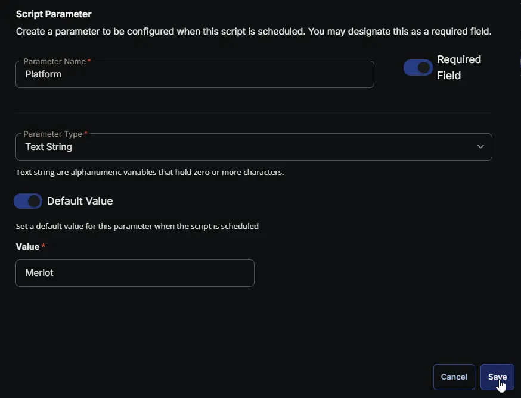
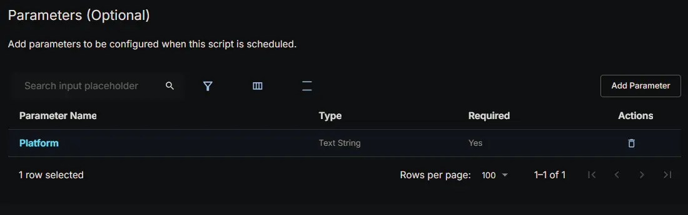
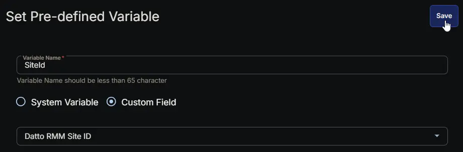
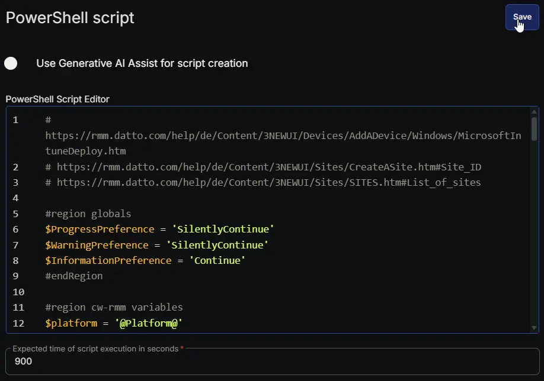
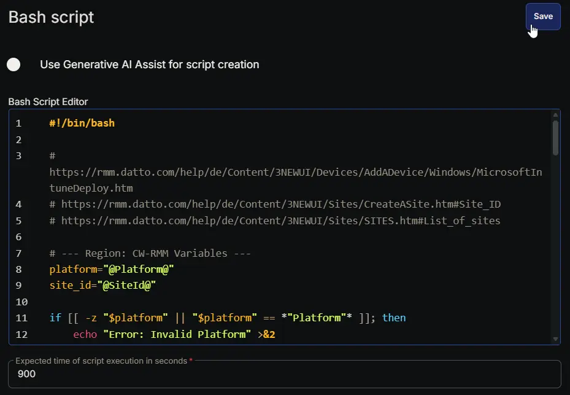
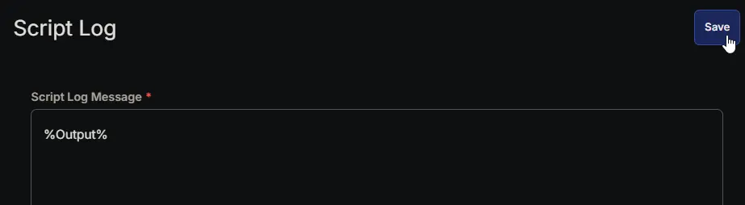
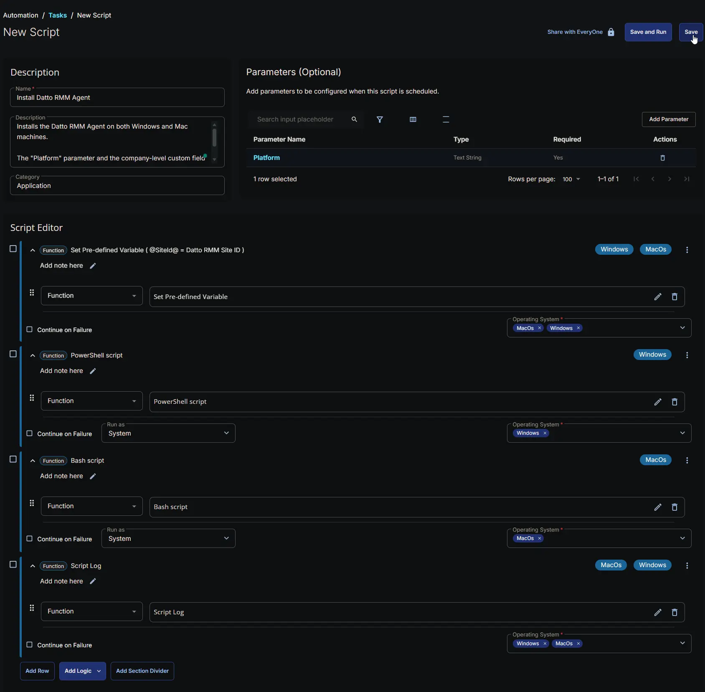

## Summary

Installs the Datto RMM Agent on both Windows and Mac machines.

The `Platform` parameter and the company-level custom field [Datto RMM Site ID](/docs/b5af697b-7eeb-4395-8962-44b76645fdc5) should be configured to perform installation.

## Sample Run



## Dependencies

- [Custom Field: Datto RMM Site ID](/docs/b5af697b-7eeb-4395-8962-44b76645fdc5)
- [Solution : Deploy Datto RMM Agent](/docs/b646e989-5515-4bda-9728-107ac03cdc07)

## User Parameters

| Name             | Example   | Accepted Values     | Required | Default | Type       | Description                                                                 |
|------------------|-----------|---------------------|----------|---------|------------|-----------------------------------------------------------------------------|
| Platform         | merlot      |  <ul><li>Pinotage</li><li>Merlot</li><li>Concord</li><li>Vidal</li><li>Zinfandel</li><li>Syrah</li></ul>              | Yes      | It is recommended to set the platform name of your Datto RMM account.  | Flag       |  Platform name of your Datto RMM Account.<br />The platform name is at the start of the URL; it will be `Pinotage` or `Merlot` (EMEA), `Concord`, `Vidal`, or `Zinfandel` (NA), or `Syrah` (APAC).<br /><br />                    |

## Custom Fields

| Name                | Example                                   | Level   | Type | Required | Description                                    |
|---------------------|-------------------------------------------|---------|------|----------|------------------------------------------------|
| [Datto RMM Site ID](/docs/b5af697b-7eeb-4395-8962-44b76645fdc5) | `6ef3f5aa-81b7-400c-a667-02075f98ba15` | Company | Text | Yes | The Site ID of the target site in the Datto RMM portal that the agent will check into after installation. |

## Task Setup Path

- **Tasks Path:** `AUTOMATION` ➞ `Tasks`  
- **Task Type:** `Script Editor`  

## Task Creation

### Description

- **Name:** `Install Datto RMM Agent`  
- **Description:**  

```PlainText
Installs the Datto RMM Agent on both Windows and Mac machines. 

The "Platform" parameter and the company-level custom field "Datto RMM Site ID" should be configured to perform installation.
```

- **Category:** `Application`



### Parameters

#### **Platform**

| Parameter Name | Required Field | Parameter Type | Default Value | Value |
| -------------- | -------------- | -------------- | ------------- | ----- |
| Platform | Enabled | Text String | Enabled | It is recommended to set the platform name of your Datto RMM account. |



> *The default value shown in the screenshot above is for demonstration purposes only. It is recommended to use the platform name of your Datto RMM account as the default value, which may differ from the example shown.*



### Script Editor

#### Row 1: Set Pre-defined Variable ( @ImmyBotTenant@ = ImmyBot Tenant )

- **Variable Name:** `SiteId`  
- **Type:** `Custom Field`  
- **Custom Field:** `Datto RMM Site ID`  
- **Continue on Failure:** `False`  
- **Operating System:** `MacOs`, `Windows`



#### Row 2: PowerShell script

- **Use Generative AI Assist for script creation:** `False`  
- **Expected time of script execution in seconds:** `900`  
- **Continue on Failure:** `False`  
- **Run As:** `System`  
- **Operating System:** `Windows`  
- **PowerShell Script Editor:**

```PowerShell
# https://rmm.datto.com/help/de/Content/3NEWUI/Devices/AddADevice/Windows/MicrosoftIntuneDeploy.htm
# https://rmm.datto.com/help/de/Content/3NEWUI/Sites/CreateASite.htm#Site_ID
# https://rmm.datto.com/help/de/Content/3NEWUI/Sites/SITES.htm#List_of_sites

#region globals
$ProgressPreference = 'SilentlyContinue'
$WarningPreference = 'SilentlyContinue'
$InformationPreference = 'Continue'
#endRegion

#region cw-rmm variables
$platform = '@Platform@'
$siteId = '@SiteId@'

if ([string]::IsNullOrEmpty($platform) -or $platform -match 'Platform') {
    throw 'Invalid Platform'
}

if ([string]::IsNullOrEmpty($siteId) -or $siteId -match 'SiteId') {
    throw 'Invalid SiteId'
}
#endRegion

#region variables
$appName = 'DRMMSetup'
$appName = 'windows-upgrader'
$workingDirectory = '{0}\_Automation\App\{1}' -f $env:ProgramData, $appName
$appPath = '{0}\{1}.exe' -f $workingDirectory, $appName
$downloadUrl = 'https://{0}.rmm.datto.com/download-agent/windows/{1}' -f $platform, $siteId
$serviceName = 'CagService'
#endRegion

#region already installed check
if (Get-Service -Name $serviceName -ErrorAction SilentlyContinue) {
    return 'Datto RMM Agent already installed on this device'
}
#endRegion

#region working Directory
if (-not (Test-Path -Path $workingDirectory)) {
    try {
        New-Item -Path $workingDirectory -ItemType Directory -Force -ErrorAction Stop | Out-Null
    } catch {
        throw ('Failed to create working directory {0}. Reason: {1}' -f $workingDirectory, $Error[0].Exception.Message)
    }
}

$acl = Get-Acl -Path $workingDirectory
$hasFullControl = $acl.Access | Where-Object {
    $_.IdentityReference -match 'Everyone' -and $_.FileSystemRights -match 'FullControl'
}
if (-not $hasFullControl) {
    $accessRule = New-Object -TypeName System.Security.AccessControl.FileSystemAccessRule(
        'Everyone', 'FullControl', 'ContainerInherit, ObjectInherit', 'None', 'Allow'
    )
    $acl.AddAccessRule($accessRule)
    Set-Acl -Path $workingDirectory -AclObject $acl -ErrorAction SilentlyContinue
}
#endRegion

#region set tls policy
$supportedTLSversions = [enum]::GetValues('Net.SecurityProtocolType')
if (($supportedTLSversions -contains 'Tls13') -and ($supportedTLSversions -contains 'Tls12')) {
    [System.Net.ServicePointManager]::SecurityProtocol = [System.Net.ServicePointManager]::SecurityProtocol::Tls13 -bor [System.Net.SecurityProtocolType]::Tls12
} elseif ($supportedTLSversions -contains 'Tls12') {
    [System.Net.ServicePointManager]::SecurityProtocol = [System.Net.SecurityProtocolType]::Tls12
} else {
    Write-Information -MessageData 'TLS 1.2 and/or TLS 1.3 are not supported on this system. This download may fail!' -InformationAction Continue
    if ($PSVersionTable.PSVersion.Major -lt 3) {
        Write-Information -MessageData 'PowerShell 2 / .NET 2.0 doesn''t support TLS 1.2.' -InformationAction Continue
    }
}
#endRegion

#region download installer
try {
    Invoke-WebRequest -Uri $downloadUrl -OutFile $appPath -UseBasicParsing -ErrorAction Stop
} catch {
    if (-not (Test-Path -Path $appPath)) {
        throw ('Failed to download the agent installer from ''{0}'', and no local copy of the installer exists on the machine. Reason: {1}' -f $downloadUrl, $Error[0].Exception.Message)
    }
}
Unblock-File -Path $appPath -ErrorAction SilentlyContinue
#endRegion

#region install agent
try {
    $procInfo = Start-Process -FilePath $appPath -Wait -NoNewWindow -PassThru -ErrorAction Stop
} catch {
    throw ('Failed to initiate the installer. Reason: {0}' -f $Error[0].Exception.Message)
}
#endRegion

#region validation
if (Get-Service -Name $serviceName -ErrorAction SilentlyContinue) {
    Write-Information -MessageData 'Agent installation completed successfully.'
} else {
    throw ('Agent installation failure. Installation process exit code: {0}' -f $procInfo.ExitCode)
}
#endRegion

#region cleanup
Remove-Item -Path $appPath -Force -ErrorAction SilentlyContinue
#endRegion
```



#### Row 3: Bash script

- **Use Generative AI Assist for script creation:** `False`  
- **Expected time of script execution in seconds:** `900`  
- **Continue on Failure:** `False`  
- **Run As:** `System`  
- **Operating System:** `MacOs`  
- **Bash Script Editor:**

```Bash
#!/bin/bash

# https://rmm.datto.com/help/de/Content/3NEWUI/Devices/AddADevice/Windows/MicrosoftIntuneDeploy.htm
# https://rmm.datto.com/help/de/Content/3NEWUI/Sites/CreateASite.htm#Site_ID
# https://rmm.datto.com/help/de/Content/3NEWUI/Sites/SITES.htm#List_of_sites

# --- Region: CW-RMM Variables ---
platform="@Platform@"
site_id="@SiteId@"

if [[ -z "$platform" || "$platform" == *"Platform"* ]]; then
    echo "Error: Invalid Platform" >&2
    exit 1
fi

if [[ -z "$site_id" || "$site_id" == *"SiteId"* ]]; then
    echo "Error: Invalid SiteId" >&2
    exit 1
fi
# --- End Region ---

# --- Region: Variables ---
app_name="DRMMSetup"
working_dir="/tmp/_Automation/App/$app_name"
app_zip="$working_dir/${app_name}.zip"
extract_dir="$working_dir/extracted"
download_url="https://${platform}.rmm.datto.com/download-agent/mac/${site_id}"
app_path="/Applications/AEM Agent.app" 
pkg_path="$extract_dir/AgentSetup/CAG.pkg"
# --- End Region ---

# --- Region: Already Installed Check ---
if [[ -d "$app_path" ]]; then
    echo "Datto RMM Agent already installed on this device"
    exit 0
fi
# --- End Region ---

# --- Region: Working Directory ---
if [[ ! -d "$working_dir" ]]; then
    if ! mkdir -p "$working_dir" 2>/dev/null; then
        echo "Error: Failed to create working directory ${working_dir}." >&2
        exit 1
    fi
fi
# --- End Region ---

# --- Region: Download Installer ---
if ! curl -s -f -L $curl_opts -o "$app_zip" "$download_url"; then
    if [[ ! -f "$app_zip" ]]; then
        echo "Error: Failed to download the agent installer from '${download_url}', and no local copy exists." >&2
        exit 1
    fi
fi
# --- End Region ---

# --- Region: Install Agent ---
mkdir -p "$extract_dir"

# Unzip the payload silently (-q)
if ! unzip -q -o "$app_zip" -d "$extract_dir"; then
    echo "Error: Failed to extract the downloaded archive." >&2
    exit 1
fi

# Execute the macOS .pkg installer silently
if ! installer -pkg "$pkg_path" -target / >/dev/null 2>&1; then
    echo "Error: Failed to initiate the installer." >&2
    exit 1
fi
# --- End Region ---

# --- Region: Validation ---
if [[ -d "$app_path" ]]; then
    echo "Agent installation completed successfully."
else
    echo "Error: Agent installation failure." >&2
    exit 1
fi
# --- End Region ---

# --- Region: Cleanup ---
rm -rf "$working_dir" 2>/dev/null
# --- End Region ---
```



#### Row 4: Script Log

- **Script Log Message:** `%Output%`  
- **Continue on Failure:** `False`  
- **Operating System:** `MacOs`, `Windows`



## Completed Script



## Output

- Script Log

## Changelog

### 2026-02-28

- Initial version of the document
