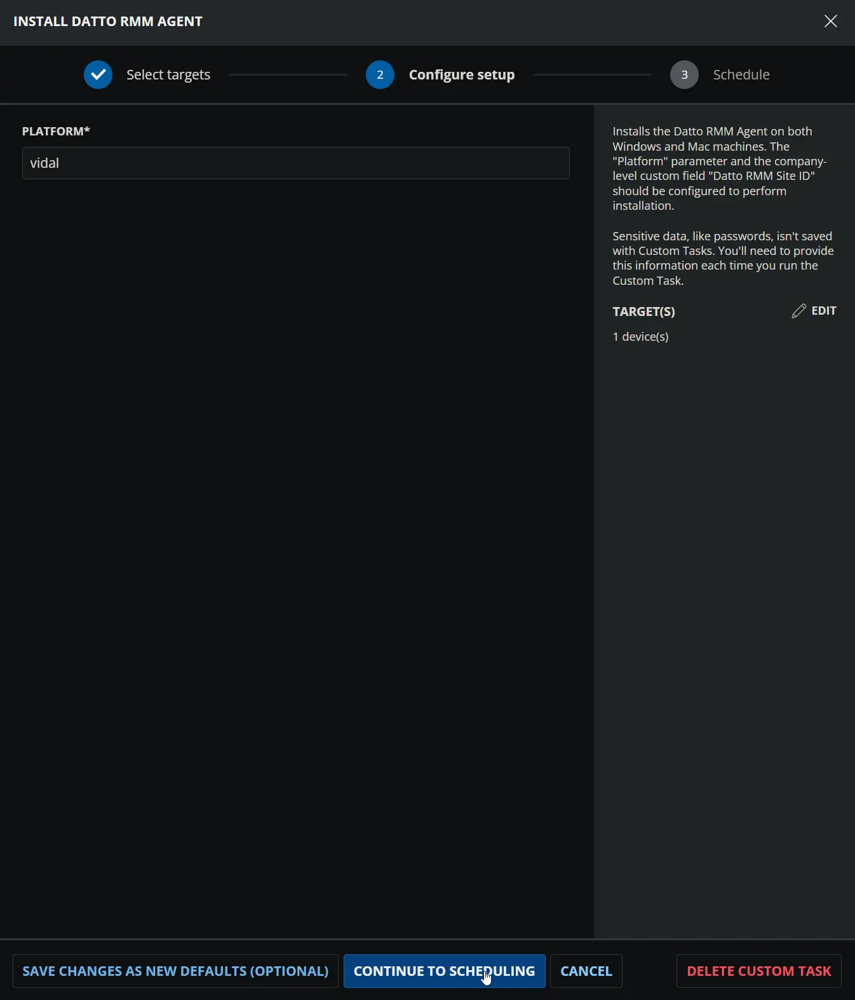
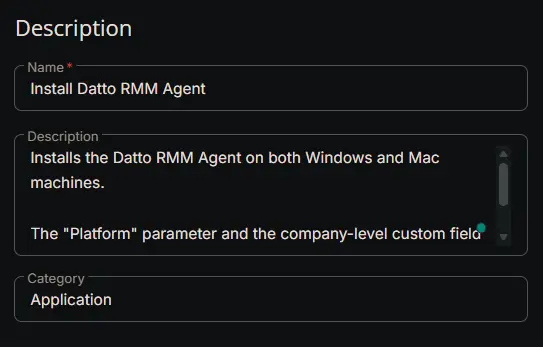
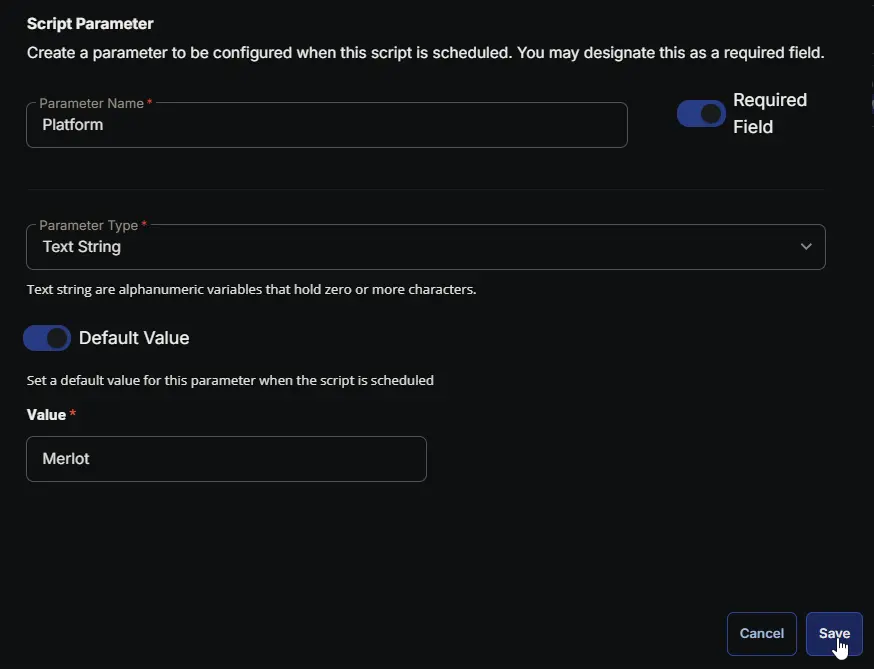
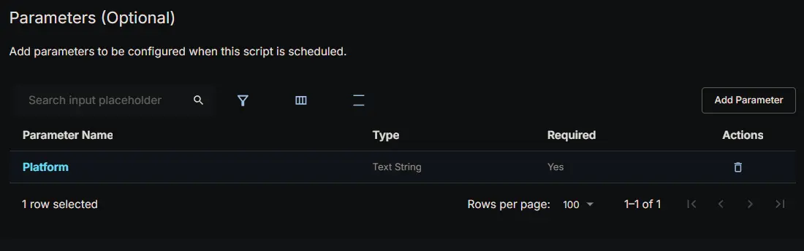
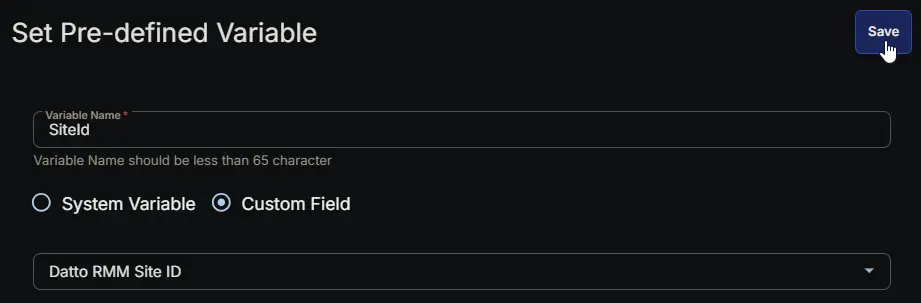
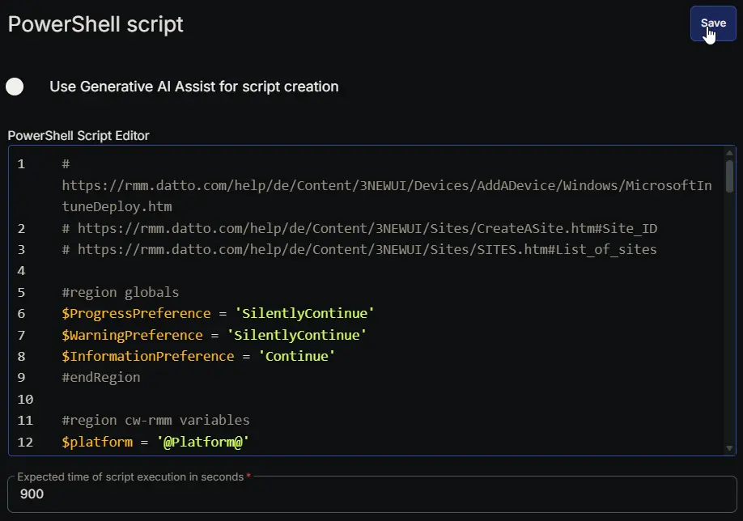
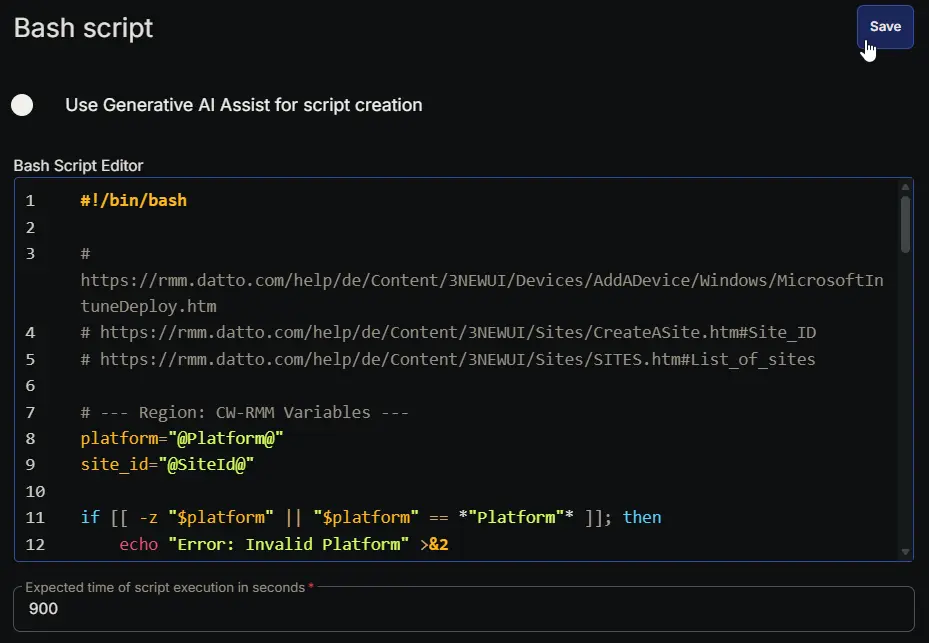
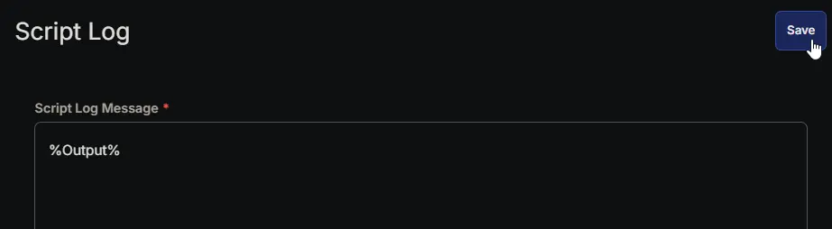
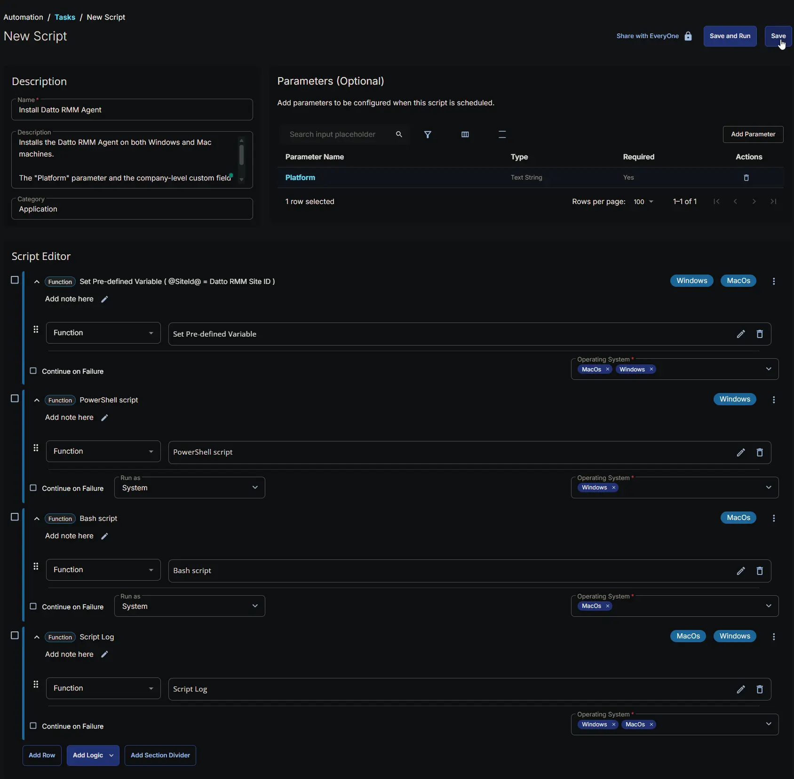

---
id: '7920577d-9a4a-48d0-9102-b01c27c2e00f'
slug: /7920577d-9a4a-48d0-9102-b01c27c2e00f
title: 'Install Datto RMM Agent'
title_meta: 'Install Datto RMM Agent'
keywords: ['datto-rmm', 'migration', 'datto']
description: 'Installs the Datto RMM Agent on both Windows and Mac machines.'
tags: ['application', 'installation']
draft: false
unlisted: false
last_update:
  date: 2026-02-28
---

## Summary

Installs the Datto RMM Agent on both Windows and Mac machines.

The `Platform` parameter and the company-level custom field [Datto RMM Site ID](/docs/b5af697b-7eeb-4395-8962-44b76645fdc5) should be configured to perform installation.

## Sample Run



## Dependencies

- [Custom Field: Datto RMM Site ID](/docs/b5af697b-7eeb-4395-8962-44b76645fdc5)
- [Solution : Deploy Datto RMM Agent](/docs/b646e989-5515-4bda-9728-107ac03cdc07)

## User Parameters

| Name             | Example   | Accepted Values     | Required | Default | Type       | Description                                                                 |
|------------------|-----------|---------------------|----------|---------|------------|-----------------------------------------------------------------------------|
| Platform         | merlot      |  <ul><li>Pinotage</li><li>Merlot</li><li>Concord</li><li>Vidal</li><li>Zinfandel</li><li>Syrah</li></ul>              | Yes      | It is recommended to set the platform name of your Datto RMM account.  | Flag       |  Platform name of your Datto RMM Account.<br />The platform name is at the start of the URL; it will be `Pinotage` or `Merlot` (EMEA), `Concord`, `Vidal`, or `Zinfandel` (NA), or `Syrah` (APAC).<br /><br />                    |

## Custom Fields

| Name                | Example                                   | Level   | Type | Required | Description                                    |
|---------------------|-------------------------------------------|---------|------|----------|------------------------------------------------|
| [Datto RMM Site ID](/docs/b5af697b-7eeb-4395-8962-44b76645fdc5) | `6ef3f5aa-81b7-400c-a667-02075f98ba15` | Company | Text | Yes | The Site ID of the target site in the Datto RMM portal that the agent will check into after installation. |

## Task Setup Path

- **Tasks Path:** `AUTOMATION` ➞ `Tasks`  
- **Task Type:** `Script Editor`  

## Task Creation

### Description

- **Name:** `Install Datto RMM Agent`  
- **Description:**  

```PlainText
Installs the Datto RMM Agent on both Windows and Mac machines. 

The "Platform" parameter and the company-level custom field "Datto RMM Site ID" should be configured to perform installation.
```

- **Category:** `Application`



### Parameters

#### **Platform**

| Parameter Name | Required Field | Parameter Type | Default Value | Value |
| -------------- | -------------- | -------------- | ------------- | ----- |
| Platform | Enabled | Text String | Enabled | It is recommended to set the platform name of your Datto RMM account. |



> *The default value shown in the screenshot above is for demonstration purposes only. It is recommended to use the platform name of your Datto RMM account as the default value, which may differ from the example shown.*



### Script Editor

#### Row 1: Set Pre-defined Variable ( @ImmyBotTenant@ = ImmyBot Tenant )

- **Variable Name:** `SiteId`  
- **Type:** `Custom Field`  
- **Custom Field:** `Datto RMM Site ID`  
- **Continue on Failure:** `False`  
- **Operating System:** `MacOs`, `Windows`



#### Row 2: PowerShell script

- **Use Generative AI Assist for script creation:** `False`  
- **Expected time of script execution in seconds:** `900`  
- **Continue on Failure:** `False`  
- **Run As:** `System`  
- **Operating System:** `Windows`  
- **PowerShell Script Editor:**

[PowerShell Script](https://github.com/ProVal-Tech/cw-rmm/blob/main/tasks/install-datto-rmm-agent/script.ps1)




#### Row 3: Bash script

- **Use Generative AI Assist for script creation:** `False`  
- **Expected time of script execution in seconds:** `900`  
- **Continue on Failure:** `False`  
- **Run As:** `System`  
- **Operating System:** `MacOs`  
- **Bash Script Editor:**

[Bash Script](https://github.com/ProVal-Tech/cw-rmm/blob/main/tasks/install-datto-rmm-agent/script.sh)




#### Row 4: Script Log

- **Script Log Message:** `%Output%`  
- **Continue on Failure:** `False`  
- **Operating System:** `MacOs`, `Windows`



## Completed Script



## Output

- Script Log

## Changelog

### 2026-02-28

- Initial version of the document

