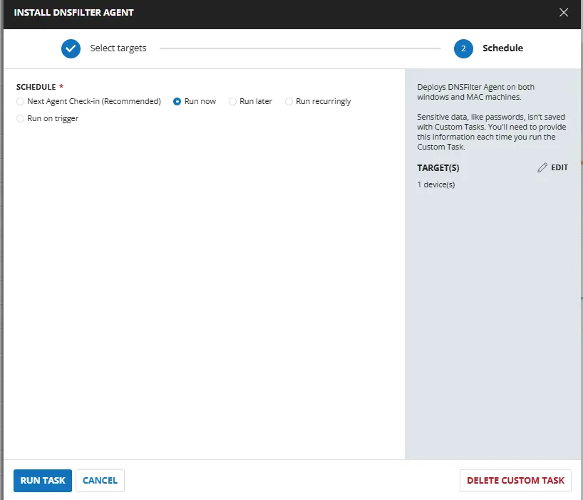
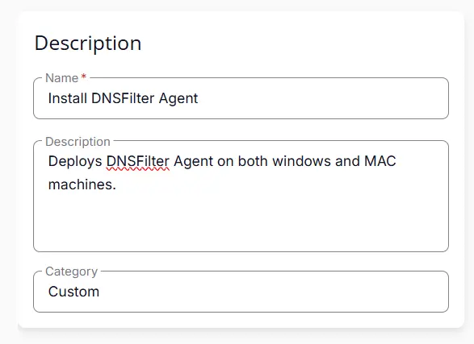
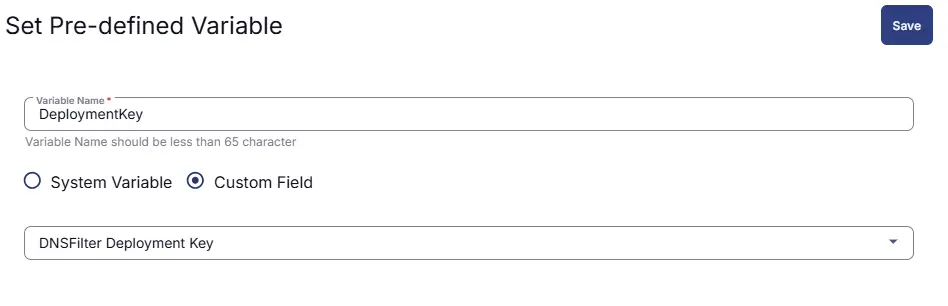
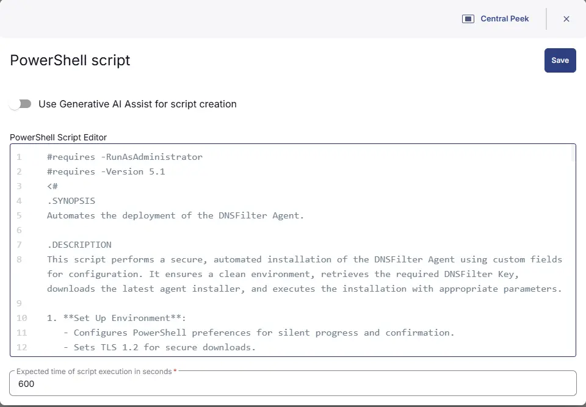
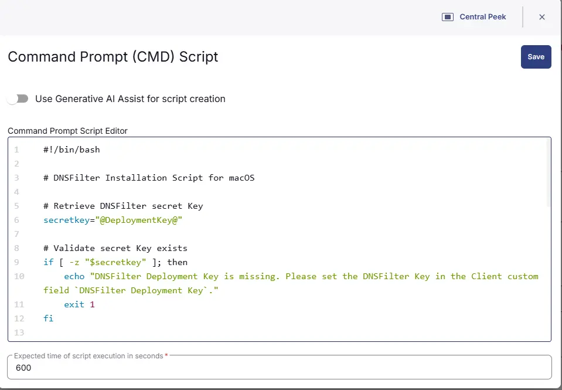
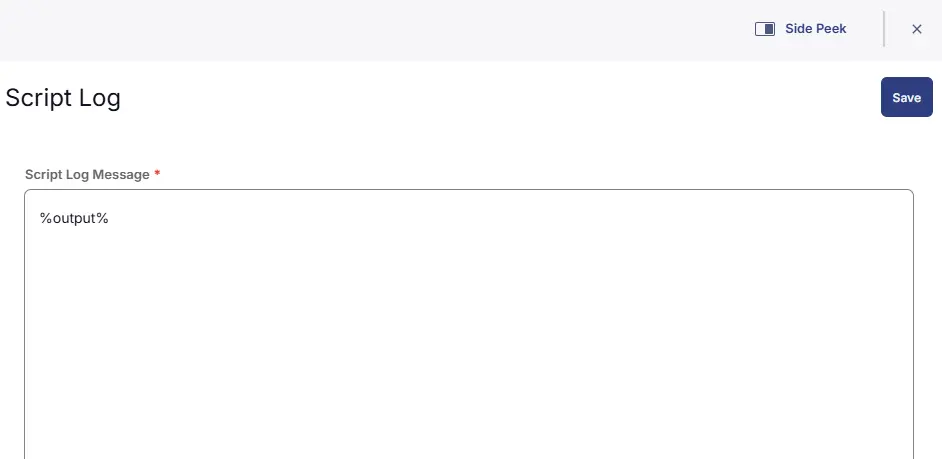
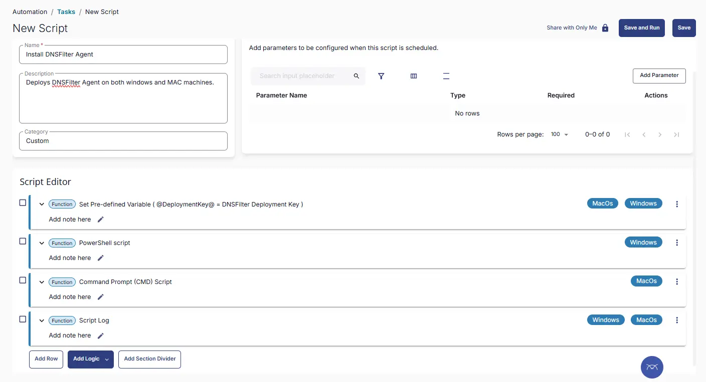
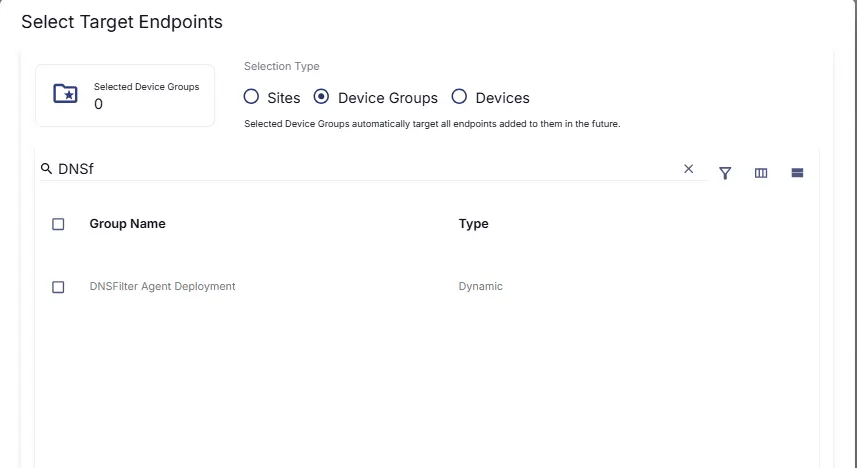
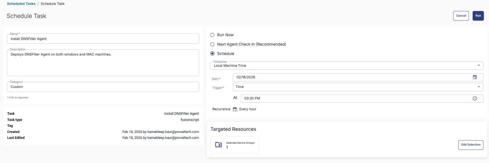

## Summary
Deploys DNSFilter Agent on both windows and MAC machines.

## Sample Run


## Dependencies

- [Custom Field - DNSFilter Deployment Key](/docs/b4038e72-ef58-4e35-8b7b-cfe0e2536c87)
- [Solution - DNS Filter Agent Deployment](/docs/fd6fcda6-9a87-4275-b6eb-1a8f8f63099d)

## Task Creation

### Script Details

#### Step 1

Navigate to `Automation` ➞ `Tasks`  


#### Step 2

Create a new `Script Editor` style task by choosing the `Script Editor` option from the `Add` dropdown menu  


The `New Script` page will appear on clicking the `Script Editor` button:  


#### Step 3

Fill in the following details in the `Description` section:  

- **Name:** `Install DNSFilter Agent`  
- **Description:** `Deploys DNSFilter Agent on both windows and MAC machines.`  
- **Category:** `Custom`



### Script Editor

Click the `Add Row` button in the `Script Editor` section to start creating the script  


A blank function will appear:  


#### Row 1: Set Pre-defined Variable ( @DeploymentKey@ = DNSFilter Deployment Key )

- **Variable Name:** `DeploymentKey`  
- **Type:** `Custom Field`  
- **Custom Field:** `DNSFilter Deployment Key`  
- **Continue on Failure:** `True`  
- **Operating System:** `Windows,MacOs`



#### Row 2: PowerShell script

- **Use Generative AI Assist for script creation:** `False`  
- **Expected time of script execution in seconds:** `600`  
- **Continue on Failure:** `False`  
- **Run As:** `System`  
- **Operating System:** `Windows`  
- **PowerShell Script Editor:**  

```PowerShell
#requires -RunAsAdministrator
#requires -Version 5.1
<#
.SYNOPSIS
Automates the deployment of the DNSFilter Agent.

.DESCRIPTION
This script performs a secure, automated installation of the DNSFilter Agent using custom fields for configuration. It ensures a clean environment, retrieves the required DNSFilter Key, downloads the latest agent installer, and executes the installation with appropriate parameters.

1. **Set Up Environment**:
   - Configures PowerShell preferences for silent progress and confirmation.
   - Sets TLS 1.2 for secure downloads.
   - Defines working directory, download URL, and custom field names.

2. **Prepare Working Directory**:
   - Removes any existing working directory for a clean setup.
   - Creates `C:\ProgramData\_Automation\Script\DNSFilter`.
   - Sets FullControl permissions for the `Everyone` group.

3. **Set Parameters**:
   - Retrieves the DNSFilter Key (`secretKey`) from the custom field `DNSFilter Deployment Key`.
   - Throws an error if the key is missing.

4. **Download the DNSFilter Agent Script**:
   - Downloads the DNSFilter installer from the official site.
   - Saves it to the working directory.
   - Throws an error if download fails.

5. **Execute the DNSFilter Installation Script**:
   - Installs the DNSFilter Agent using the retrieved key and MSI installer.

.NOTES
- Requires administrative privileges.
- Ensure the DNSFilter Key is set in the custom field `DNSFilter Deployment Key`.
- Outputs logs and errors to the working directory.

#>
#region Globals
$ErrorActionPreference = 'Stop'
$ProgressPreference = 'SilentlyContinue'
$WorkingDirectory = 'C:\ProgramData\_Automation\Script\DNSFilter'
#endregion

#region Deployment Key Validation
$cfAcctKey = '@DeploymentKey@'

if ([string]::IsNullOrWhiteSpace($cfAcctKey)) {
    throw 'An error occurred: DNSFilter Deployment Key is missing. Please set the DNSFilter Key in the Client custom field `DNSFilter Deployment Key`.'
}

$secretKey = $cfAcctKey
#endregion

#region TLS / NuGet / Strapper Setup
[Net.ServicePointManager]::SecurityProtocol = [Net.SecurityProtocolType]::Tls12

Get-PackageProvider -Name NuGet -ForceBootstrap | Out-Null
Set-PSRepository -Name PSGallery -InstallationPolicy Trusted

try {
    Update-Module -Name Strapper -ErrorAction Stop
}
catch {
    Install-Module -Name Strapper -Repository PSGallery -SkipPublisherCheck -Force
}

Import-Module Strapper -Force | Out-Null
Set-StrapperEnvironment
#endregion

#region Setup Working Directory
if (!(Test-Path $WorkingDirectory)) {
    try {
        New-Item -Path $WorkingDirectory -ItemType Directory -Force | Out-Null
        Write-Output "Created directory: $WorkingDirectory"
    }
    catch {
         Write-Output  "Failed to create $WorkingDirectory. Reason: $($_.Exception.Message)"
        return
    }
}

try {
    $acl = Get-Acl $WorkingDirectory
    if (-not ($acl.Access | Where-Object {
        $_.IdentityReference -match 'Everyone' -and
        $_.FileSystemRights -match 'FullControl'
    })) {
        $accessRule = New-Object System.Security.AccessControl.FileSystemAccessRule(
            'Everyone',
            'FullControl',
            'ContainerInherit, ObjectInherit',
            'None',
            'Allow'
        )
        $acl.AddAccessRule($accessRule)
        Set-Acl $WorkingDirectory $acl
        Write-Output "Set FullControl permissions for Everyone on $WorkingDirectory"
    }
}
catch {
     Write-Output "Failed to set permissions. Reason: $($_.Exception.Message)"
    return
}
#endregion

#region Download MSI
$url = "https://download.dnsfilter.com/User_Agent/Windows/DNSFilter_Agent_Setup.msi"
$MSIPath = Join-Path $WorkingDirectory "DNSFilter_Agent_Setup.msi"

try {
    Write-Output "Downloading DNSFilter Agent..."

    # Use WebClient for better compatibility with RMM agents
    $webClient = New-Object System.Net.WebClient
    $webClient.DownloadFile($url, $MSIPath)

    if (!(Test-Path $MSIPath)) {
        throw "MSI was not downloaded."
    }

    Write-Output "Downloaded DNSFilter Agent MSI to $MSIPath" 
}
catch {
    Write-Output "Failed to download MSI. Reason: $($_.Exception.Message)"
    return
}
#endregion


#region Get Latest MSI Version
try {
    if (!(Test-Path $MSIPath)) {
        throw "MSI file not found at $MSIPath"
    }

    $installer = New-Object -ComObject WindowsInstaller.Installer
    $database  = $installer.OpenDatabase($MSIPath, 0)

    $query = "SELECT `Value` FROM `Property` WHERE `Property` = 'ProductVersion'"
    $view  = $database.OpenView($query)
    $view.Execute()

    $record = $view.Fetch()
    if (-not $record) {
        throw "Failed to fetch ProductVersion from MSI."
    }

    $latestVersion = $record.StringData(1)

     Write-Output "Latest DNSFilter Agent version: $latestVersion"

    # Clean up COM objects properly
    $view.Close()
    [System.Runtime.Interopservices.Marshal]::ReleaseComObject($record)  | Out-Null
    [System.Runtime.Interopservices.Marshal]::ReleaseComObject($view)    | Out-Null
    [System.Runtime.Interopservices.Marshal]::ReleaseComObject($database)| Out-Null
    [System.Runtime.Interopservices.Marshal]::ReleaseComObject($installer)| Out-Null
}
catch {
     Write-Output "Failed to read MSI version. Reason: $($_.Exception.Message)" 
    return
}
#endregion

#region Check Installed Version
$dnsFilterApp = Get-ChildItem `
    -Path HKLM:\SOFTWARE\Microsoft\Windows\CurrentVersion\Uninstall,
          HKLM:\SOFTWARE\Wow6432Node\Microsoft\Windows\CurrentVersion\Uninstall `
| Get-ItemProperty `
| Where-Object { $_.DisplayName -match 'DNSFilter' } `
| Select-Object -First 1

if ($dnsFilterApp) {

    $installedVersion = $dnsFilterApp.DisplayVersion
    Write-Output "Installed DNSFilter Agent version: $installedVersion"

    if ($installedVersion -eq $latestVersion) {
        Write-Log -Text "DNSFilter Agent is up to date."
        Remove-Item -Path $WorkingDirectory -Recurse -Force -ErrorAction SilentlyContinue
        return
    }
}
else {
     Write-Output "DNSFilter Agent not found on the machine."
}
#endregion

#region Install MSI
try {
    Write-Output "Starting DNSFilter installation..."

    $arguments = "/qn /i `"$MSIPath`" NKEY=`"$secretKey`" /L*v `"$WorkingDirectory\install.log`""

    $process = Start-Process -FilePath "msiexec.exe" ` -ArgumentList $arguments ` -Wait `
    
    $exitCode = $process.ExitCode
    Write-Output "msiexec exit code: $exitCode"

if ($exitCode -ne 0) {

    $errorMessage = "DNSFilter installation failed with exit code $exitCode"

    if (Test-Path "$WorkingDirectory\install.log") {
        $logTail = (Get-Content "$WorkingDirectory\install.log" -Tail 50) -join "`n"
        $errorMessage += "`n===== MSI LOG OUTPUT =====`n$logTail"
    }

    Write-Output $errorMessage

}

    Write-Output "MSI installation process completed. Verifying installation..."
}
catch {
    Write-Output "Installation process error: $($_.Exception.Message)"
    return
}
#endregion


#region Post-Install Validation (Registry Check)

    Start-Sleep -Seconds 5

    $installedApp = Get-ChildItem -Path HKLM:\SOFTWARE\Microsoft\Windows\CurrentVersion\Uninstall, HKLM:\SOFTWARE\Wow6432Node\Microsoft\Windows\CurrentVersion\Uninstall | Get-ItemProperty | Where-Object { $_.DisplayName -match 'DNSFilter' } | Select-Object -First 1

    if (-not $installedApp) {
        throw "Failed to install DNSFilter Agent."

    $installedVersion = $installedApp.DisplayVersion
    Write-Output "Installed DNSFilter Agent version detected: $installedVersion"

    if ($installedVersion -ne $latestVersion) {
        throw "Installed version ($installedVersion) does not match expected version ($latestVersion)."
    }

    Write-Output "DNSFilter Agent installation verified successfully."

#endregion
```



#### Row 3: Bash script

- **Use Generative AI Assist for script creation:** `False`  
- **Expected time of script execution in seconds:** `600`  
- **Continue on Failure:** `False`  
- **Run As:** `System`  
- **Operating System:** `MacOs`  
- **Bash Script Editor:**

```bash
#!/bin/bash

# DNSFilter Installation Script for macOS

# Retrieve DNSFilter secret Key
secretkey="@DeploymentKey@"

# Validate secret Key exists
if [ -z "$secretkey" ]; then
    echo "DNSFilter Deployment Key is missing. Please set the DNSFilter Key in the Client custom field `DNSFilter Deployment Key`."
    exit 1
fi

# Define installer path and URL
installerPath="/tmp/DNSFilterAgent-Installer.pkg"
installerUrl="https://download.dnsfilter.com/User_Agent/MacOS/DNSFilter%20Agent-Installer.pkg"

# Download the installer
echo "Downloading DNSFilter installer..."
curl -L -o "$installerPath" "$installerUrl"
if [ $? -ne 0 ]; then
    echo "ERROR: Failed to download the DNSFilter installer"
    exit 1
fi

# Install the package
echo "Installing DNSFilter agent..."
sudo installer -pkg "$installerPath" -target /

# Wait for installation to complete
sleep 5

# Register the agent with the secret key
echo "Registering DNSFilter agent..."
/Applications/DNSFilter\ Agent.app/Contents/MacOS/agent register "$secretkey"

# Clean up
rm -f "$installerPath"

echo "DNSFilter agent installation and registration completed successfully."
```



#### Row 7: Script Log

- **Script Log Message:** `%Output%`  
- **Operating System:** `Windows`, `MacOs`




## Save Task

Click the `Save` button at the top-right corner of the screen to save the script.  


## Completed Task



## Deployment
This task has to be scheduled on the `DNSFilter Agent Deployment` group for auto deployment. The script can also be run manually if required.

- Go to Automations > Tasks.  
- Search for `Install DNSFilter Agent`.  
- Then click on Schedule and provide the parameter details as necessary for the script completion.

**Target Group**:


**Complete Schedule Task**:



## Output
- Script Logs