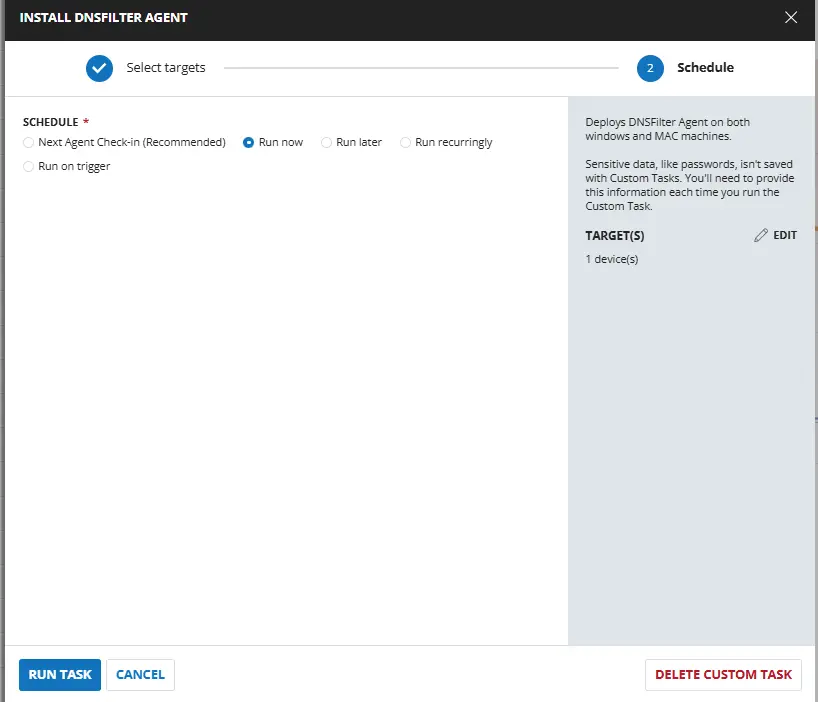
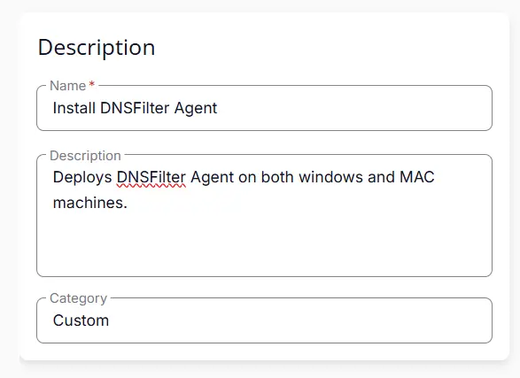
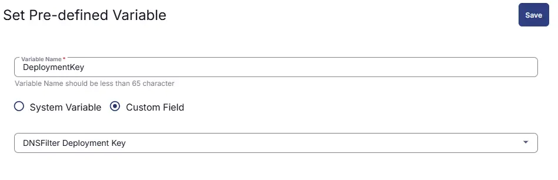
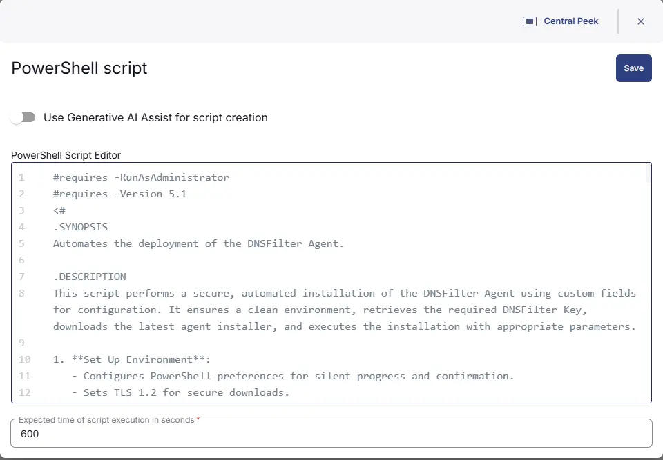
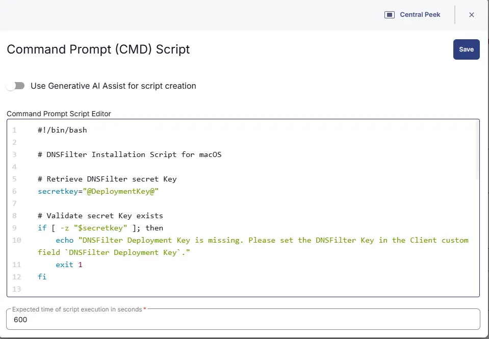
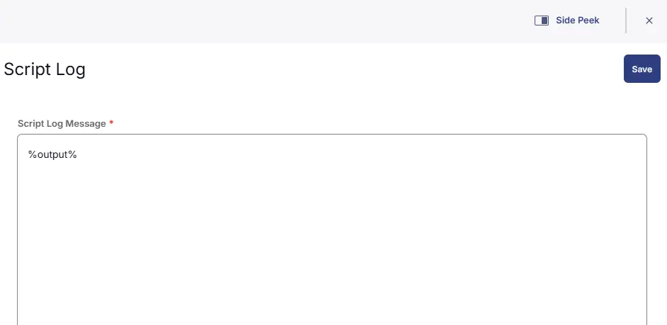
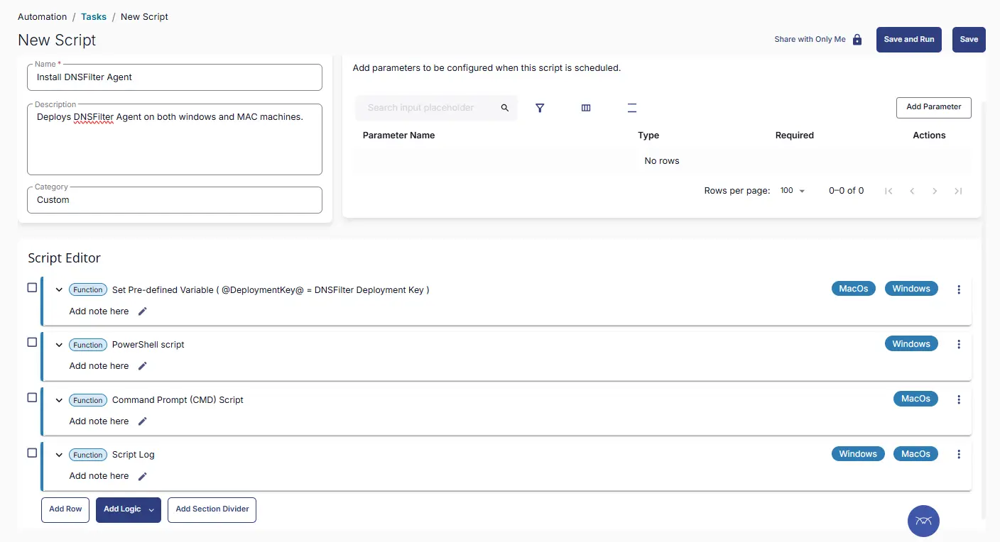
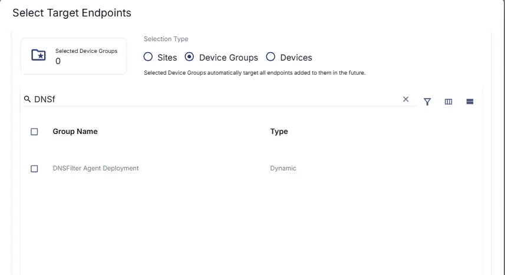
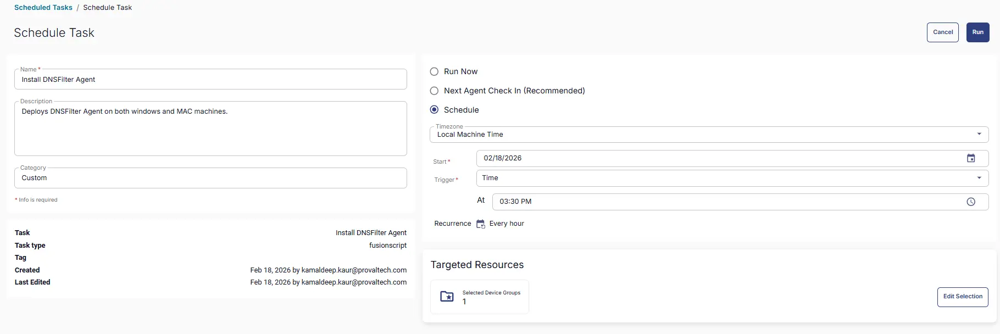

## Summary
Deploys DNSFilter Agent on both windows and MAC machines.

## Sample Run

## Dependencies

- [Custom Field - DNSFilter Deployment Key](/docs/b4038e72-ef58-4e35-8b7b-cfe0e2536c87)
- [Solution - DNS Filter Agent Deployment](/docs/fd6fcda6-9a87-4275-b6eb-1a8f8f63099d)

## Task Creation

### Script Details

#### Step 1

Navigate to `Automation` ➞ `Tasks`  

#### Step 2

Create a new `Script Editor` style task by choosing the `Script Editor` option from the `Add` dropdown menu  

The `New Script` page will appear on clicking the `Script Editor` button:  

#### Step 3

Fill in the following details in the `Description` section:  

- **Name:** `Install DNSFilter Agent`  
- **Description:** `Deploys DNSFilter Agent on both windows and MAC machines.`  
- **Category:** `Custom`

### Script Editor

Click the `Add Row` button in the `Script Editor` section to start creating the script  

A blank function will appear:  

#### Row 1: Set Pre-defined Variable ( @DeploymentKey@ = DNSFilter Deployment Key )

- **Variable Name:** `DeploymentKey`  
- **Type:** `Custom Field`  
- **Custom Field:** `DNSFilter Deployment Key`  
- **Continue on Failure:** `True`  
- **Operating System:** `Windows,MacOs`

#### Row 2: PowerShell script

- **Use Generative AI Assist for script creation:** `False`  
- **Expected time of script execution in seconds:** `600`  
- **Continue on Failure:** `False`  
- **Run As:** `System`  
- **Operating System:** `Windows`  
- **PowerShell Script Editor:**  

[PowerShell Script](https://github.com/ProVal-Tech/cw-rmm/blob/main/tasks/install-dnsfilter-agent/script.ps1)

#### Row 3: Bash script

- **Use Generative AI Assist for script creation:** `False`  
- **Expected time of script execution in seconds:** `600`  
- **Continue on Failure:** `False`  
- **Run As:** `System`  
- **Operating System:** `MacOs`  
- **Bash Script Editor:**

[Bash Script](https://github.com/ProVal-Tech/cw-rmm/blob/main/tasks/install-dnsfilter-agent/script.sh)

#### Row 7: Script Log

- **Script Log Message:** `%Output%`  
- **Operating System:** `Windows`, `MacOs`

## Save Task

Click the `Save` button at the top-right corner of the screen to save the script.  

## Completed Task

## Deployment
This task has to be scheduled on the `DNSFilter Agent Deployment` group for auto deployment. The script can also be run manually if required.

- Go to Automations > Tasks.  
- Search for `Install DNSFilter Agent`.  
- Then click on Schedule and provide the parameter details as necessary for the script completion.

**Target Group**:

**Complete Schedule Task**:

## Output
- Script Logs

## Changelog

### 2026-02-18

- Initial version of the document

