## Summary

This script automates the installation of the ImmyBot Agent MSI installer with option to reinstall if needed.

## Sample Run

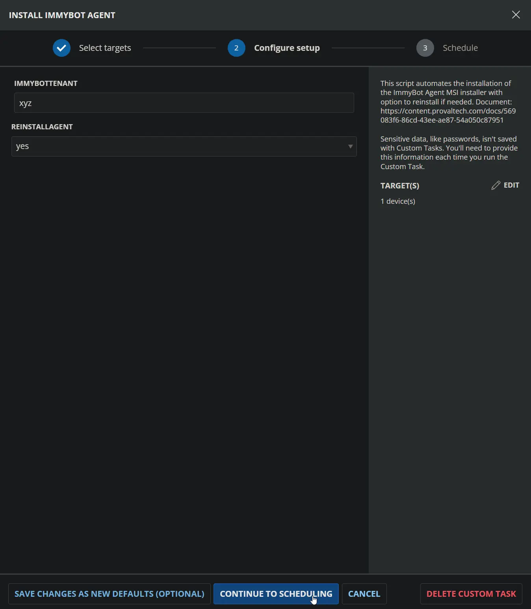

## Dependencies

- [ImmyBot Tenant](/docs/2556d27a-3c3c-4437-aa2c-43143b97ff88)
- [ImmyBot Installer ID](/docs/9f10ae6a-e898-4bc6-95cb-946c77abdf2e)
- [ImmyBot Installer Key](/docs/9449d91e-3a45-4fa2-b0b4-099dc349bb50)
- [ImmyBot Agent Deployment](/docs/d0a57d05-71c0-495e-a055-803ad7a728ad)

## User Parameters

| Name             | Example   | Accepted Values     | Required | Default | Type       | Description                                                                 |
|------------------|-----------|---------------------|----------|---------|------------|-----------------------------------------------------------------------------|
| ReinstallAgent   | Yes       | Yes, No             | No       | No      | Flag       | Set to ‘Yes’ to force a reinstall of the ImmyBot Agent.                     |

## Custom Fields

| Name                | Example                                   | Level   | Type | Required | Description                                    |
|---------------------|-------------------------------------------|---------|------|----------|------------------------------------------------|
| ImmyBot Tenant | xyz | Client | Text | Yes | Subdomain part of your ImmyBot URL. For `https://xyz.immy.bot`, use `xyz`.                      |
| ImmyBot Installer ID | `cd87c48a-4ab2-4cab-ab6d-2c578ae646a9`    | Client  | Text | Yes      | Agent Installer ID.                           |
| ImmyBot Installer Key | `Rg6k0ITU4r1+AyCfI/VKWtN95+KVszyLFEJZ3PKigrD=` | Client  | Text | Yes      | Agent Installer Key.                    |

## Obtaining Required Information

### ImmyBot Tenant

- Use the subdomain from your ImmyBot URL (`xyz` from `https://xyz.immy.bot`).
- Save the value to the client-level custom field `ImmyBot Tenant`.

### ImmyBot Installer ID and Key

- The Installer ID and Key are found in the install PowerShell script generated for your tenant.

### Steps to Retrieve ID and Key

1. **Open ImmyBot Agent Download**
   - In the navigation pane, click the **ImmyBot Agent** button.
   - Click the **Download** link in the highlighted box.  
     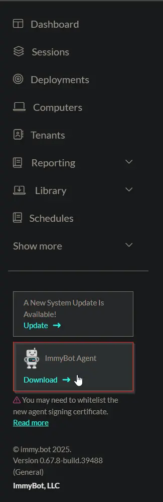

2. **Select Tenant**
   - In the installer popup, select the correct tenant from the dropdown menu.
   - Click **Next** to proceed.  
     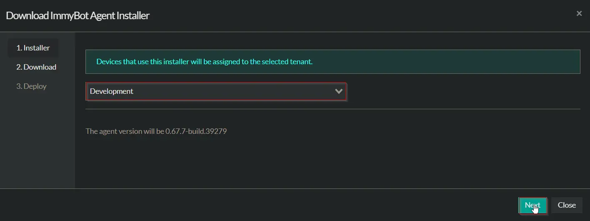

3. **Choose Installer Format**
   - Select **PowerShell** as the Installer Format.
   - Confirm your settings and options.  
     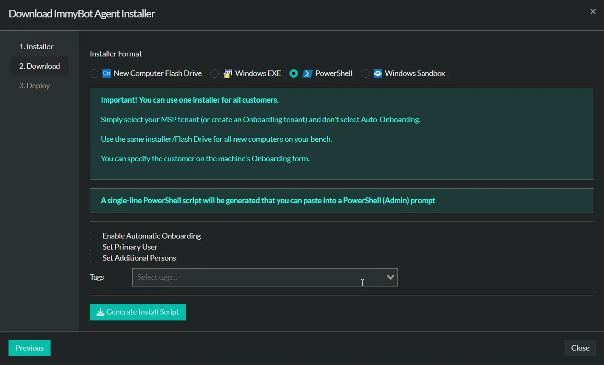

4. **Generate Install Script**
   - Click the **Generate Install Script** button.
   - Copy the generated PowerShell script from the field.  
     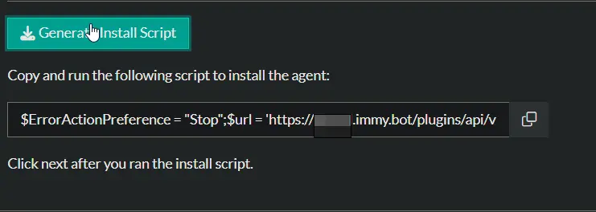

5. **Extract ID and Key**
   - Paste the copied script into a text editor.
   - Look within the script for the parameters labeled `ID` and `KEY`.
   - Example:

     ```PowerShell
     $ErrorActionPreference = "Stop";$url = 'https://xyz.immy.bot/plugins/api/v1/1/installer/latest-download';$InstallerFile = [io.path]::ChangeExtension([io.path]::GetTempFileName(), ".msi");(New-Object System.Net.WebClient).DownloadFile($url, $InstallerFile);$InstallerLogFile = [io.path]::ChangeExtension([io.path]::GetTempFileName(), ".log");$Arguments = " /c msiexec /i `"$InstallerFile`" /qn /norestart /l*v `"$InstallerLogFile`" REBOOT=REALLYSUPPRESS ID=cd87c48a-4ab2-4cab-ab6d-2c578ae646a9 ADDR=https://proval.immy.bot/plugins/api/v1/1 KEY=Rg6k0ITU4r1+AyCfI/VKWtN95+KVszyLFEJZ3PKigrD=";Write-Host "InstallerLogFile: $InstallerLogFile";$Process = Start-Process -Wait cmd -ArgumentList $Arguments -Passthru;if ($Process.ExitCode -ne 0) {    Get-Content $InstallerLogFile -ErrorAction SilentlyContinue | Select-Object -Last 200;    throw "Exit Code: $($Process.ExitCode), ComputerName: $($env:ComputerName)"}else {    Write-Host "Exit Code: $($Process.ExitCode)";    Write-Host "ComputerName: $($env:ComputerName)";}
     ```

   - The value after `ID=` is your **ImmyBot Installer ID**.
     Example: `cd87c48a-4ab2-4cab-ab6d-2c578ae646a9`
   - The value after `KEY=` is your **ImmyBot Installer Key**.
     Example: `Rg6k0ITU4r1+AyCfI/VKWtN95+KVszyLFEJZ3PKigrD=`

6. **Store Values**
   - Save the ID and Key into the corresponding client-level custom fields:
     - `ImmyBot Installer ID`
     - `ImmyBot Installer Key`

## Task Setup Path

**Tasks Path:** `AUTOMATION` ➞ `Tasks`  
**Task Type:** `Script Editor`  

## Task Creation

### Description

**Name:** `Install ImmyBot Agent`  
**Description:** `This script automates the installation of the ImmyBot Agent MSI installer with option to reinstall if needed. Document: https://content.provaltech.com/docs/c2576ff2-e86f-43f7-94dc-462a7afbc7f1`  
**Category:** `Application`

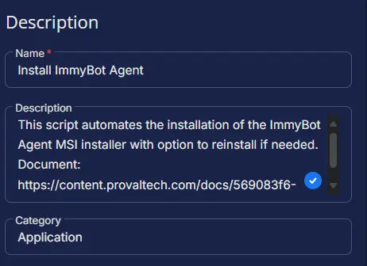

### Parameters

| Parameter Name | Required Field | Parameter Type | Default Value |
| -------------- | -------------- | -------------- | ------------- |
| ReinstallAgent | Disabled | Flag | Disabled |

**ReinstallAgent:**  
    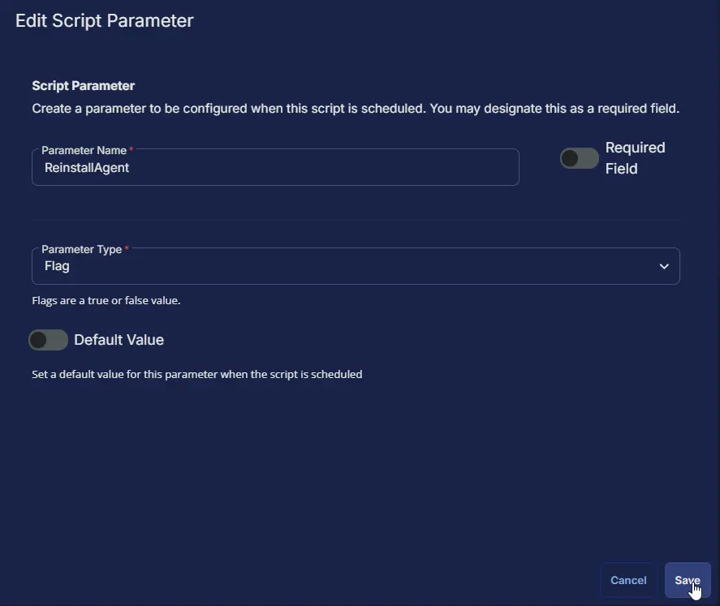

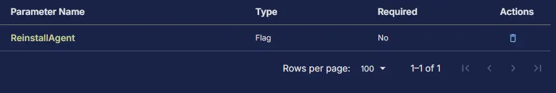

### Script Editor

#### Row 1: Set Pre-defined Variable ( @ImmyBotTenant@ = ImmyBot Tenant )

**Variable Name:**  `ImmyBotTenant`  
**Type:**  `Custom Field`  
**Custom Field:**  `ImmyBot Tenant`  
**Operating System:** `Windows`

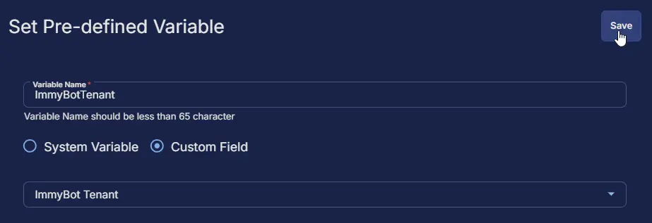

#### Row 2: Set Pre-defined Variable ( @ImmyBotInstallerID@ = ImmyBot Installer ID )

**Variable Name:**  `ImmyBotInstallerID`  
**Type:**  `Custom Field`  
**Custom Field:**  `ImmyBot Installer ID`  
**Operating System:** `Windows`

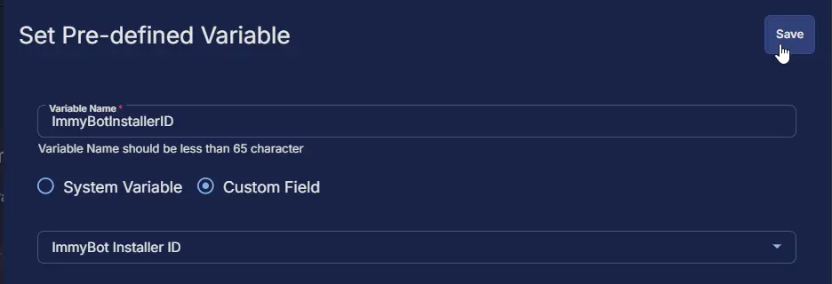

#### Row 3: Set Pre-defined Variable ( @ImmyBotInstallerKey@ = ImmyBot Installer Key )

**Variable Name:**  `ImmyBotInstallerKey`  
**Type:**  `Custom Field`  
**Custom Field:**  `ImmyBot Installer Key`  
**Operating System:** `Windows`

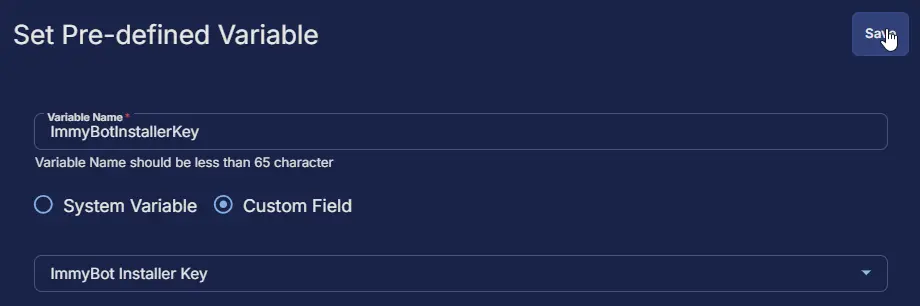

#### Row 4: PowerShell script

**Use Generative AI Assist for script creation:** `False`  
**Expected time of script execution in seconds:** `600`  
**Operating System:** `Windows`  
**PowerShell Script Editor:**  

```PowerShell
<#
.SYNOPSIS
    Installs or reinstalls the ImmyBot Agent on a Windows machine via CW RMM.

.DESCRIPTION
    This script automates the installation of the ImmyBot Agent MSI installer with options to uninstall and reinstall if needed. 
    It is specifically designed to be used within a ConnectWise (CW) RMM environment and uses variables supplied by CW RMM to customize the deployment.

.FUNCTIONALITY
    The script performs the following key functions:
    - Validates that the system supports TLS 1.2 or TLS 1.3 protocols, essential for secure communication.
    - Reads required CW RMM variables:
        - ImmyBot Tenant (runtime variable)
        - ImmyBot Installer ID (client-level custom field)
        - ImmyBot Installer Key (client-level custom field)
        - Reinstall Agent (runtime variable controlling reinstall behavior)
    - Checks whether the ImmyBot Agent service and/or MSI product is already installed on the target machine.
    - If requested or if a partial installation exists, uninstalls the existing ImmyBot Agent instance.
    - Downloads the latest ImmyBot Agent MSI installer from the ImmyBot tenant's secured URL.
    - Runs the MSI installer silently with parameters including the tenant's address, installer ID, and key.
    - Verifies the success of the installation by checking service presence and MSI product registration.
    - Cleans up temporary installation files after completion.

.PARAMETER ImmyBotTenant
    The subdomain of your ImmyBot tenant. This is a runtime variable passed from CW RMM and represents the unique tenant identifier used in URLs.

.PARAMETER ImmyBotInstallerID
    The GUID product installer ID for ImmyBot Agent MSI. This is set as a Client-Level Custom Field in CW RMM and must be a valid GUID format.

.PARAMETER ImmyBotInstallerKey
    The installer key string required to activate the installer. This is also a Client-Level Custom Field and must be correctly configured to enable installation.

.PARAMETER ReinstallAgent
    Runtime flag that can be enabled to force reinstallation of the ImmyBot Agent, even if it is already installed.

.NOTES
    - ImmyBot Tenant must be configured as Runtime Variables in the CW RMM task.
    - ImmyBot Installer ID and ImmyBot Installer Key must be configured as Client-Level Custom Fields; these settings are mandatory. Without these, the script will not function correctly.
    - The script sets correct TLS security protocols to ensure proper secure connections for downloading the installer.
    - All installation progress and errors are logged in the specified log file inside the working directory under ProgramData.
    - Installation happens silently with no restarts triggered automatically; reboot suppression is enforced.
    - Partial installations detected by mismatched service or product presence trigger a reinstall.

.EXAMPLE
    # Run via CW RMM task with properly set variables and custom fields; the script installs ImmyBot Agent or reinstalls it if needed.
    .\Install-ImmyBotAgent.ps1

.LINK
    For further documentation on fields and usage, see:
    https://content.provaltech.com/docs/c2576ff2-e86f-43f7-94dc-462a7afbc7f1

.OUTPUTS
    C:\ProgramData\_Automation\App\IBAgent\IBAgent.log
#>

begin {
    #region Globals
    $ProgressPreference = 'SilentlyContinue'
    $msiexecPath = 'C:\Windows\System32\msiexec.exe'
    $softwareName = 'ImmyBot Agent'
    $serviceName = 'ImmyBot Agent'
    #endRegion

    #region Variables
    $appName = 'IBAgent'
    $workingDirectory = '{0}\_Automation\App\{1}' -f $env:ProgramData, $appName
    $tmpAppPath = '{0}\{1}.tmp' -f $workingDirectory, $appName
    $appPath = [io.path]::ChangeExtension($tmpAppPath, '.msi')
    $logPath = [io.path]::ChangeExtension($tmpAppPath, '.log')
    #endRegion

    #region CW RMM Variables
    $immyBotTenant = ('@ImmyBotTenant@').Trim()
    $immyBotInstallerID = ('@ImmyBotInstallerID@').Trim()
    $immyBotInstallerKey = ('@ImmyBotInstallerKey@').Trim()
    $reinstall = ('@ReinstallAgent@').Trim()
    #endRegion

    #region Functions
    function Search-Service {
        [CmdletBinding()]
        param (
            [Parameter(Mandatory)][String]$ServiceName
        )
        if (Get-Service -Name $ServiceName -ErrorAction SilentlyContinue) {
            return $true
        } else {
            return $false
        }
    }

    function Get-ProductId {
        [CmdletBinding()]
        param (
            [Parameter(Mandatory)][String]$SoftwareName
        )
        $uninstallPaths = @(
            'HKLM:\SOFTWARE\Microsoft\Windows\CurrentVersion\Uninstall',
            'HKLM:\SOFTWARE\Wow6432Node\Microsoft\Windows\CurrentVersion\Uninstall'
        )
        $uninstallInfo = Get-ChildItem $uninstallPaths -ErrorAction SilentlyContinue |
            Get-ItemProperty |
            Where-Object { 
                $_.DisplayName -match [Regex]::Escape($SoftwareName)
            }
        if ($uninstallInfo) {
            return $uninstallInfo.PSChildName
        } else {
            return $null
        }
    }

    function Uninstall-Software {
        [CmdletBinding()]
        param (
            [Parameter(Mandatory)][String]$ProductId
        )
        $argumentList = @(
            '/x',
            $ProductId,
            '/quiet',
            '/norestart'
        )
        $UninstallProcess = Start-Process 'msiexec.exe' -ArgumentList $argumentList -Wait -PassThru
        Start-Sleep -Seconds 5
        return $UninstallProcess
    }
    #endRegion
} process {
    #region Set TLS version
    $supportedTLSversions = [enum]::GetValues('Net.SecurityProtocolType')
    if ( ($supportedTLSversions -contains 'Tls13') -and ($supportedTLSversions -contains 'Tls12') ) {
        [System.Net.ServicePointManager]::SecurityProtocol = [System.Net.ServicePointManager]::SecurityProtocol::Tls13 -bor [System.Net.SecurityProtocolType]::Tls12
    } elseif ( $supportedTLSversions -contains 'Tls12' ) {
        [System.Net.ServicePointManager]::SecurityProtocol = [System.Net.SecurityProtocolType]::Tls12
    } else {
        throw 'TLS 1.2 or TLS 1.3 is not supported on this system. Please install ''KB3140245'' to fix this issue.'
        if ($PSVersionTable.PSVersion.Major -lt 3) {
            throw 'PowerShell 2 / .NET 2.0 does not support TLS 1.2.'
        }
    }

    #region CW RMM Variables Check
    if ([string]::IsNullOrEmpty($immyBotTenant) -or $immyBotTenant -match 'immyBotTenant') {
        throw 'ImmyBot Tenant is missing. Please provide the tenant subdomain in the RunTime Variable ''ImmyBot Tenant'' (the part between ''https://'' and ''.immy.bot'').'
    }
    if ($immyBotInstallerID -notmatch '^[\w\d]{8}(?:-[\w\d]{4}){3}-[\w\d]{12}$') {
        throw @'
No valid ImmyBot Installer ID found. Please enter the installer ID in the Client-Level Custom Field ''ImmyBot Agent Installer ID''.
Refer to the script documentation for help: https://content.provaltech.com/docs/c2576ff2-e86f-43f7-94dc-462a7afbc7f1.
'@
    }
    if ($immyBotInstallerKey -notmatch '^\S{44}$') {
        throw @'
A valid ImmyBot Installer Key is required. Set this key in the Client-Level Custom Field ''ImmyBot Installer Key''.
See the script documentation for more information: https://content.provaltech.com/docs/c2576ff2-e86f-43f7-94dc-462a7afbc7f1.
'@
    }
    if ($reinstall -match '1|Yes|True') {
        $reinstallAgent = $true
    } else {
        $reinstallAgent = $false
    }
    #endRegion

    #region Installation Check
    $serviceCheck = Search-Service -ServiceName $serviceName
    $softwareCheck = Get-ProductId -SoftwareName $softwareName

    if (!$serviceCheck -and !$softwareCheck) {
        Write-Information 'ImmyBot Agent not found. Starting installation...' -InformationAction Continue
    } elseif (($softwareCheck -and !$serviceCheck) -or (!$softwareCheck -and $serviceCheck)) {
        $reinstall = $true
        Write-Information 'Partial ImmyBot Agent installation detected. Starting reinstallation...' -InformationAction Continue
    } elseif ($softwareCheck -and $serviceCheck -and $reinstallAgent) {
        Write-Information 'ImmyBot Agent is installed and ''Reinstall Agent'' is enabled. Proceeding with reinstallation...' -InformationAction Continue
    } elseif ($softwareCheck -and $serviceCheck) {
        return 'ImmyBot Agent is already installed. Enable the run-time variable ''Reinstall Agent'' to force reinstallation.'
    } else {
        Write-Information 'Starting ImmyBot Agent installation...' -InformationAction Continue
    }
    #endRegion

    #region Working Directory
    if (!(Test-Path -Path $workingDirectory)) {
        try {
            Write-Information ('Creating working directory: {0}' -f $workingDirectory) -InformationAction Continue
            New-Item -Path $workingDirectory -ItemType Directory -Force -ErrorAction Stop | Out-Null
        } catch {
            throw ('Failed to create directory ''{0}''. Error message: {1}' -f $workingDirectory, $($Error[0].Exception.Message))
        }
    }
    #endRegion

    #region Uninstall
    if ($reinstall) {
        Write-Information 'Removing existing installation...' -InformationAction Continue
        $productId = Get-ProductId -SoftwareName $softwareName
        if ($productId) {
            $uninstallProcessInfo = Uninstall-Software -ProductId $productId
            if (!(Get-ProductId -SoftwareName $softwareName)) {
                Write-Information ('{0} has been successfully uninstalled.' -f $softwareName) -InformationAction Continue
            } else {
                Write-Information ('Failed to uninstall {0}. Exit code: ''{1}''' -f $softwareName, $uninstallProcessInfo.ExitCode) -InformationAction Continue
            }
        } else {
            Write-Information ('{0} is not installed.' -f $softwareName) -InformationAction Continue
        }
    }
    #endRegion

    #region Download
    $downloadUrl = 'https://{0}.immy.bot/plugins/api/v1/1/installer/latest-download' -f $immyBotTenant
    try {
        Write-Information 'Downloading ImmyBot Agent installer...' -InformationAction Continue
        Invoke-WebRequest -Uri $downloadUrl -OutFile $appPath -UseBasicParsing -ErrorAction Stop
    } catch {
        throw $('Failed to download ImmyBot Agent from ''{0}''. Error details: {1}' -f $downloadUrl, $($Error[0].Exception.Message))
    }
    #endRegion

    #region Installer parameters
    $addr = 'https://{0}.immy.bot/plugins/api/v1/1' -f $immyBotTenant
    $arguments = @(
        '/i',
        """$appPath""",
        '/qn',
        '/norestart',
        '/l*v',
        """$logPath""",
        'REBOOT=REALLYSUPPRESS',
        "ID=$immyBotInstallerID",
        "ADDR=$addr",
        "KEY=$immyBotInstallerKey"
    )
    #endRegion

    #region Install
    try {
        Write-Information 'Starting installation...' -InformationAction Continue
        $installationProcess = Start-Process -FilePath $msiexecPath -ArgumentList $arguments -PassThru -ErrorAction Stop -Wait
    } catch {
        throw ('Failed to start installation. Error: {0}' -f $($Error[0].Exception.Message))
    }
    #endRegion

    #region Verification
    Start-Sleep -Seconds 30
    $logContent = Get-Content -Path $logPath -ErrorAction SilentlyContinue | Select-Object -Last 200
    if ($installationProcess.ExitCode -ne 0) {
        throw @"
Installation failed with exit code '$($installationProcess.ExitCode)'.
Log output: $($logContent | Out-String)
"@
    }

    $serviceCheck = Search-Service -ServiceName $serviceName
    $softwareCheck = Get-ProductId -SoftwareName $softwareName
    if (!$serviceCheck -or !$softwareCheck) {
        throw @"
Installation was not successful.
Log output: $($logContent | Out-String)
"@
    }

    return 'ImmyBot Agent was installed successfully.'
    #endRegion
} end {
    #region remove installer file
    Write-Information 'Deleting installer file...' -InformationAction Continue
    Remove-Item -Path $appPath -Force -ErrorAction SilentlyContinue
    #endRegion
}
```

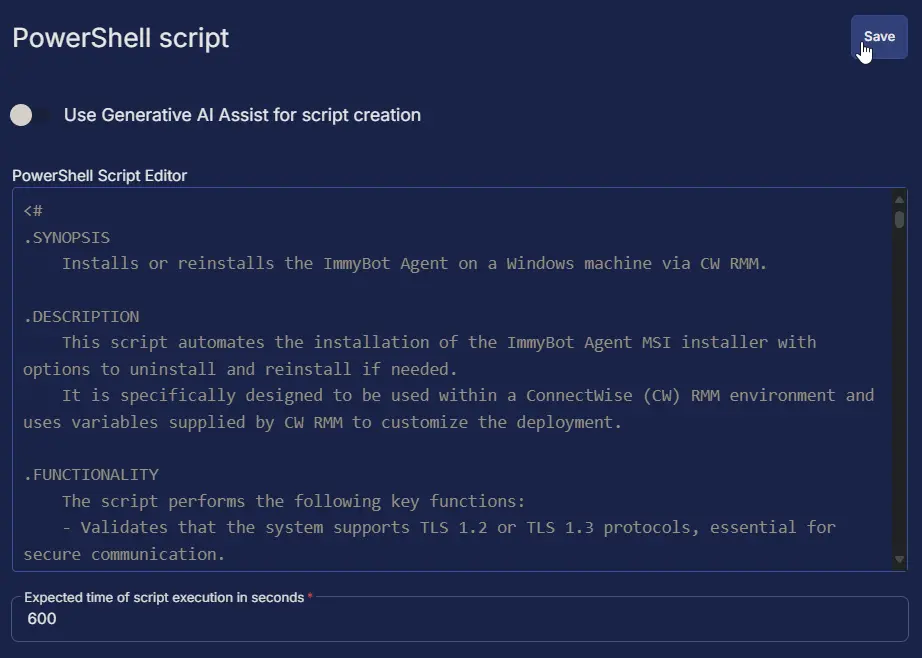

#### Row 5: Script Log

**Script Log Message:** `%Output%`  
**Operating System:** `Windows`

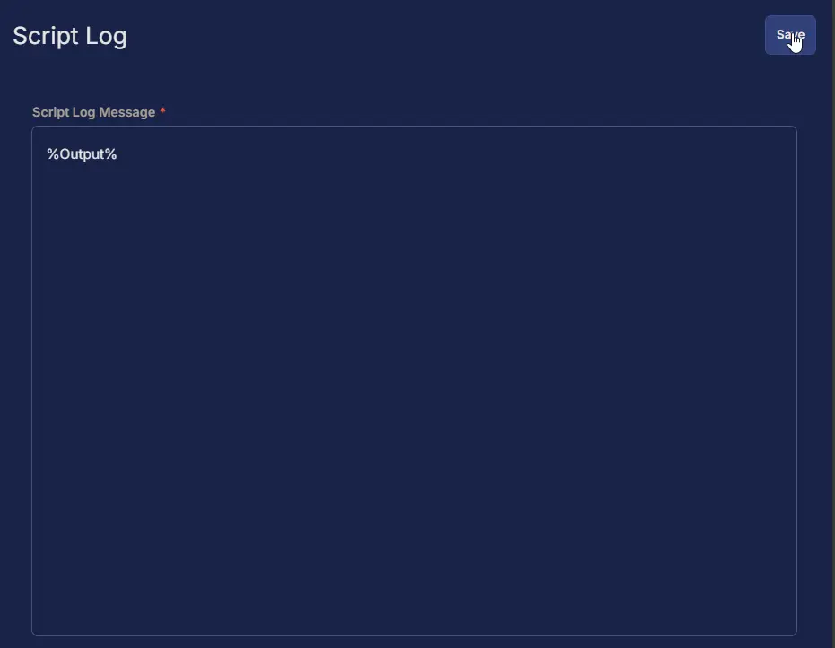

## Completed Script

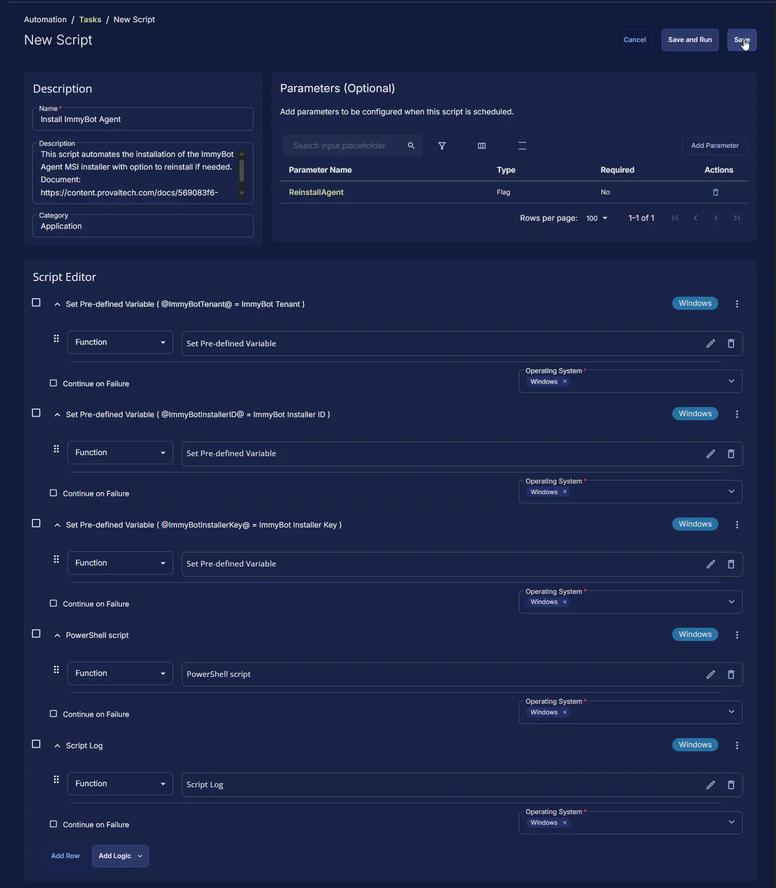

## Output

- Script Log
