---
id: 'c2576ff2-e86f-43f7-94dc-462a7afbc7f1'
slug: /c2576ff2-e86f-43f7-94dc-462a7afbc7f1
title: 'Install ImmyBot Agent'
title_meta: 'Install ImmyBot Agent'
keywords: ['immybot', 'immybot-agent', 'deploy-immybot-agent', 'install-immybot-agent', 'reinstall-immybot-agent']
description: 'This script automates the installation of the ImmyBot Agent MSI installer with options to uninstall and reinstall if needed.'
tags: ['application', 'installation']
draft: false
unlisted: false
last_update:
  date: 2025-08-13
---

## Summary

This script automates the installation of the ImmyBot Agent MSI installer with option to reinstall if needed.

## Sample Run

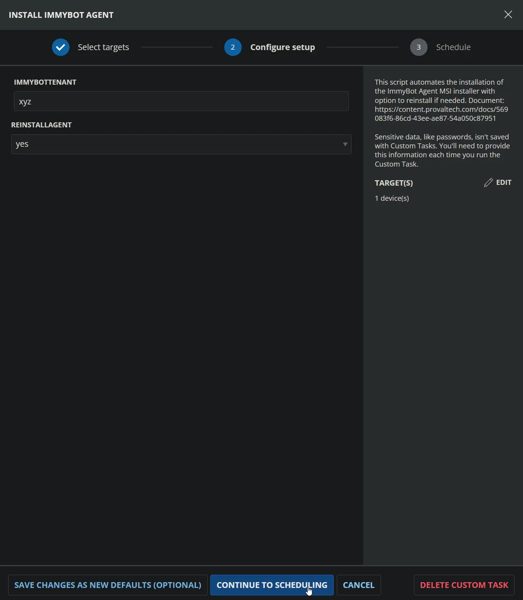

## Dependencies

- [ImmyBot Tenant](/docs/2556d27a-3c3c-4437-aa2c-43143b97ff88)
- [ImmyBot Installer ID](/docs/9f10ae6a-e898-4bc6-95cb-946c77abdf2e)
- [ImmyBot Installer Key](/docs/9449d91e-3a45-4fa2-b0b4-099dc349bb50)
- [Solution - ImmyBot Agent Deployment](/docs/d0a57d05-71c0-495e-a055-803ad7a728ad)

## User Parameters

| Name             | Example   | Accepted Values     | Required | Default | Type       | Description                                                                 |
|------------------|-----------|---------------------|----------|---------|------------|-----------------------------------------------------------------------------|
| ReinstallAgent   | Yes       | Yes, No             | No       | No      | Flag       | Set to ‘Yes’ to force a reinstall of the ImmyBot Agent.                     |

## Custom Fields

| Name                | Example                                   | Level   | Type | Required | Description                                    |
|---------------------|-------------------------------------------|---------|------|----------|------------------------------------------------|
| ImmyBot Tenant | xyz | Client | Text | Yes | Subdomain part of your ImmyBot URL. For `https://xyz.immy.bot`, use `xyz`.                      |
| ImmyBot Installer ID | `cd87c48a-4ab2-4cab-ab6d-2c578ae646a9`    | Client  | Text | Yes      | Agent Installer ID.                           |
| ImmyBot Installer Key | `Rg6k0ITU4r1+AyCfI/VKWtN95+KVszyLFEJZ3PKigrD=` | Client  | Text | Yes      | Agent Installer Key.                    |

## Obtaining Required Information

### ImmyBot Tenant

- Use the subdomain from your ImmyBot URL (`xyz` from `https://xyz.immy.bot`).
- Save the value to the client-level custom field `ImmyBot Tenant`.

### ImmyBot Installer ID and Key

- The Installer ID and Key are found in the install PowerShell script generated for your tenant.

### Steps to Retrieve ID and Key

1. **Open ImmyBot Agent Download**
   - In the navigation pane, click the **ImmyBot Agent** button.
   - Click the **Download** link in the highlighted box.  
     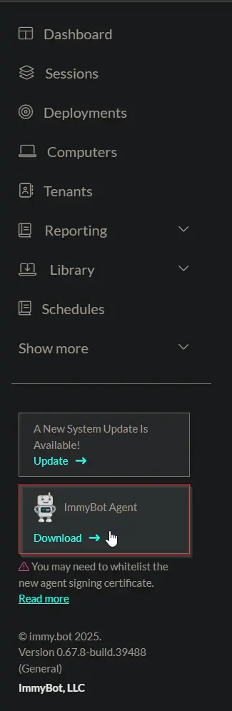

2. **Select Tenant**
   - In the installer popup, select the correct tenant from the dropdown menu.
   - Click **Next** to proceed.  
     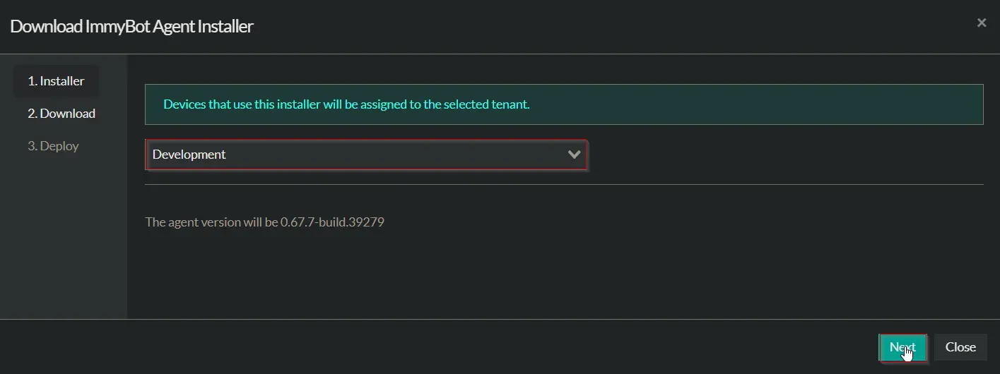

3. **Choose Installer Format**
   - Select **PowerShell** as the Installer Format.
   - Confirm your settings and options.  
     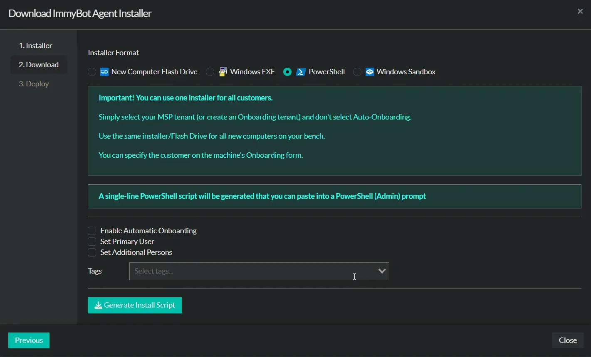

4. **Generate Install Script**
   - Click the **Generate Install Script** button.
   - Copy the generated PowerShell script from the field.  
     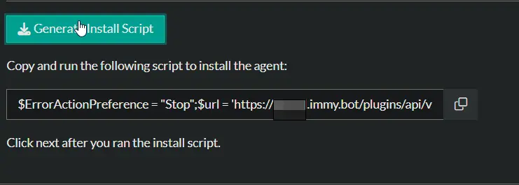

5. **Extract ID and Key**
   - Paste the copied script into a text editor.
   - Look within the script for the parameters labeled `ID` and `KEY`.
   - Example:

     [PowerShell Script 1](https://github.com/ProVal-Tech/cw-rmm/blob/main/tasks/install-immybot-agent/script1.ps1)

   - The value after `ID=` is your **ImmyBot Installer ID**.
     Example: `cd87c48a-4ab2-4cab-ab6d-2c578ae646a9`
   - The value after `KEY=` is your **ImmyBot Installer Key**.
     Example: `Rg6k0ITU4r1+AyCfI/VKWtN95+KVszyLFEJZ3PKigrD=`

6. **Store Values**
   - Save the ID and Key into the corresponding client-level custom fields:
     - `ImmyBot Installer ID`
     - `ImmyBot Installer Key`

## Task Setup Path

- **Tasks Path:** `AUTOMATION` ➞ `Tasks`  
- **Task Type:** `Script Editor`  

## Task Creation

### Description

- **Name:** `Install ImmyBot Agent`  
- **Description:** `This script automates the installation of the ImmyBot Agent MSI installer with option to reinstall if needed. Document: https://content.provaltech.com/docs/c2576ff2-e86f-43f7-94dc-462a7afbc7f1`  
- **Category:** `Application`

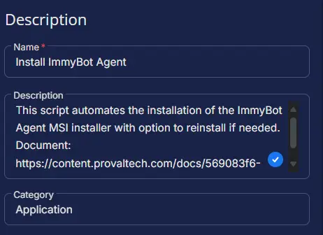

### Parameters

| Parameter Name | Required Field | Parameter Type | Default Value |
| -------------- | -------------- | -------------- | ------------- |
| ReinstallAgent | Disabled | Flag | Disabled |

**ReinstallAgent:**  
    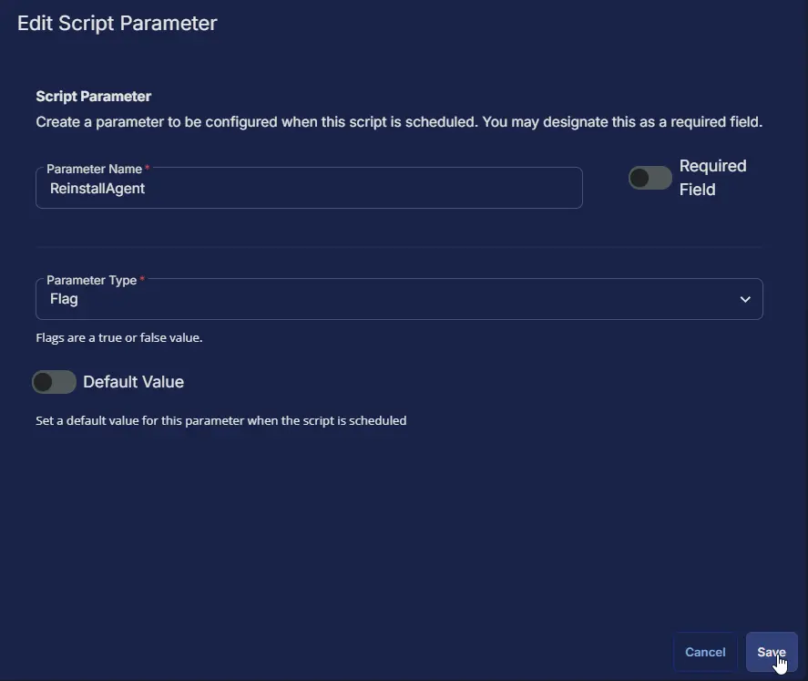

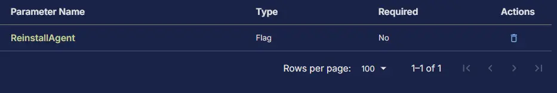

### Script Editor

#### Row 1: Set Pre-defined Variable ( @ImmyBotTenant@ = ImmyBot Tenant )

- **Variable Name:**  `ImmyBotTenant`  
- **Type:**  `Custom Field`  
- **Custom Field:**  `ImmyBot Tenant`  
*- *Operating System:** `Windows`

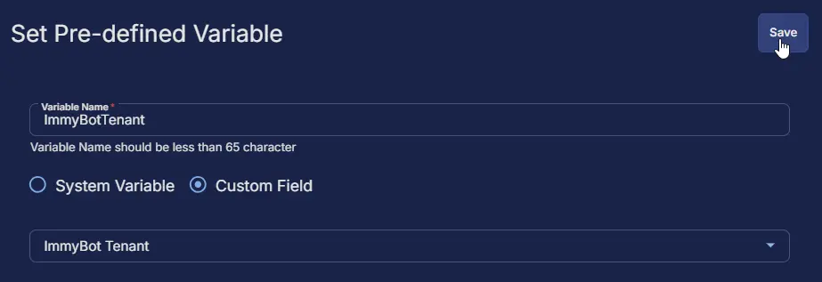

#### Row 2: Set Pre-defined Variable ( @ImmyBotInstallerID@ = ImmyBot Installer ID )

- **Variable Name:**  `ImmyBotInstallerID`  
- **Type:**  `Custom Field`  
- **Custom Field:**  `ImmyBot Installer ID`  
- **Operating System:** `Windows`

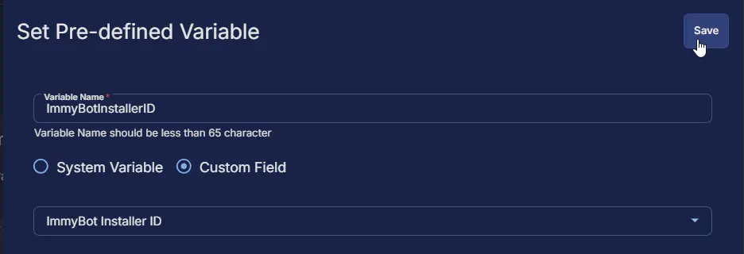

#### Row 3: Set Pre-defined Variable ( @ImmyBotInstallerKey@ = ImmyBot Installer Key )

- **Variable Name:**  `ImmyBotInstallerKey`  
- **Type:**  `Custom Field`  
- **Custom Field:**  `ImmyBot Installer Key`  
- **Operating System:** `Windows`

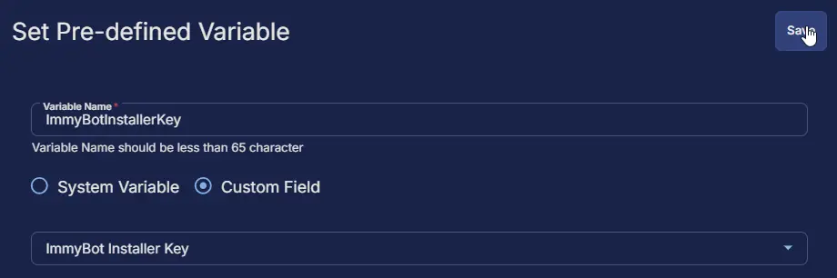

#### Row 4: PowerShell script

- **Use Generative AI Assist for script creation:** `False`  
- **Expected time of script execution in seconds:** `600`  
- **Operating System:** `Windows`  
- **PowerShell Script Editor:**  

[PowerShell Script 2](https://github.com/ProVal-Tech/cw-rmm/blob/main/tasks/install-immybot-agent/script2.ps1)

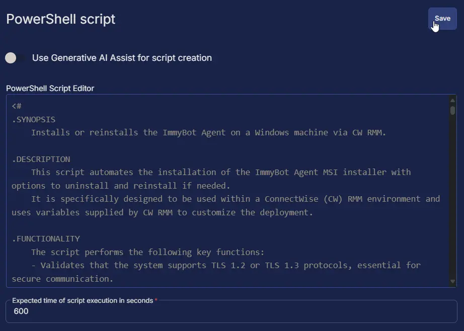

#### Row 5: Script Log

- **Script Log Message:** `%Output%`  
- **Operating System:** `Windows`

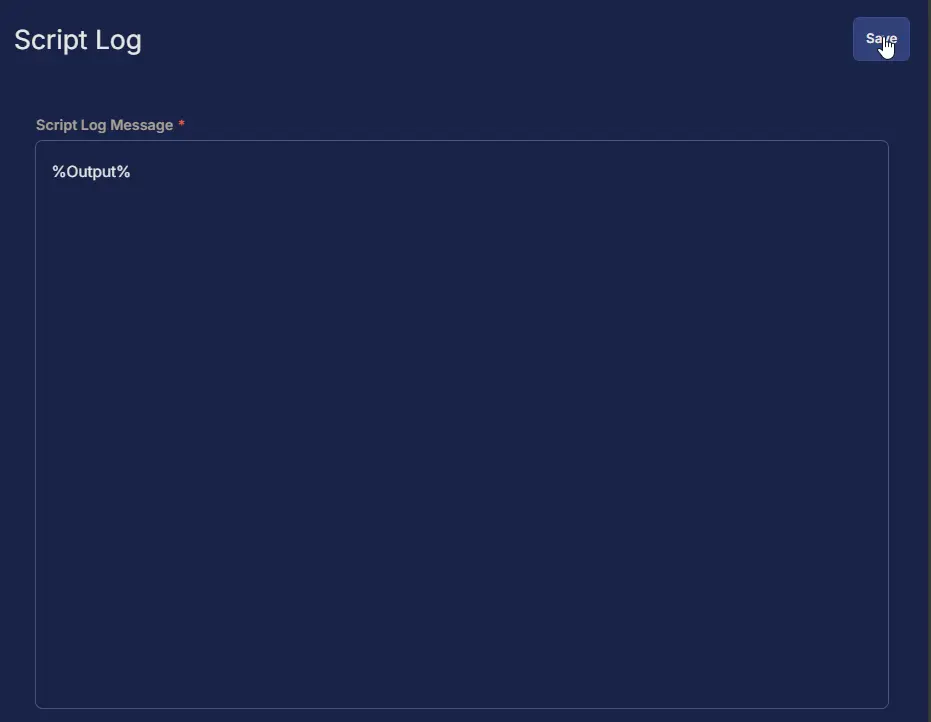

## Completed Script

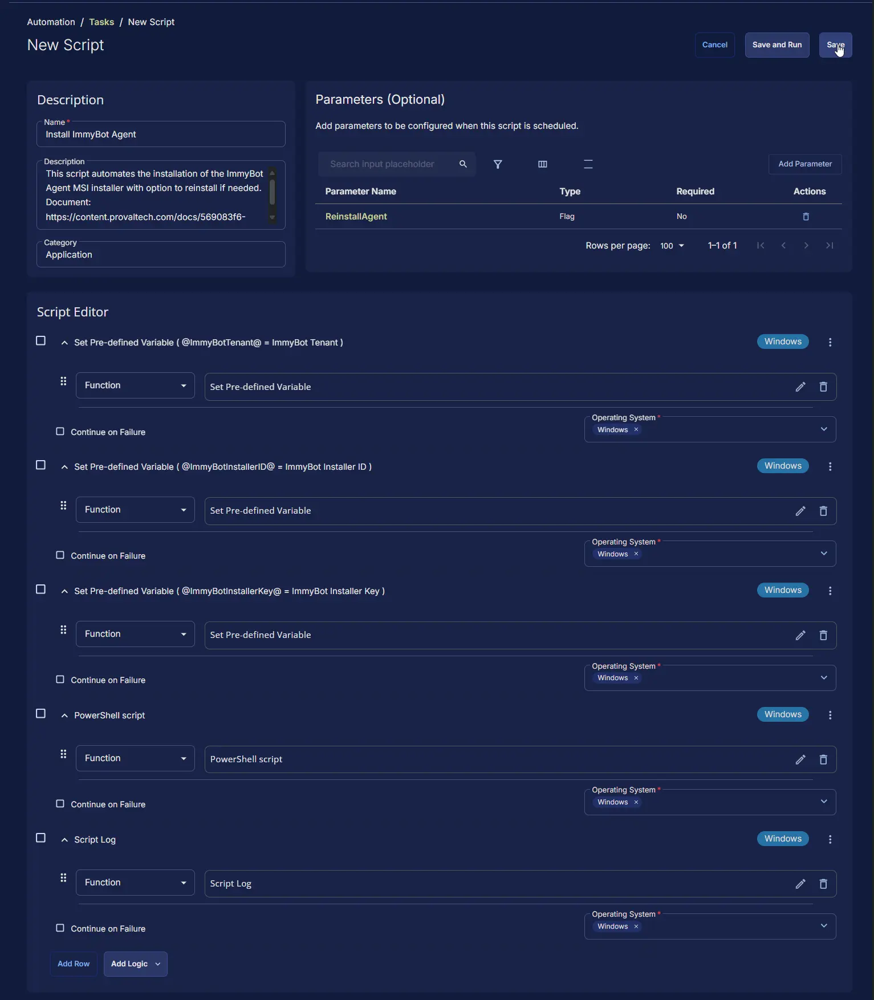

## Output

- Script Log

## Changelog

### 2025-08-04

- Initial version of the document

