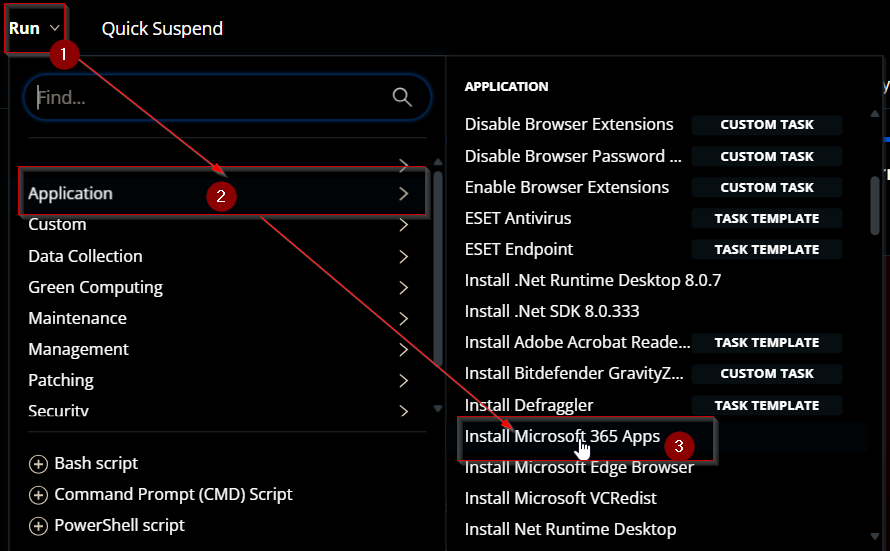
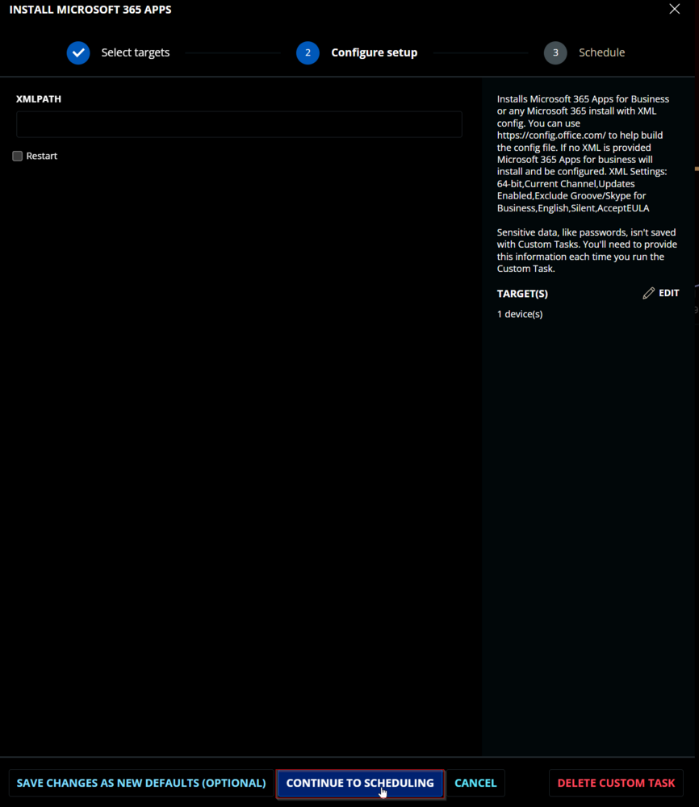
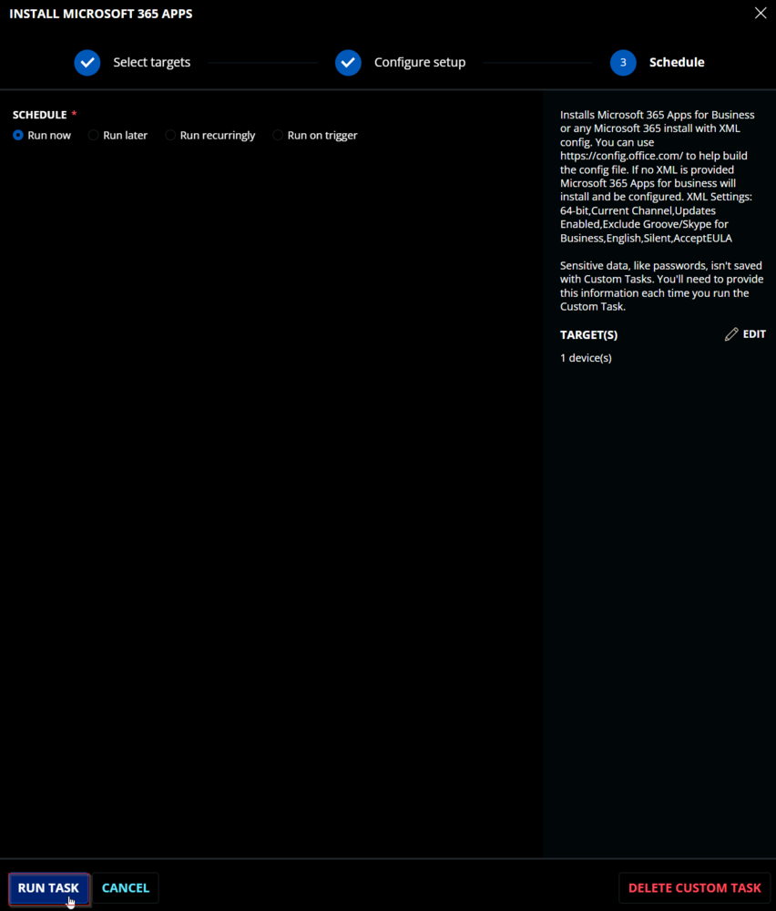
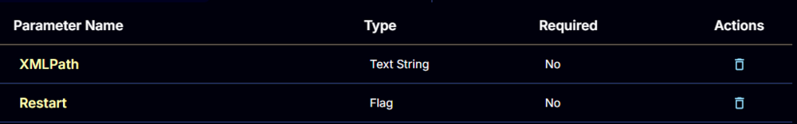
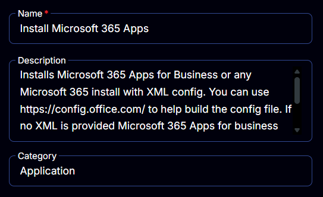
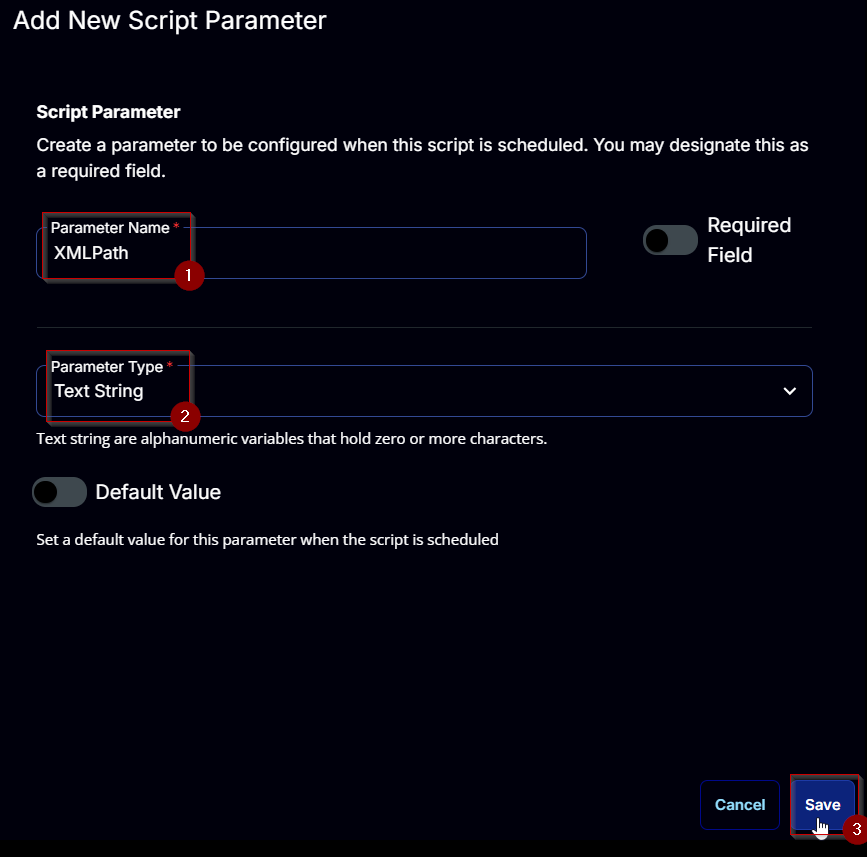
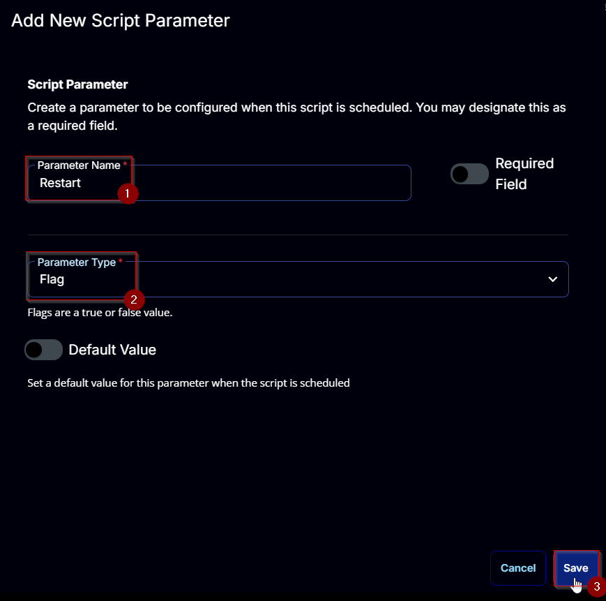
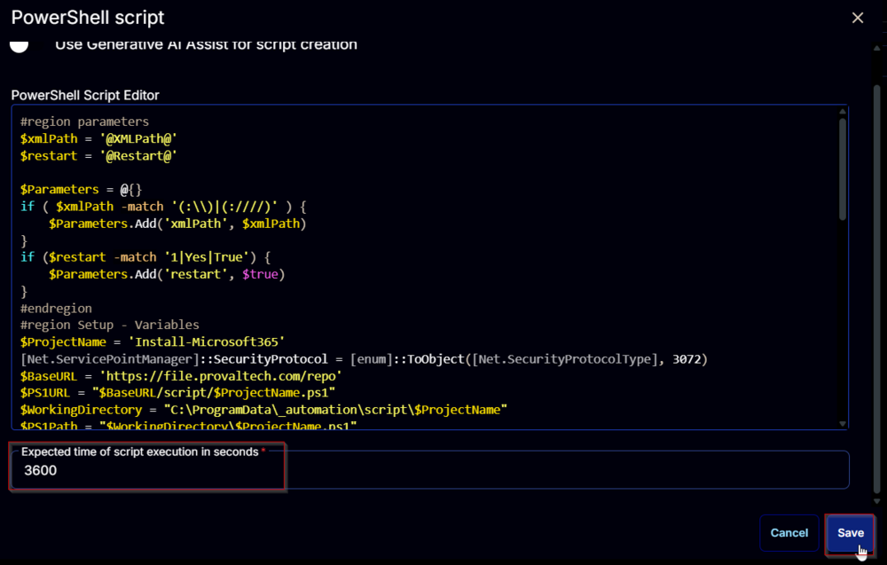

## Summary

This guide explains how to install Microsoft 365 Apps for Business or any Microsoft 365 installation using XML configuration. You can use [https://config.office.com/](https://config.office.com/) to help build the configuration file. If no XML is provided, Microsoft 365 Apps for Business will install with a default configuration. XML settings include: 64-bit, Current Channel, Updates Enabled, Exclude Groove/Skype for Business, English, Silent, AcceptEULA.

CW RMM Implementation of [Install-Microsoft365](/docs/b91e0ebd-2946-4030-bc43-a8eda4d885b1)

## Sample Run

  
  


## Dependencies

[Install-Microsoft365](/docs/b91e0ebd-2946-4030-bc43-a8eda4d885b1)

## User Parameters

| Name      | Example                                             | Required | Type         | Description                                                                                                                                                                                                                                                                                                                                                          |
|-----------|-----------------------------------------------------|----------|--------------|----------------------------------------------------------------------------------------------------------------------------------------------------------------------------------------------------------------------------------------------------------------------------------------------------------------------------------------------------------------------|
| XMLPath   | - [https://pathtoxml.com](https://pathtoxml.com)  - C:/temp/fileName.xml | False    | Text String  | Installs Microsoft 365 with the specified XML path. Supports local file path or URL. If not provided, a default configuration will be used.                                                                                                                                                                                                                         |
| Restart   | 0/1                                               | False    | Flag         | Optional: A restart is performed after installation.                                                                                                                                                                                                                                                                                                                                                                          |



## Task Creation

Create a new `Script Editor` style script in the system to implement this task.  
  
  

**Name:** `Install Microsoft 365 Apps`  
**Description:** `Installs Microsoft 365 Apps for Business or any Microsoft 365 install with XML config. You can use [https://config.office.com/](https://config.office.com/) to help build the config file. If no XML is provided, Microsoft 365 Apps for Business will install with a default configuration. XML Settings: 64-bit, Current Channel, Updates Enabled, Exclude Groove/Skype for Business, English, Silent, AcceptEULA.`  
**Category:** Application  
  

## Parameters

### XMLPath

Add a new parameter by clicking the `Add Parameter` button present at the top-right corner of the screen.  
  

This screen will appear.  
  

- Set `XMLPath` in the `Parameter Name` field.
- Select `Text String` from the `Parameter Type` dropdown menu.
- Click the `Save` button.



### Restart

Add a new parameter by clicking the `Add Parameter` button present at the top-right corner of the screen.  
  

This screen will appear.  
  

- Set `Restart` in the `Parameter Name` field.
- Select `Flag` from the `Parameter Type` dropdown menu.
- Click the `Save` button.



## Task

Navigate to the Script Editor Section and start by adding a row. You can do this by clicking the `Add Row` button at the bottom of the script page.  
  

A blank function will appear.  
  

### Row 1 Function: PowerShell Script

Search and select the `PowerShell Script` function.  
  
  

The following function will pop up on the screen:  
  

Paste in the following PowerShell script and set the `Expected time of script execution in seconds` to `3600` seconds. Click the `Save` button.

```powershell
#region parameters
$xmlPath = '@XMLPath@'
$restart = '@Restart@'
$Parameters = @{}
if ( $xmlPath -match '(:\\)|(:////)' ) {
    $Parameters.Add('xmlPath', $xmlPath)
}
if ($restart -match '1|Yes|True') {
    $Parameters.Add('restart', $true)
}
#endregion
#region Setup - Variables
$ProjectName = 'Install-Microsoft365'
[Net.ServicePointManager]::SecurityProtocol = [enum]::ToObject([Net.SecurityProtocolType], 3072)
$BaseURL = 'https://file.provaltech.com/repo'
$PS1URL = "$BaseURL/script/$ProjectName.ps1"
$WorkingDirectory = "C:\ProgramData\_automation\script\$ProjectName"
$PS1Path = "$WorkingDirectory\$ProjectName.ps1"
$WorkingPath = $WorkingDirectory
$LogPath = "$WorkingDirectory\$ProjectName-log.txt"
$ErrorLogPath = "$WorkingDirectory\$ProjectName-Error.txt"
#endregion
#region Setup - Folder Structure
New-Item -Path $WorkingDirectory -ItemType Directory -ErrorAction SilentlyContinue | Out-Null
$response = Invoke-WebRequest -Uri $PS1URL -UseBasicParsing
if (($response.StatusCode -ne 200) -and (!(Test-Path -Path $PS1Path))) {
    throw "No pre-downloaded script exists and the script '$PS1URL' failed to download. Exiting."
} elseif ($response.StatusCode -eq 200) {
    Remove-Item -Path $PS1Path -ErrorAction SilentlyContinue
    [System.IO.File]::WriteAllLines($PS1Path, $response.Content)
}
if (!(Test-Path -Path $PS1Path)) {
    throw 'An error occurred and the script was unable to be downloaded. Exiting.'
}
#endregion
#region Execution
if ($Parameters) {
    & $PS1Path @Parameters
} else {
    & $PS1Path
}
#endregion
#region log verification
if ( !(Test-Path $LogPath) ) {
    throw 'PowerShell Failure. A Security application seems to have restricted the execution of the PowerShell Script.'
}
if ( Test-Path $ErrorLogPath ) {
    $ErrorContent = ( Get-Content -Path $ErrorLogPath )
    throw $ErrorContent
}
Get-Content -Path $LogPath
#endregion
```



### Row 2 Function: Script Log

Add a new row by clicking the `Add Row` button.  
  

A blank function will appear.  
  

Search and select the `Script Log` function.  
  

The following function will pop up on the screen:  
  

In the script log message, simply type `%Output%` and click the `Save` button.  
  

Click the `Save` button at the top-right corner of the screen to save the script.  
  

## Completed Task


## Output

- Script log
