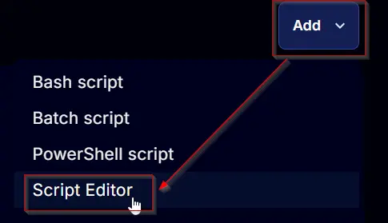
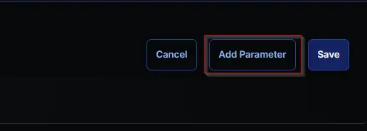
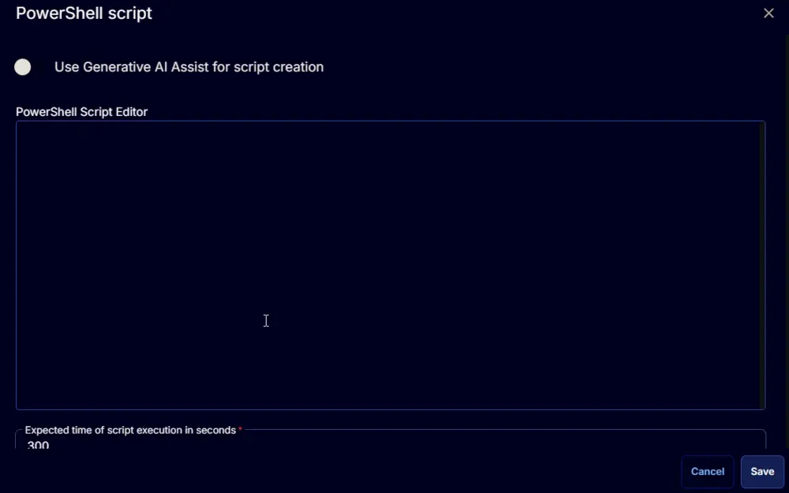
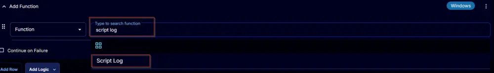

## Summary

This task deploys Perch Log Shipper on Windows machines.

## Sample Run

  
  
  

## Dependencies

[SWM - Software Install - Agnostic - Install - PerchLogShipper](/docs/41fd7a2b-4604-4ef1-bd74-c7a4325da37e)

## User Parameters

| Name  | Example              | Required  | Description                       |
|-------|----------------------|-----------|-----------------------------------|
| Token | hwu76-whduh-hhjdhj   | Mandatory | Populate it with an installation code. |


**Note:** 
- If no parameters are set, the script will throw an error: "Invalid Token does not contain a value."

## Task Creation

Install PerchLogShipper. Create a new `Script Editor` style script in the system to implement this task.

  


**Name:** Install PerchLogShipper  
**Description:** This task deploys Perch Log Shipper on Windows machines.  
**Category:** Custom  

  

### Parameters

Add a new parameter by clicking the `Add Parameter` button present at the top-right corner of the screen.

  

This screen will appear.  

  

- Set `Token` in the `Parameter Name` field.
- Select `Text String` from the `Parameter Type` dropdown menu.
- Click the `Save` button.

  

Click the `Confirm` button to save the parameter.

  

### Task

Navigate to the Script Editor section and start by adding a row. You can do this by clicking the `Add Row` button at the bottom of the script page.

  

A blank function will appear.

  

#### Row 1 Function: PowerShell Script

Search and select the `PowerShell Script` function.  

  
  

The following function will pop up on the screen:  

  

```powershell
# Parameters and Globals
# Be sure that the name of the hashtable property matches the name of the parameter of the script that you are calling.
$Token = '@Token@'
$Parameters = @{}
if ($Token.Length -gt 5) {
    $Parameters["Token"] = $Token
} else {
    throw "Invalid Token does not contain a value."
}

#region Setup - Variables
$ProjectName = 'Install-PerchLogShipper'
[Net.ServicePointManager]::SecurityProtocol = [enum]::ToObject([Net.SecurityProtocolType], 3072)
$BaseURL = 'https://file.provaltech.com/repo'
$PS1URL = "$BaseURL/script/$ProjectName.ps1"
$WorkingDirectory = "C:\\ProgramData\\_automation\\script\\$ProjectName"
$PS1Path = "$WorkingDirectory\\$ProjectName.ps1"
$Workingpath = $WorkingDirectory
$LogPath = "$WorkingDirectory\\$ProjectName-log.txt"
$ErrorLogPath = "$WorkingDirectory\\$ProjectName-Error.txt"
#endregion

#region Setup - Folder Structure
New-Item -Path $WorkingDirectory -ItemType Directory -ErrorAction SilentlyContinue | Out-Null
$response = Invoke-WebRequest -Uri $PS1URL -UseBasicParsing
if (($response.StatusCode -ne 200) -and (!(Test-Path -Path $PS1Path))) {
    throw "No pre-downloaded script exists and the script '$PS1URL' failed to download. Exiting."
} elseif ($response.StatusCode -eq 200) {
    Remove-Item -Path $PS1Path -ErrorAction SilentlyContinue
    [System.IO.File]::WriteAllLines($PS1Path, $response.Content)
}
if (!(Test-Path -Path $PS1Path)) {
    throw 'An error occurred and the script was unable to be downloaded. Exiting.'
}
#endregion

#region Execution
if ($Parameters) {
    & $PS1Path @Parameters
} else {
    & $PS1Path
}
#endregion
```

```powershell
if (!(Test-Path $LogPath)) {
    throw 'PowerShell Failure. A Security application seems to have restricted the execution of the PowerShell Script.'
}
if (Test-Path $ErrorLogPath) {
    $ErrorContent = (Get-Content -Path $ErrorLogPath)
    throw $ErrorContent
}
Get-Content -Path $LogPath
```

  

### Row 2 Function: Script Log

Add a new row by clicking the `Add Row` button.  
  

A blank function will appear.  
  

Search and select the `Script Log` function.  
  
  

The following function will pop up on the screen:  
  

In the script log message, simply type `%output%` and click the `Save` button.  
  

Click the `Save` button at the top-right corner of the screen to save the script.  
  

### Completed Task

  

## Output

- Script log