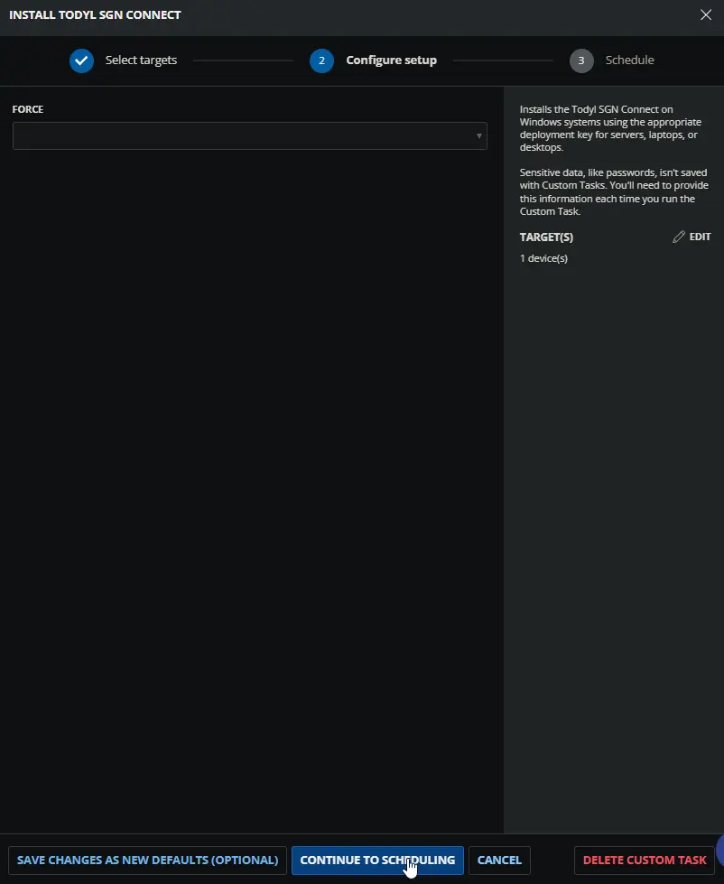
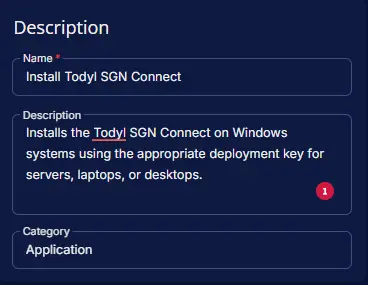
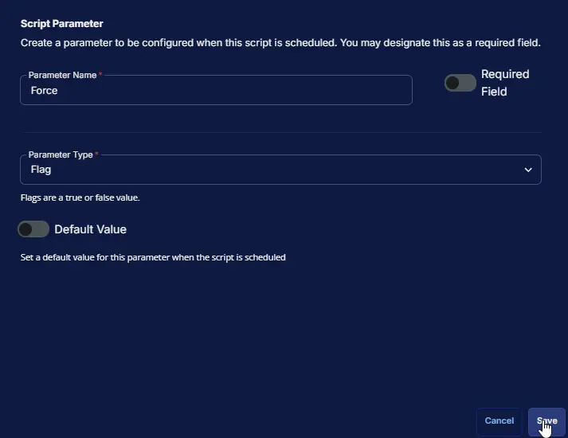
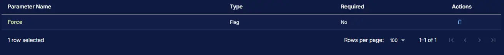
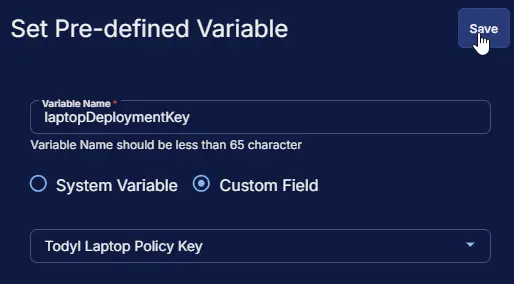
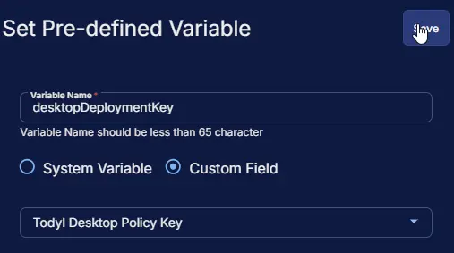
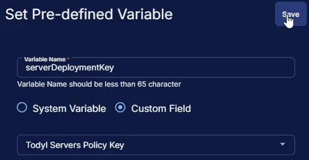
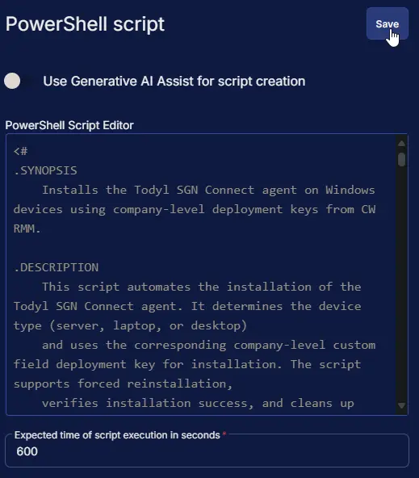
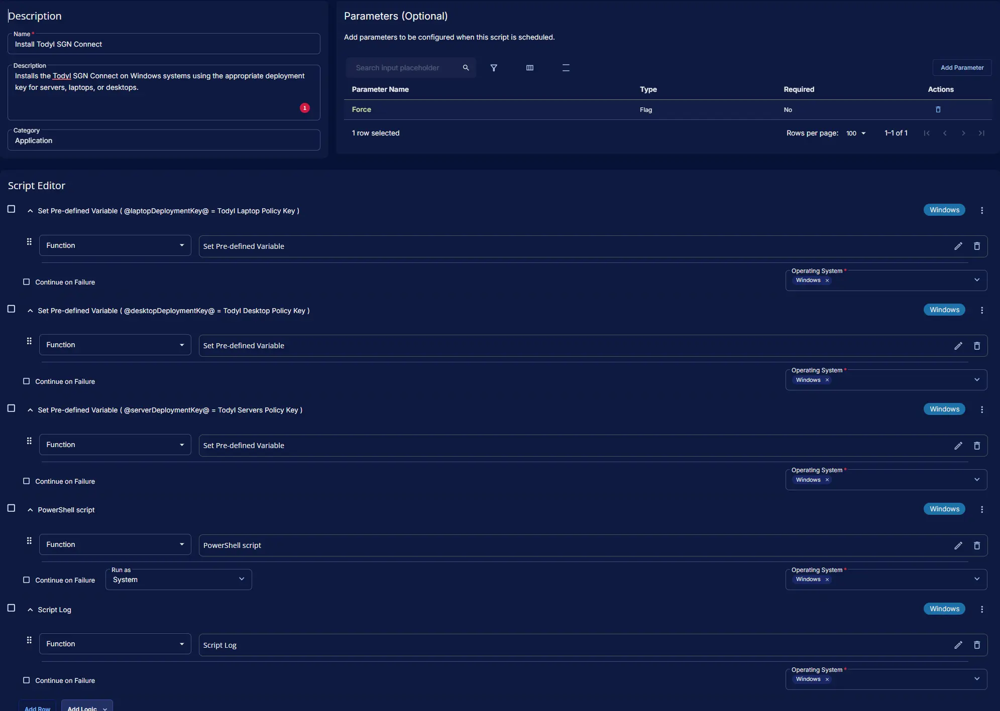

---
id: 'c23cdc78-f90e-4aba-b77e-4dff9d612940'
slug: /c23cdc78-f90e-4aba-b77e-4dff9d612940
title: 'Install Todyl SGN Connect'
title_meta: 'Install Todyl SGN Connect'
keywords: ['todyl', 'todyl-sgn-connect', 'deploy-todyl']
description: 'Installs the Todyl SGN Connect on Windows systems using the appropriate deployment key for servers, laptops, or desktops.'
tags: ['application', 'installation', 'security']
draft: false
unlisted: false
last_update:
  date: 2025-09-18
---

## Summary

Installs the Todyl SGN Connect on Windows systems using the appropriate deployment key for servers, laptops, or desktops.

## Dependencies

- [Todyl Desktop Policy Key](/docs/8656e3f6-5cfc-49b9-a700-cbf453744576)
- [Todyl Laptop Policy Key](/docs/894b9f2c-e0ac-4351-a312-f7f55865e32a)
- [Todyl Servers Policy Key](/docs/e7b46cfc-c872-4d3c-b317-2b59a6c9679d)
- [Solution: Todyl SGN Connect Deployment](/docs/41308550-ea69-4cca-aa0d-9e6f02fcab43)

## Sample Run

## User Parameters

| Name             | Example   | Accepted Values     | Required | Default | Type       | Description                                                                 |
|------------------|-----------|---------------------|----------|---------|------------|-----------------------------------------------------------------------------|
| Force   | `Yes`       | `Yes`, `No`             | `No`       | `No`      | `Flag`       | If enabled, forces installation even if SGN Connect is already installed. |

## Custom Fields

| Name                | Level   | Type | Required | Description                                    |
|---------------------|---------|------|----------|------------------------------------------------|
| Todyl Desktop Policy Key | Company | Text | Yes | Todyl Deployment Key for Desktop Agents. |
| Todyl Laptop Policy Key |  Company  | Text | Yes      | Todyl Deployment Key for Laptop Agents. |
| Todyl Servers Policy Key |  Company  | Text | Yes      | Todyl Deployment Key for Server Agents. |

## Task Setup Path

- **Tasks Path:** `AUTOMATION` ➞ `Tasks`  
- **Task Type:** `Script Editor`  

## Task Creation

### Description

- **Name:** `Install Todyl SGN Connect`  
- **Description:** `Installs the Todyl SGN Connect on Windows systems using the appropriate deployment key for servers, laptops, or desktops.`  
- **Category:** `Application`

### Parameters

| Parameter Name | Required Field | Parameter Type | Default Value |
| -------------- | -------------- | -------------- | ------------- |
| Force | Disabled | Flag | Disabled |

**Force:**  
    

### Script Editor

#### Row 1: Set Pre-defined Variable ( @laptopDeploymentKey@ = Todyl Laptop Policy Key )

- **Variable Name:** `laptopDeploymentKey`  
- **Type:** `Custom Field`  
- **Custom Field:** `Todyl Laptop Policy Key`  
- **Continue on Failure:** `False`  
- **Operating System:** `Windows`

#### Row 2: Set Pre-defined Variable ( @desktopDeploymentKey@ = Todyl Desktop Policy Key )

- **Variable Name:** `desktopDeploymentKey`  
- **Type:** `Custom Field`  
- **Custom Field:** `Todyl Desktop Policy Key`  
- **Continue on Failure:** `False`  
- **Operating System:** `Windows`

#### Row 3: Set Pre-defined Variable ( @serverDeploymentKey@ = Todyl Server Policy Key )

- **Variable Name:** `serverDeploymentKey`  
- **Type:** `Custom Field`  
- **Custom Field:** `Todyl Server Policy Key`  
- **Continue on Failure:** `False`  
- **Operating System:** `Windows`

#### Row 4: PowerShell script

- **Use Generative AI Assist for script creation:** `False`  
- **Expected time of script execution in seconds:** `600`  
- **Continue on Failure:** `False`  
- **Run As:** `System`  
- **Operating System:** `Windows`  
- **PowerShell Script Editor:**  

[PowerShell Script](https://github.com/ProVal-Tech/cw-rmm/blob/main/tasks/install-todyl-sgn-connect/script.ps1)

#### Row 5: Script Log

- **Script Log Message:** `%Output%`  
- **Operating System:** `Windows`

## Completed Script

## Output

- Script Log

## Changelog

### 2025-08-29

- Initial version of the document

