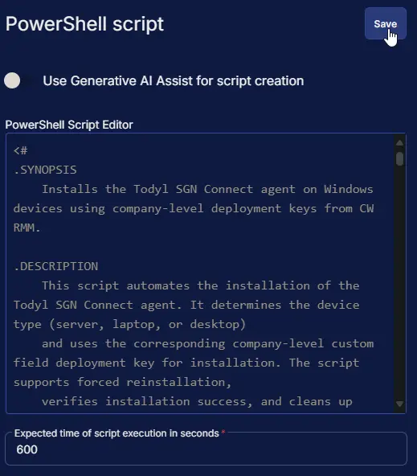
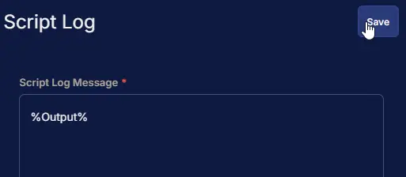

## Summary

Installs the Todyl SGN Connect on Windows systems using the appropriate deployment key for servers, laptops, or desktops.

## Dependencies

- [Todyl Desktop Policy Key](/docs/8656e3f6-5cfc-49b9-a700-cbf453744576)
- [Todyl Laptop Policy Key](/docs/894b9f2c-e0ac-4351-a312-f7f55865e32a)
- [Todyl Servers Policy Key](/docs/e7b46cfc-c872-4d3c-b317-2b59a6c9679d)
- [Solution: Todyl SGN Connect Deployment](/docs/41308550-ea69-4cca-aa0d-9e6f02fcab43)

## Sample Run


## User Parameters

| Name             | Example   | Accepted Values     | Required | Default | Type       | Description                                                                 |
|------------------|-----------|---------------------|----------|---------|------------|-----------------------------------------------------------------------------|
| Force   | `Yes`       | `Yes`, `No`             | `No`       | `No`      | `Flag`       | If enabled, forces installation even if SGN Connect is already installed. |

## Custom Fields

| Name                | Level   | Type | Required | Description                                    |
|---------------------|---------|------|----------|------------------------------------------------|
| Todyl Desktop Policy Key | Company | Text | Yes | Todyl Deployment Key for Desktop Agents. |
| Todyl Laptop Policy Key |  Company  | Text | Yes      | Todyl Deployment Key for Laptop Agents. |
| Todyl Servers Policy Key |  Company  | Text | Yes      | Todyl Deployment Key for Server Agents. |

## Task Setup Path

- **Tasks Path:** `AUTOMATION` ➞ `Tasks`  
- **Task Type:** `Script Editor`  

## Task Creation

### Description

- **Name:** `Install Todyl SGN Connect`  
- **Description:** `Installs the Todyl SGN Connect on Windows systems using the appropriate deployment key for servers, laptops, or desktops.`  
- **Category:** `Application`


### Parameters

| Parameter Name | Required Field | Parameter Type | Default Value |
| -------------- | -------------- | -------------- | ------------- |
| Force | Disabled | Flag | Disabled |

**Force:**  
    


### Script Editor

#### Row 1: Set Pre-defined Variable ( @laptopDeploymentKey@ = Todyl Laptop Policy Key )

- **Variable Name:** `laptopDeploymentKey`  
- **Type:** `Custom Field`  
- **Custom Field:** `Todyl Laptop Policy Key`  
- **Continue on Failure:** `False`  
- **Operating System:** `Windows`


#### Row 2: Set Pre-defined Variable ( @desktopDeploymentKey@ = Todyl Desktop Policy Key )

- **Variable Name:** `desktopDeploymentKey`  
- **Type:** `Custom Field`  
- **Custom Field:** `Todyl Desktop Policy Key`  
- **Continue on Failure:** `False`  
- **Operating System:** `Windows`


#### Row 3: Set Pre-defined Variable ( @serverDeploymentKey@ = Todyl Server Policy Key )

- **Variable Name:** `serverDeploymentKey`  
- **Type:** `Custom Field`  
- **Custom Field:** `Todyl Server Policy Key`  
- **Continue on Failure:** `False`  
- **Operating System:** `Windows`


#### Row 4: PowerShell script

- **Use Generative AI Assist for script creation:** `False`  
- **Expected time of script execution in seconds:** `600`  
- **Continue on Failure:** `False`  
- **Run As:** `System`  
- **Operating System:** `Windows`  
- **PowerShell Script Editor:**  

```PowerShell
<#
.SYNOPSIS
    Installs the Todyl SGN Connect agent on Windows devices using company-level deployment keys from CW RMM.

.DESCRIPTION
    This script automates the installation of the Todyl SGN Connect agent. It determines the device type (server, laptop, or desktop)
    and uses the corresponding company-level custom field deployment key for installation. The script supports forced reinstallation,
    verifies installation success, and cleans up temporary files.

.PARAMETER laptopDeploymentKey
    Company-level custom field named "Todyl Laptop Policy Key". Used for laptops.

.PARAMETER desktopDeploymentKey
    Company-level custom field named "Todyl Desktop Policy Key". Used for desktops.

.PARAMETER serverDeploymentKey
    Company-level custom field named "Todyl Server Policy Key". Used for servers.

.PARAMETER force
    If set to 1, Yes, or True, forces installation even if SGN Connect is already installed.

.NOTES
    - Requires administrative privileges.
    - Designed for use with CW RMM or similar remote management platforms.
    - Deployment keys must be provided via company-level custom fields.

.EXAMPLE
    .\Install-TodylAgentCWRMM.ps1
    Installs SGN Connect using the appropriate deployment key based on device type.

#>

#region Globals
$ErrorActionPreference = 'Stop'
$ProgressPreference = 'SilentlyContinue'
[Net.ServicePointManager]::SecurityProtocol = [Enum]::ToObject([Net.SecurityProtocolType], 3072)
#endRegion

#region Variables
$appName = 'SGN Connect'
$workingDirectory = '{0}\_Automation\Script\{1}' -f $env:ProgramData, $appName
$appPath = '{0}\SGNConnect_Latest.exe' -f $workingDirectory
$downloadURL = 'https://download.todyl.com/sgn_connect/SGNConnect_Latest.exe'
$sgnExecutablePath = 'C:\Program Files\SGN Connect\Current\sgnconnect.exe'
#endRegion

#region Functions
function Test-TodylInstall {
    [CmdletBinding()]
    [OutputType([bool])]
    param (
        [Parameter(Mandatory)][String]$SoftwareName
    )

    $uninstallPaths = @(
        'HKLM:\SOFTWARE\Microsoft\Windows\CurrentVersion\Uninstall',
        'HKLM:\SOFTWARE\Wow6432Node\Microsoft\Windows\CurrentVersion\Uninstall'
    )
    $uninstallInfo = Get-ChildItem $uninstallPaths -ErrorAction SilentlyContinue |
        Get-ItemProperty |
        Where-Object {
            $_.DisplayName -match [Regex]::Escape($SoftwareName)
        }
    if ($uninstallInfo) {
        return $true
    } else {
        return $false
    }
}
#endRegion

#region CW RMM Variables
$laptopDeploymentKey = '@laptopDeploymentKey@'
$desktopDeploymentKey = '@desktopDeploymentKey@'
$serverDeploymentKey = '@serverDeploymentKey@'
$force = '@Force@'
#endRegion

#region Set Script Variables
if ([String]::IsNullOrEmpty($laptopDeploymentKey) -or $laptopDeploymentKey -match 'laptopDeploymentKey@$' -or $laptopDeploymentKey -eq 'NA') {
    $laptopDeploymentKey = ''
}

if ([String]::IsNullOrEmpty($desktopDeploymentKey) -or $desktopDeploymentKey -match 'desktopDeploymentKey@$' -or $desktopDeploymentKey -eq 'NA') {
    $desktopDeploymentKey = ''
}

if ([String]::IsNullOrEmpty($serverDeploymentKey) -or $serverDeploymentKey -match 'serverDeploymentKey@$' -or $serverDeploymentKey -eq 'NA') {
    $serverDeploymentKey = ''
}

if ($force -match '1|Yes|True') {
    $force = $true
} else {
    $force = $false
}
#endRegion

#region Install Check
if (-not (Test-TodylInstall -SoftwareName $appName)) {
    Write-Information ('Todyl {0} is not installed. Proceeding with installation.' -f $appName) -InformationAction Continue
} elseif ($force) {
    Write-Information ('Todyl {0} is already installed and force parameter is enabled. Proceeding with installation.' -f $appName) -InformationAction Continue
} else {
    return ('Todyl {0} is already installed and force parameter is not enabled. Skipping installation.' -f $appName)
}
#endregion

#region Get Computer Information
$computerSystem = Get-CimInstance -ClassName Win32_ComputerSystem
$myOS = (Get-CimInstance -ClassName Win32_OperatingSystem).ProductType
#endRegion

#region Set Todyl Installation Key
if ($myOS -eq 1) {
    Write-Information ('Todyl {0} is a server. Setting installation key.' -f $appName) -InformationAction Continue
    if ($serverDeploymentKey -eq '') {
        throw ('Todyl {0} server deployment key not provided. Exiting installation.' -f $appName)
    } else {
        $todylKey = $serverDeploymentKey
    }
} elseif ($computerSystem.PCSystemType -eq 2) {
    Write-Information ('Todyl {0} is a laptop. Setting installation key.' -f $appName) -InformationAction Continue
    if ($laptopDeploymentKey -eq '') {
        throw ('Todyl {0} laptop deployment key not provided. Exiting installation.' -f $appName)
    } else {
        $todylKey = $laptopDeploymentKey
    }
} else {
    Write-Information ('Todyl {0} is a desktop. Setting installation key.' -f $appName) -InformationAction Continue
    if ($desktopDeploymentKey -eq '') {
        throw ('Todyl {0} desktop deployment key not provided. Exiting installation.' -f $appName)
    } else {
        $todylKey = $desktopDeploymentKey
    }
}
#endRegion

#region Working Directory
if ( !(Test-Path -Path $workingDirectory) ) {
    try {
        New-Item -Path $workingDirectory -ItemType Directory -Force -ErrorAction Stop | Out-Null
    } catch {
        throw ('Failed to Create {0}. Reason: {1}' -f $workingDirectory, $($Error[0].Exception.Message))
    }
}
#endRegion

#region Download
try {
    Invoke-WebRequest -Uri $downloadURL -OutFile $appPath -UseBasicParsing -ErrorAction Stop
} catch {
    throw ('Failed to download {0}. Reason: {1}' -f $appName, $($_.Exception.Message))
}
Unblock-File -Path $appPath -ErrorAction SilentlyContinue
#endRegion

#region Install SGN Connect
$arguments = @(
    '/Silent',
    '/DeployKey',
    "$todylKey"
)
try {
    $procInfo = Start-Process -FilePath $appPath -ArgumentList $arguments -Wait -PassThru
} catch {
    throw ('Failed to install {0}. Reason: {1}' -f $appName, $($Error[0].Exception.Message))
}
#endRegion

#region Run SGNConnect
if ($procInfo.ExitCode -eq 0) {
    if (Test-Path -Path $sgnExecutablePath) {
        Start-Process -FilePath $sgnExecutablePath
    } else {
        throw ('SGN Connect executable not found at expected path.')
    }
} else {
    throw ('{0} installation failed with exit code {1}.' -f $appName, $procInfo.ExitCode)
}
#endRegion

#region Install Verification
if (Test-TodylInstall -SoftwareName $appName) {
    return ('Todyl {0} installation completed successfully.' -f $appName)
} else {
    throw ('Todyl {0} installation failed with exit code {1}.' -f $appName, $procInfo.ExitCode)
}
#endregion

#region Cleanup
Remove-Item -Path $appPath -Force -ErrorAction SilentlyContinue
#endregion
```



#### Row 5: Script Log

- **Script Log Message:** `%Output%`  
- **Operating System:** `Windows`



## Completed Script


## Output

- Script Log
