## Summary
This script installs updates for Dell, HP, Lenovo, and Windows based on the parameters selected. If no options are specified, it defaults to installing Windows driver updates.

## Sample Run

#### Example 1

- Leave all parameters blank to install windows driver updates on machines.
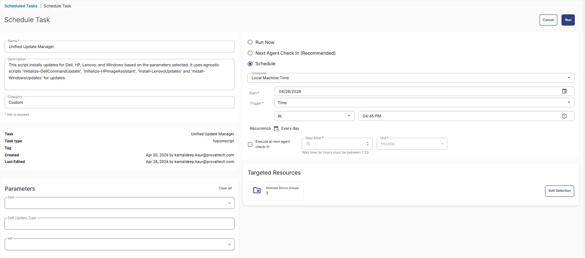

#### Example 2 

- Set `Windows_Update_Type` to `ALL` to install all types of windows updates and `Reboot` to `Yes` to immediately reboot the machine after windows updates.
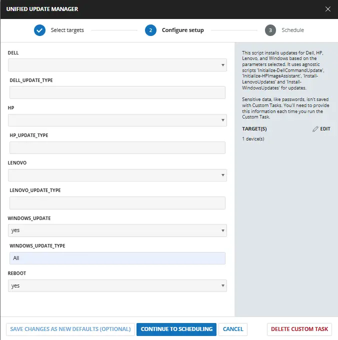

#### Example 3

- Set `Dell` to `Yes` and`Dell_Update_Type` to `All` to install all types of Dell updates on Dell machines and `Reboot` to `No` to not reboot the machine after updates.
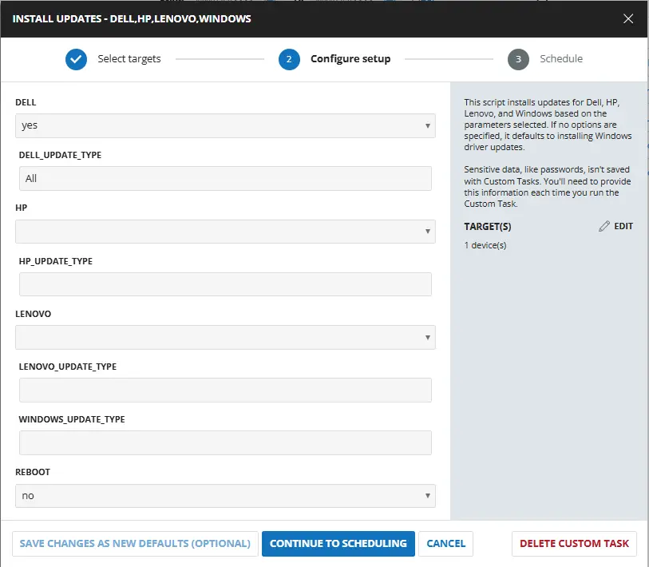

#### Example 4

- Set `Dell` to `Yes` and `Dell_Update_Type` to `All` to install all types of Dell updates on Dell machines. Set `HP` to `Yes` and  `HP_Update_Type` to `Bios,Firmware` to install just bios and firmware updates on HP machines and `Reboot` to `No` to not reboot the machine after updates.
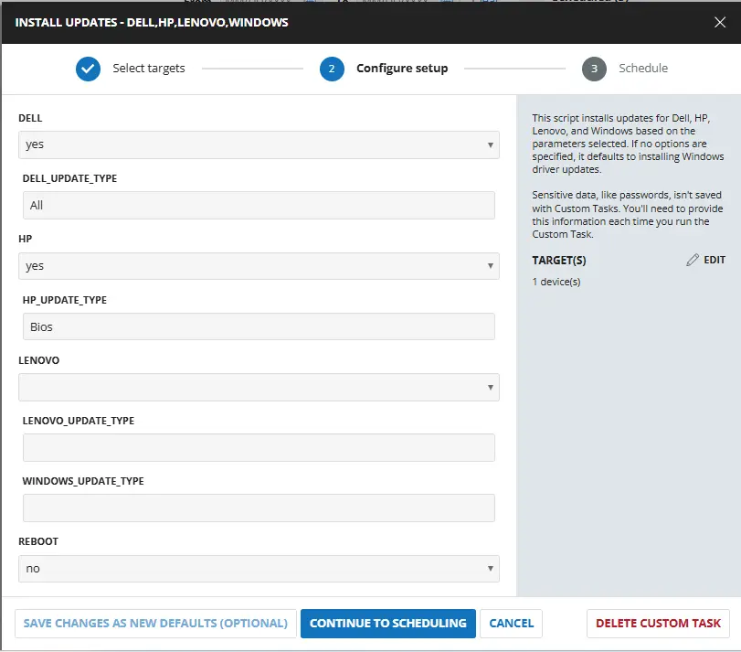

## Dependencies

## User Parameters

| Name | Example | Accepted Values | Required | Default | Type | Description |
| ---- | ------- | --------------- | -------- | ------- | ---- | ----------- |
| Dell | <ul><li>Yes</li></ul> | <ul><li>Yes</li><li>No</li></ul> | False |  | Flag | Set it to `Yes` to enable updates on dell machines. |
| Dell_Update_Type | <ul><li>Scan</li><li>All</li><li>Bios,Firmware</li></ul> | <ul><li>Scan</li><li>All</li><li>Bios</li><li>Firmware</li><li>Driver</li><li>Application</li></ul> | False |  | Text | Define the type of update to install on the Dell machine. Setting it to `Scan` will scan the updates. `All` will install all the updates. Define multiple updates by separating them with a comma i.e `bios,firmware,application`. It runs the [Agnostic - Initialize-DellCommandUpdate](/docs/aa963f3d-f149-4bfa-8fdc-30f12c21ce7f) for installing the updates. **If left blank, it will install driver updates on the machine. It will only work if Dell parameter is selected.**  |
| HP | <ul><li>Yes</li></ul> | <ul><li>Yes</li><li>No</li></ul> | False |  | Flag | Set it to `Yes` to enable updates on HP machines. |
| HP_Update_Type | <ul><li>Scan</li><li>All</li><li>Bios,firmware</li></ul> | <ul><li>Scan</li><li>All</li><li>Bios</li><li>Firmware</li><li>Driver</li><li>Application</li></ul> | False |  | Text | Define the type of update to install on the HP machine. Setting it to `Scan` will scan the updates. `All` will install all the updates. Define multiple updates by separating them with a comma i.e `bios,firmware,application`. It runs the [Agnostic script - Initialize-HPImageAssistant](/docs/92b749f0-2e30-4d4d-8916-fb5f30d85bff) for installing the updates. **If left blank, it will install driver updates on the machine. It will only work if HP parameter is selected.**  |
| Lenovo | <ul><li>Yes</li></ul> | <ul><li>Yes</li><li>No</li></ul> | False |  | Flag | Set it to `Yes to enable updates on Lenovo machines. |
| Lenovo_Update_Type | <ul><li>Scan</li><li>All</li><li>Bios,Firmware</li></ul> | <ul><li>Scan</li><li>All</li><li>Bios</li><li>Firmware</li><li>Driver</li><li>Application</li></ul> | False |  | Text | Define the type of update to install on the Lenovo machine. Setting it to `Scan` will scan the updates. `All` will install all the updates. Define multiple updates by separating them with a comma i.e `bios,firmware,application`. It runs the [Agnostic Script - Install-LenovoUpdates](/docs/3640e534-d089-4304-89ba-68d3bc113978) for installing the updates. **If left blank, it will install driver updates on the machine. It will only work if Lenovo parameter is selected.**  |
| Windows_Update_Type | <ul><li>All</li><li>Critical Updates,drivers,tools</li></ul> | <ul><li>All</li><li>Critical Updates</li><li>Security Updates</li><li>Update Rollups</li><li>Feature Packs</li><li>Service Packs</li><li>Definition Updates</li><li>Drivers</li><li>Tools</li><li>Updates</li></ul> | False |  | Text | Define the type of windows update to install. `All` will install all the updates. Define multiple updates by separating them with a comma i.e `Critical Updates,drivers,tools`. It runs the [Agnostic Script - Install-WindowsUpdates](/docs/3ccc8542-1961-4d3f-a54b-4a1bb9a78edd) for installing the updates. **If left blank, it will install windows driver updates on the machine.**  |
| Reboot | <ul><li>Yes</li></ul> | <ul><li>Yes</li><li>No</li></ul> | False |  | Flag | Set it to `Yes` to reboot the machine after installing the updates. It applies to all Dell, HP, Lenovo and windows updates. |

**Note** : If Dell is selected for a dell machine, script will only execute dell updates and not windows updates. Same goes for HP and lenovo

## Task Creation

### Script Details

#### Step 1

Navigate to `Automation` ➞ `Tasks`  


#### Step 2

Create a new `Script Editor` style task by choosing the `Script Editor` option from the `Add` dropdown menu  


The `New Script` page will appear on clicking the `Script Editor` button:  


#### Step 3

Fill in the following details in the `Description` section:  

- **Name:** `Install Updates - Dell,HP,Lenovo,Windows`  
- **Description:** `This script installs updates for Dell, HP, Lenovo, and Windows based on the parameters selected. If no options are specified, it defaults to installing Windows driver updates.`  
- **Category:** `Custom`

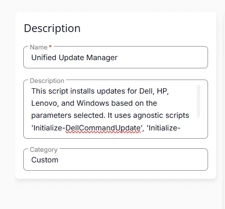

### Parameters

Locate the `Add Parameter` button on the right-hand side of the screen and click on it to create a new parameter.  


The `Add New Script Parameter` page will appear on clicking the `Add Parameter` button.  


#### Dell

- Set `Dell` in the `Parameter Name` field.  
- Select `Flag` from the `Parameter Type` dropdown menu.  
- Click the `Save` button. 


#### Dell_Update_Type

Add a new parameter by clicking the `Add Parameter` button present at the top-right corner of the screen.  

- Set `Dell_Update_Type` in the `Parameter Name` field.  
- Select `Text String` from the `Parameter Type` dropdown menu.  
- Click the `Save` button.  

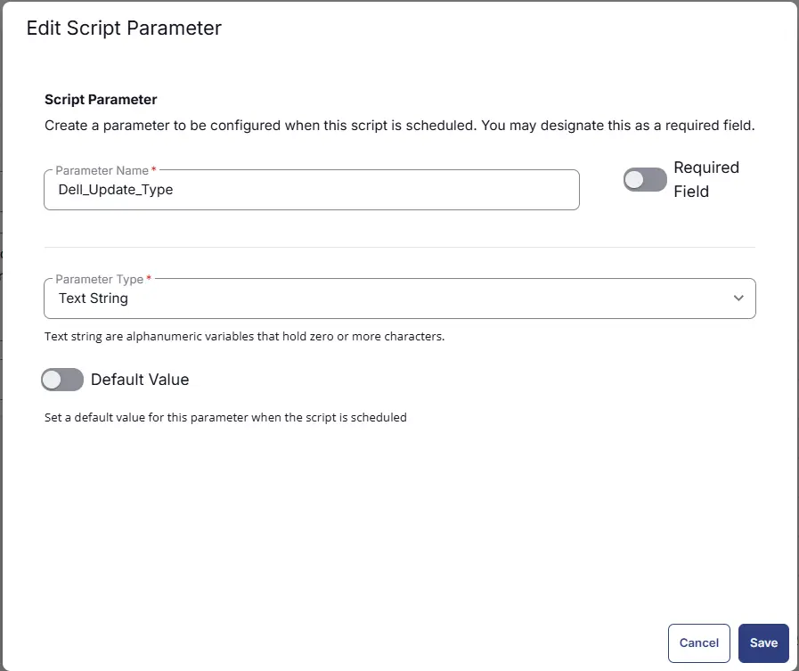

#### HP

Add a new parameter by clicking the `Add Parameter` button present at the top-right corner of the screen.  

- Set `HP` in the `Parameter Name` field.  
- Select `Flag` from the `Parameter Type` dropdown menu.  
- Click the `Save` button. 

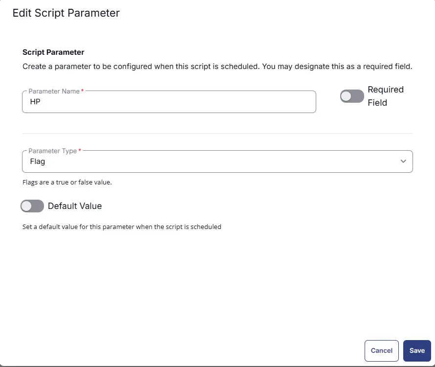

#### HP_Update_Type

Add a new parameter by clicking the `Add Parameter` button present at the top-right corner of the screen.  

- Set `HP_Update_Type` in the `Parameter Name` field.  
- Select `Text String` from the `Parameter Type` dropdown menu.  
- Click the `Save` button.  


#### Lenovo

Add a new parameter by clicking the `Add Parameter` button present at the top-right corner of the screen.  

- Set `Lenovo` in the `Parameter Name` field.  
- Select `Flag` from the `Parameter Type` dropdown menu.  
- Click the `Save` button. 

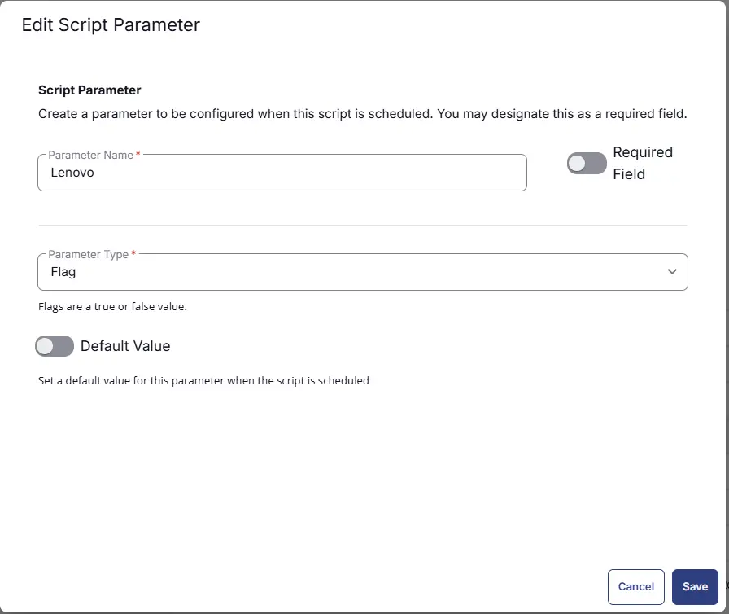

#### Lenovo_Update_Type

Add a new parameter by clicking the `Add Parameter` button present at the top-right corner of the screen.  

- Set `Lenovo_Update_Type` in the `Parameter Name` field.  
- Select `Text String` from the `Parameter Type` dropdown menu.  
- Click the `Save` button.  


#### Windows_Update_Type

Add a new parameter by clicking the `Add Parameter` button present at the top-right corner of the screen.  

- Set `Windows_Update_Type` in the `Parameter Name` field.  
- Select `Text String` from the `Parameter Type` dropdown menu.  
- Click the `Save` button.  

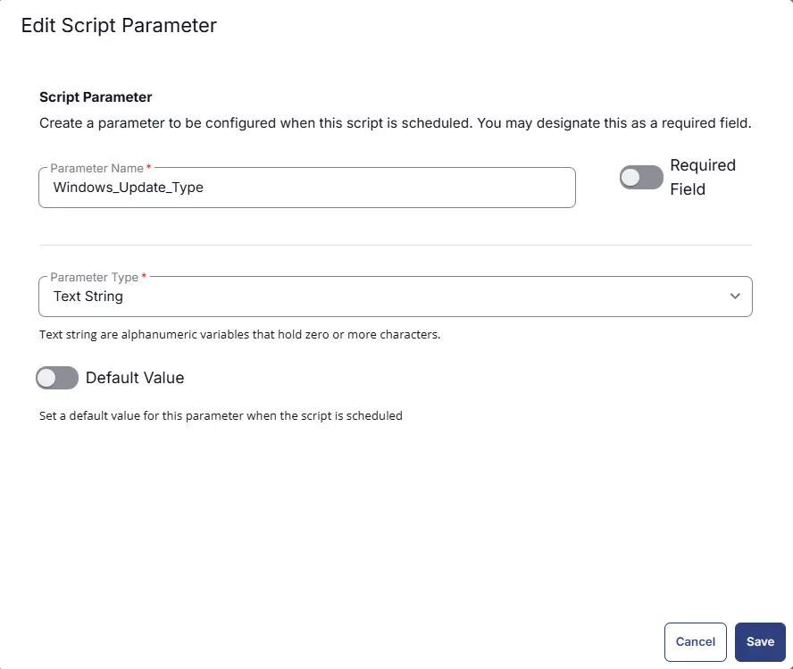

#### Reboot

Add a new parameter by clicking the `Add Parameter` button present at the top-right corner of the screen.  

- Set `Reboot` in the `Parameter Name` field.  
- Select `Flag` from the `Parameter Type` dropdown menu.  
- Set `False` as `Default` Value
- Click the `Save` button. 

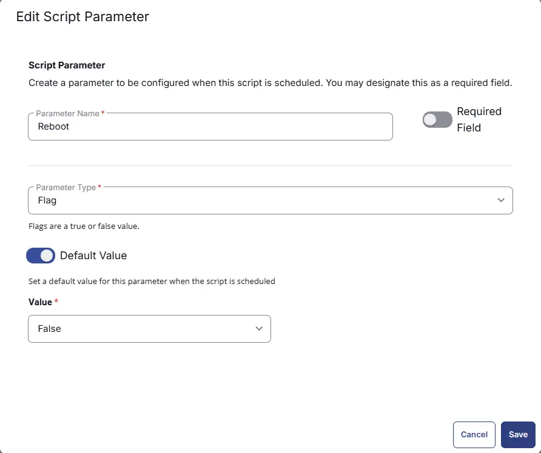

### Script Editor

Click the `Add Row` button in the `Script Editor` section to start creating the script  


A blank function will appear:  


#### Row 1 Function: `PowerShell Script`

Search and select the `PowerShell Script` function.  
 
  

The following function will pop up on the screen:  
  

Paste in the following PowerShell script and set the `Expected time of script execution in seconds` to `600` seconds. Click the `Save` button.

```powershell

$Dell = '@Dell@'
$HP = '@HP@'
$Lenovo = '@Lenovo@'
$Reboot = '@Reboot@'
$Dell_Update_Type = '@Dell_Update_Type@'
$HP_Update_Type = '@HP_Update_Type@'
$Lenovo_Update_Type = '@Lenovo_Update_Type@'
$windows_Update_Type = "@windows_Update_Type@"

$manufacturer = (Get-CimInstance Win32_ComputerSystem).Manufacturer
$ProjectName = switch -Regex ($manufacturer) {
    'Dell' {
        if ($Dell -match '1|Yes|True|Y') {
            'Initialize-DellCommandUpdate'
        }
        else {
            'Install-WindowsUpdates'
        }
    }
    'HP|Hewlett' {
        if ($HP -match '1|Yes|True|Y' ) {
            'Initialize-HPImageAssistant'
        }
        else {
            'Install-WindowsUpdates'
        }
    }
    'Lenovo' {
        if ($Lenovo -match '1|Yes|True|Y' ) {
            'Install-LenovoUpdates'
        }
        else {
            'Install-WindowsUpdates'
        }
    }
    default { 'Install-WindowsUpdates' }
}

switch ($ProjectName) {
    'Initialize-DellCommandUpdate' {
        # Special case: Scan
        if ($Dell_Update_Type -match 'scan') {
            $Parameters = @{
                Argument = '/scan -silent'
            }
            break
        }

        # Build UpdateType
        if ($Dell_Update_Type -eq 'All') {
            $typeString = 'bios,firmware,driver,application'
        }
        else {
            $types = @()

            if ($Dell_Update_Type -match 'bios')        { $types += 'bios' }
            if ($Dell_Update_Type -match 'firmware')    { $types += 'firmware' }
            if ($Dell_Update_Type -match 'driver')      { $types += 'driver' }
            if ($Dell_Update_Type -match 'application') { $types += 'application' }

            if (-not $types) {
                $types = @('driver')  # fallback
            }

            $typeString = ($types -join ',')
        }

        # Build Reboot parameter
        $rebootArg = ''
        if ($Reboot -notmatch '1|Yes|True|Y') {
            $rebootArg = ' -reboot=disable'
        }

        # Final Argument
        $Parameters = @{
            Argument = "/applyUpdates -updateType=$typeString $rebootArg -silent -forceupdate=enable"
        }
    }

    'Initialize-HPImageAssistant' {

        # Special case: Scan (Analyze only, no install)
        if ($HP_Update_Type -match 'scan') {
            $Parameters = @{
                Argument = ''
            }
            break
        }

        # Build Category
        if ($HP_Update_Type -eq 'All') {
            $typeString = 'BIOS,Drivers,Firmware,Software'
        }
        else {
            $types = @()

            if ($HP_Update_Type -match 'bios')        { $types += 'BIOS' }
            if ($HP_Update_Type -match 'firmware')    { $types += 'Firmware' }
            if ($HP_Update_Type -match 'driver')      { $types += 'Drivers' }
            if ($HP_Update_Type -match 'application') { $types += 'Software' }

            if (-not $types) {
                $types = @('Drivers')  # fallback
            }

            $typeString = ($types -join ',')
        }

        $Parameters = @{
            Argument = "/Operation:Analyze /Category:$typeString /Selection:Recommended /Action:Install /Silent /AutoCleanup /ReportFilePath:`"C:\ProgramData\_Automation\App\HPImageAssistant\InstallReport`""
        }
    }

    'Install-LenovoUpdates' {

        # Special case: Scan
        if ($Lenovo_Update_Type -match 'scan') {
            $Parameters = @{
            }
            break
        }

        # Build UpdateType
        if ($Lenovo_Update_Type -eq 'All') {
            $typeString = 'bios,firmware,driver,application'
        }
        else {
            $types = @()

            if ($Lenovo_Update_Type -match 'bios')        { $types += 'bios' }
            if ($Lenovo_Update_Type -match 'firmware')    { $types += 'firmware' }
            if ($Lenovo_Update_Type -match 'driver')      { $types += 'driver' }
            if ($Lenovo_Update_Type -match 'application') { $types += 'application' }

            if (-not $types) {
                $types = @('driver')
            }

            $typeString = ($types -join ',')
        }

        # Build Reboot parameter
        $rebootArg = ''
        if ($Reboot -notmatch '1|Yes|True|Y') {
            $rebootArg = 'True'
        }

        # Final Argument
        $Parameters = @{
            Type = $typeString
            NoReboot = $rebootArg

        }
    }

    default {

        # Build UpdateType
        if ($windows_Update_Type -eq 'All') {
            $types = @(
                'Critical Updates','Security Updates','Update Rollups','Feature Packs',
                'Service Packs','Definition Updates','Drivers','Tools','Updates'
            )
        }
        else {
            $validTypes = @(
                'Critical Updates','Security Updates','Update Rollups','Feature Packs',
                'Service Packs','Definition Updates','Drivers','Tools','Updates'
            )

            $inputTypes = $windows_Update_Type -split ',' | ForEach-Object { $_.Trim() }

            $types = $validTypes | Where-Object { $inputTypes -contains $_ }

            if (-not $types) {
                $types = @('Drivers')
            }
        }

        # Build Reboot parameter
        $NoReboot = $true
        if ($Reboot -match '1|Yes|True|Y'){
            $NoReboot = $false
        }

        # Final Parameters (IMPORTANT FIX)
        $Parameters = @{
            Category = $types        # <-- array, NOT string, NOT quoted
            AllowReboot = $NoReboot
        }
    }
}

#region globals
$ProgressPreference = 'SilentlyContinue'
$WarningPreference = 'SilentlyContinue'
#endRegion

#region variables
$workingDirectory = '{0}\_Automation\Script\{1}' -f $env:ProgramData, $projectName
$scriptPath = '{0}\{1}.ps1' -f $workingDirectory, $projectName
$logPath = '{0}\{1}-log.txt' -f $workingDirectory, $projectName
$errorLogPath = '{0}\{1}-error.txt' -f $workingDirectory, $projectName
$baseUrl = 'https://contentrepo.net/repo'
$scriptUrl = '{0}/script/{1}.ps1' -f $baseUrl, $projectName
#endRegion

#region working Directory
if (!(Test-Path -Path $workingDirectory)) {
    try {
        New-Item -Path $workingDirectory -ItemType Directory -Force -ErrorAction Stop | Out-Null
    } catch {
        throw ('Failed to Create working directory {0}. Reason: {1}' -f $workingDirectory, $($Error[0].Exception.Message))
    }
}


#region set tls policy
$supportedTLSversions = [enum]::GetValues('Net.SecurityProtocolType')
if (($supportedTLSversions -contains 'Tls13') -and ($supportedTLSversions -contains 'Tls12')) {
    [System.Net.ServicePointManager]::SecurityProtocol = [System.Net.ServicePointManager]::Tls13 -bor [System.Net.SecurityProtocolType]::Tls12
} elseif ($supportedTLSversions -contains 'Tls12') {
    [System.Net.ServicePointManager]::SecurityProtocol = [System.Net.SecurityProtocolType]::Tls12
} else {
    Write-Information 'TLS 1.2 and/or TLS 1.3 are not supported on this system. This download may fail!' -InformationAction Continue
    if ($PSVersionTable.PSVersion.Major -lt 3) {
        Write-Information 'PowerShell 2 / .NET 2.0 doesn''t support TLS 1.2.' -InformationAction Continue
    }
}
#endRegion

#region download script
try {
    Invoke-WebRequest -Uri $scriptUrl -OutFile $scriptPath -UseBasicParsing -ErrorAction Stop
} catch {
    if (!(Test-Path -Path $scriptPath)) {
        throw ('Failed to download the script from ''{0}'', and no local copy of the script exists on the machine. Reason: {1}' -f $scriptUrl, $($Error[0].Exception.Message))
    }
}
#endRegion

#region execute script
if ($parameters) {
    & $scriptPath @parameters
} else {
    & $scriptPath
}
#endRegion

#region log verification
if (!(Test-Path -Path $logPath )) {
    throw ('Failed to run the agnostic script ''{0}''. A security application seems to have interrupted the script.' -f $scriptPath)
} else {
    $content = Get-Content -Path $logPath
    $logContent = $content[ $($($content.IndexOf($($content -match "$($projectName)$")[-1])) + 1)..$($content.length - 1) ]
    Write-Information ('Log Content: {0}' -f ($logContent | Out-String)) -InformationAction Continue
}

if ((Test-Path -Path $errorLogPath)) {
    $errorLogContent = Get-Content -Path $errorLogPath -ErrorAction SilentlyContinue
    throw ('Error log Content: {0}' -f ($errorLogContent | Out-String -ErrorAction SilentlyContinue))
}
#endRegion

```


### Row 2 Function: Script Log

Add a new row by clicking the `Add Row` button.  
  

A blank function will appear.  
  

Search and select the `Script Log` function.  
  
 

In the script log message, simply type `%output%` and click the `Save` button.  


## Save Task

Click the `Save` button at the top-right corner of the screen to save the script.  


## Completed Task

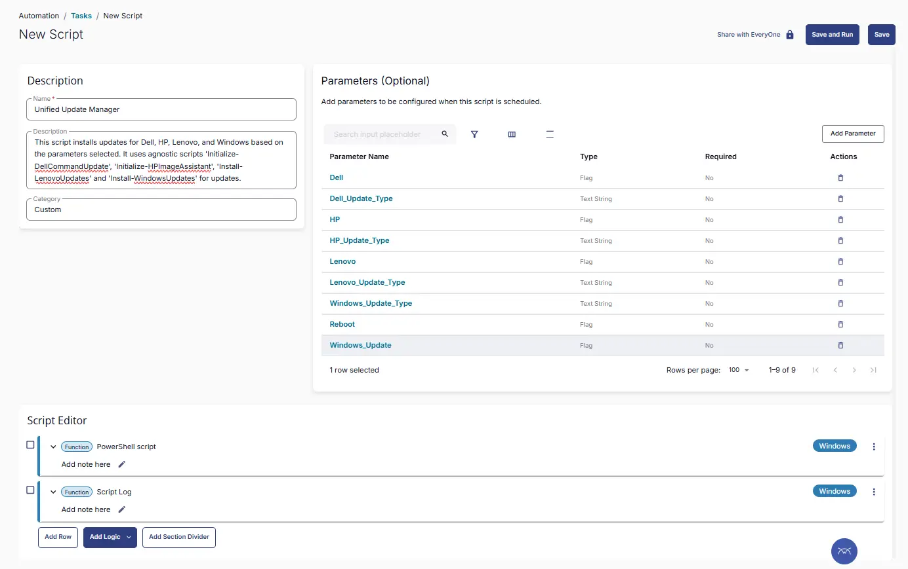


## Output

- Script Output

## Schedule Task

### Task Details

- **Name:** `Install Updates - Dell, HP, Lenovo, Windows`  
- **Description:** `This script installs updates for Dell, HP, Lenovo, and Windows based on the parameters selected. If no options are specified, it defaults to installing Windows driver updates.`  
- **Category:** `Custom`


### Parameters

- Select the parameters as per requirement. For more details on parameters refer User parameter section in this document

### Schedule

- **Schedule Type:**  `Schedule`  
- **Timezone:** `Local Machine Time`  
- **Start:** `<Current Date>`  
- **Trigger:** `Time` `At` `<Current Time>`  
- **Recurrence:** `Every Day`
- **Execute at next agent check-in** `Not selected`

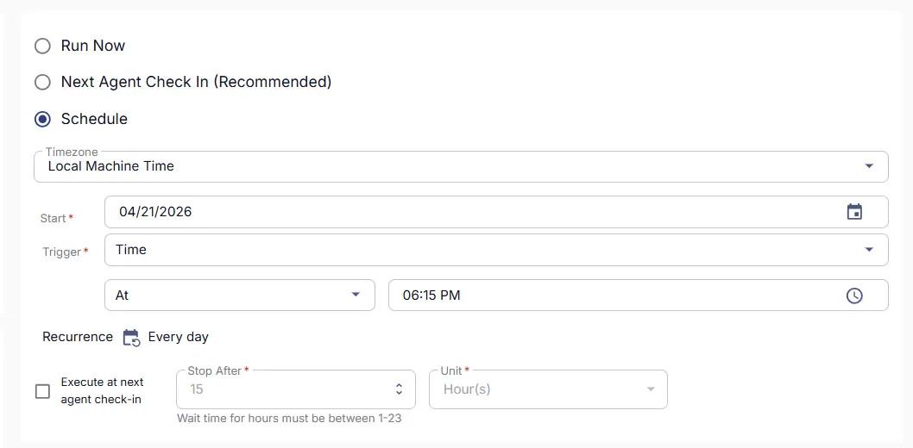

### Targeted Resource

**Device Group:** `Deploy All Updates`

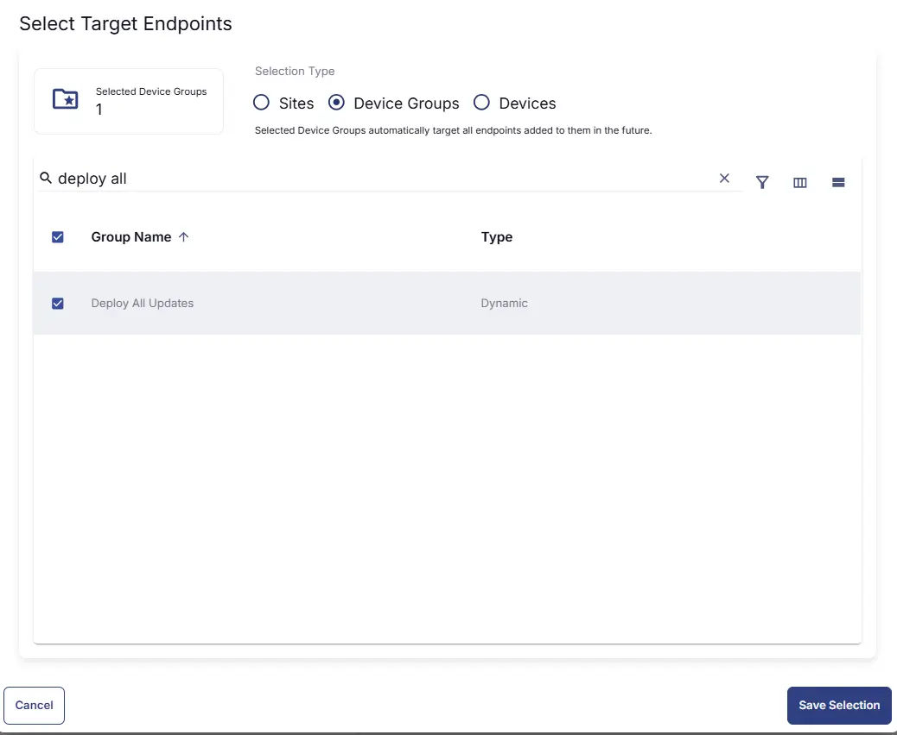


### Completed Scheduled Task


## Changelog

### 2026-04-21

- Initial version of the document