## Summary

This document describes the CW RMM implementation of the agnostic script [Install-WindowsFeatureUpdate](/docs/837e00a9-4fde-4457-9516-591da7ba4da0).

The script automates the installation of the latest Windows 11 Feature Update. It performs comprehensive pre-checks, maintenance, and validation to ensure a smooth upgrade process.

The script supports both Windows 10 and Windows 11:

- For Windows 10, it attempts to upgrade to the latest available version of Windows 11.  
- For Windows 11, it ensures the system is updated to the latest available feature update.

**Important Notes:**

1. The script does not track progress or results. It simply initiates the agnostic script.
2. The computer may restart up to seven times during the process. The agnostic script re-schedules itself through a startup scheduled task to continue the process after each reboot.
3. The `NoReboot` parameter may not reliably prevent reboots. The script attempts to install missing drivers, firmware, and BIOS updates, which may force a restart regardless of this parameter. Use this parameter with caution.
4. It is recommended to initiate the script after business hours and ensure the computer remains connected to AC power. The entire process may take up to six hours in some cases, though it typically completes within two hours.
5. Be aware of [known issues](https://learn.microsoft.com/en-us/windows/release-health/status-windows-11-24h2) with the feature update 24H2 before using the script.

## Requirements

- Windows 10 or Windows 11
- Administrative privileges
- Internet connectivity
- At least 64GB of free space on the system drive
- [Windows 11 Compatible Machine](https://www.microsoft.com/en-us/windows/windows-11-specifications)

## Sample Run

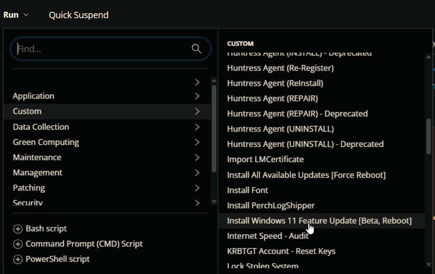  
  


## Dependencies

- [Install-WindowsFeatureUpdate](/docs/837e00a9-4fde-4457-9516-591da7ba4da0)

## User Parameters

| Name | Example | Accepted Values | Required | Default | Type | Description |
| ---- | ------- | --------------- | -------- | ------- | ---- | ----------- |
| NoReboot | | | False | | Flag | If enabled, the script will attempt to suppress reboots. However, reboots may still occur due to driver, firmware, or feature update requirements. Use this parameter judiciously. |

## Task Creation

### Script Details

#### Step 1

Navigate to `Automation` ➞ `Tasks`  
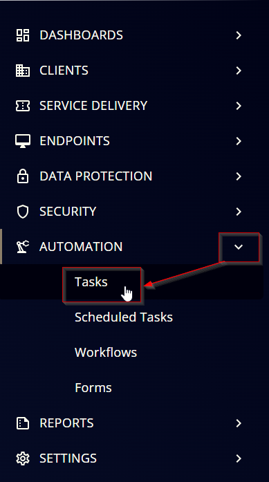

#### Step 2

Create a new `Script Editor` style task by choosing the `Script Editor` option from the `Add` dropdown menu  
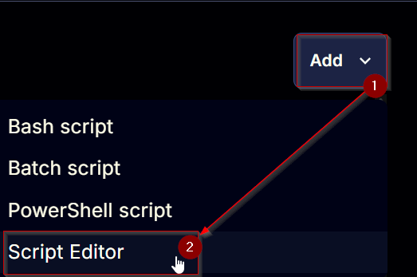

The `New Script` page will appear on clicking the `Script Editor` button:  
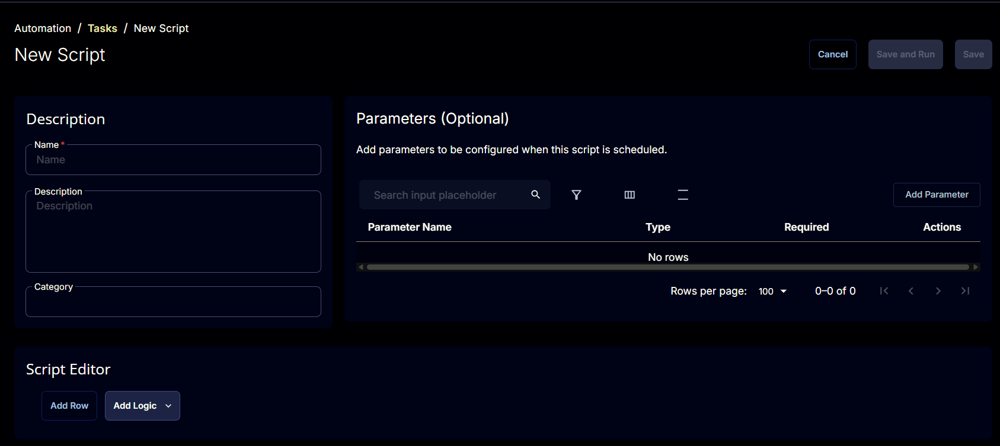

#### Step 3

Fill in the following details in the `Description` section:  

**Name:** `Install Windows 11 Feature Update [Beta, Reboot]`  
**Description:** `The script automates the installation of the latest Windows 11 Feature Update. It performs comprehensive pre-checks, maintenance, and validation to ensure a smooth upgrade process. The script can restart the computer up to seven times.`  
**Category:** `Custom`

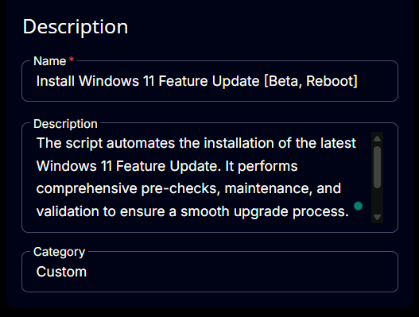

### Parameters

#### NoReboot

Locate the `Add Parameter` button on the right-hand side of the screen and click on it to create a new parameter.  


The `Add New Script Parameter` page will appear on clicking the `Add Parameter` button.  
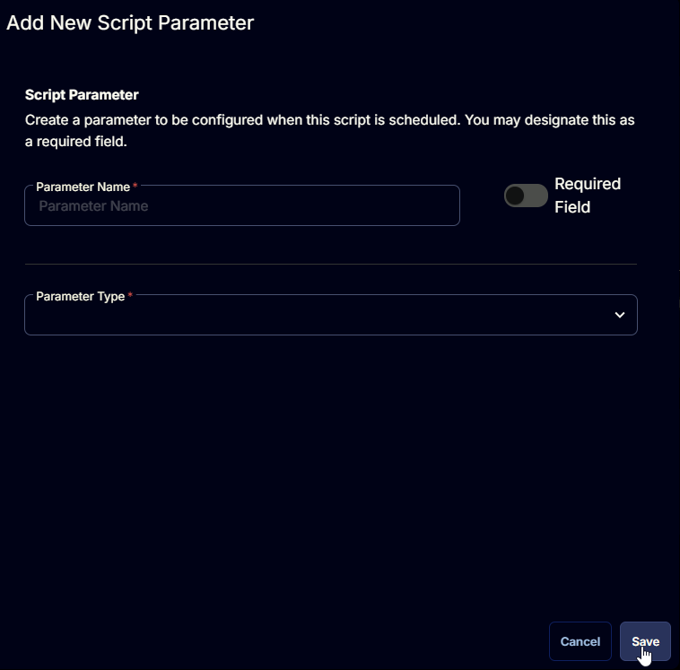

- Set `NoReboot` in the `Parameter Name` field.  
- Select `Flag` from the `Parameter Type` dropdown menu.  
- Click the `Save` button.

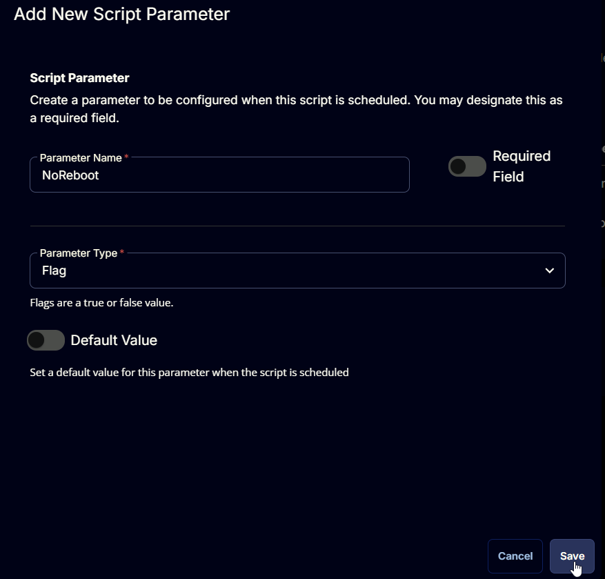

### Script Editor

Click the `Add Row` button in the `Script Editor` section to start creating the script  


A blank function will appear:  
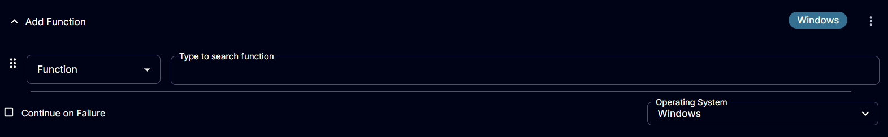

#### Row 1 Function: PowerShell

Search and select the `PowerShell Script` function.  
  
  

The following function will pop up on the screen:  


Paste in the following PowerShell script and set the `Expected time of script execution in seconds` to `7200` seconds. Click the `Save` button.

```PowerShell
#region parameters
$noReboot = '@NoReboot@'
if ( $noReboot -match '1|Yes|True') {
    $Parameters = @{
        NoReboot = $true
    }
}
#endregion
#region Setup - Variables
$ProjectName = 'Install-Windows11FeatureUpdate'
[Net.ServicePointManager]::SecurityProtocol = [enum]::ToObject([Net.SecurityProtocolType], 3072)
Set-ExecutionPolicy -ExecutionPolicy Bypass -Scope Process -Force -Confirm:$false -ErrorAction SilentlyContinue -WarningAction SilentlyContinue
$BaseURL = 'https://file.provaltech.com/repo'
$PS1URL = "$BaseURL/script/$ProjectName.ps1"
$WorkingDirectory = "C:\ProgramData\_automation\script\$ProjectName"
$PS1Path = "$WorkingDirectory\$ProjectName.ps1"
$WorkingPath = $WorkingDirectory
$LogPath = "$WorkingDirectory\$ProjectName-log.txt"
$ErrorLogPath = "$WorkingDirectory\$ProjectName-Error.txt"
#endregion
#region Setup - Folder Structure
New-Item -Path $WorkingDirectory -ItemType Directory -ErrorAction SilentlyContinue | Out-Null
$response = Invoke-WebRequest -Uri $PS1URL -UseBasicParsing
if (($response.StatusCode -ne 200) -and (!(Test-Path -Path $PS1Path))) {
    throw "No pre-downloaded script exists and the script '$PS1URL' failed to download. Exiting."
} elseif ($response.StatusCode -eq 200) {
    Remove-Item -Path $PS1Path -ErrorAction SilentlyContinue
    [System.IO.File]::WriteAllLines($PS1Path, $response.Content)
}
if (!(Test-Path -Path $PS1Path)) {
    throw 'An error occurred and the script was unable to be downloaded. Exiting.'
}
#endregion
#region Execution
if ($Parameters) {
    & $PS1Path @Parameters
} else {
    & $PS1Path
}
#endregion
#region log verification
if ( !(Test-Path $LogPath) ) {
    throw 'PowerShell Failure. A Security application seems to have restricted the execution of the PowerShell Script.'
}
if ( Test-Path $ErrorLogPath ) {
    $ErrorContent = ( Get-Content -Path $ErrorLogPath )
    throw $ErrorContent
}
Get-Content -Path $LogPath
#endregion
```

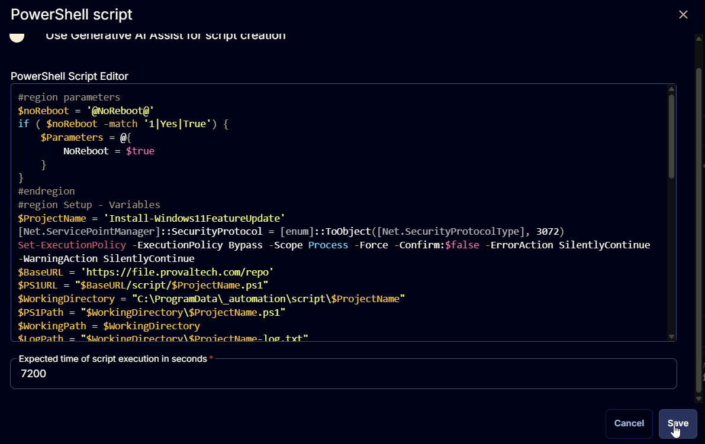

### Row 2 Function: Script Log

Add a new row by clicking the `Add Row` button.  


A blank function will appear.  


Search and select the `Script Log` function.  
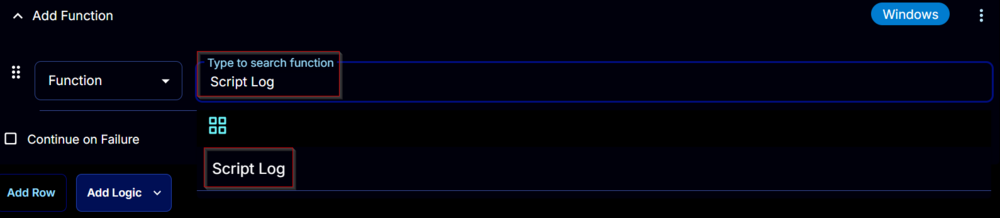

The following function will pop up on the screen:  


In the script log message, simply type `%Output%` and click the `Save` button.  


## Save Task

Click the `Save` button at the top-right corner of the screen to save the script.  


## Completed Task

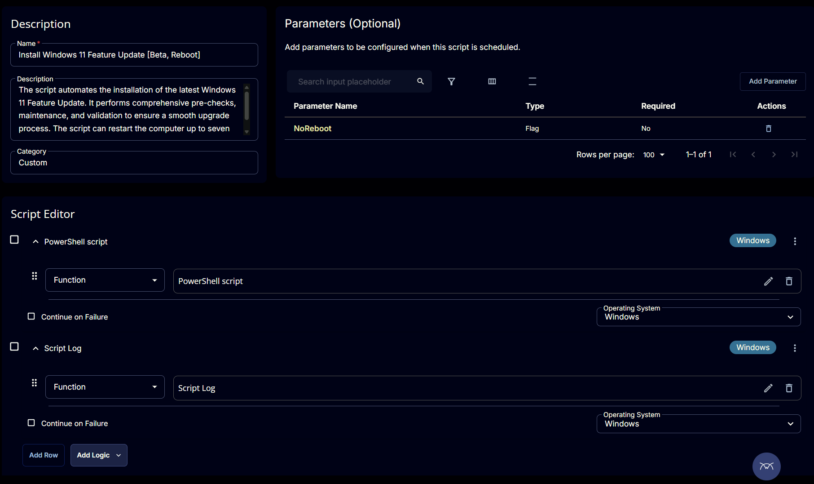

## Output

- Script Log