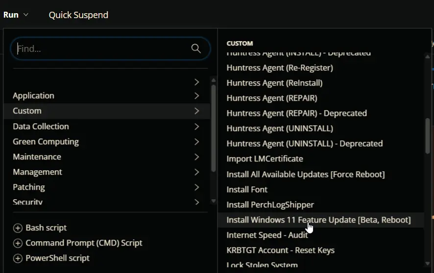
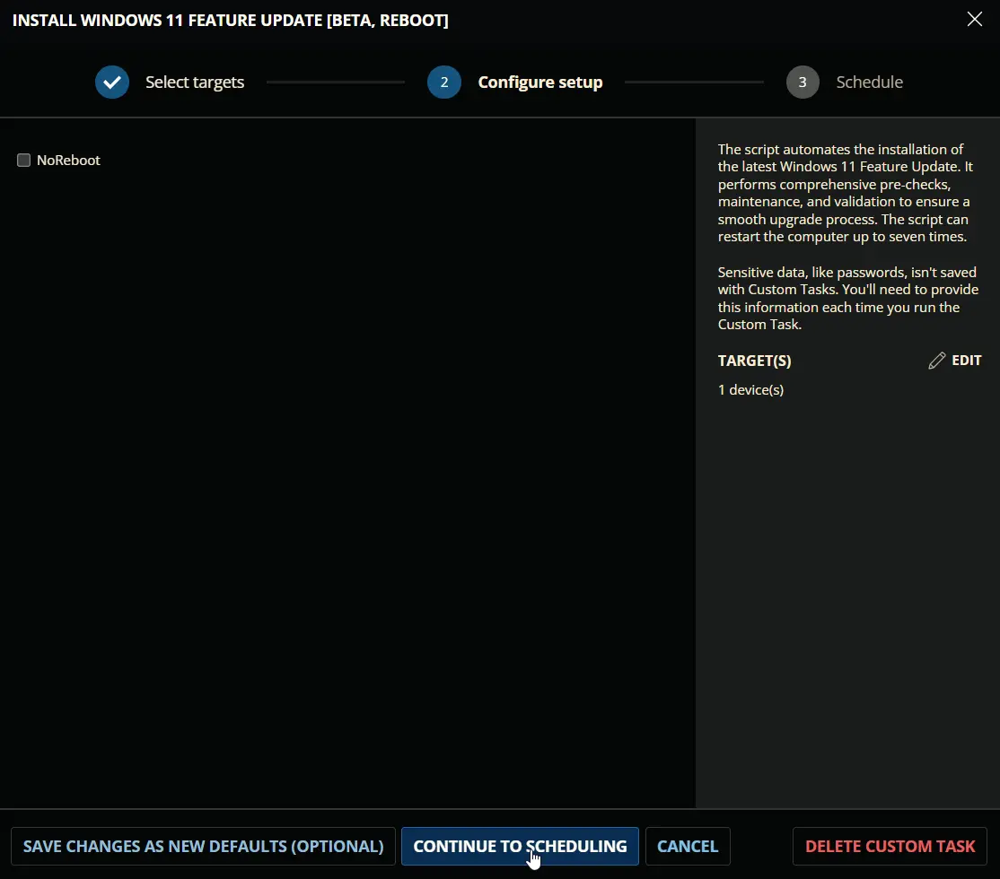
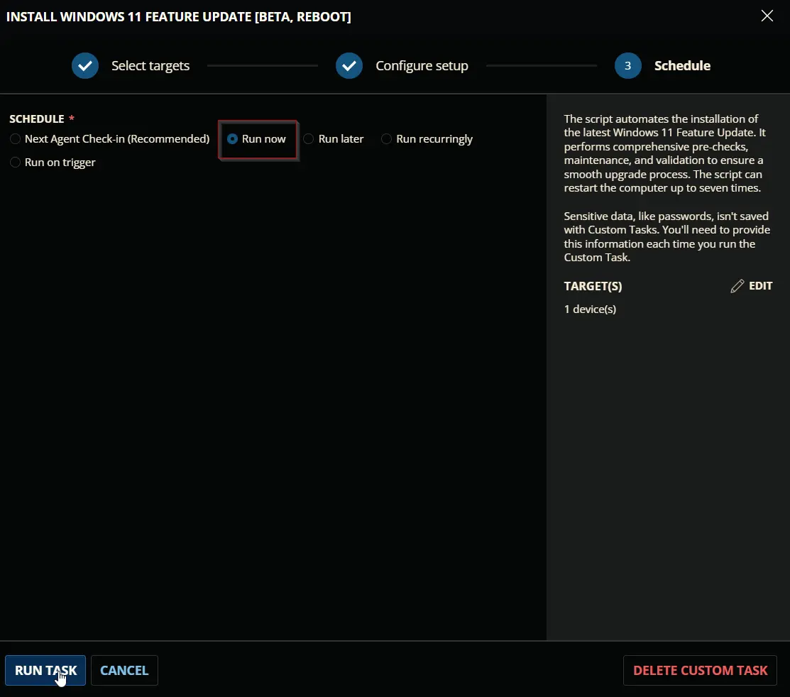
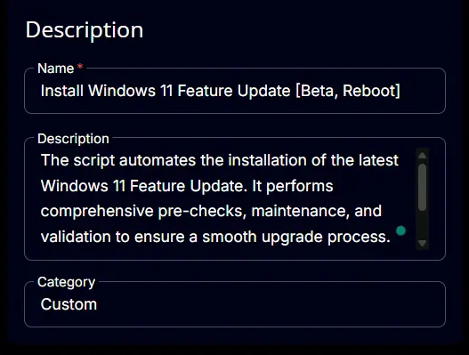
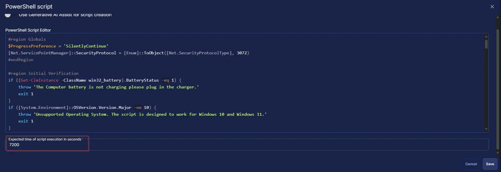
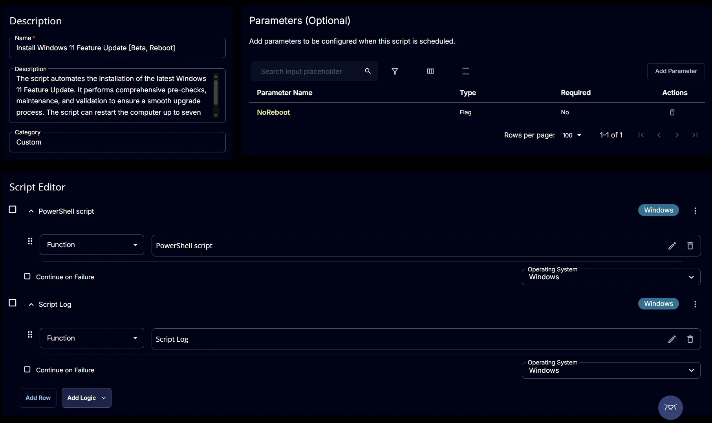

---
id: 'b397d199-6675-451a-b2fc-eba5fd57031a'
slug: /b397d199-6675-451a-b2fc-eba5fd57031a
title: 'Install Windows 11 Feature Update [Beta, Reboot]'
title_meta: 'Install Windows 11 Feature Update [Beta, Reboot]'
keywords: ['install', 'feature update', 'upgrade', 'windows', 'windows 11', 'troubleshooting', 'reboot']
description: 'The script automates the installation of the latest Windows 11 Feature Update. It performs comprehensive pre-checks, maintenance, and validation to ensure a smooth upgrade process.'
tags: ['installation', 'update', 'windows']
draft: false
unlisted: false
last_update:
  date: 2025-09-04
---

## Summary

This document describes the CW RMM implementation of the agnostic script [Install-WindowsFeatureUpdate](/docs/837e00a9-4fde-4457-9516-591da7ba4da0).

The script automates the installation of the latest Windows 11 Feature Update. It performs comprehensive pre-checks, maintenance, and validation to ensure a smooth upgrade process.

The script supports both Windows 10 and Windows 11:

- For Windows 10, it attempts to upgrade to the latest available version of Windows 11.  
- For Windows 11, it ensures the system is updated to the latest available feature update.

**Important Notes:**

1. This task creates and schedules a Windows Scheduled Task to run the agnostic script, then exits immediately. Therefore, any log messages shown by the task—other than incompatibility errors—should not be considered the actual cause of failure. However, the upgrade process continues to run in the background on the machine. The progress can be monitored by reviewing the log files located at `C:\ProgramData\_Automation\Script\Install-Windows11FeatureUpdate`
2. The computer may restart up to seven times during the process. The agnostic script re-schedules itself through a startup scheduled task to continue the process after each reboot.
3. The `NoReboot` parameter may not reliably prevent reboots. The script attempts to install missing drivers, firmware, and BIOS updates, which may force a restart regardless of this parameter. Use this parameter with caution.
4. It is recommended to initiate the script after business hours and ensure the computer remains connected to AC power. The entire process may take up to six hours in some cases, though it typically completes within two hours.
5. Be aware of [known issues](https://learn.microsoft.com/en-us/windows/release-health/status-windows-11-24h2) with the feature update 24H2 before using the script.

## Security Application Guidance

For optimal performance and to minimize potential interference, it is recommended to disable or set any active security applications (such as antivirus, endpoint protection, or EDR tools) to "learning" or "detect-only" mode before executing the script.

This helps ensure that the update process runs smoothly without being blocked or slowed down by real-time protection mechanisms. Once the update is complete, security settings can be reverted to their original state.

## Requirements

- Windows 10 or Windows 11
- Administrative privileges
- Internet connectivity
- At least 64GB of free space on the system drive
- [Windows 11 Compatible Machine](https://www.microsoft.com/en-us/windows/windows-11-specifications)

## Sample Run

  
  

## Dependencies

- [Install-WindowsFeatureUpdate](/docs/837e00a9-4fde-4457-9516-591da7ba4da0)

## Task Creation

### Script Details

#### Step 1

Navigate to `Automation` ➞ `Tasks`  

#### Step 2

Create a new `Script Editor` style task by choosing the `Script Editor` option from the `Add` dropdown menu  

The `New Script` page will appear on clicking the `Script Editor` button:  

#### Step 3

Fill in the following details in the `Description` section:  

**Name:** `Install Windows 11 Feature Update [Beta, Reboot]`  
**Description:** `The script automates the installation of the latest Windows 11 Feature Update. It performs comprehensive pre-checks, maintenance, and validation to ensure a smooth upgrade process. The script can restart the computer up to seven times.`  
**Category:** `Custom`

#### Row 1 Function: PowerShell

Search and select the `PowerShell Script` function.  
  
  

The following function will pop up on the screen:  

Paste in the following PowerShell script and set the `Expected time of script execution in seconds` to `7200` seconds. Click the `Save` button.

[PowerShell Script](https://github.com/ProVal-Tech/cw-rmm/blob/main/tasks/install-windows-11-feature-update/script.ps1)

### Row 2 Function: Script Log

Add a new row by clicking the `Add Row` button.  

A blank function will appear.  

Search and select the `Script Log` function.  

The following function will pop up on the screen:  

In the script log message, simply type `%Output%` and click the `Save` button.  

## Save Task

Click the `Save` button at the top-right corner of the screen to save the script.  

## Completed Task

## Output

- Script Log
- C:\ProgramData\_Automation\Script\Install-Windows11FeatureUpdate\Install-Windows11FeatureUpdate-log.txt

## Changelog

### 2025-09-08

- Added `Security Application Guidance` section in the document.

### 2025-07-23

- Removed No Reboot parameter and updated  the task to execute the agnostic script through a scheduled task

### 2025-04-21

- Initial version of the document

