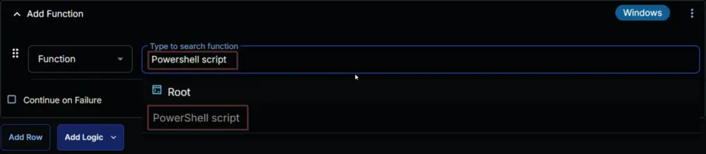

## Summary

This document describes the CW RMM implementation of the agnostic script [Install-WindowsFeatureUpdate](/docs/837e00a9-4fde-4457-9516-591da7ba4da0).

The script automates the installation of the latest Windows 11 Feature Update. It performs comprehensive pre-checks, maintenance, and validation to ensure a smooth upgrade process.

The script supports both Windows 10 and Windows 11:

- For Windows 10, it attempts to upgrade to the latest available version of Windows 11.  
- For Windows 11, it ensures the system is updated to the latest available feature update.

**Important Notes:**

1. This task creates and schedules a Windows Scheduled Task to run the agnostic script, then exits immediately. Therefore, any log messages shown by the task—other than incompatibility errors—should not be considered the actual cause of failure. However, the upgrade process continues to run in the background on the machine. The progress can be monitored by reviewing the log files located at `C:\ProgramData\_Automation\Script\Install-Windows11FeatureUpdate`
2. The computer may restart up to seven times during the process. The agnostic script re-schedules itself through a startup scheduled task to continue the process after each reboot.
3. The `NoReboot` parameter may not reliably prevent reboots. The script attempts to install missing drivers, firmware, and BIOS updates, which may force a restart regardless of this parameter. Use this parameter with caution.
4. It is recommended to initiate the script after business hours and ensure the computer remains connected to AC power. The entire process may take up to six hours in some cases, though it typically completes within two hours.
5. Be aware of [known issues](https://learn.microsoft.com/en-us/windows/release-health/status-windows-11-24h2) with the feature update 24H2 before using the script.

## Requirements

- Windows 10 or Windows 11
- Administrative privileges
- Internet connectivity
- At least 64GB of free space on the system drive
- [Windows 11 Compatible Machine](https://www.microsoft.com/en-us/windows/windows-11-specifications)

## Sample Run

  
  


## Dependencies

- [Install-WindowsFeatureUpdate](/docs/837e00a9-4fde-4457-9516-591da7ba4da0)

## Task Creation

### Script Details

#### Step 1

Navigate to `Automation` ➞ `Tasks`  


#### Step 2

Create a new `Script Editor` style task by choosing the `Script Editor` option from the `Add` dropdown menu  


The `New Script` page will appear on clicking the `Script Editor` button:  


#### Step 3

Fill in the following details in the `Description` section:  

**Name:** `Install Windows 11 Feature Update [Beta, Reboot]`  
**Description:** `The script automates the installation of the latest Windows 11 Feature Update. It performs comprehensive pre-checks, maintenance, and validation to ensure a smooth upgrade process. The script can restart the computer up to seven times.`  
**Category:** `Custom`


#### Row 1 Function: PowerShell

Search and select the `PowerShell Script` function.  
  
  

The following function will pop up on the screen:  


Paste in the following PowerShell script and set the `Expected time of script execution in seconds` to `7200` seconds. Click the `Save` button.

```PowerShell
#region Globals
$ProgressPreference = 'SilentlyContinue'
[Net.ServicePointManager]::SecurityProtocol = [Enum]::ToObject([Net.SecurityProtocolType], 3072)
#endRegion

#region Initial Verification
if ((Get-CimInstance -ClassName win32_battery).BatteryStatus -eq 1) {
    throw 'The Computer battery is not charging please plug in the charger.'
    exit 1
}
if ([System.Environment]::OSVersion.Version.Major -ne 10) {
    throw 'Unsupported Operating System. The script is designed to work for Windows 10 and Windows 11.'
    exit 1
}
#endRegion

#region Variables
$projectName = 'Install-Windows11FeatureUpdate'
$workingDirectory = '{0}\_automation\script\{1}' -f $env:ProgramData, $projectName
$baseUrl = 'https://file.provaltech.com/repo'
$ps1Url = '{0}/script/{1}.ps1' -f $baseUrl, $projectName
$ps1Path = '{0}\{1}.ps1' -f $workingDirectory, $projectName
$taskName = 'Initiate - {0}' -f $projectName
$osVersionCheckUrl = 'https://content.provaltech.com/attachments/windows-os-support.json'
$compatibilityCheckScriptDownloadUrl = 'https://download.microsoft.com/download/e/1/e/e1e682c2-a2ee-46c7-ad1e-d0e38714a795/HardwareReadiness.ps1'
$compatibilityCheckScriptPath = '{0}\HardwareReadiness.ps1' -f $workingDirectory
$tableName = 'Windows11LatestFeatureUpdate'
#endRegion

#region Working Directory
Remove-Item -Path $workingDirectory -Recurse -Force -ErrorAction SilentlyContinue | Out-Null
if (!(Test-Path -Path $workingDirectory)) {
    try {
        New-Item -Path $workingDirectory -ItemType Directory -Force -ErrorAction Stop | Out-Null
    } catch {
        throw 'Failed to Create ''{0}''. Reason: {1}' -f $workingDirectory, $($Error[0].Exception.Message)
        exit 1
    }
}

if (-not (((Get-Acl -Path $workingDirectory).Access | Where-Object { $_.IdentityReference -Match 'EveryOne' }).FileSystemRights -Match 'FullControl')) {
    $Acl = Get-Acl -Path $workingDirectory
    $AccessRule = New-Object System.Security.AccessControl.FileSystemAccessRule('Everyone', 'FullControl', 'ContainerInherit, ObjectInherit', 'none', 'Allow')
    $Acl.AddAccessRule($AccessRule)
    Set-Acl -Path $workingDirectory -AclObject $Acl
}
#endRegion

#region Check OS Version
$iwr = Invoke-WebRequest -Uri $osVersionCheckUrl -UseBasicParsing
$json = $iwr.content -replace "$([char]0x201C)|$([char]0x201D)", '"' -replace "$([char]0x2018)|$([char]0x2019)", '''' -replace '&#x2014;', ' ' -replace '&nbsp;', ''
$rows = ($json | ConvertFrom-Json).rows
$osVersion = (Get-CimInstance -ClassName Win32_OperatingSystem).Version
$latestVersion = $rows | Where-Object { $_.BaseOS -eq 'Windows 11' -and [Version]$_.Build -gt [Version]$osVersion } | Sort-Object -Property Build -Descending | Select-Object -First 1
if (!$latestVersion) {
    return 'Information: Latest available feature update ({0}) for windows 11 is installed.'
    exit 0
} else {
    Write-Information ('Information: Latest available feature update for windows 11 is {0}' -f $latestVersion.Build) -InformationAction Continue
}
#endRegion

#region Drive Space Check
$systemVolume = Get-Volume -DriveLetter $env:SystemDrive[0]
if ($systemVolume.SizeRemaining -le 64GB) {
    throw @"
Error: The Drive Space health check failed. The drive must have 64GB of free space to perform a Feature Update.
Current available space on $($env:SystemDrive[0]): $([math]::round($systemVolume.SizeRemaining / 1GB, 2))
For more information: https://learn.microsoft.com/en-us/troubleshoot/windows-client/deployment/windows-10-upgrade-quick-fixes?toc=%2Fwindows%2Fdeployment%2Ftoc.json&bc=%2Fwindows%2Fdeployment%2Fbreadcrumb%2Ftoc.json#verify-disk-space
"@
}
#endRegion

#region Compatibility Check
try {
    Invoke-WebRequest -Uri $compatibilityCheckScriptDownloadUrl -OutFile $compatibilityCheckScriptPath -UseBasicParsing -ErrorAction Stop
} catch {
    throw 'Failed to download the compatibility check script from ''{0}''. Reason: {1}' -f $compatibilityCheckScriptDownloadUrl, $($Error[0].Exception.Message)
    exit 1
}
Unblock-File -Path $compatibilityCheckScriptPath -ErrorAction SilentlyContinue

$compatibilityCheck = & $compatibilityCheckScriptPath
$obj = $compatibilityCheck[1] | ConvertFrom-Json -ErrorAction SilentlyContinue
if ($obj.returnResult -ne 'CAPABLE' -or $compatibilityCheck -match 'NOT CAPABLE') {
    throw @"
$Env:ComputerName is incompatible with windows 11 upgrade.
Result returned by Compatibility check script:
$compatibilityCheck
Minimum system requirements: https://www.microsoft.com/en-in/windows/windows-11-specifications
"@
    exit 1
}
#endRegion

#region Download
try {
    Invoke-WebRequest -Uri $ps1Url -OutFile $ps1Path -UseBasicParsing -ErrorAction Stop
} catch {
    throw 'Failed to download the installer from ''{0}''. Reason: {1}' -f $ps1Url, $($Error[0].Exception.Message)
    exit 1
}
#endRegion

#region reset StoredTableInfo
Get-PackageProvider -Name NuGet -ForceBootstrap -ErrorAction SilentlyContinue | Out-Null
Set-PSRepository -Name PSGallery -InstallationPolicy Trusted -ErrorAction SilentlyContinue
try {
    Update-Module -Name Strapper -ErrorAction Stop
} catch {
    Install-Module -Name Strapper -Repository PSGallery -SkipPublisherCheck -Force
    Get-Module -Name Strapper -ListAvailable | Where-Object { $_.Version -ne (Get-InstalledModule -Name Strapper).Version } | ForEach-Object { Uninstall-Module -Name Strapper -MaximumVersion $_.Version }
}
(Import-Module -Name 'Strapper') 3>&1 2>&1 1>$null
Set-StrapperEnvironment
$storedData = @{
    PrimaryTaskExecuted = 0
}
$storedData | Write-StoredObject -TableName $tableName -Clobber -WarningAction SilentlyContinue -Depth 2 -ErrorAction SilentlyContinue
#endregion

#region Scheduled Task
(Get-ScheduledTask | Where-Object { $_.TaskName -eq $taskName }) | Unregister-ScheduledTask -ErrorAction SilentlyContinue | Out-Null
try {
    $action = New-ScheduledTaskAction -Execute 'cmd.exe' -WorkingDirectory $workingDirectory -Argument ('/c start /min "" Powershell -NoLogo -ExecutionPolicy Bypass -NoProfile -NonInteractive -Windowstyle Hidden -File "' + $ps1Path + '"')
    $trigger = New-ScheduledTaskTrigger -Once -At (Get-Date).AddSeconds(15)
    $setting = New-ScheduledTaskSettingsSet -AllowStartIfOnBatteries
    $principal = New-ScheduledTaskPrincipal -UserId 'NT AUTHORITY\SYSTEM' -RunLevel Highest
    $scheduledTask = New-ScheduledTask -Action $action -Trigger $trigger -Settings $setting -Principal $principal
    Register-ScheduledTask -TaskName $TaskName -InputObject $ScheduledTask -ErrorAction Stop | Out-Null
    return ('Task to run the primary script ''{1}'' has been scheduled. Detailed logs can be found at ''{0}''' -f $workingDirectory, $taskName)
} catch {
    throw ('Failed to Schedule the task. Reason: {0}' -f ($Error[0].Exception.Message))
    exit 1
}
#endRegion
```


### Row 2 Function: Script Log

Add a new row by clicking the `Add Row` button.  


A blank function will appear.  


Search and select the `Script Log` function.  


The following function will pop up on the screen:  


In the script log message, simply type `%Output%` and click the `Save` button.  


## Save Task

Click the `Save` button at the top-right corner of the screen to save the script.  


## Completed Task


## Output

- Script Log
- C:\ProgramData\_Automation\Script\Install-Windows11FeatureUpdate\Install-Windows11FeatureUpdate-log.txt
