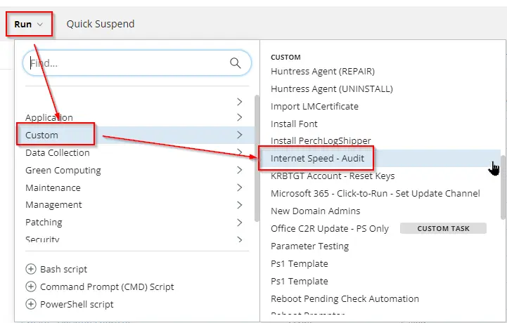
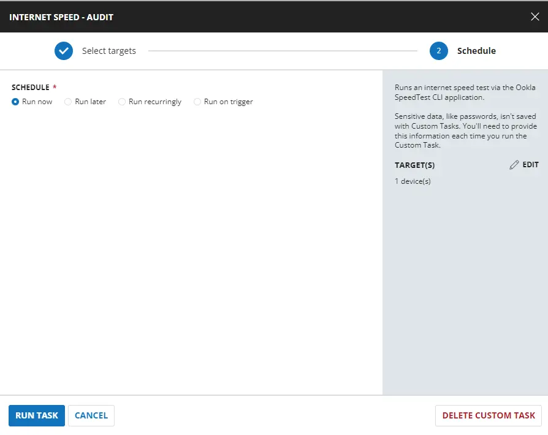
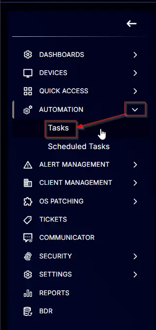
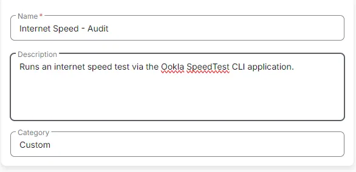

---
id: '296c457d-66d6-4de8-af91-4667c2321e12'
slug: /296c457d-66d6-4de8-af91-4667c2321e12
title: 'Internet Speed - Audit'
title_meta: 'Internet Speed - Audit'
keywords: ['internet', 'speed', 'test', 'ookla', 'cli']
description: 'This document provides a comprehensive guide on how to run an internet speed test using the Ookla SpeedTest CLI application. It includes sample runs, dependencies, task creation steps, and detailed instructions on implementing the script in a system.'
tags: ['networking', 'performance', 'setup']
draft: false
unlisted: false
last_update:
  date: 2025-11-27
---

## Summary

This document describes how to run an internet speed test using the Ookla SpeedTest CLI application.

## Sample Run

## Dependencies

[Download Test-InternetSpeed.ps1](https://file.provaltech.com/repo/script/Test-InternetSpeed.ps1)

## Task Creation

Create a new `Script Editor` style script in the system to implement this task.

**Name:** Internet Speed - Audit  
**Description:** Runs an internet speed test via the Ookla SpeedTest CLI application.  
**Category:** Custom  

## Task

Navigate to the Script Editor section and start by adding a row. You can do this by clicking the `Add Row` button at the bottom of the script page.

A blank function will appear.

### Row 1 Function: PowerShell Script

Search and select the `PowerShell Script` function.

The following function will pop up on the screen:

Paste in the following PowerShell script and set the expected time of script execution to `600` seconds. Click the `Save` button.

[PowerShell Script](https://github.com/ProVal-Tech/cw-rmm/blob/main/tasks/internet-speed-audit/script.ps1)

### Row 2: Function: Script Log

In the script log message, simply type `%output%` so that the script will send the results of the PowerShell script above to the output on the Automation tab for the target device.

## Completed Task

## Output

- Script Log

## Changelog

### 2025-04-10

- Initial version of the document

