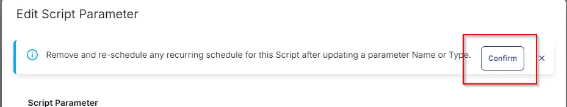
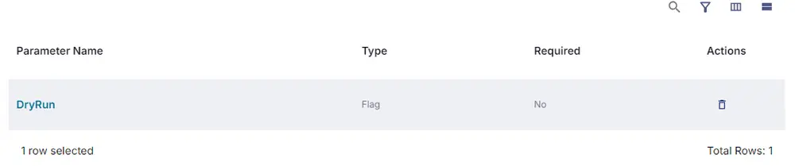
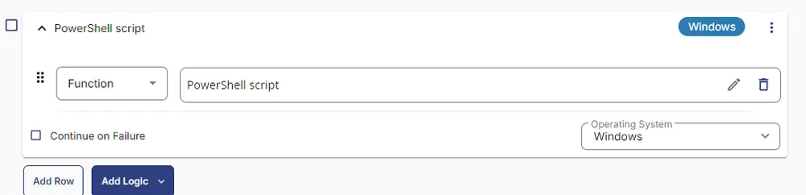

## Summary

This is an RMM implementation of the agnostic script [Reset-KrbtgtKeys](/docs/ae748a86-1683-4d69-9c96-17a6a8f79950). This task is used to reset the KRBTGT Active Directory account. Adapted from [New-KrbtgtKeys.ps1](https://github.com/microsoft/New-KrbtgtKeys.ps1/blob/master/New-KrbtgtKeys.ps1).

This script is provided "without warranty".

It is essentially a streamlined version of the adapted script to always run the live account reset with some modernization of PowerShell mixed in.

Due to this, results are not guaranteed, and if at all possible, it should always be run manually, and logins should be immediately tested.

**YOU HAVE BEEN WARNED**

## Sample Run


In order to run without DryRun, do not select DryRun.  


## Dependencies

[Reset-KrbtgtKeys](/docs/ae748a86-1683-4d69-9c96-17a6a8f79950)

## User Parameters

| Name      | Example   | Accepted Values | Required | Default | Type | Description                                                                                       |
|-----------|-----------|----------------|----------|---------|------|---------------------------------------------------------------------------------------------------|
| `DryRun`  | Unmarked  | True/False     | False    | False   | Flag | Runs the process of resetting the KRBTGT account password without actually resetting it. Recommended to be run and reviewed before executing the live reset. |

## Task Creation

Create a new `Script Editor` style script in the system to implement this task.


**Name:** KRBTGT Account - Reset Keys  
**Description:** This task is used to reset the KRBTGT Active Directory account. Adapted from [New-KrbtgtKeys.ps1](https://github.com/microsoft/New-KrbtgtKeys.ps1/blob/master/New-KrbtgtKeys.ps1)  
**Category:** Custom  


## Parameters

Add a new parameter by clicking the `Add Parameter` button present at the top-right corner of the screen.


This screen will appear.  


- Set `DryRun` in the `Parameter Name` field.
- Select `Flag` from the `Parameter Type` dropdown menu.
- Toggle Default Value.
- Set its default value to `False`.
- Click the `Save` button.  


- It will ask for confirmation to proceed. Click the `Confirm` button to create the parameter.  


Parameters will look as shown below:  


## Task

Navigate to the Script Editor section and start by adding a row. You can do this by clicking the `Add Row` button at the bottom of the script page.  


A blank function will appear.  


### Row 1 Function: PowerShell Script

Search and select the `PowerShell Script` function.  


The following function will pop up on the screen:  


Paste in the following PowerShell script and set the expected time of script execution to `900` seconds. Click the `Save` button.

```PowerShell
#region Setup - Variables
$DryRun = "@DryRun@"
$ProjectName = 'Reset-krbtgtkeys'
[Net.ServicePointManager]::SecurityProtocol = [enum]::ToObject([Net.SecurityProtocolType], 3072)
$BaseURL = 'https://file.provaltech.com/repo'
$PS1URL = "$BaseURL/script/$ProjectName.ps1"
$WorkingDirectory = "C:\ProgramData\_automation\script\$ProjectName"
$PS1Path = "$WorkingDirectory\$ProjectName.ps1"
$Workingpath = $WorkingDirectory
$LogPath = "$WorkingDirectory\$ProjectName-log.txt"
$ErrorLogPath = "$WorkingDirectory\$ProjectName-Error.txt"
#endregion
#region Setup - Folder Structure
New-Item -Path $WorkingDirectory -ItemType Directory -ErrorAction SilentlyContinue | Out-Null
$response = Invoke-WebRequest -Uri $PS1URL -UseBasicParsing
if (($response.StatusCode -ne 200) -and (!(Test-Path -Path $PS1Path))) {
    throw "No pre-downloaded script exists and the script '$PS1URL' failed to download. Exiting."
} elseif ($response.StatusCode -eq 200) {
    Remove-Item -Path $PS1Path -ErrorAction SilentlyContinue
    [System.IO.File]::WriteAllLines($PS1Path, $response.Content)
}
if (!(Test-Path -Path $PS1Path)) {
    throw 'An error occurred and the script was unable to be downloaded. Exiting.'
}
#endregion
#region Execution
if ($DryRun -match '1|Y|Yes|True' ) {
    & $PS1Path -DryRun
} else {
    & $PS1Path
}
#endregion
if ( !(Test-Path $LogPath) ) {
    throw 'PowerShell Failure. A Security application seems to have restricted the execution of the PowerShell Script.'
}
if ( Test-Path $ErrorLogPath ) {
    $ErrorContent = ( Get-Content -Path $ErrorLogPath )
    throw $ErrorContent
}
Get-Content -Path $LogPath
```

### Row 2: Function: Script Log

In the script log message, simply type `%output%` so that the script will send the results of the PowerShell script above to the output on the Automation tab for the target device.  


## Completed Task


## Output

- Script Log