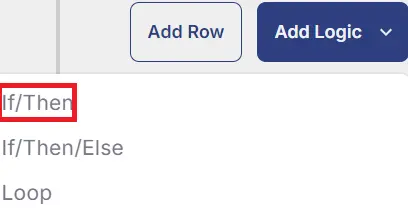

## Summary

This Task performs the endpoint scanning using the MSRT and provided option to creates ticket if failure detected. It also save result to the custom field `MSRT Scanner Result` so that the agent gets excluded from the dynamic [Group - Malicious software removal tool scanning enable](/docs/b497ecf7-c8e2-4b6a-b779-94adfd831c98) if the task ran successfully.
This script can be run on demand as well or by scheduling it to the [Group - Malicious software removal tool scanning enable](/docs/b497ecf7-c8e2-4b6a-b779-94adfd831c98).

## Dependencies

- [MSRT Custom fields](/docs/c6a36d73-01c8-4ef9-ace2-e9d6a4bc2363)
- [Group - Malicious software removal tool scanning enable](/docs/b497ecf7-c8e2-4b6a-b779-94adfd831c98)

## Sample Run


Check the `Create Ticket` flag option if you want to create ticket for the endpoint during failure and click `Continue to Scheduling`.


Click `Run Task`


## Implementation

### Create Task

**Malicious Software Removal Tool Scanning**  
To implement this script, please `Add Parameter` first:

Click `Add Parameter` on the top right side of the new script:


Set parameter `CreateTicket` as a flag with `Default Value` set to `False` and do not turn on the `Required Field`. This is set to not create a ticket by default, if required to create ticket on failure change the default value to `True`.


To implement this script, please create a new "PowerShell" style script in the system.


- **Name:** Malicious Software Removal Tool Scanning
- **Description:** This script performs the endpoint scanning using the MSRT and provided option to creates ticket if failure detected. Based on the output, it sets the custom field `MSRT Scanning Result`.
- **Category:** Security


### Script

Start by creating a separate row. You can do this by clicking the "Add Row" button at the bottom of the script page.


### Row 1: Function: Pre-defined Variable


Paste the highlighted text:  

```plaintext
Variable Name: Systemname
System Variable: Drop down Endpoint>Asset>Friendlyname
```


### Row 2: Function: PowerShell Script


Paste in the following PowerShell script and set the expected time of script execution to `1800` seconds.

```powershell
$WorkingDirectory = 'C:\ProgramData\_automation\script\MSRT'
$File = "$WorkingDirectory\Windows-KB890830-x64.exe"
$MRTResult = 'C:\WINDOWS\debug\mrt.log'
if (Test-Path -Path $File) {
    Remove-Item -Path $File -Force -Recurse -ErrorAction SilentlyContinue
}

if (Test-Path -Path $MRTResult) {
    Remove-Item -Path $MRTResult -Force -Recurse -ErrorAction SilentlyContinue
}
#region Setup - Folder Structure
if ( !(Test-Path $WorkingDirectory) ) {
    try {
        New-Item -Path $WorkingDirectory -ItemType Directory -Force -ErrorAction Stop | Out-Null
    }
    catch {
        return "An error occurred: Failed to Create $WorkingDirectory. Reason: $($Error[0].Exception.Message)"
    }
} if (-not ( ( ( Get-Acl $WorkingDirectory ).Access | Where-Object { $_.IdentityReference -Match 'EveryOne' } ).FileSystemRights -Match 'FullControl' ) ) {
    $ACl = Get-Acl $WorkingDirectory
    $AccessRule = New-Object System.Security.AccessControl.FileSystemAccessRule('Everyone', 'FullControl', 'ContainerInherit, ObjectInherit', 'none', 'Allow')
    $Acl.AddAccessRule($AccessRule)
    Set-Acl $WorkingDirectory $Acl
}
$uri = 'https://www.microsoft.com/download/details.aspx?id=9905'
try {
    Write-Output "Attempting to download content from $uri"
    $response = Invoke-WebRequest -Uri $uri -UseBasicParsing
    Write-Output "Response status code: $($response.StatusCode)"
    if ($response.StatusCode -ne 200) {
        return 'An error occurred: The URI failed to output the html content'
    }
    $html = $response.Content
    $regex = [regex]::new("(?i)https://download\.microsoft\.com/download/2/C/5/2C563B99-54D9-4D85-A82B-45D3CD2F53CE/Windows-KB890830-x64-V\d+\.\d+\.exe")
    $URLCheck = $regex.Matches($html)
    if ($URLCheck.Count -gt 0) {
        $uniqueMatches = $URLCheck | Select-Object -Unique
        $URL = $uniqueMatches.Value
        Write-Output "Download URL found: $URL"
    }
    else {
        return 'An error occurred: Link not found'
    }
}
catch {
    return "An error occurred: Failed to download content from URI. Reason: $($_.Exception.Message)"
}

Invoke-WebRequest -Uri $URL -OutFile $File -UseBasicParsing

if (!(Test-Path -Path $File)) {
    return 'An error occurred and the exe was unable to be downloaded. Exiting.'
}

Start-Process -FilePath $File -ArgumentList "/N /Q"
Start-Sleep -Seconds 180
$logFilePath = 'C:\WINDOWS\debug\mrt.log'
$attempts = 0
$maxAttempts = 3
$sleepDuration = 300

while ($attempts -lt $maxAttempts) {
    if (Test-Path $logFilePath) {
        $logContent = Get-Content $logFilePath
        if ($logContent -match "Microsoft Windows Malicious Software Removal Tool Finished On") {
            Write-Output 'Scanning completed successfully. Displaying complete content'
            Write-Output $logContent
            break
        }
        else {
            Write-Output 'Scanning not completed yet. Waiting for the next attempt.'
        }
    }
    else {
        Write-Output "Log file not found. Attempt $($attempts + 1) of $maxAttempts."
    }
    $attempts++
    Start-Sleep -Seconds $sleepDuration
}

if ($attempts -eq $maxAttempts) {
    Write-Output 'An error occurred: Log file failed to create or scanning not completed after maximum attempts.'
}
```

### Row 3: Logic: If/Then/Else


### Row 3a: Condition: Output Contains

In the IF part, enter `An error occurred` in the right box of the "Output Contains" part.


### Row 3b: Function: Set Custom Field

Add a new row by clicking on the Add row button and select `Set Custom Field`. 


Clicking `Set Custom Field` opens up new window.

**Custom Field:** `MSRT Scanner Result`

**Value:** `MSRT Scanning Failed`


### Row 3c(i): Logic: If/Then




### Row 3c(ii): Condition: Value

In the IF part, enter `@CreateTicket@` in the right box of the "Value contains" part where Value `1` `Equals` to `@CreateTicket@`.


### Row 3c(iii): Function: Create Ticket

Add a new row by clicking on the Add row button.

Select Function 'Create Ticket'. When you select `Create Ticket`, it will open up a new window.

In this window, set the `Subject` as `Malicious Software Removal Tool scanning failed on computer: @SystemName@ of company: %companyname%`.

`Body` as `Malicious Software Removal Tool scanning failed to detect or detected an infection on the endpoint. Refer to the below logs:
%Output%`

`Priority` set to `Low`


### Row 3d: Function: Script Exit

Add a new row in the If section and select `Script Exit`.

In the script exit message, simply type `Malicious Software Removal Tool scanning failed. Refer to the logs:
%output%`.

In the script exit message, leave it blank.


### Row 4: Logic: If/Then

Add a new logic in the Else section and select `If/Then`.


### Row 4a: Condition: Output Does Not Contains

In the IF part, enter `No infection found` in the right box of the "Output Does Not Contains" part.


### Row 4b: Function: Set Custom Field

Add a new row by clicking on the Add row button and select `Set Custom Field`. 


Clicking `Set Custom Field` opens up new window.

**Custom Field:** `MSRT Scanner Result`

**Value:** `MSRT Scanner Result - Infection detected`


### Row 4c(i): Logic: If/Then


### Row 4c(ii): Condition: Value

In the IF part, enter `@CreateTicket@` in the right box of the "Value contains" part where Value `1` `Equals` to `@CreateTicket@`.


### Row 4c(iii): Function: Create Ticket

Add a new row by clicking on the Add row button.

Select Function 'Create Ticket'. When you select `Create Ticket`, it will open up a new window.

In this window, set the `Subject` as `Malicious Software Removal Tool scanning detected infection on computer: @SystemName@ of company: %companyname%`.

`Body` as `Malicious Software Removal Tool scanning detected infection on the endpoint. Refer to the logs:
%Output%`

`Priority` set to `Low`


### Row 4d: Function: Script Exit

Add a new row in the IF section and select `Script Exit`.

In the script exit message, simply type `Malicious Software Removal Tool detected infection on the endpoint. Refer to the logs:
%Output%`.

In the script exit message, leave it blank.


### Row 4e: Function: Set Custom Field

Add a new row in the else section by clicking on the Add row button and select `Set Custom Field`. 


Clicking `Set Custom Field` opens up new window.

**Custom Field:** `MSRT Scanner Result`

**Value:** `MSRT Scanner Result - No infection found`


### Row 4f: Function: Script Log


In the script log message, simply type `Malicious Software Removal Tool scanner detected on infection. Refer to the logs:
%Output%` so that the script will send the results of the PowerShell script above to the output on the Automation tab for the target device.


### Row 5: Complete


## Deployment

It is suggested to run the Task every 2 hours against the group [Group - Malicious software removal tool scanning enable](/docs/b497ecf7-c8e2-4b6a-b779-94adfd831c98)

- Go to `Automation` > `Tasks.`
- Search for `Malicious Software Removal Tool Scanning` Task.
- Select the concerned task.
- Click on the `Schedule` button to schedule the task/script.


This screen will appear.


Select the relevant time to run the script and click the Do not repeat button.


A pop-up box will appear.

Change the number of hours to `2` and click `OK`.


Select the target `Device Group` to schedule on the group [Group - Malicious software removal tool scanning enable](/docs/b497ecf7-c8e2-4b6a-b779-94adfd831c98).


Now click the `Run` button once all customization is set to initiate the task.


The task will start appearing in the Scheduled Tasks.

## Output

- Task log