## Summary
This CW RMM implementation helps keep .NET on Windows devices clean, current, and secure. It can list installed .NET components, install the latest supported versions, update patch releases, remove unsupported versions, or perform a full cleanup and refresh.

The script checks Microsoft release data in real time, then uses that information to decide what to install, update, or remove. This reduces manual effort and lowers the risk of keeping outdated .NET versions.

When you run this script, expect software changes on the endpoint. Depending on the selected action, it may download installers, silently install updates, and remove older versions. A stable internet connection and administrator access are required.

**NOTE:**

- Installing or uninstalling `sdk` can also install or remove related `aspNetCoreRuntime`, `desktopRuntime`, and `runtime` components.
- Installing or uninstalling `desktopRuntime` can also install or remove the related `runtime`.
- For actions other than `list`, if `Type` is not provided, the script uses `desktopRuntime` by default.
- Install and update use the machine's native architecture installer (for example, x64 installer on x64 machines).
- If x86 components already exist on a machine, the script can detect and remove outdated x86 components during `uninstall`, `update`, and `renew`.
- Use `Version` carefully:
  - For `list`, `install`, `uninstall`, and `update`, you can target specific major versions (including unsupported versions).
  - For `renew` with `Version`, all specified versions must still be supported. If any are unsupported, the action will stop.
- Set `Force` to `1` to apply force removal behavior. Any other value (or blank) means force is not applied.
- For `uninstall`, `update`, and `renew`, older-version cleanup primarily targets components detected by `dotnet.exe`. With `Force = 1`, cleanup can also remove .NET entries found through uninstall registry data and package metadata, including components that `dotnet.exe` does not list.
- `renew` is the most aggressive option. It can remove versions you are not targeting. Review your required application dependencies before using it.

## Sample Run

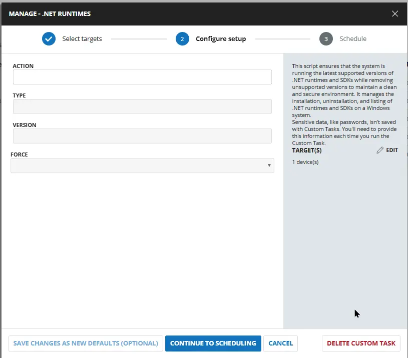

## Dependencies

- [Optimize-DotNetRunTime](/docs/6ec8fb3c-29ef-4b05-b8fd-546eb07176c7)  

## User Parameters

| Name | Example | Required | Default | Type | Description |
| ---- | ------- | -------- | ------- | ---- | ----------- |
| `Action` | <ul><li>`list`</li><li>`install`</li><li>`uninstall`</li><li>`update`</li><li>`renew`</li></ul> | False   | - | DropDown  | Select the action to perform. Valid values are:    <ul><li>`list`: Lists all installed .NET runtimes and SDKs.</li><li> `install`: Installs the latest supported versions of .NET runtimes and SDKs. </li><li> `uninstall`: Uninstalls unsupported or specific versions of .NET runtimes and SDKs. </li><li> `update`: Updates to latest patches and removes superseded patches. </li><li> `renew`: Removes all unsupported versions of .NET runtimes and SDKs and installs the latest available version.</li></ul> **Note:** Default Action is `list` |
| `Type`   | <ul><li>`sdk`</li><li>`runtime`</li><li>`desktopRuntime`</li><li>`aspNetCoreRuntime`</li><li>`all`</li></ul> | False  |  - | DropDown  | Select the type of .NET component to manage. Valid values are:    <ul><li>`sdk`: Manages .NET SDKs. </li><li> `runtime`: Manages .NET runtimes. </li><li> `desktopRuntime`: Manages .NET desktop runtimes. </li><li>`aspNetCoreRuntime`: Manages ASP.NET Core runtimes. </li><li>`all`: Manages all .NET components. </li></ul> **Note:** Default Type is `desktopRuntime`|
| `Version` | <ul><li>`8`</li><li>`9`</li><li>`8, 9`</li></ul> | False |  - | Text String    | (Optional) Limit the action to specific .NET versions by major version number (e.g., `8`, `9`, or `8, 9, 10`). When omitted, the script uses its default behavior for each action. Accepts both supported and EOL versions for `list`, `install`, `uninstall`, and `update`. For `renew`, all specified versions must be actively supported. **Note:** Default is not set (all applicable versions are targeted). |
| `Force` |  | False |  - | Flag | Select it to apply forced MSI dependency bypass during removal. If `Force` is not selected, normal safe behavior is used. |

## Task Creation

### Script Details

#### Step 1

Navigate to `Automation` ➞ `Tasks`  
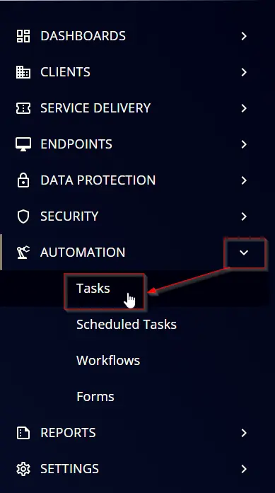

#### Step 2

Create a new `Script Editor` style task by choosing the `Script Editor` option from the `Add` dropdown menu  
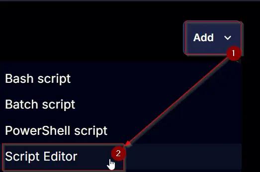

The `New Script` page will appear on clicking the `Script Editor` button:  
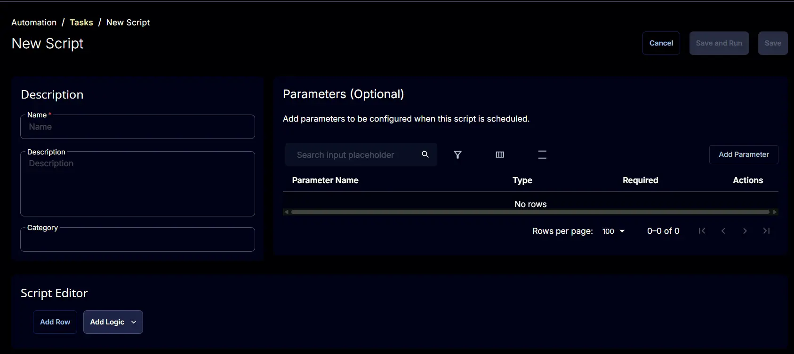

#### Step 3

Fill in the following details in the `Description` section:  

**Name:** `Manage - .net Runtimes`  
**Description:** `This script ensures that the system is running the latest supported versions of .NET runtimes and SDKs while removing unsupported versions to maintain a clean and secure environment. It manages the installation, uninstallation, and listing of .NET runtimes and SDKs on a Windows system.`  
**Category:** `Custom`

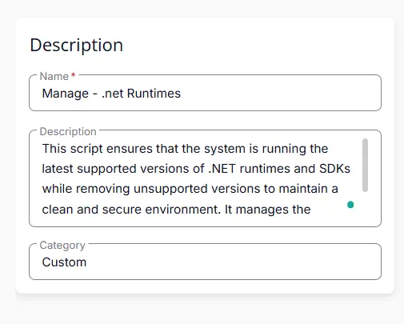

### Parameters

Locate the `Add Parameter` button on the right-hand side of the screen and click on it to create a new parameter.  

The `Add New Script Parameter` page will appear on clicking the `Add Parameter` button.  
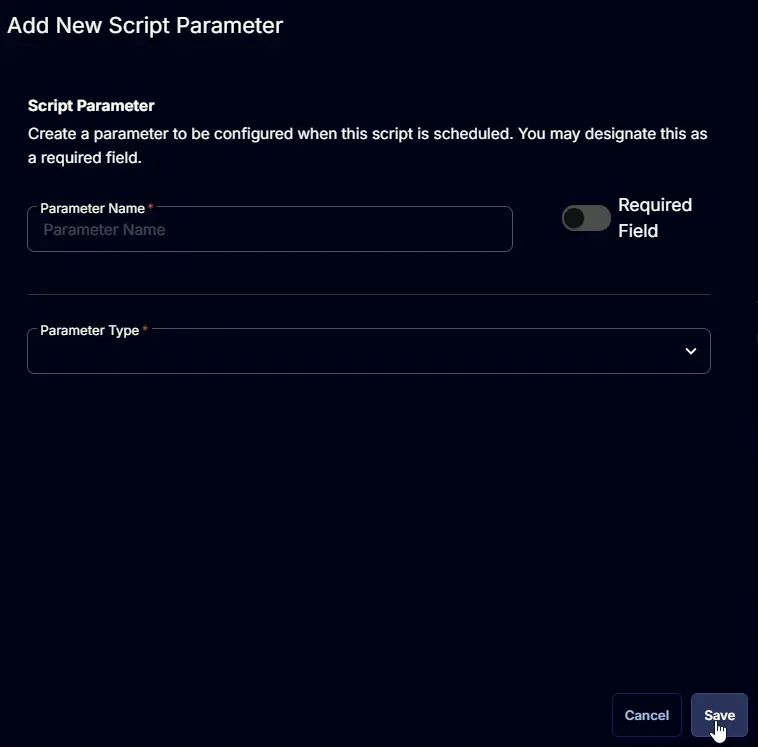

### Action

The `Add New Script Parameter` page will appear on clicking the `Add Parameter` button.  

- Set `Action` in the `Parameter Name` field.
- Select `DropDown` from the `Parameter Type` dropdown menu.
- Select `String` from the `Option Type` dropdown menu.
- Add `list`,`install`,`uninstall`,`update`,`renew` from the `Option Type` dropdown menu.
- Click the `Save` button.

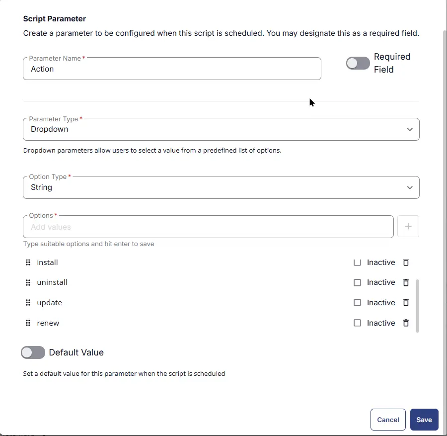

### Type

The `Add New Script Parameter` page will appear on clicking the `Add Parameter` button.  

- Set `Type` in the `Parameter Name` field.
- Select `DropDown` from the `Parameter Type` dropdown menu.
- Select `String` from the `Option Type` dropdown menu.
- Add `sdk`,`runtimes`,`desktopRuntime`,`aspNetCoreRuntime`,`all` from the `Option Type` dropdown menu.
- Click the `Save` button.

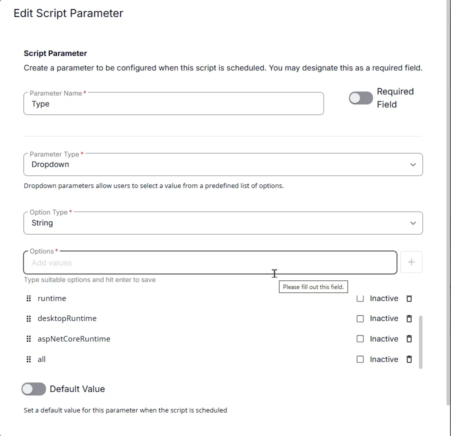

### Version

The `Add New Script Parameter` page will appear on clicking the `Add Parameter` button.  

- Set `Version` in the `Parameter Name` field.
- Select `Text String` from the `Parameter Type` dropdown menu.
- Click the `Save` button.

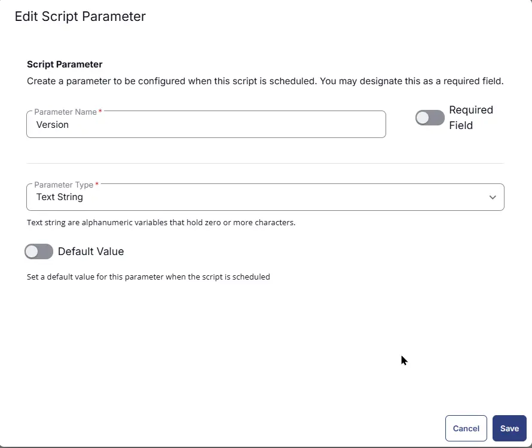

### Force

The `Add New Script Parameter` page will appear on clicking the `Add Parameter` button.  

- Set `Force` in the `Parameter Name` field.
- Select `Flag` from the `Parameter Type` dropdown menu.
- Click the `Save` button.

### Script Editor

Click the `Add Row` button in the `Script Editor` section to start creating the script  

A blank function will appear:  
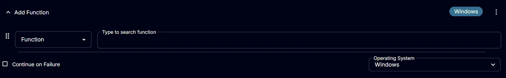

#### **Row 1 Function: PowerShell script**

- **Notes:** `<Leave it Blank>`  
- **Use Generative AI Assist for script creation:** `False`  
- **Expected time of script execution in seconds:** `600`  
- **Continue on Failure:** `False`  
- **Run As:** `System`  
- **Operating System:** `Windows`  
- **PowerShell Script Editor:**

[PowerShell Script](https://github.com/ProVal-Tech/cw-rmm/blob/main/tasks/manage-dotnet-rumtimes/script.ps1)

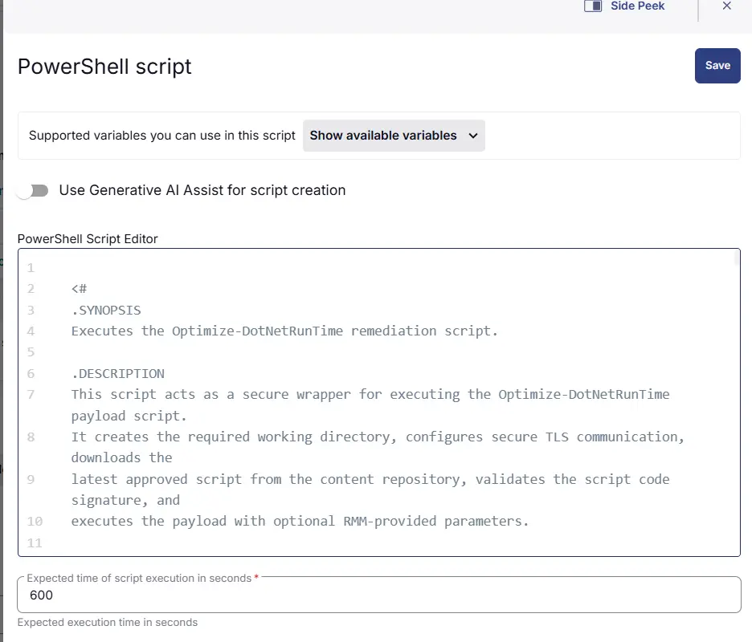

#### **Row 7 Function: Script Log**

- **Notes:** `<Leave it Blank>`  
- **Continue on Failure:** `False`  
- **Operating System:** `Windows`  
- **Script Log Message:** `%Output%`  

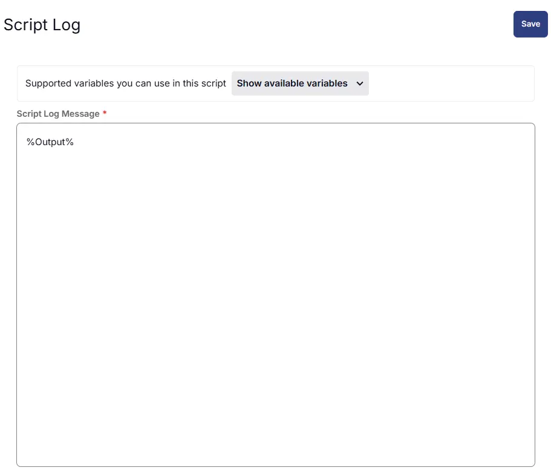

## Save Task

Click the `Save` button at the top-right corner of the screen to save the script.  

## Completed Task

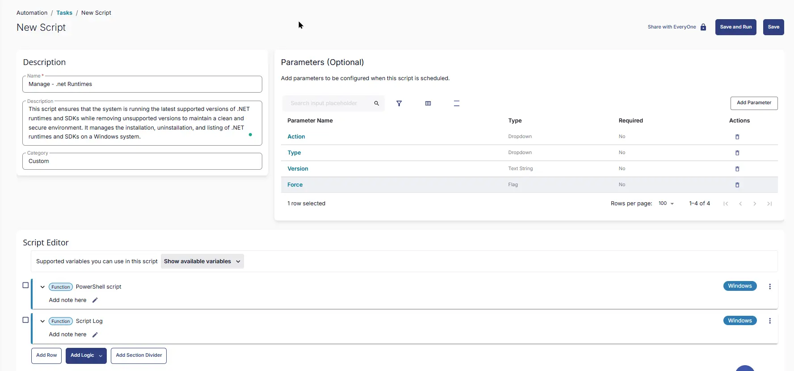

## Output

- Script Logs

## Changelog

### 2026-08-11

- Initial version of the document

