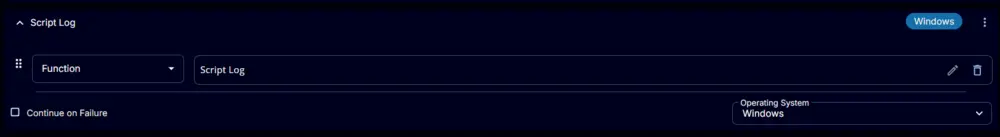
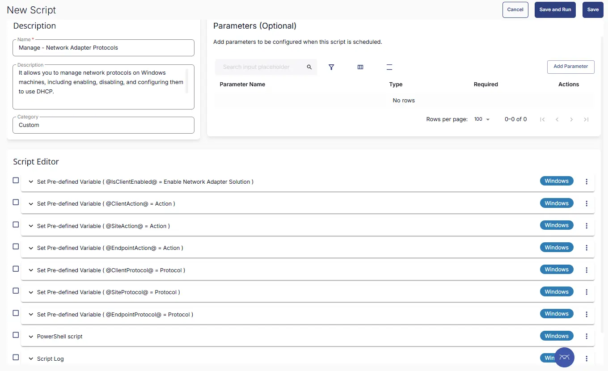

## Summary
This task allows you to manage network protocols on Windows machines, including enabling, disabling, and configuring them to use DHCP.

**Caution :** Use this script with caution. Disabling IPv4 on the machine may result in a network disconnection.

## Sample Run
Serach for `Manage - Network Adapter Protocols` task and click on it
  

Selec `Run Now` and click `Run Task` button  


## Dependencies
- [Dynamic Group - Devices Opted for Network Adapter Solution](/docs/31025444-7b65-4fa5-9ca3-89d2f5b06a55)  
- [Manage - Network Adapter Solutions Custom Field](/docs/97f24a5e-9b01-4a3c-8288-0aef911bf2ad)
- [ Solution - Manage Network Adapter Solution](/docs/0d47f7f9-c0f9-42f1-9bc9-23b6d5cb6220)

## Task Creation

### Step 1

Navigate to `Automation` ➞ `Tasks`  


### Step 2

Create a new `Script Editor` style task by choosing the `Script Editor` option from the `Add` dropdown menu  


The `New Script` page will appear on clicking the `Script Editor` button:  


### Step 3

Fill in the following details in the `Description` section:  

- **Name:** `Manage - Network Adapter Protocols`    
- **Description:** It allows you to manage network protocols on Windows machines, including enabling, disabling, and configuring them to use DHCP.  
    Caution : Use this script with caution. Disabling IPv4 on the machine may result in a network disconnection.  
- **Category:** `Custom`


### Script Editor

Click the `Add Row` button in the `Script Editor` section to start creating the script  


A blank function will appear:  


## Row 1 Function: Set Pre-defined Variable

- Select `Set Pre-Defined Variable` Function


- Select `Custom Field`
- Input `IsClientEnabled` as Variable name
- Select `Enable Network Adapter Solution` custom field from the dropdown
- Click `Save`


## Row 2 Function: Set Pre-defined Variable

- Select `Set Pre-Defined Variable` Function


- Select `Custom Field`
- Input `ClientAction` as Variable name
- Select `Action` custom field from the dropdown for Client
- Click `Save`


## Row 3 Function: Set Pre-defined Variable

- Select `Set Pre-Defined Variable` Function


- Select `Custom Field`
- Input `SiteAction` as Variable name
- Select `Action` custom field from the dropdown for Site
- Click `Save`


## Row 4 Function: Set Pre-defined Variable

- Select `Set Pre-Defined Variable` Function


- Select `Custom Field`
- Input `EndpointAction` as Variable name
- Select `Action` custom field from the dropdown for Endpoint
- Click `Save`


## Row 5 Function: Set Pre-defined Variable

- Select `Set Pre-Defined Variable` Function


- Select `Custom Field`
- Input `ClientProtocol` as Variable name
- Select `Protocol` custom field from the dropdown for Client
- Click `Save`


## Row 6 Function: Set Pre-defined Variable

- Select `Set Pre-Defined Variable` Function


- Select `Custom Field`
- Input `SiteProtocol` as Variable name
- Select `Protocol` custom field from the dropdown for Site
- Click `Save`


## Row 7 Function: Set Pre-defined Variable

- Select `Set Pre-Defined Variable` Function


- Select `Custom Field`
- Input `EndProtocol` as Variable name
- Select `Protocol` custom field from the dropdown for Endpoint
- Click `Save`


## Row 8 Function: PowerShell Script


Paste in the following PowerShell script and set the expected script execution time to 900 seconds.

```PowerShell
if (@IsClientEnabled@  -notmatch '1|Yes|True|Y') {
   return 'Client is not opted for Network Adapter Solution'
}

$ResolvedAction = 'Not Set'
if('@EndpointAction@' -match 'ENABLE|DISABLE|Enable DHCP|Exclude from Solution'){
	$ResolvedAction = '@EndpointAction@'
}
elseif('@SiteAction@' -match 'ENABLE|DISABLE|Enable DHCP|Exclude from Solution'){
	$ResolvedAction = '@SiteAction@'
}
elseif('@ClientAction@' -match 'ENABLE|DISABLE|Enable DHCP'){
	$ResolvedAction = '@ClientAction@'
}

if ( $ResolvedAction -match 'Not Set|Exclude from Solution') {
    return 'Please verify that the Action is defined properly or solution is enabled for the machine, then reattempt executing the Task'
}

$ResolvedProtocol = 'Not Set'
if('@EndpointProtocol@' -match 'IPv4|IPv6|Both'){_
	$ResolvedProtocol = '@EndpointProtocol@'
}
elseif('@SiteProtocol@' -match 'IPv4|IPv6|Both'){
	$ResolvedProtocol = '@SiteProtocol@'
}
elseif('@ClientProtocol@' -match 'IPv4|IPv6|Both'){
	$ResolvedProtocol = '@ClientProtocol@'
}

if ( $ResolvedProtocol -match 'Not Set') {
    return 'Please verify that the Protocol is properly defined for the machine, then reattempt executing the Task'
}


param(
    [Parameter(Mandatory=$true)]
    [ValidateSet("ENABLE", "DISABLE", "Enable DHCP")]
    [string]]$Action = $ResolvedAction,
    
    [Parameter(Mandatory=$true)]
    [ValidateSet("IPv4", "IPv6", "Both")]
    [string]$Protocol = $ResolvedProtocol
)

function Set-NetworkAdapterIP {
    param (
        [string]$InterfaceAlias,
        [string]$Protocol,
        [string]$Action
    )

    $ComponentID = if ($Protocol -eq "IPv6") { "ms_tcpip6" } else { "ms_tcpip" }

    if ($Action -eq "DISABLE") {
        Disable-NetAdapterBinding -Name $InterfaceAlias -ComponentID $ComponentID
        $binding = Get-NetAdapterBinding -Name $InterfaceAlias | Where-Object { $_.ComponentID -eq $ComponentID }
        if ($binding.Enabled -eq $false) {
            Write-Output "$Protocol successfully disabled on $InterfaceAlias."
        } else {
            Write-Error "Failed to disable $Protocol on $InterfaceAlias."
        }
    }
    elseif ($Action -eq "ENABLE") {
        Enable-NetAdapterBinding -Name $InterfaceAlias -ComponentID $ComponentID
        $binding = Get-NetAdapterBinding -Name $InterfaceAlias | Where-Object { $_.ComponentID -eq $ComponentID }
        if ($binding.Enabled -eq $true) {
            Write-Output "$Protocol successfully enabled on $InterfaceAlias."
        } else {
            Write-Error "Failed to enable $Protocol on $InterfaceAlias."
        }
    }
    elseif ($Action -eq "Enable/DHCP") {
        Enable-NetAdapterBinding -Name $InterfaceAlias -ComponentID $ComponentID
        
        if ($Protocol -eq "IPv4") {
            Set-NetIPInterface -InterfaceAlias $InterfaceAlias -Dhcp Enabled
            Remove-NetIPAddress -InterfaceAlias $InterfaceAlias -AddressFamily IPv4 -Confirm:$false -ErrorAction SilentlyContinue
        }
        elseif ($Protocol -eq "IPv6") {
            Set-NetIPInterface -InterfaceAlias $InterfaceAlias -AddressFamily IPv6 -Dhcp Enabled
            Remove-NetIPAddress -InterfaceAlias $InterfaceAlias -AddressFamily IPv6 -Confirm:$false -ErrorAction SilentlyContinue
        }

        $dhcpStatus = Get-NetIPInterface -InterfaceAlias $InterfaceAlias -AddressFamily $Protocol
        if ($dhcpStatus.Dhcp -eq "Enabled") {
            Write-Output "$Protocol DHCP successfully enabled on $InterfaceAlias."
        } else {
            Write-Error "Failed to enable DHCP for $Protocol on $InterfaceAlias."
        }
    }
}

$adapters = Get-NetAdapter

foreach ($adapter in $adapters) {
    if ($Protocol -eq "Both") {
        if ($Action -eq "DISABLE") {
            Write-Error "Invalid selection: Cannot disable both IPv4 and IPv6."
            exit 1
        }
        Set-NetworkAdapterIP -InterfaceAlias $adapter.Name -Protocol "IPv4" -Action $Action
        Set-NetworkAdapterIP -InterfaceAlias $adapter.Name -Protocol "IPv6" -Action $Action
    }
    elseif ($Protocol -eq "IPv4") {
        Set-NetworkAdapterIP -InterfaceAlias $adapter.Name -Protocol "IPv4" -Action $Action
        if ($Action -eq "DISABLE") {
            Set-NetworkAdapterIP -InterfaceAlias $adapter.Name -Protocol "IPv6" -Action "ENABLE"
        }
    }
    elseif ($Protocol -eq "IPv6") {
        Set-NetworkAdapterIP -InterfaceAlias $adapter.Name -Protocol "IPv6" -Action $Action
        if ($Action -eq "DISABLE") {
            Set-NetworkAdapterIP -InterfaceAlias $adapter.Name -Protocol "IPv4" -Action "ENABLE"
        }
    }
}
```


## Row 9 Function: Script Log

Add a new row by clicking the `Add Row` button.


A blank function will appear.


Search and select the `Script Log` function.




The following function will pop up on the screen:


In the script log message, simply type `%output%` and click the `Save` button.


Click the `Save` button at the top-right corner of the screen to save the script.


## Save Task

Click the `Save` button at the top-right corner of the screen to save the script.  


## Completed Task



## Deployment

This task has to be scheduled on [Devices Opted for Network Adapter Solution](/docs/31025444-7b65-4fa5-9ca3-89d2f5b06a55) group for auto deployment. The script can also be run manually if required.

- Go to `Automations` > `Tasks`.  
- Search for `Manage - Network Adapter Protocols`.  
- Then click on `Schedule` from right side and provide the parameters detail as necessary for the script completion.  
- Select `Targeted Resources` as device group `Devices Opted for Network Adapter Solution`.


## Output
- Script Logs