---
id: '27c2c3ce-52f1-4deb-9f4f-442f2cd27343'
slug: /27c2c3ce-52f1-4deb-9f4f-442f2cd27343
title: 'Memory Threshold Violation Monitoring Configuration Writer'
title_meta: 'Memory Threshold Violation Monitoring Configuration Writer'
keywords: ['memory', 'monitoring', 'windows', 'alerts', 'thresholds', 'performance']
description: 'Generates a JSON configuration file for Memory threshold monitoring using hierarchical custom fields. The actual monitoring is performed by an external monitor set that reads this file.'
tags: ['performance', 'monitoring', 'windows']
draft: false
unlisted: false
last_update:
  date: 2026-07-23
---

## Summary

The Memory Threshold Violation Monitoring Configuration Writer is a preparation task that builds the local monitoring configuration consumed by the Memory Threshold Violation Monitoring monitor set(s). It does **not** perform any monitoring itself. Instead, it reads the threshold values you define in ConnectWise RMM custom fields — together with the ConnectWise ticketing webhook URL — and writes a simple JSON file that the deployed monitor set reads every time it runs. Two monitor‑set variants share this file: the original [Memory Threshold Violation Monitoring](/docs/919528ea-47be-4700-88e6-55accd98b435) set, which uses the monitor's built‑in ticketing, and the optional [Memory Threshold Violation Monitoring [Workflow]](/docs/029c88f9-1655-4919-8c25-873ad4b53ca0) set, which delegates ticketing to the ConnectWise workflow. The webhook URL written into the file is consumed **only** by the [Workflow] variant; the original set ignores it.

### How it works

1. **Custom Fields Evaluation**  
   The script reads the memory monitoring thresholds from custom fields at the Company, Site, and Endpoint levels. It follows a strict priority order: **Endpoint → Site → Company**. If a value is set at the Endpoint level, that value is used. If not, the Site level is checked, then the Company level. If no value is set at any level, a sensible default is applied. In the same pass it also reads the company-level [Ticket_Mgmt_Webhook_Url](/docs/8e55deb6-bef8-4501-9e64-7b25e7fcd1ab) field, which holds the webhook URL of the [CWRMM ticketing workflow](/docs/57daa951-2acc-4be7-a025-0d0ca729ef57). Unlike the threshold fields, this URL is read at the **Company level only** — there is no Site/Endpoint override and no `_Svr` / `_Wks` server/workstation split — because it represents a single, global webhook endpoint shared by every device. The value is stored purely so the [Workflow] monitor‑set variant can reach the workflow; the original monitor set never reads it.

2. **Server & Workstation Separation**  
   The script automatically detects whether the endpoint is a Windows Server or Workstation and applies the correct set of Company/Site fields (`_Svr` or `_Wks` suffix) for the thresholds. (The webhook URL is unaffected by this detection — it is the same company-level value on both.) This allows you to set different thresholds for servers and workstations without duplicating scripts.

3. **Configuration File Generation**  
   Once the final values are resolved, the script writes a JSON configuration file to the endpoint:

   ```PlainText
   C:\ProgramData\_Automation\Script\Test-MemoryUsage\Test-MemoryUsage.json
   ```

   The file contains:
   - **HighThreshold** – memory percentage that, once exceeded, starts the timer.
   - **LowThreshold** – memory percentage that resets the timer if usage drops below it.
   - **UsageMins** – the number of minutes the memory must stay above the low threshold (after the initial spike above the high threshold) before an alert is triggered.
   - **TicketWebhookUrl** – the ConnectWise ticketing webhook URL resolved from `Ticket_Mgmt_Webhook_Url`, written verbatim so the [Memory Threshold Violation Monitoring [Workflow]](/docs/029c88f9-1655-4919-8c25-873ad4b53ca0) monitor set can POST `Create` / `Close` / `Comment` payloads to the workflow. The original monitor set ignores this key. If the company field is empty or its RMM token fails to resolve, a hard-coded placeholder (`https://webhook.myconnectwise.net/REPLACE_WITH_YOUR_DEFAULT_WEBHOOK_URL`) is written instead.

> In the samples below, `https://webhook.myconnectwise.net/...` is documentation shorthand for the real instance URL you paste into the company field; the script writes whatever string is stored there verbatim, with no validation of the URL itself.

### Sample Scenario 1: Using Default Values

No *threshold* custom fields are configured at any level. The script runs on a server and uses the built‑in defaults for servers: High = 95, Low = 90, Minutes = 30. The company-level `Ticket_Mgmt_Webhook_Url` field is assumed to be set, because it is a mandatory prerequisite for the [Workflow] monitor‑set variant (see the Custom Fields notes).

The resulting configuration file would be:

```json
{
    "HighThreshold": 95,
    "LowThreshold": 90,
    "UsageMins": 30,
    "TicketWebhookUrl": "https://webhook.myconnectwise.net/..."
}
```

### Sample Scenario 2: Using Custom Field Overrides

An administrator wants a tighter threshold for a critical database server. At the Endpoint level, they set:

- `MTVM_HighThreshold` = `98`
- `MTVM_LowThreshold` = `90`
- `MTVM_UsageMins` = `15`

The script runs and, because the Endpoint fields take priority over any Company or Site fields, the threshold values are overridden, but `TicketWebhookUrl` is unaffected — it always reflects the single company-level field, never the per-level overrides, and is consumed only by the [Workflow] monitor‑set variant. The configuration file becomes:

```json
{
    "HighThreshold": 98,
    "LowThreshold": 90,
    "UsageMins": 15,
    "TicketWebhookUrl": "https://webhook.myconnectwise.net/..."
}
```

On all other servers where no Endpoint-level fields are set, the script falls back to the Company or default values.

### Ticketing & Alerting Behavior

- The deployed monitor set reads the configuration file and periodically checks the memory usage. Which set is deployed is a per‑partner choice — only one of the two should be active for a given device.
- An alert is triggered only when the memory first exceeds the **high threshold** and then **continues to stay above the low threshold** for the number of minutes specified in `UsageMins`. When the memory drops below the low threshold, the condition clears.
- **Original [Memory Threshold Violation Monitoring](/docs/919528ea-47be-4700-88e6-55accd98b435) set:** generates alerts and tickets using the monitor's *built‑in* ticketing. It reads only the thresholds from the config file and **ignores `TicketWebhookUrl`**. It raises one ticket per incident and auto‑resolves it on recovery via the monitor set's automatic resolution rule, but the ticket subject/body are monitor‑generated (not customizable) and a comment is appended on every detection while the alert persists. For this variant the webhook URL is irrelevant and the company field may be left blank.
- **Optional [Memory Threshold Violation Monitoring [Workflow]](/docs/029c88f9-1655-4919-8c25-873ad4b53ca0) set:** evaluates memory usage the same way, but instead of the built‑in ticketing it reads `TicketWebhookUrl` from the config file and POSTs `Create` / `Close` / `Comment` payloads to the [CWRMM ticketing workflow](/docs/57daa951-2acc-4be7-a025-0d0ca729ef57). The monitor script fires a `Close` payload when the condition clears, so the workflow **auto‑closes the ticket on recovery** — overcoming the manual‑close limitation of the built‑in path — while also producing clean tickets with no comment spam. **This is the only variant for which the webhook URL is required.**
- The configuration writer itself never contacts the webhook; it only stores the URL for the [Workflow] monitor set to use.
- The configuration file is updated once per day (or manually) by this task, so any changes to custom fields — including the webhook URL — take effect on the next scheduled run.

## Sample Run

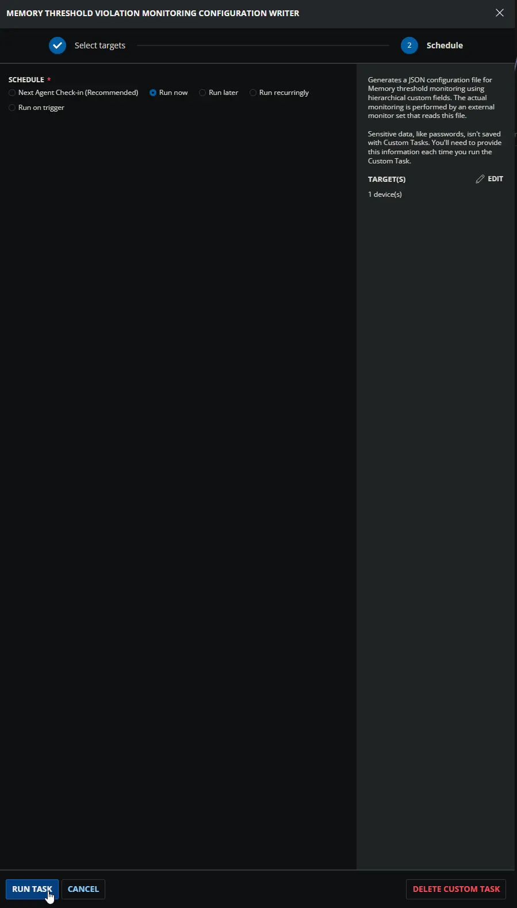

## Dependencies

- [Custom Field: Ticket_Mgmt_Webhook_Url](/docs/8e55deb6-bef8-4501-9e64-7b25e7fcd1ab)
- [Custom Field: MTVM_Enable_Svr](/docs/2fae464f-4fe6-4c42-9957-664365c25fe0)
- [Custom Field: MTVM_Enable_Wks](/docs/f00277da-77b2-4f63-9f06-438b5f3800c8)
- [Custom Field: MTVM_Enable_Svr_Site](/docs/46461e0d-19a9-415f-998f-fc9b6d2a6112)
- [Custom Field: MTVM_Enable_Wks_Site](/docs/61e68b73-3a6e-4e43-ac03-188a29a9b446)
- [Custom Field: MTVM_Enable](/docs/cdbbb3d0-31a3-4ac7-816c-f381c8c94c7d)
- [Custom Field: MTVM_HighThreshold_Svr](/docs/68411d50-3434-4a8f-b61a-45280882d55c)
- [Custom Field: MTVM_HighThreshold_Wks](/docs/59645171-f364-49d2-b77f-540a7e196548)
- [Custom Field: MTVM_HighThreshold_Svr_Site](/docs/fd75f77b-f6d4-4da5-b940-f4d453cdf629)
- [Custom Field: MTVM_HighThreshold_Wks_Site](/docs/4b3eacba-d5e1-4f80-8f4b-c4debb5634e4)
- [Custom Field: MTVM_HighThreshold](/docs/7b979e7c-127e-45f7-8272-1673859fd52e)
- [Custom Field: MTVM_LowThreshold_Svr](/docs/699f0cee-b9aa-4518-978c-411438d5f5a0)
- [Custom Field: MTVM_LowThreshold_Wks](/docs/48c01a19-6250-4eb2-a9c4-c0431a2789dc)
- [Custom Field: MTVM_LowThreshold_Svr_Site](/docs/e44a2b52-44ef-4cfb-9d76-ed3036bbce07)
- [Custom Field: MTVM_LowThreshold_Wks_Site](/docs/54fd4b39-a8be-4683-92e2-270f44738cff)
- [Custom Field: MTVM_LowThreshold](/docs/e52a3fd2-c154-499d-a775-2f4e7e10abe2)
- [Custom Field: MTVM_UsageMins_Svr](/docs/8eaa16d2-cbc5-4c46-84a4-ab17da0f8dd8)
- [Custom Field: MTVM_UsageMins_Wks](/docs/56b23367-3c2c-49c0-8f53-501072a1e8b5)
- [Custom Field: MTVM_UsageMins_Svr_Site](/docs/6f5b0137-4bef-4c9a-bb2e-b2cee5d9a595)
- [Custom Field: MTVM_UsageMins_Wks_Site](/docs/bb20ad1a-a6f2-4d6d-9193-ef4051adeba4)
- [Custom Field: MTVM_UsageMins](/docs/ac69275d-6200-4bc0-a449-0778149615f0)
- [Group: Memory Threshold Violation Monitoring](/docs/183946ab-f199-4b68-b92a-6dab5ae19d24)
- [Triggers: CWRMM Ticket Management for Monitors](/docs/05c811e6-c6d0-4652-b4b6-2aa83f9605c7)
- [Workflow: CWRMM Ticket Management for Monitors](/docs/57daa951-2acc-4be7-a025-0d0ca729ef57)
- [Solution: Memory Threshold Violation Monitoring](/docs/cda6ee21-e70f-45c3-868c-1800d4aa26d7)

## Custom Fields

The following table lists all custom fields used by the script to determine the Memory monitoring thresholds. The `Enable` fields are not listed here; they are used exclusively by the automation group to decide whether the script runs at all.

| Name | Example | Level | Type | Default Value | Description |
| --- | --- | --- | --- | --- | --- |
| [MTVM_HighThreshold_Svr](/docs/68411d50-3434-4a8f-b61a-45280882d55c) | `95`, `98` | Company | Text Box | `95` | Defines Company baseline high Memory % for servers. This value starts the timer when exceeded. Overridden by Site or Endpoint. |
| [MTVM_HighThreshold_Wks](/docs/59645171-f364-49d2-b77f-540a7e196548) | `90`, `98` | Company | Text Box | `90` | Defines Company baseline high Memory % for workstations. This value starts the timer when exceeded. Overridden by Site or Endpoint. |
| [MTVM_HighThreshold_Svr_Site](/docs/fd75f77b-f6d4-4da5-b940-f4d453cdf629) | `95`, `99` | Site | Text Box | – | Site‑level override for servers. Overrides Company; overridden by Endpoint. |
| [MTVM_HighThreshold_Wks_Site](/docs/4b3eacba-d5e1-4f80-8f4b-c4debb5634e4) | `90`, `92` | Site | Text Box | – | Site‑level override for workstations. Overrides Company; overridden by Endpoint. |
| [MTVM_HighThreshold](/docs/7b979e7c-127e-45f7-8272-1673859fd52e) | `98`, `88` | Endpoint | Text Box | – | Endpoint‑level high Memory %. Overrides all higher levels (applies to both OS types). |
| [MTVM_LowThreshold_Svr](/docs/699f0cee-b9aa-4518-978c-411438d5f5a0) | `90`, `85` | Company | Text Box | `90` | Defines Company baseline low Memory % for servers. If usage drops below this, the timer resets. Overridden by Site or Endpoint. |
| [MTVM_LowThreshold_Wks](/docs/48c01a19-6250-4eb2-a9c4-c0431a2789dc) | `85`, `80` | Company | Text Box | `85` | Defines Company baseline low Memory % for workstations. If usage drops below this, the timer resets. Overridden by Site or Endpoint. |
| [MTVM_LowThreshold_Svr_Site](/docs/e44a2b52-44ef-4cfb-9d76-ed3036bbce07) | `80`, `75` | Site | Text Box | – | Site‑level override for servers. Overrides Company; overridden by Endpoint. |
| [MTVM_LowThreshold_Wks_Site](/docs/54fd4b39-a8be-4683-92e2-270f44738cff) | `80`, `70` | Site | Text Box | – | Site‑level override for workstations. Overrides Company; overridden by Endpoint. |
| [MTVM_LowThreshold](/docs/e52a3fd2-c154-499d-a775-2f4e7e10abe2) | `85`, `75` | Endpoint | Text Box | – | Endpoint‑level low Memory %. Overrides all higher levels (applies to both OS types). |
| [MTVM_UsageMins_Svr](/docs/8eaa16d2-cbc5-4c46-84a4-ab17da0f8dd8) | `30`, `15` | Company | Text Box | `30` | Defines Company baseline for servers: minutes Memory must stay above low threshold after initially exceeding the high threshold before an alert fires. Overridden by Site or Endpoint. |
| [MTVM_UsageMins_Wks](/docs/56b23367-3c2c-49c0-8f53-501072a1e8b5) | `30`, `20` | Company | Text Box | `30` | Defines Company baseline for workstations: minutes Memory must stay above low threshold after initially exceeding the high threshold before an alert fires. Overridden by Site or Endpoint. |
| [MTVM_UsageMins_Svr_Site](/docs/6f5b0137-4bef-4c9a-bb2e-b2cee5d9a595) | `15`, `10` | Site | Text Box | – | Site‑level override for servers. Overrides Company; overridden by Endpoint. |
| [MTVM_UsageMins_Wks_Site](/docs/bb20ad1a-a6f2-4d6d-9193-ef4051adeba4) | `20`, `10` | Site | Text Box | – | Site‑level override for workstations. Overrides Company; overridden by Endpoint. |
| [MTVM_UsageMins](/docs/ac69275d-6200-4bc0-a449-0778149615f0) | `5`, `10` | Endpoint | Text Box | – | Endpoint‑level sustained minutes. Overrides all higher levels (applies to both OS types). |

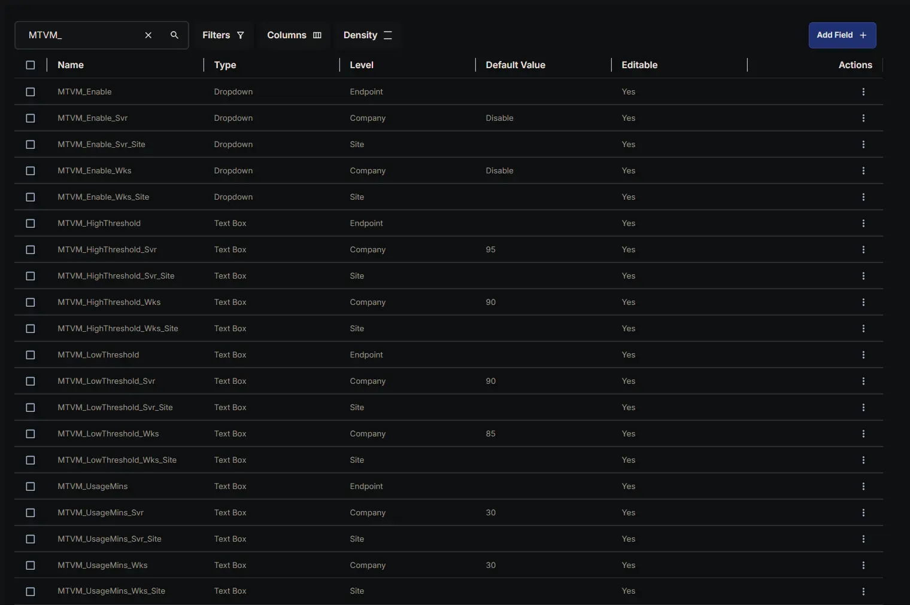

In addition to the threshold fields listed above, this task also reads the following company-level field and embeds its value into the configuration file as `TicketWebhookUrl`:

| Name | Example | Level | Type | Default Value | Description |
| --- | --- | --- | --- | --- | --- |
| [Ticket_Mgmt_Webhook_Url](/docs/8e55deb6-bef8-4501-9e64-7b25e7fcd1ab) | `https://webhook.<rmm-domain>/<instance-id>` | Company | Text Box | `https://webhook.myconnectwise.net/...` | Company-level webhook URL of the [CWRMM ticketing workflow](/docs/57daa951-2acc-4be7-a025-0d0ca729ef57); written into the config JSON as `TicketWebhookUrl`. Read at the Company level only and consumed only by the [Memory Threshold Violation Monitoring [Workflow]](/docs/029c88f9-1655-4919-8c25-873ad4b53ca0) monitor set — see notes below. Name must match exactly. |

**Only required for the [Workflow] monitor-set variant:**  
`TicketWebhookUrl` exists in the config file for the benefit of the optional [Memory Threshold Violation Monitoring [Workflow]](/docs/029c88f9-1655-4919-8c25-873ad4b53ca0) monitor set, which is the only component that reads it. If a partner deploys the original [Memory Threshold Violation Monitoring](/docs/919528ea-47be-4700-88e6-55accd98b435) set (built-in ticketing) instead, this field is unused end-to-end — the original monitor set ignores the key, so the company field may be left blank and the silent-failure consequence described below does not apply. The mandatory-prerequisite and silent-failure warnings that follow therefore apply **only** when the [Workflow] monitor set is in use.

**Company-level only — no hierarchical override and no server/workstation split:**  
Unlike every `MTVM_*` threshold field above, `Ticket_Mgmt_Webhook_Url` exists only at the Company level and has no `_Svr` / `_Wks` variants. The script reads it once (Row 16) and the OS-detection block does not touch it, so servers and workstations — and every Site and Endpoint — share the exact same webhook URL. This is intentional: the URL points to a single, environment-wide webhook instance, not to a per-device or per-class value.

**Mandatory prerequisite for the [Workflow] variant — silent-failure risk if left blank:**  
When the [Workflow] monitor set is deployed, the value written to `TicketWebhookUrl` must be the real workflow URL — whatever string is stored as the field's Default Value, copied verbatim from the [workflow's trigger webhook instance](/docs/57daa951-2acc-4be7-a025-0d0ca729ef57). The `https://webhook.myconnectwise.net/...` shown in the table is only a placeholder / example and must be replaced with the real URL during workflow setup. If the field is empty, missing, or its RMM token fails to resolve, the script does **not** error out — Row 16 is configured with **Continue on Failure = `True`** — it silently writes the hard-coded fallback `https://webhook.myconnectwise.net/REPLACE_WITH_YOUR_DEFAULT_WEBHOOK_URL` into the JSON instead. The configuration task will still report success, but the [Workflow] monitor set will then have no valid endpoint to POST to, and **ticket creation/closure will silently fail for every device**. After saving the field, always confirm the URL stored in the company field is a character-for-character match of the URL shown in the workflow's trigger instance, then re-run this task (or wait for the next daily run) so the new URL is written into the config file.

**No URL validation is performed:**  
This task only stores the string; it does not check that the URL is reachable or well-formed. Connectivity, authentication, and payload handling are the responsibility of the [Workflow] monitor set and the [workflow](/docs/57daa951-2acc-4be7-a025-0d0ca729ef57) on the receiving end.

## Task Setup Path

- **Tasks Path:** `AUTOMATION` ➞ `Tasks`  
- **Task Type:** `Script Editor`  

## Task Creation

### **Description**

- **Name:** `Memory Threshold Violation Monitoring Configuration Writer`  
- **Description:**  

```PlainText
Generates a JSON configuration file for Memory threshold monitoring using hierarchical custom fields. The actual monitoring is performed by an external monitor set that reads this file.
Defaults = High: 95%, Low: 90%, Minutes: 30
Output File = %ProgramData%\_Automation\Script\Test-MemoryUsage\Test-MemoryUsage.json
```

- **Category:** `Monitoring`

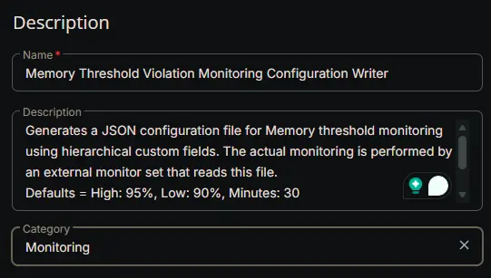

### **Script Editor**

#### **Row 1 Function: Set Pre-defined Variable ( @MTVM_HighThreshold@ = MTVM_HighThreshold  )**

- **Notes:** `MTVM_HighThreshold`
- **Continue on Failure:** `False`
- **Operating System:** `Windows`
- **Variable Name:** `MTVM_HighThreshold`
- **Custom Field:** `MTVM_HighThreshold (STRING - ENDPOINT)`

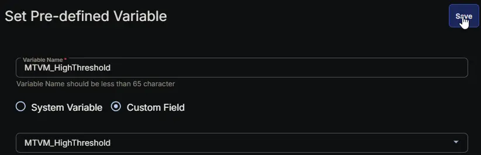

#### **Row 2 Function: Set Pre-defined Variable ( @MTVM_LowThreshold@ = MTVM_LowThreshold  )**

- **Notes:** `MTVM_LowThreshold`
- **Continue on Failure:** `False`
- **Operating System:** `Windows`
- **Variable Name:** `MTVM_LowThreshold`
- **Custom Field:** `MTVM_LowThreshold (STRING - ENDPOINT)`

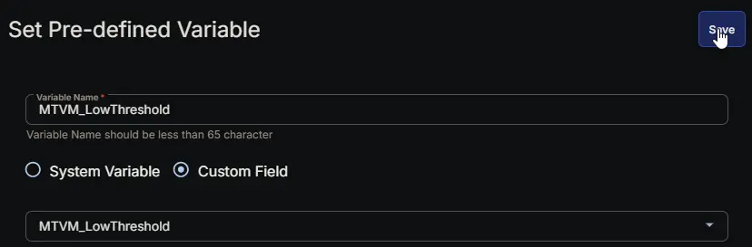

#### **Row 3 Function: Set Pre-defined Variable ( @MTVM_UsageMins@ = MTVM_UsageMins  )**

- **Notes:** `MTVM_UsageMins`
- **Continue on Failure:** `False`
- **Operating System:** `Windows`
- **Variable Name:** `MTVM_UsageMins`
- **Custom Field:** `MTVM_UsageMins (STRING - ENDPOINT)`

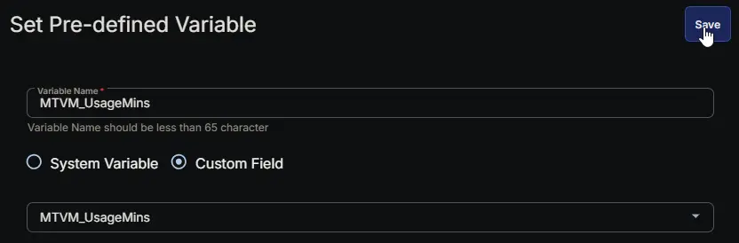

#### **Row 4 Function: Set Pre-defined Variable ( @MTVM_HighThreshold_Svr_Site@ = MTVM_HighThreshold_Svr_Site  )**

- **Notes:** `MTVM_HighThreshold_Svr_Site`
- **Continue on Failure:** `False`
- **Operating System:** `Windows`
- **Variable Name:** `MTVM_HighThreshold_Svr_Site`
- **Custom Field:** `MTVM_HighThreshold_Svr_Site (STRING - SITE)`

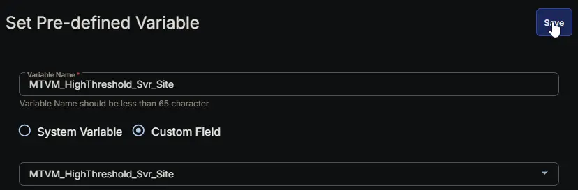

#### **Row 5 Function: Set Pre-defined Variable ( @MTVM_HighThreshold_Wks_Site@ = MTVM_HighThreshold_Wks_Site  )**

- **Notes:** `MTVM_HighThreshold_Wks_Site`
- **Continue on Failure:** `False`
- **Operating System:** `Windows`
- **Variable Name:** `MTVM_HighThreshold_Wks_Site`
- **Custom Field:** `MTVM_HighThreshold_Wks_Site (STRING - SITE)`

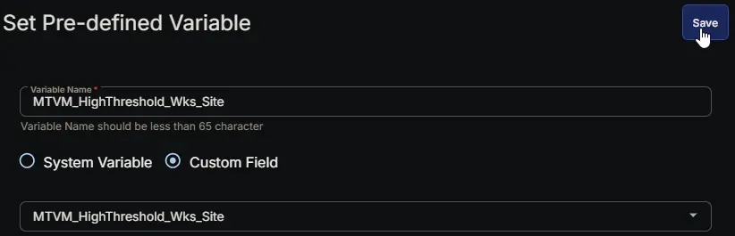

#### **Row 6 Function: Set Pre-defined Variable ( @MTVM_LowThreshold_Svr_Site@ = MTVM_LowThreshold_Svr_Site  )**

- **Notes:** `MTVM_LowThreshold_Svr_Site`
- **Continue on Failure:** `False`
- **Operating System:** `Windows`
- **Variable Name:** `MTVM_LowThreshold_Svr_Site`
- **Custom Field:** `MTVM_LowThreshold_Svr_Site (STRING - SITE)`

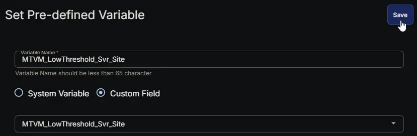

#### **Row 7 Function: Set Pre-defined Variable ( @MTVM_LowThreshold_Wks_Site@ = MTVM_LowThreshold_Wks_Site  )**

- **Notes:** `MTVM_LowThreshold_Wks_Site`
- **Continue on Failure:** `False`
- **Operating System:** `Windows`
- **Variable Name:** `MTVM_LowThreshold_Wks_Site`
- **Custom Field:** `MTVM_LowThreshold_Wks_Site (STRING - SITE)`

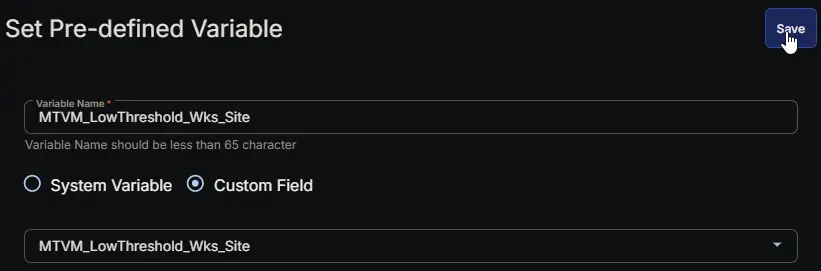

#### **Row 8 Function: Set Pre-defined Variable ( @MTVM_UsageMins_Svr_Site@ = MTVM_UsageMins_Svr_Site  )**

- **Notes:** `MTVM_UsageMins_Svr_Site`
- **Continue on Failure:** `False`
- **Operating System:** `Windows`
- **Variable Name:** `MTVM_UsageMins_Svr_Site`
- **Custom Field:** `MTVM_UsageMins_Svr_Site (STRING - SITE)`

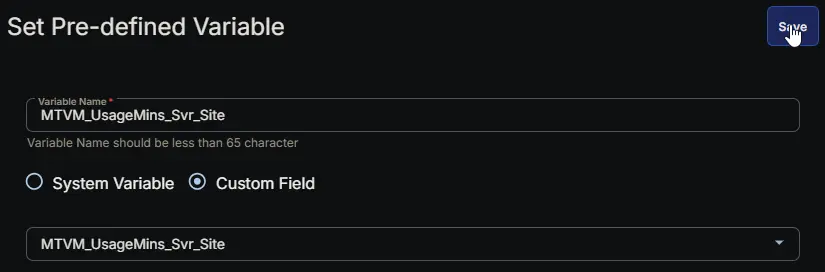

#### **Row 9 Function: Set Pre-defined Variable ( @MTVM_UsageMins_Wks_Site@ = MTVM_UsageMins_Wks_Site  )**

- **Notes:** `MTVM_UsageMins_Wks_Site`
- **Continue on Failure:** `False`
- **Operating System:** `Windows`
- **Variable Name:** `MTVM_UsageMins_Wks_Site`
- **Custom Field:** `MTVM_UsageMins_Wks_Site (STRING - SITE)`

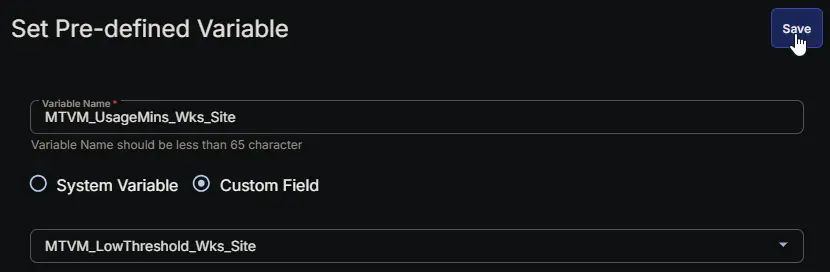

#### **Row 10 Function: Set Pre-defined Variable ( @MTVM_HighThreshold_Svr@ = MTVM_HighThreshold_Svr  )**

- **Notes:** `MTVM_HighThreshold_Svr`
- **Continue on Failure:** `False`
- **Operating System:** `Windows`
- **Variable Name:** `MTVM_HighThreshold_Svr`
- **Custom Field:** `MTVM_HighThreshold_Svr (STRING - COMPANY)`

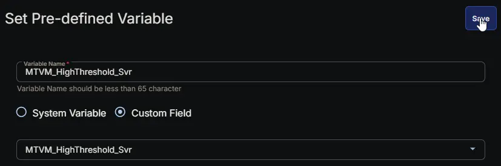

#### **Row 11 Function: Set Pre-defined Variable ( @MTVM_HighThreshold_Wks@ = MTVM_HighThreshold_Wks  )**

- **Notes:** `MTVM_HighThreshold_Wks`
- **Continue on Failure:** `False`
- **Operating System:** `Windows`
- **Variable Name:** `MTVM_HighThreshold_Wks`
- **Custom Field:** `MTVM_HighThreshold_Wks (STRING - COMPANY)`

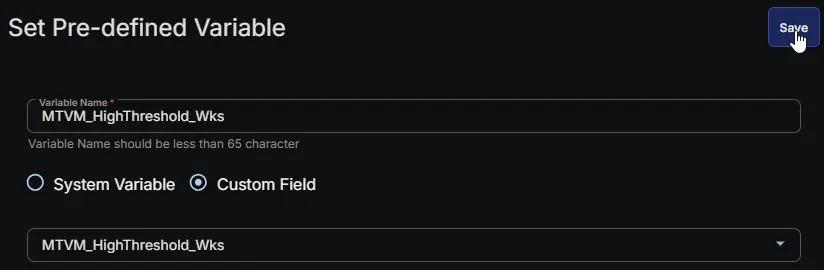

#### **Row 12 Function: Set Pre-defined Variable ( @MTVM_LowThreshold_Svr@ = MTVM_LowThreshold_Svr  )**

- **Notes:** `MTVM_LowThreshold_Svr`
- **Continue on Failure:** `False`
- **Operating System:** `Windows`
- **Variable Name:** `MTVM_LowThreshold_Svr`
- **Custom Field:** `MTVM_LowThreshold_Svr (STRING - COMPANY)`

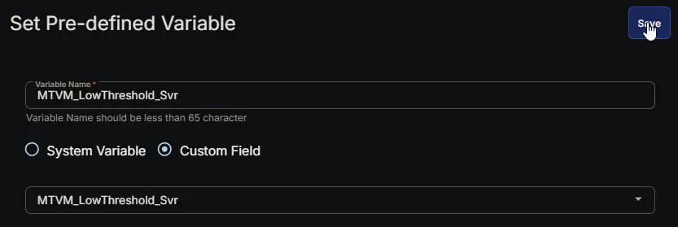

#### **Row 13 Function: Set Pre-defined Variable ( @MTVM_LowThreshold_Wks@ = MTVM_LowThreshold_Wks  )**

- **Notes:** `MTVM_LowThreshold_Wks`
- **Continue on Failure:** `False`
- **Operating System:** `Windows`
- **Variable Name:** `MTVM_LowThreshold_Wks`
- **Custom Field:** `MTVM_LowThreshold_Wks (STRING - COMPANY)`

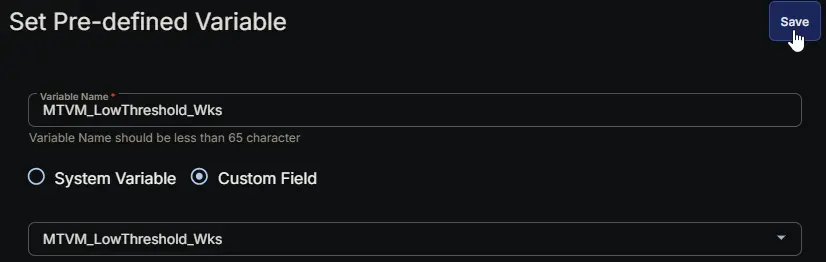

#### **Row 14 Function: Set Pre-defined Variable ( @MTVM_UsageMins_Svr@ = MTVM_UsageMins_Svr  )**

- **Notes:** `MTVM_UsageMins_Svr`
- **Continue on Failure:** `False`
- **Operating System:** `Windows`
- **Variable Name:** `MTVM_UsageMins_Svr`
- **Custom Field:** `MTVM_UsageMins_Svr (STRING - COMPANY)`

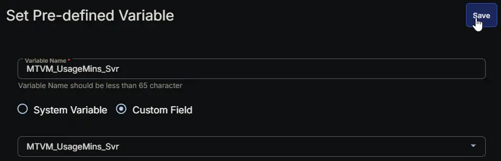

#### **Row 15 Function: Set Pre-defined Variable ( @MTVM_UsageMins_Wks@ = MTVM_UsageMins_Wks  )**

- **Notes:** `MTVM_UsageMins_Wks`
- **Continue on Failure:** `False`
- **Operating System:** `Windows`
- **Variable Name:** `MTVM_UsageMins_Wks`
- **Custom Field:** `MTVM_UsageMins_Wks (STRING - COMPANY)`

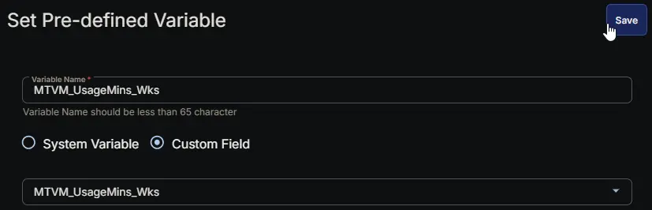

#### **Row 16 Function: Set Pre-defined Variable ( @Ticket_Mgmt_Webhook_Url@ = Ticket_Mgmt_Webhook_Url   )**

- **Notes:** `Ticket_Mgmt_Webhook_Url`
- **Continue on Failure:** `True`
- **Operating System:** `Windows`
- **Variable Name:** `Ticket_Mgmt_Webhook_Url`
- **Custom Field:** `Ticket_Mgmt_Webhook_Url (STRING - COMPANY)`

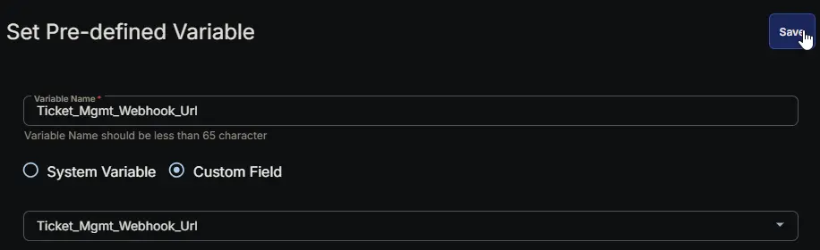

#### **Row 17 Function: PowerShell script**

- **Notes:** `<Leave it Blank>`  
- **Use Generative AI Assist for script creation:** `False`  
- **Expected time of script execution in seconds:** `300`  
- **Continue on Failure:** `False`  
- **Run As:** `System`  
- **Operating System:** `Windows`  
- **PowerShell Script Editor:**

[PowerShell Script](https://github.com/ProVal-Tech/cw-rmm/blob/main/tasks/memory-threshold-violation-monitoring-configuration-writer/script.ps1)


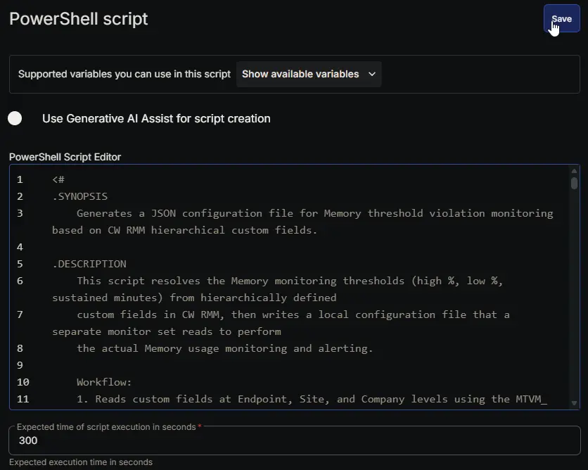

#### **Row 18 Function: Script Log**

- **Notes:** `<Leave it Blank>`  
- **Continue on Failure:** `False`  
- **Operating System:** `Windows`  
- **Script Log Message:** `%Output%`  

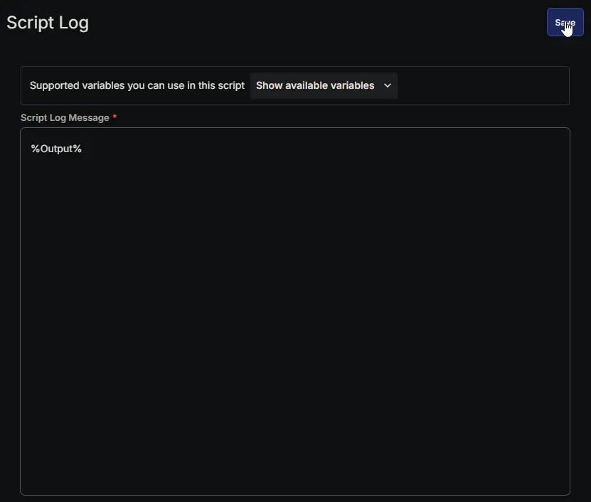

## Completed Script

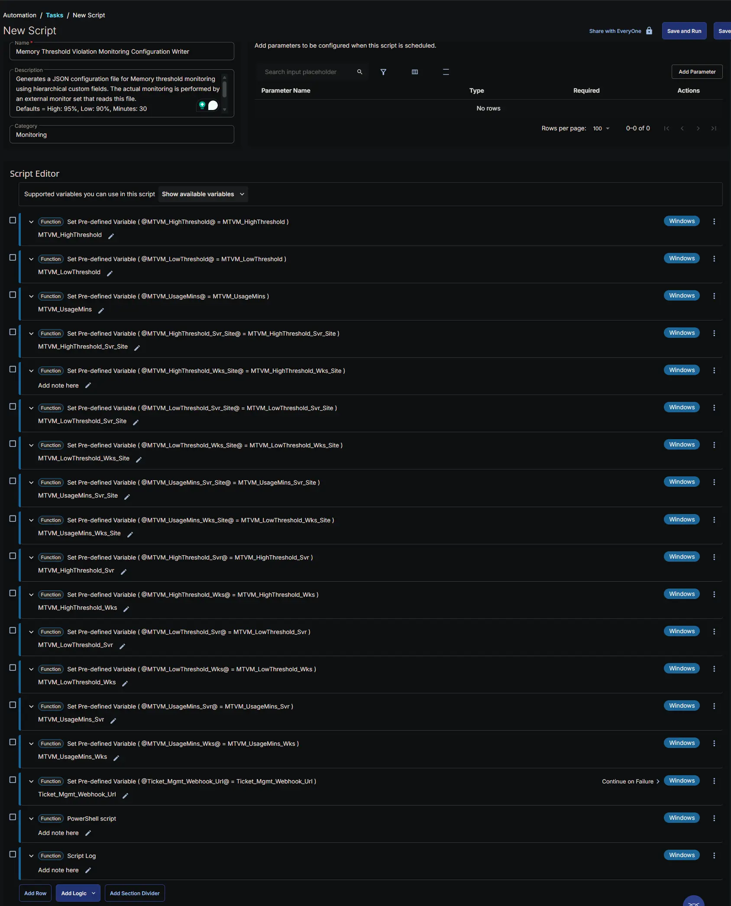

## Output

- Script Log
- JSON File at `C:\ProgramData\_Automation\Script\Test-MemoryUsage\Test-MemoryUsage.json`

## Schedule Task

### Task Details

- **Name:** `Memory Threshold Violation Monitoring Configuration Writer`  
- **Description:** `Generates a JSON configuration file for Memory threshold monitoring using hierarchical custom fields. The actual monitoring is performed by an external monitor set that reads this file.`  
- **Category:** `Monitoring`  

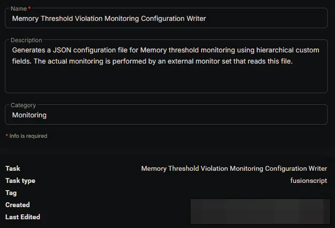

### Schedule

- **Schedule Type:**  `Schedule`  
- **Timezone:** `Local Machine Time`  
- **Start:** `<Current Date>`  
- **Trigger:** `Time` `At` `<Current Time>`  
- **Recurrence:** `Every day`
- **Execute at next agent check-in:** `True`
- **Stop After:** `22`
- **Unit:** `Hour(s)`

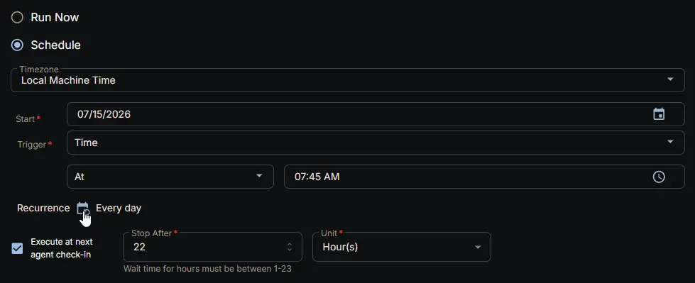

### Targeted Resource

**Device Group:** `Memory Threshold Violation Monitoring`

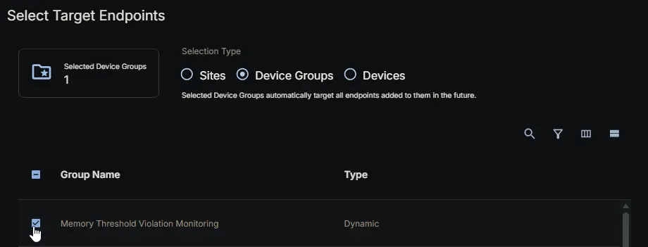

### Completed Scheduled Task

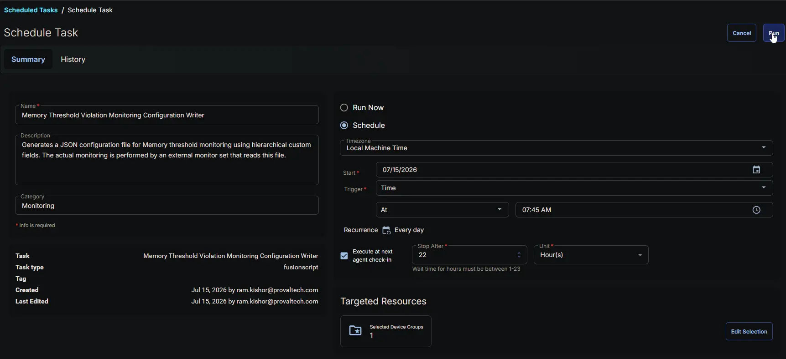

## Changelog

### 2026-07-23

- **Task Update:** The task now reads the company-level `Ticket_Mgmt_Webhook_Url` custom field and writes it into the configuration file as `TicketWebhookUrl`, enabling the optional `[Workflow]` monitor-set variant to trigger the ConnectWise ticketing workflow.

### 2026-07-15

- Initial version of the document

