---
id: 'f5099dd5-8e47-468f-a623-a245c342eb19'
slug: /f5099dd5-8e47-468f-a623-a245c342eb19
title: 'Microsoft 365 - Click-to-Run - Get Details'
title_meta: 'Microsoft 365 - Click-to-Run - Get Details'
keywords: ['microsoft', 'click-to-run', 'office', 'update', 'version', 'auto-update', 'channel']
description: 'This document provides a comprehensive guide on how to retrieve the installed Microsoft Click-to-Run Office version on a machine, verify if auto-update is enabled, and obtain the update channel. The guide includes sample runs, dependencies, task creation steps, and implementation recommendations.'
tags: ['application', 'office', 'update']
draft: false
unlisted: false
last_update:
  date: 2025-05-09
---

## Summary

This script retrieves the installed Microsoft Click-to-Run Office version on the machine, verifies whether auto-update is enabled, and obtains the update channel.

## Sample Run

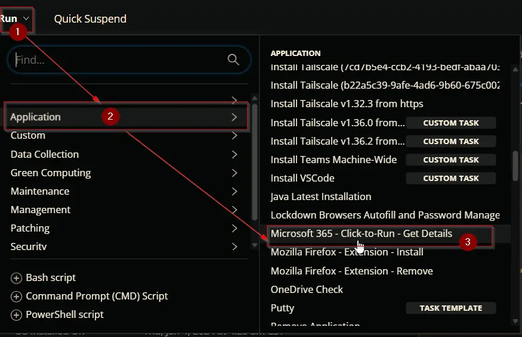  
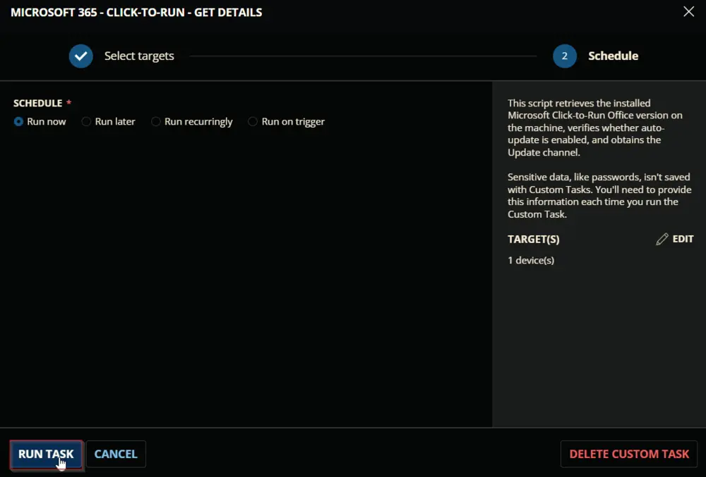  

## Dependencies

- [Custom Field - Endpoint - C2R Office Version](/docs/9229f1df-c80a-4333-8184-2c54954b4996)
- [Custom Field - Endpoint - C2R Auto Update](/docs/3fbd3eec-1a64-44d4-a812-fc2ac0e359e0)
- [Custom Field - Endpoint - C2R Update Channel](/docs/371c0aa5-4230-4952-b341-f5c58b0b46ad)
- [Custom Field - Endpoint - C2R Data Collection Time](/docs/d6a8abaa-dc34-4f49-8bf6-2bffe1ac40d0)
- [Device Group - Office C2R Auditing](/docs/4611eb6b-e00e-4e38-9935-531f71852e8c)

## Task Creation

Create a new `Script Editor` style script in the system to implement this task.

  
  

**Name:** `Microsoft 365 - Click-to-Run - Get Details`  
**Description:** `This script retrieves the installed Microsoft Click-to-Run Office version on the machine, verifies whether auto-update is enabled, and obtains the update channel.`  
**Category:** Application  
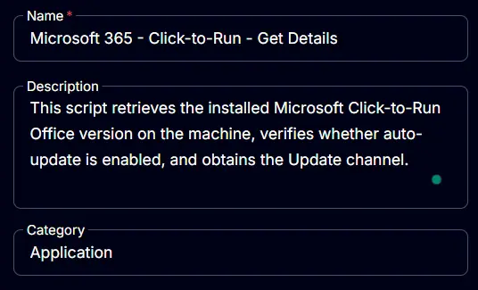  

## Task

Navigate to the Script Editor section and start by adding a row. You can do this by clicking the `Add Row` button at the bottom of the script page.  
  

A blank function will appear.  
  

### Row 1 Function: PowerShell Script

Search and select the `PowerShell Script` function.  
  
  

The following function will pop up on the screen:  
  

Paste in the following PowerShell script and leave the `Expected time of script execution in seconds` to `300` seconds. Click the `Save` button.

[PowerShell Script 1](https://github.com/ProVal-Tech/cw-rmm/blob/main/tasks/microsoft-365-click-to-run-get-details/script1.ps1)

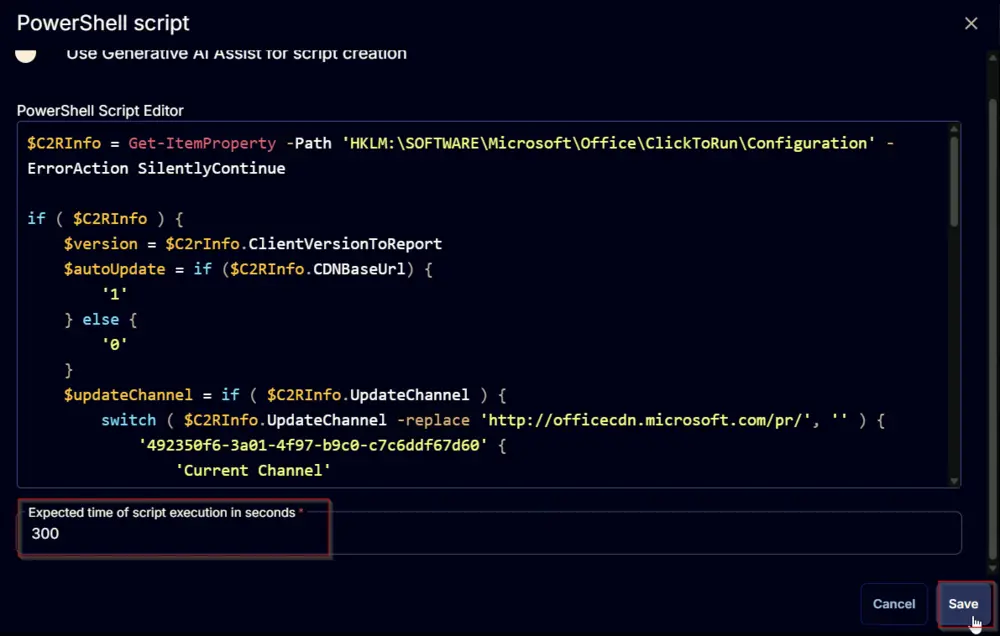  

### Row 2 Function: Set User Variable

Add a new row by clicking the `Add Row` button.  
  

Search and select the `Set User Variable` function.  
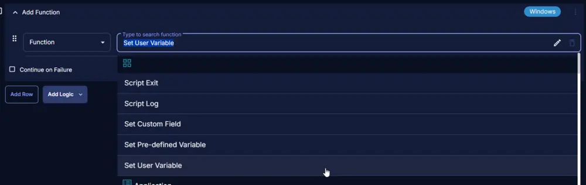  

The following function will pop up on the screen:  
  

- Set `psout` in the `Variable Name` field.
- Set `%Output%` in the `Value` field.
- Click the `Save` button.  
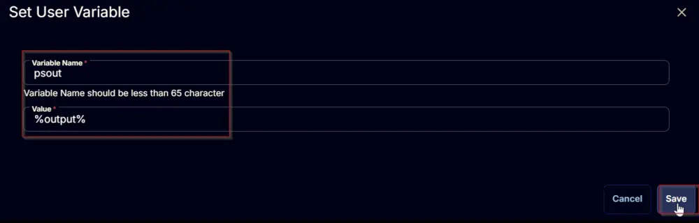  

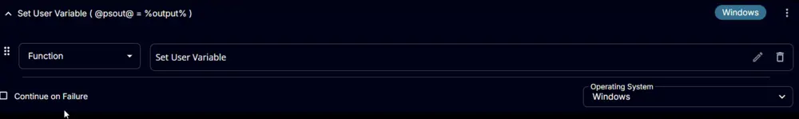  

### Row 3 Function: Script Log

Add a new row by clicking the `Add Row` button.  
  

A blank function will appear.  
  

Search and select the `Script Log` function.  
  

The following function will pop up on the screen:  
  

In the script log message, simply type `%output%` and click the `Save` button.  
  

### Row 4 Function: PowerShell Script

Add a new row by clicking the `Add Row` button.  
  

Search and select the `PowerShell Script` function.  
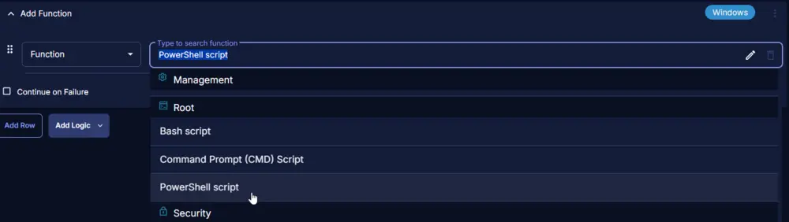  

The following function will pop up on the screen:  
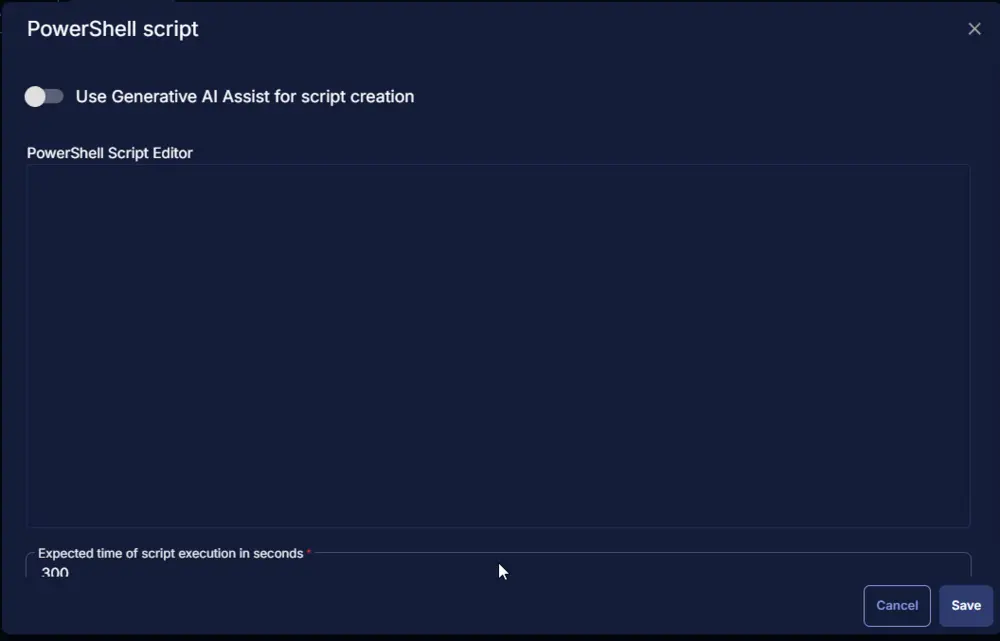  

Paste in the following PowerShell script and leave the `Expected time of script execution in seconds` to `300` seconds. Click the `Save` button.

[PowerShell Script 2](https://github.com/ProVal-Tech/cw-rmm/blob/main/tasks/microsoft-365-click-to-run-get-details/script2.ps1)

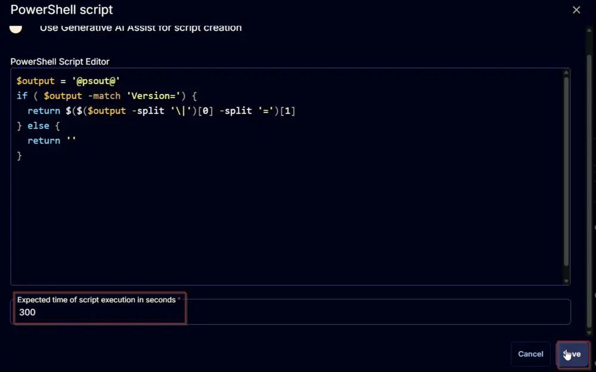  

### Row 5 Function: Set Custom Field

Add a new row by clicking the `Add Row` button.  
  

Search and select the `Set Custom Field` function.  
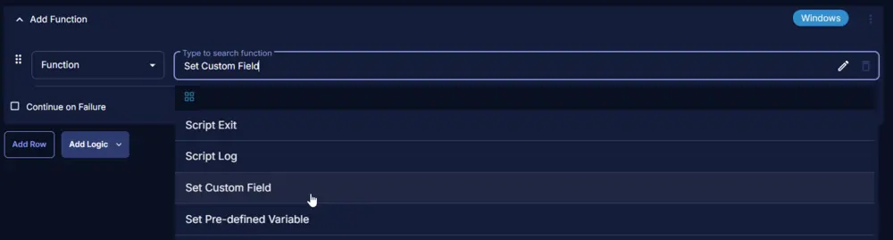  

The following function will pop up on the screen:  
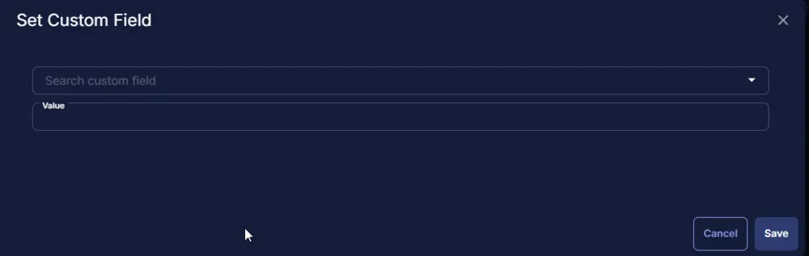  

- Search and select the Computer-Level Custom Field `C2R Office Version` from the Custom Field dropdown menu.
- Set `%Output%` in the `Value` field.
- Click the `Save` button.  
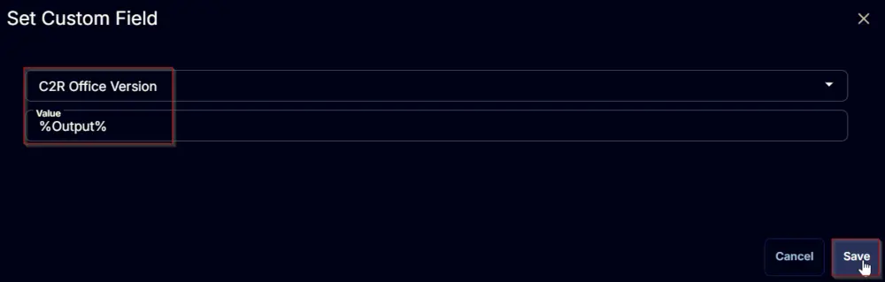  

Flag the `Continue on Failure` field.  
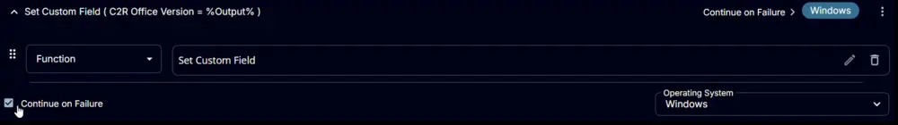  

### Row 6 Function: PowerShell Script

Add a new row by clicking the `Add Row` button.  
  

Search and select the `PowerShell Script` function.  
  

The following function will pop up on the screen:  
  

Paste in the following PowerShell script and leave the `Expected time of script execution in seconds` to `300` seconds. Click the `Save` button.

[PowerShell Script 3](https://github.com/ProVal-Tech/cw-rmm/blob/main/tasks/microsoft-365-click-to-run-get-details/script3.ps1)

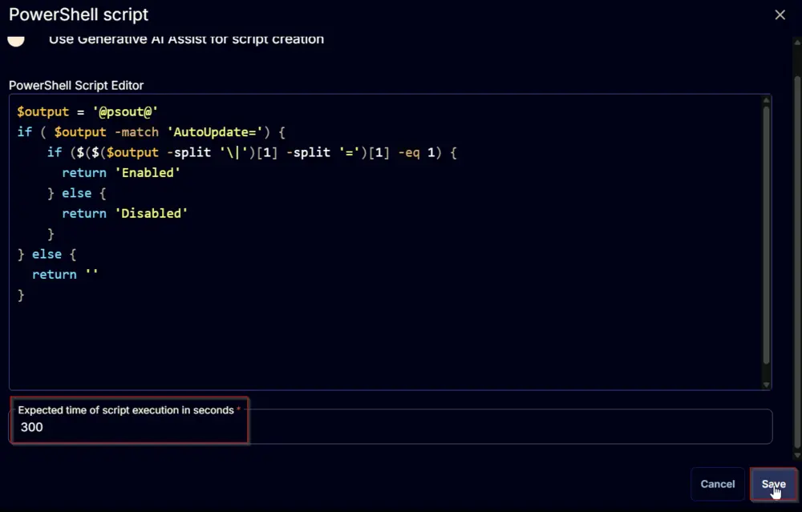  

### Row 7 Function: Set Custom Field

Add a new row by clicking the `Add Row` button.  
  

Search and select the `Set Custom Field` function.  
  

The following function will pop up on the screen:  
  

- Search and select the Computer-Level Custom Field `C2R Auto Update` from the Custom Field dropdown menu.
- Set `%Output%` in the `Value` field.
- Click the `Save` button.  
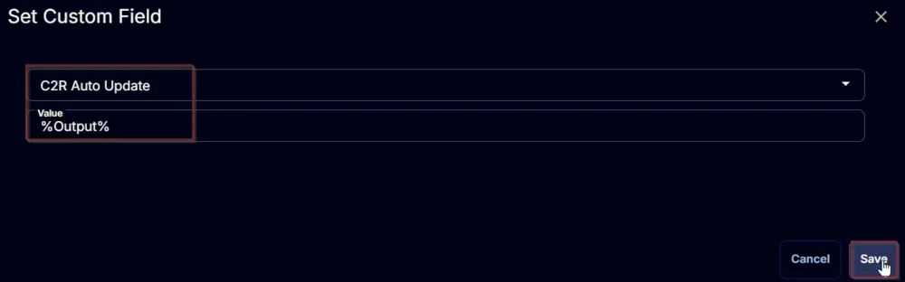  

Flag the `Continue on Failure` field.  
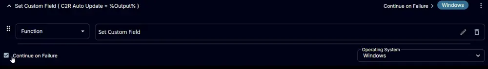  

### Row 8 Function: PowerShell Script

Add a new row by clicking the `Add Row` button.  
  

Search and select the `PowerShell Script` function.  
  

The following function will pop up on the screen:  
  

Paste in the following PowerShell script and leave the `Expected time of script execution in seconds` to `300` seconds. Click the `Save` button.

[PowerShell Script 4](https://github.com/ProVal-Tech/cw-rmm/blob/main/tasks/microsoft-365-click-to-run-get-details/script4.ps1)

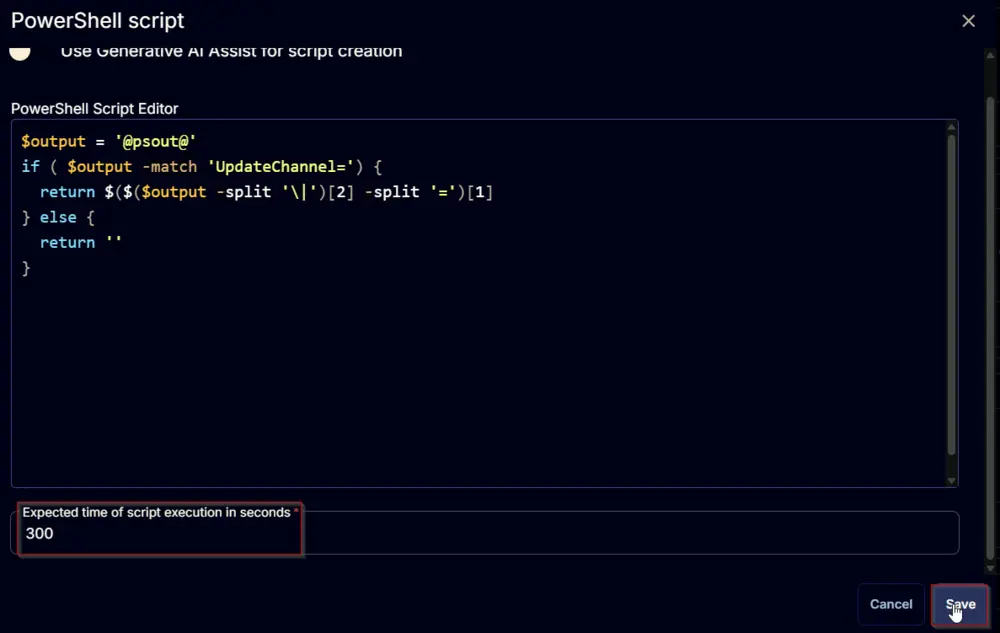  

### Row 9 Function: Set Custom Field

Add a new row by clicking the `Add Row` button.  
  

Search and select the `Set Custom Field` function.  
  

The following function will pop up on the screen:  
  

- Search and select the Computer-Level Custom Field `C2R Update Channel` from the Custom Field dropdown menu.
- Set `%Output%` in the `Value` field.
- Click the `Save` button.  
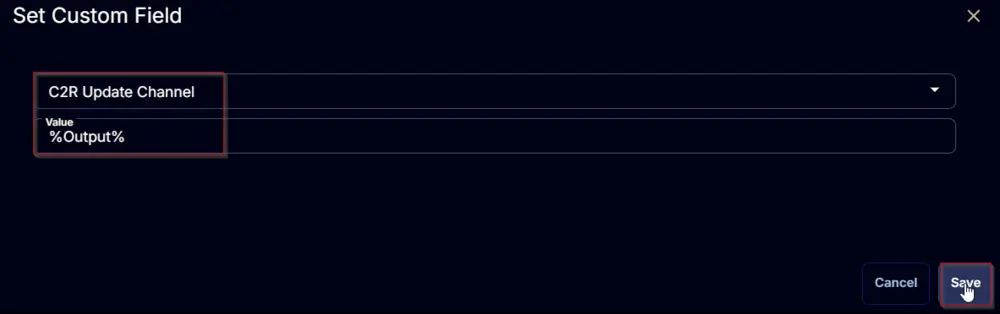  

Flag the `Continue on Failure` field.  
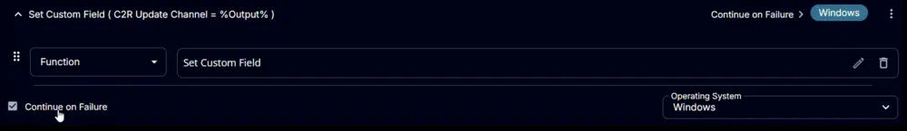  

### Row 10 Function: PowerShell Script

Add a new row by clicking the `Add Row` button.  
  

Search and select the `PowerShell Script` function.  
  

The following function will pop up on the screen:  
  

Paste in the following PowerShell script and leave the `Expected time of script execution in seconds` to `300` seconds. Click the `Save` button.

[PowerShell Script 5](https://github.com/ProVal-Tech/cw-rmm/blob/main/tasks/microsoft-365-click-to-run-get-details/script5.ps1)

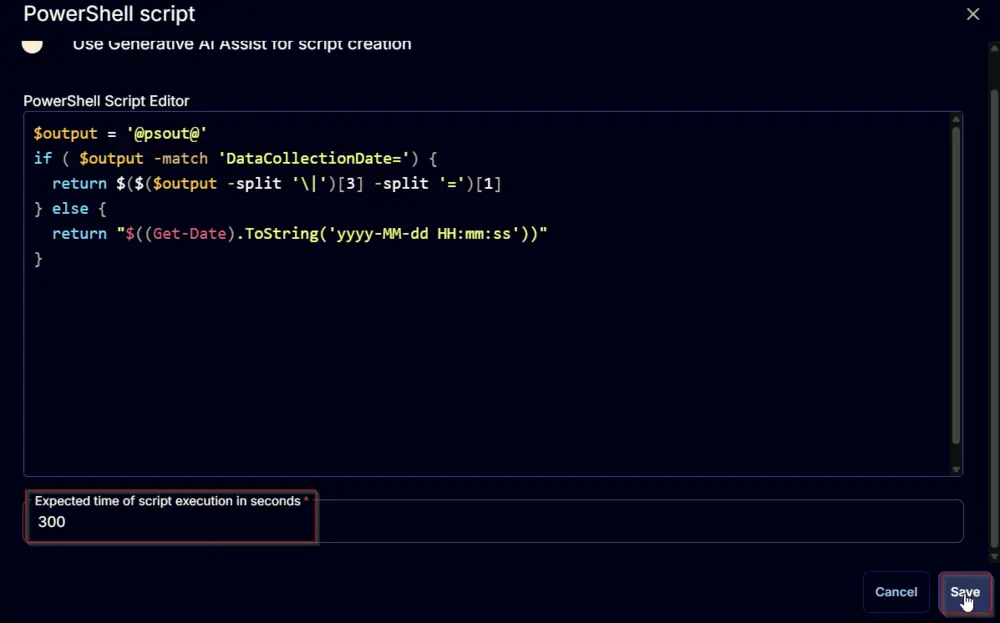  

### Row 11 Function: Set Custom Field

Add a new row by clicking the `Add Row` button.  
  

Search and select the `Set Custom Field` function.  
  

The following function will pop up on the screen:  
  

- Search and select the Computer-Level Custom Field `C2R Data Collection Time` from the Custom Field dropdown menu.
- Set `%Output%` in the `Value` field.
- Click the `Save` button.  
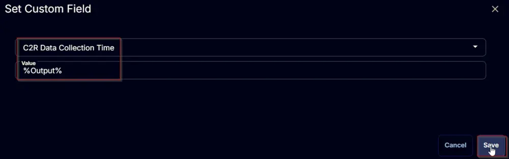  

Flag the `Continue on Failure` field.  
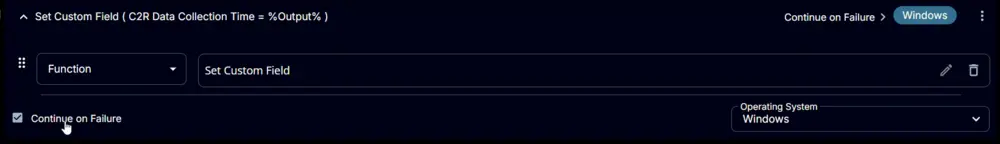  

Click the `Save` button at the top-right corner of the screen to save the script.  
  

## Completed Task

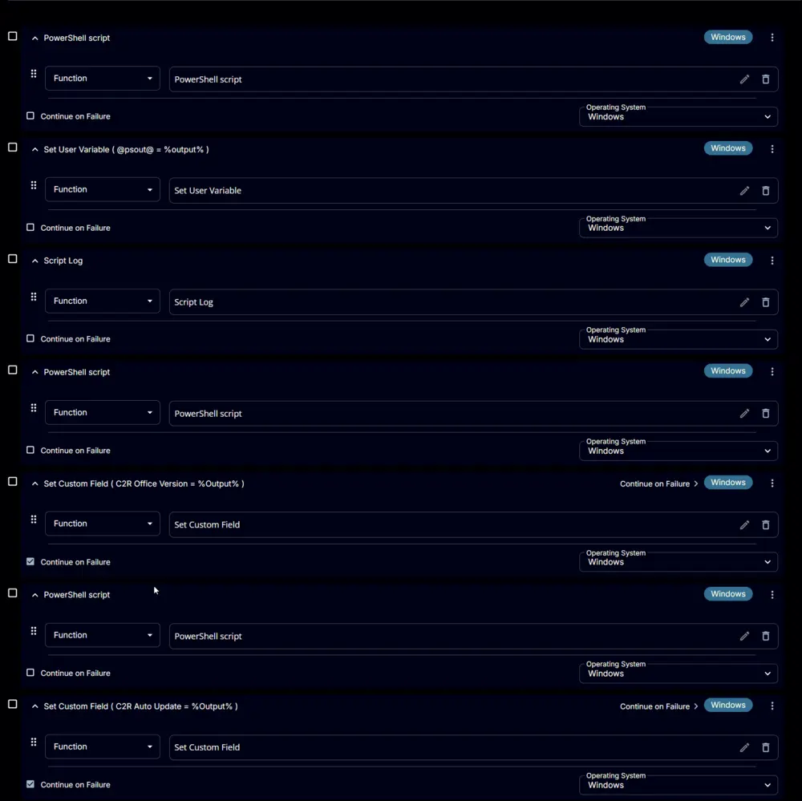  
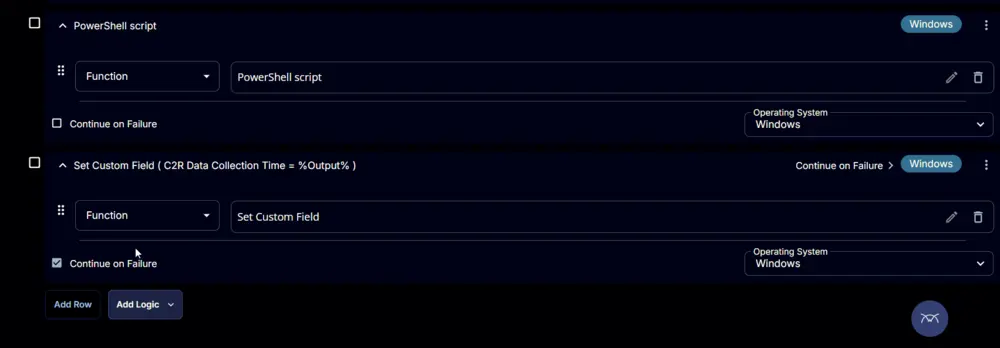  

## Implementation

It is suggested to run the task once per month against computers with the `Microsoft 365 Apps` installed.

- Go to `Automation` > `Tasks`.
- Search for [Microsoft 365 - Click-to-Run - Get Details](/docs/f5099dd5-8e47-468f-a623-a245c342eb19) task.
- Select the concerned task.
- Click on the `Schedule` button to schedule the task/script.  
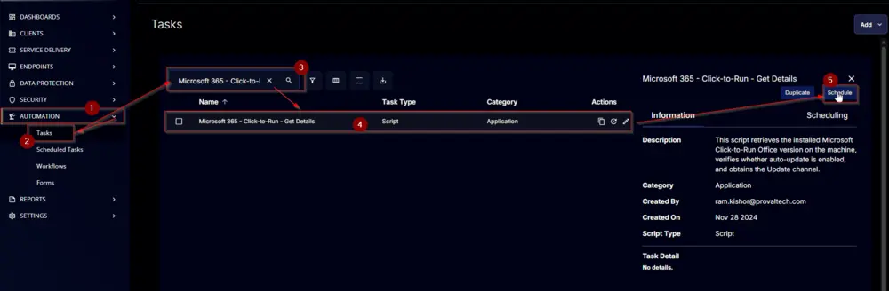  

This screen will appear.  
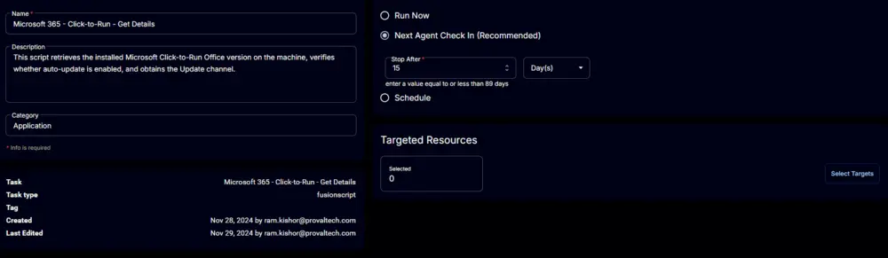  

Select the `Schedule` button and click the calendar-looking button present in front of the `Recurrence` option.  
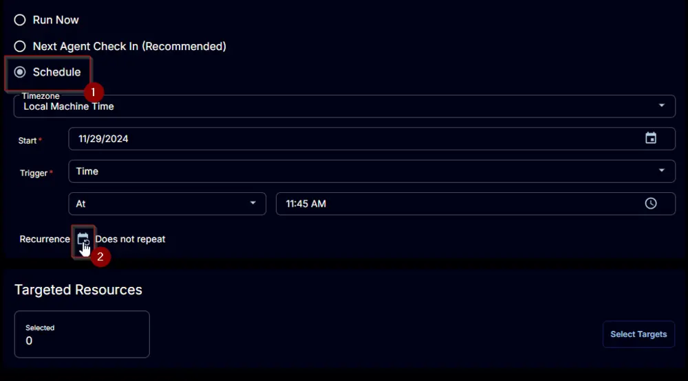  

Select the `Days(s)` for the `Repeat`, `14`, and click the `OK` button to save the schedule.  
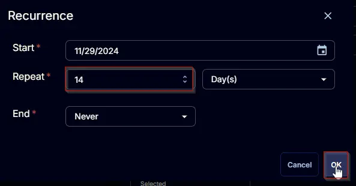  

Click the `Select Targets` button to select the concerned target.  
  

Search and select the `Office C2R Auditing` Device Group for the target.  
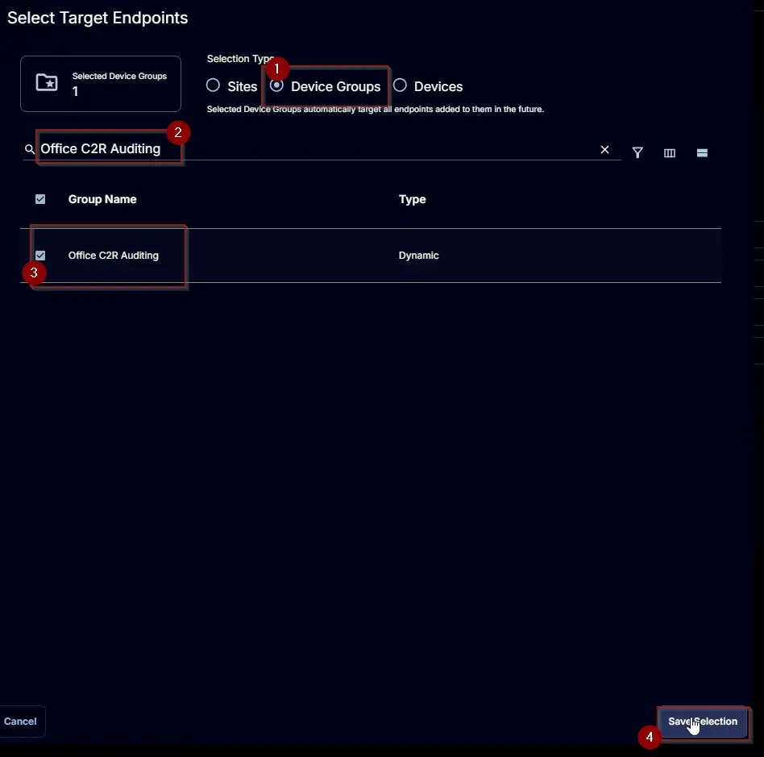  

Click the `Run` button to initiate the schedule.  
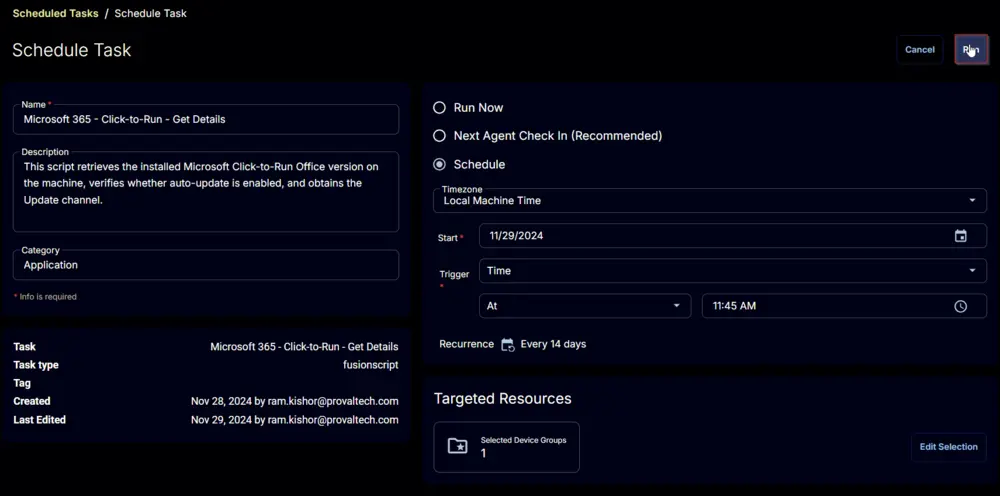  

## Output

- Script log  
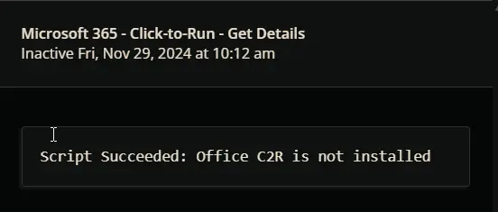  

- Custom Fields  
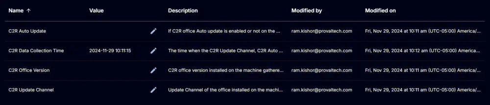

## Changelog

### 2025-04-10

- Initial version of the document

