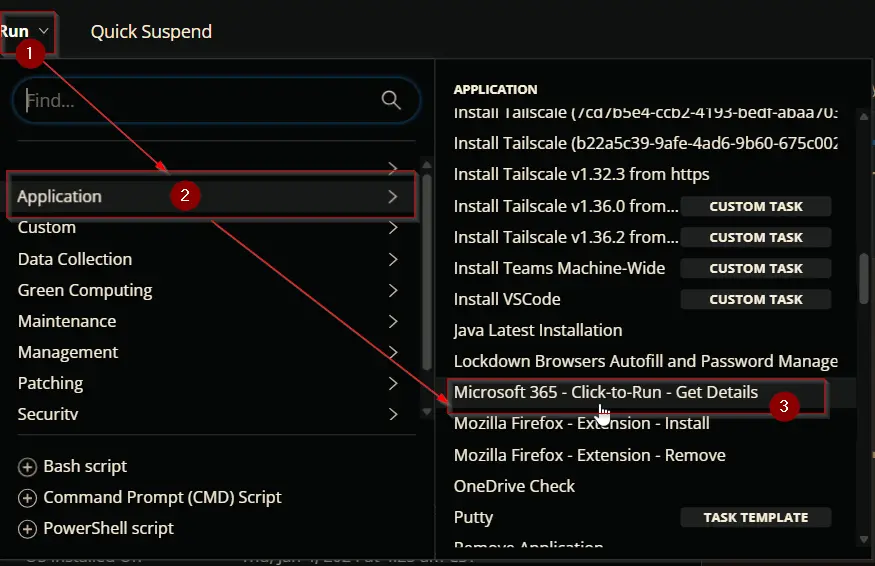
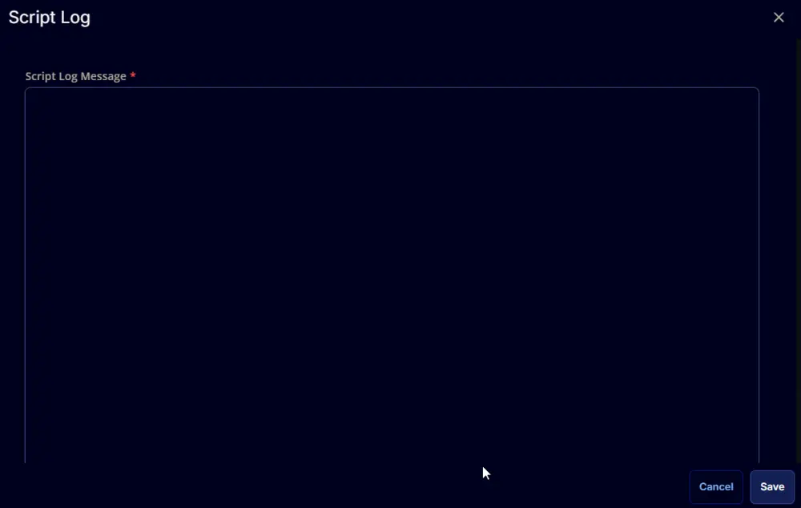
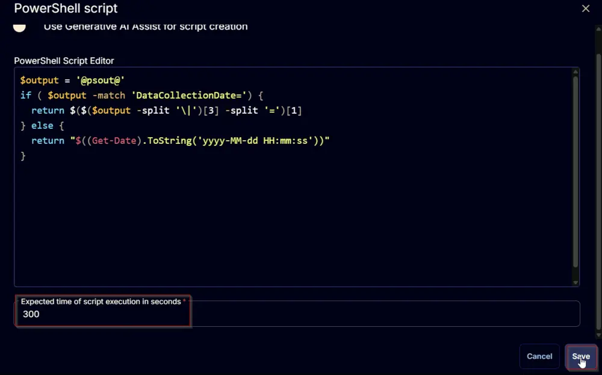

## Summary

This script retrieves the installed Microsoft Click-to-Run Office version on the machine, verifies whether auto-update is enabled, and obtains the update channel.

## Sample Run

  
  

## Dependencies

- [CW RMM - Custom Field - Endpoint - C2R Office Version](/docs/9229f1df-c80a-4333-8184-2c54954b4996)
- [CW RMM - Custom Field - Endpoint - C2R Auto Update](/docs/3fbd3eec-1a64-44d4-a812-fc2ac0e359e0)
- [CW RMM - Custom Field - Endpoint - C2R Update Channel](/docs/371c0aa5-4230-4952-b341-f5c58b0b46ad)
- [CW RMM - Custom Field - Endpoint - C2R Data Collection Time](/docs/d6a8abaa-dc34-4f49-8bf6-2bffe1ac40d0)
- [CW RMM - Device Group - Office C2R Auditing](/docs/4611eb6b-e00e-4e38-9935-531f71852e8c)

## Task Creation

Create a new `Script Editor` style script in the system to implement this task.

  
  

**Name:** `Microsoft 365 - Click-to-Run - Get Details`  
**Description:** `This script retrieves the installed Microsoft Click-to-Run Office version on the machine, verifies whether auto-update is enabled, and obtains the update channel.`  
**Category:** Application  
  

## Task

Navigate to the Script Editor section and start by adding a row. You can do this by clicking the `Add Row` button at the bottom of the script page.  
  

A blank function will appear.  
  

### Row 1 Function: PowerShell Script

Search and select the `PowerShell Script` function.  
  
  

The following function will pop up on the screen:  
  

Paste in the following PowerShell script and leave the `Expected time of script execution in seconds` to `300` seconds. Click the `Save` button.

```powershell
$C2RInfo = Get-ItemProperty -Path 'HKLM:\\SOFTWARE\\Microsoft\\Office\\ClickToRun\\Configuration' -ErrorAction SilentlyContinue
if ($C2RInfo) {
    $version = $C2RInfo.ClientVersionToReport
    $autoUpdate = if ($C2RInfo.CDNBaseUrl) {
        '1'
    } else {
        '0'
    }
    $updateChannel = if ($C2RInfo.UpdateChannel) {
        switch ($C2RInfo.UpdateChannel -replace 'http://officecdn.microsoft.com/pr\', '') {
            '492350f6-3a01-4f97-b9c0-c7c6ddf67d60' {
                'Current Channel'
            }
            '55336b82-a18d-4dd6-b5f6-9e5095c314a6' {
                'Monthly Enterprise Channel'
            }
            '7ffbc6bf-bc32-4f92-8982-f9dd17fd3114' {
                'Semi-Annual Enterprise Channel'
            }
            'b8f9b850-328d-4355-9145-c59439a0c4cf' {
                'Semi-Annual Enterprise Channel (Preview)'
            }
            '64256afe-f5d9-4f86-8936-8840a6a4f5be' {
                'Current Channel (Preview)'
            }
            '5440fd1f-7ecb-4221-8110-145efaa6372f' {
                'Beta Channel'
            }
            'f2e724c1-748f-4b47-8fb8-8e0d210e9208' {
                'LTSC Channel (up to Office 2019)'
            }
            '2e148de9-61c8-4051-b103-4af54baffbb4' {
                'LTSC Channel (Preview)'
            }
            '5030841d-c919-4594-8d2d-84ae4f96e58e' {
                'LTSC 2021 Channel (Office 2021+)'
            }
            default {
                'Unknown'
            }
        }
    } else {
        'Not Set'
    }
    $dataCollectionDate = (Get-Date).ToString('yyyy-MM-dd HH:mm:ss')
    return "Version=$version|AutoUpdate=$autoUpdate|UpdateChannel=$updateChannel|DataCollectionDate=$dataCollectionDate"
} else {
    return 'Office C2R is not installed'
}
```

  

### Row 2 Function: Set User Variable

Add a new row by clicking the `Add Row` button.  
  

Search and select the `Set User Variable` function.  
  

The following function will pop up on the screen:  
  

- Set `psout` in the `Variable Name` field.
- Set `%Output%` in the `Value` field.
- Click the `Save` button.  
  

  

### Row 3 Function: Script Log

Add a new row by clicking the `Add Row` button.  
  

A blank function will appear.  
  

Search and select the `Script Log` function.  
  

The following function will pop up on the screen:  
  

In the script log message, simply type `%output%` and click the `Save` button.  
  

### Row 4 Function: PowerShell Script

Add a new row by clicking the `Add Row` button.  
  

Search and select the `PowerShell Script` function.  
  

The following function will pop up on the screen:  
  

Paste in the following PowerShell script and leave the `Expected time of script execution in seconds` to `300` seconds. Click the `Save` button.

```powershell
$output = '@psout@'
if ($output -match 'Version=') {
    return $($($output -split '/|')[0] -split '=')[1]
} else {
    return ''
}
```

  

### Row 5 Function: Set Custom Field

Add a new row by clicking the `Add Row` button.  
  

Search and select the `Set Custom Field` function.  
  

The following function will pop up on the screen:  
  

- Search and select the Computer-Level Custom Field `C2R Office Version` from the Custom Field dropdown menu.
- Set `%Output%` in the `Value` field.
- Click the `Save` button.  
  

Flag the `Continue on Failure` field.  
  

### Row 6 Function: PowerShell Script

Add a new row by clicking the `Add Row` button.  
  

Search and select the `PowerShell Script` function.  
  

The following function will pop up on the screen:  
  

Paste in the following PowerShell script and leave the `Expected time of script execution in seconds` to `300` seconds. Click the `Save` button.

```powershell
$output = '@psout@'
if ($output -match 'AutoUpdate=') {
    if ($($($output -split '/|')[1] -split '=')[1] -eq 1) {
        return 'Enabled'
    } else {
        return 'Disabled'
    }
} else {
    return ''
}
```

  

### Row 7 Function: Set Custom Field

Add a new row by clicking the `Add Row` button.  
  

Search and select the `Set Custom Field` function.  
  

The following function will pop up on the screen:  
  

- Search and select the Computer-Level Custom Field `C2R Auto Update` from the Custom Field dropdown menu.
- Set `%Output%` in the `Value` field.
- Click the `Save` button.  
  

Flag the `Continue on Failure` field.  
  

### Row 8 Function: PowerShell Script

Add a new row by clicking the `Add Row` button.  
  

Search and select the `PowerShell Script` function.  
  

The following function will pop up on the screen:  
  

Paste in the following PowerShell script and leave the `Expected time of script execution in seconds` to `300` seconds. Click the `Save` button.

```powershell
$output = '@psout@'
if ($output -match 'UpdateChannel=') {
    return $($($output -split '/|')[2] -split '=')[1]
} else {
    return ''
}
```

  

### Row 9 Function: Set Custom Field

Add a new row by clicking the `Add Row` button.  
  

Search and select the `Set Custom Field` function.  
  

The following function will pop up on the screen:  
  

- Search and select the Computer-Level Custom Field `C2R Update Channel` from the Custom Field dropdown menu.
- Set `%Output%` in the `Value` field.
- Click the `Save` button.  
  

Flag the `Continue on Failure` field.  
  

### Row 10 Function: PowerShell Script

Add a new row by clicking the `Add Row` button.  
  

Search and select the `PowerShell Script` function.  
  

The following function will pop up on the screen:  
  

Paste in the following PowerShell script and leave the `Expected time of script execution in seconds` to `300` seconds. Click the `Save` button.

```powershell
$output = '@psout@'
if ($output -match 'DataCollectionDate=') {
    return $($($output -split '/|')[3] -split '=')[1]
} else {
    return "$((Get-Date).ToString('yyyy-MM-dd HH:mm:ss'))"
}
```

  

### Row 11 Function: Set Custom Field

Add a new row by clicking the `Add Row` button.  
  

Search and select the `Set Custom Field` function.  
  

The following function will pop up on the screen:  
  

- Search and select the Computer-Level Custom Field `C2R Data Collection Time` from the Custom Field dropdown menu.
- Set `%Output%` in the `Value` field.
- Click the `Save` button.  
  

Flag the `Continue on Failure` field.  
  

Click the `Save` button at the top-right corner of the screen to save the script.  
  

## Completed Task

  
  

## Implementation

It is suggested to run the task once per month against computers with the `Microsoft 365 Apps` installed.

- Go to `Automation` > `Tasks`.
- Search for [Microsoft 365 - Click-to-Run - Get Details](/docs/f5099dd5-8e47-468f-a623-a245c342eb19) task.
- Select the concerned task.
- Click on the `Schedule` button to schedule the task/script.  
  

This screen will appear.  
  

Select the `Schedule` button and click the calendar-looking button present in front of the `Recurrence` option.  
  

Select the `Days(s)` for the `Repeat`, `14`, and click the `OK` button to save the schedule.  
  

Click the `Select Targets` button to select the concerned target.  
  

Search and select the `Office C2R Auditing` Device Group for the target.  
  

Click the `Run` button to initiate the schedule.  
  

## Output

- Script log  
  

- Custom Fields  
  