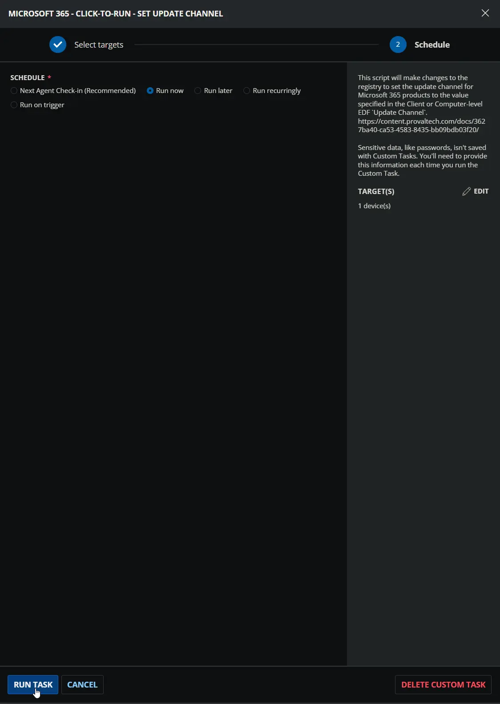
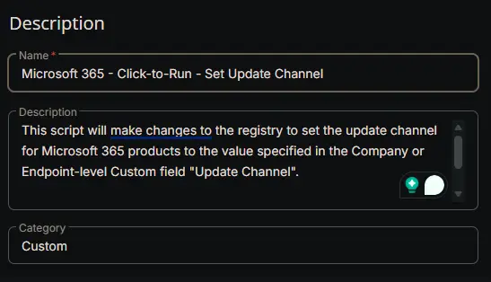
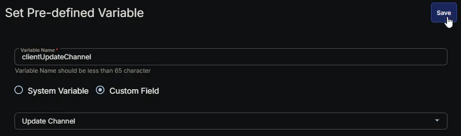
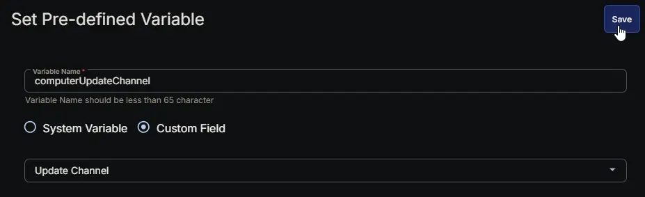
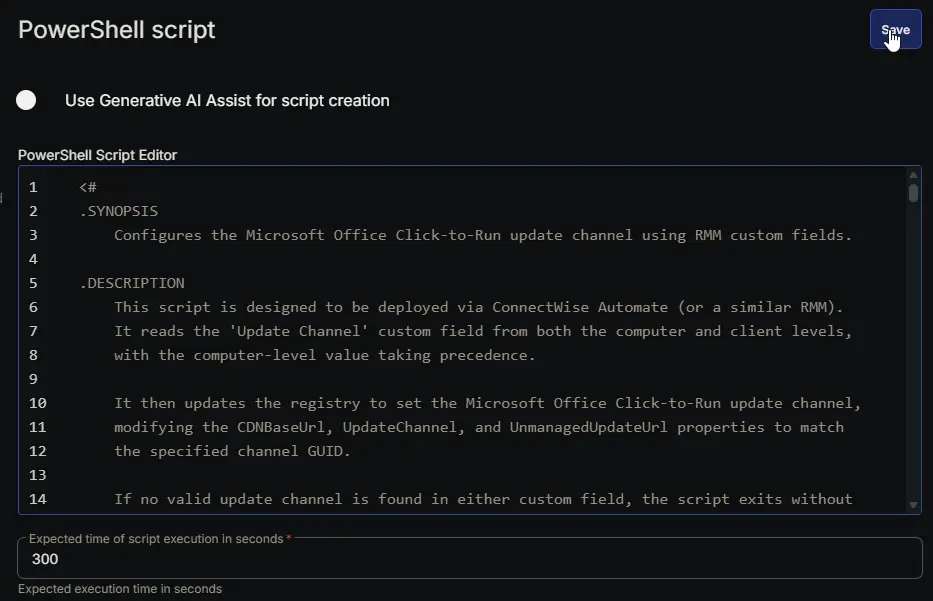
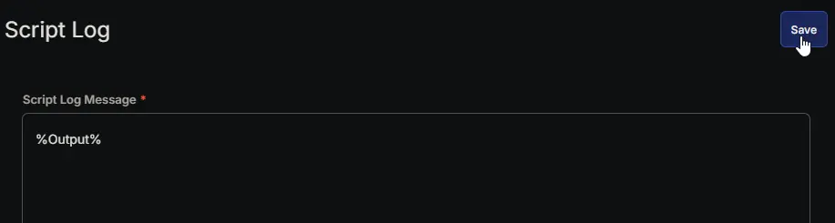
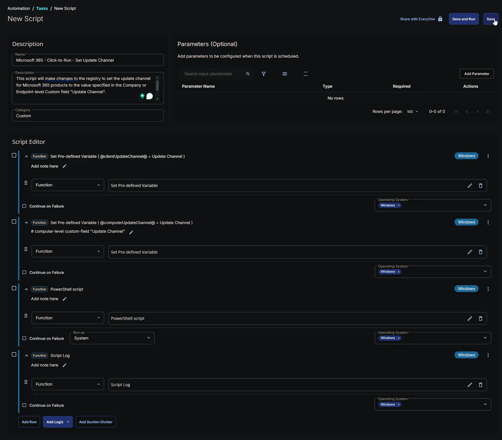

## Summary

Configures the Microsoft Office Click-to-Run update channel using custom fields.

> **Note:** Set the 'Update Channel' custom field at either the company or endpoint-level before running this task.

## Sample Run



## Dependencies

- [Custom Field - Client - Update Channel](/docs/656f037b-8dba-4e59-b135-33dcd5b0b7dc)
- [Custom Field - Endpoint - Update Channel](/docs/772c0498-4505-4f1c-afc4-46788294b3e2)
- [Solution - Microsoft 365 - Click-to-Run - Set Update Channel](/docs/b605b808-7016-4911-8c37-6b950de40919)

## Custom Fields

| Name                | Example                                   | Level   | Type | Required | Available Options | Description                 |
|---------------------|-------------------------------------------|---------|------|----------|--------------------|----------------------------|
| [Update Channel](/docs/656f037b-8dba-4e59-b135-33dcd5b0b7dc) | `Current Channel` | `Company` | Dropdown | Partially |   *(See below)*                  | Sets the default update channel for all endpoints at the company level. |
| [Update Channel](/docs/772c0498-4505-4f1c-afc4-46788294b3e2) | `Semi-Annual Enterprise Channel` | `Endpoint` | Dropdown | Partially |   *(See below)*                  | Overrides the company-level update channel for a specific endpoint. |

> **Note:** At least one of the above custom fields must be set before running this task. If both are set, the endpoint-level value takes precedence over the company-level value.

**Available Options:**  

- Current Channel
- Monthly Enterprise Channel
- Semi-Annual Enterprise Channel
- Beta Channel
- None

## Task Setup Path

- **Tasks Path:** `AUTOMATION` ➞ `Tasks`  
- **Task Type:** `Script Editor`  

## Task Creation

### Description

- **Name:** `Microsoft 365 - Click-to-Run - Set Update Channel`  
- **Description:**  

```PlainText
This script will make changes to the registry to set the update channel for Microsoft 365 products to the value specified in the Company or Endpoint-level Custom field "Update Channel".

https://content.provaltech.com/docs/3627ba40-ca53-4583-8435-bb09bdb03f20
```

- **Category:** `Custom`



### Script Editor

#### Row 1: Set Pre-defined Variable ( @clientUpdateChannel@ = Update Channel )

- **Notes:** `# client-level custom-field "Update Channel"`  
- **Variable Name:** `clientUpdateChannel`  
- **Type:** `Custom Field`  
- **Custom Field:** `Update Channel` *(Select the company-level custom field)*  
- **Continue on Failure:** `False`  
- **Operating System:** `Windows`



#### Row 2: Set Pre-defined Variable ( @computerUpdateChannel@ = Update Channel )

- **Notes:** `# computer-level custom-field "Update Channel"`  
- **Variable Name:** `computerUpdateChannel`  
- **Type:** `Custom Field`  
- **Custom Field:** `Update Channel` *(Select the endpoint-level custom field)*  
- **Continue on Failure:** `False`  
- **Operating System:** `Windows`



#### Row 3: PowerShell script

- **Notes:** `<Leave it Blank>`  
- **Continue on Failure:** `False`  
- **Run As:** `System`  
- **Operating System:** `Windows`  
- **Expected time of script execution in seconds:** 300  
- **PowerShell Script:**  

```PowerShell
<#
.SYNOPSIS
    Configures the Microsoft Office Click-to-Run update channel using RMM custom fields.

.DESCRIPTION
    This script is designed to be deployed via ConnectWise Automate (or a similar RMM). 
    It reads the 'Update Channel' custom field from both the computer and client levels, 
    with the computer-level value taking precedence. 

    It then updates the registry to set the Microsoft Office Click-to-Run update channel,
    modifying the CDNBaseUrl, UpdateChannel, and UnmanagedUpdateUrl properties to match 
    the specified channel GUID.

    If no valid update channel is found in either custom field, the script exits without 
    making changes.

.NOTES
    Required Custom Fields:
    - Computer-Level: 'Update Channel'
    - Client-Level: 'Update Channel'

    Accepted Values:
    'Current Channel', 'Monthly Enterprise Channel', 'Semi-Annual Enterprise Channel',
    'Current Channel (Preview)', 'Semi-Annual Enterprise Channel (Preview)', 'Beta Channel',
    'LTSC Channel (upto Office 2019)', 'LTSC Channel (Preview)', 'LTSC 2021 Channel (Office 2021+)'

.EXAMPLE
    Set the 'Update Channel' custom field to 'Current Channel' at either the client or 
    computer level in your RMM, then execute this script.

    The script will automatically detect the value and apply the corresponding registry changes.
#>

#region globals
$ProgressPreference = 'SilentlyContinue'
$WarningPreference = 'SilentlyContinue'
$InformationPreference = 'Continue'
$ConfirmPreference = 'None'
#endregion

#region function
function Set-M365UpdateChannel {
    <#
    .SYNOPSIS
        Configures the Microsoft Office Click-to-Run update channel.

    .DESCRIPTION
        This script updates the registry to set the Microsoft Office Click-to-Run update channel.
        It modifies the CDNBaseUrl, UpdateChannel, and UnmanagedUpdateUrl properties to match
        the specified channel GUID.

    .PARAMETER updateChannel
        Required. The desired Office update channel to configure.
        Accepted Values: 'Current Channel', 'Monthly Enterprise Channel', 'Semi-Annual Enterprise Channel',
                         'Current Channel (Preview)', 'Semi-Annual Enterprise Channel (Preview)',
                         'Beta Channel', 'LTSC Channel (upto Office 2019)', 'LTSC Channel (Preview)',
                         'LTSC 2021 Channel (Office 2021+)'.

    .EXAMPLE
        Set-M365UpdateChannel -updateChannel 'Current Channel'

        Sets the Office update channel to Current Channel.
    #>

    #region parameters
    [CmdletBinding(SupportsShouldProcess)]
    [OutputType([boolean])]
    param(
        [Parameter(Mandatory = $true, HelpMessage = 'The desired Office update channel to configure')]
        [ValidateSet(
            'Current Channel',
            'Monthly Enterprise Channel',
            'Semi-Annual Enterprise Channel',
            'Current Channel (Preview)',
            'Semi-Annual Enterprise Channel (Preview)',
            'Beta Channel',
            'LTSC Channel (upto Office 2019)',
            'LTSC Channel (Preview)',
            'LTSC 2021 Channel (Office 2021+)'
        )]
        [string]$updateChannel
    )
    #endregion

    begin {

        #region variables
        $success = $true
        $confirmationCount = 0
        #endregion
    } process {
        #region variables
        $guid = switch ($updateChannel) {
            'Current Channel' {
                '492350f6-3a01-4f97-b9c0-c7c6ddf67d60'
            }
            'Monthly Enterprise Channel' {
                '55336b82-a18d-4dd6-b5f6-9e5095c314a6'
            }
            'Semi-Annual Enterprise Channel' {
                '7ffbc6bf-bc32-4f92-8982-f9dd17fd3114'
            }
            'Semi-Annual Enterprise Channel (Preview)' {
                'b8f9b850-328d-4355-9145-c59439a0c4cf'
            }
            'Current Channel (Preview)' {
                '64256afe-f5d9-4f86-8936-8840a6a4f5be'
            }
            'Beta Channel' {
                '5440fd1f-7ecb-4221-8110-145efaa6372f'
            }
            'LTSC Channel (upto Office 2019)' {
                'f2e724c1-748f-4b47-8fb8-8e0d210e9208'
            }
            'LTSC Channel (Preview)' {
                '2e148de9-61c8-4051-b103-4af54baffbb4'
            }
            'LTSC 2021 Channel (Office 2021+)' {
                '5030841d-c919-4594-8d2d-84ae4f96e58e'
            }
            default {
                '492350f6-3a01-4f97-b9c0-c7c6ddf67d60'
            }
        }

        $path = 'HKLM:\SOFTWARE\Microsoft\Office\ClickToRun\Configuration'
        $strings = @('CDNBaseUrl', 'UpdateChannel', 'UnmanagedUpdateUrl')
        $url = 'http://officecdn.microsoft.com/pr/{0}' -f $guid
        #endregion

        #region process
        Write-Information -MessageData ('Setting Update Channel to {0}' -f $updateChannel)

        foreach ($string in $strings) {
            $currentValue = (Get-ItemProperty -Path $path -Name $string -ErrorAction SilentlyContinue).$string

            if ($currentValue -eq $url) {
                Write-Information -MessageData ('{0} is already set to {1}' -f $string, $updateChannel)
            } else {
                try {
                    if (-not (Test-Path -Path $path)) {
                        New-Item -Path $path -Force -ErrorAction Stop | Out-Null
                    }

                    if ($PSCmdlet.ShouldProcess($string, 'Set registry value')) {
                        Set-ItemProperty -Path $path -Name $string -Value $url -Force -ErrorAction Stop
                        Write-Information -MessageData ('{0} has been successfully set to {1}' -f $string, $updateChannel)
                    }
                } catch {
                    Write-Information -MessageData ('Error: Failed to set {0} to {1}. Reason: {2}' -f $string, $updateChannel, $Error[0].Exception.Message)
                }
            }
        }
        #endregion

        #region confirmation
        Write-Information -MessageData 'Re-Checking registry values to confirm changes...'
        foreach ($string in $strings) {
            $currentValue = (Get-ItemProperty -Path $path -Name $string -ErrorAction SilentlyContinue).$string

            if ($currentValue -eq $url) {
                Write-Information -MessageData ('{0} is confirmed to be set to {1}' -f $string, $updateChannel)
                $confirmationCount += 1
            } else {
                Write-Information -MessageData ('{0} is NOT set to {1}. Current value: {2}' -f $string, $updateChannel, $currentValue)
            }
        }
        if ($confirmationCount -eq ($strings.Count)) {
            Write-Information -MessageData 'All registry values have been confirmed to be set correctly.'
            $success = $true
        } else {
            Write-Information -MessageData ('{0} out of {1} registry values were confirmed to be set correctly.' -f $confirmationCount, $strings.Count)
            $success = $false
        }
        #endregion
    } end {
        #region return result
        return $success
        #endregion
    }
}
#endregion

#region rmm implementation
$clientLevelUpdateChannel = '@clientUpdateChannel@'
$computerLevelUpdateChannel = '@computerUpdateChannel@'

$acceptedValues = @(
    'Current Channel',
    'Monthly Enterprise Channel',
    'Semi-Annual Enterprise Channel',
    'Current Channel (Preview)',
    'Semi-Annual Enterprise Channel (Preview)',
    'Beta Channel',
    'LTSC Channel (upto Office 2019)',
    'LTSC Channel (Preview)',
    'LTSC 2021 Channel (Office 2021+)'
)


$updateChannel = if ($acceptedValues -contains $computerLevelUpdateChannel) {
    $computerLevelUpdateChannel
} elseif ($acceptedValues -contains $clientLevelUpdateChannel) {
    $clientLevelUpdateChannel
} else {
    'Not Set'
}

if ($updateChannel -eq 'Not Set') {
    Write-Information -MessageData 'No valid update channel specified at either client or computer level. Exiting without making changes.'
    Write-Information -MessageData ('Please set the update channel either at the client level or computer level in the Custom Field `Update Channel` before running the script. Accepted values are: {0}' -f ($acceptedValues -join ', '))
    exit 1
}

Write-Information -MessageData ('Applying update channel: {0}' -f $updateChannel)
if (Set-M365UpdateChannel -updateChannel $updateChannel) {
    Write-Information -MessageData 'Update channel applied successfully.'
    exit 0
} else {
    Write-Information -MessageData 'Failed to apply update channel.'
    exit 1
}
#endregion
```



#### Row 4: Script Log

- **Notes:** `<Leave it Blank>`  
- **Continue on Failure:** `False`  
- **Operating System:** `Windows`  
- **Script Log Message:** `%Output%`



## Completed Script



## Output

- Script Log

## Changelog

### 2026-06-16

- Enhanced PowerShell script
- Simplified the task
- Documentation

### 2025-04-10

- Initial version of the document
