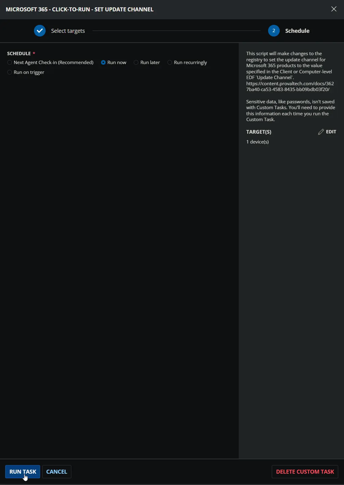
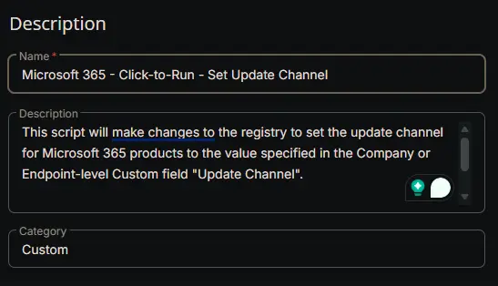
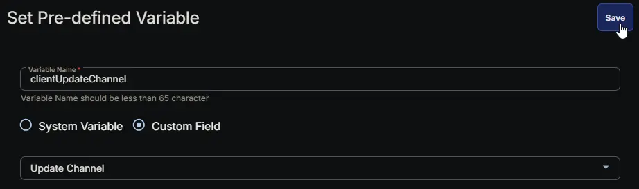
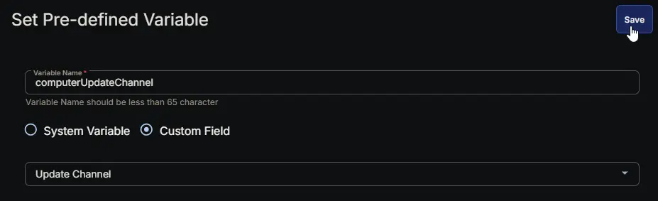
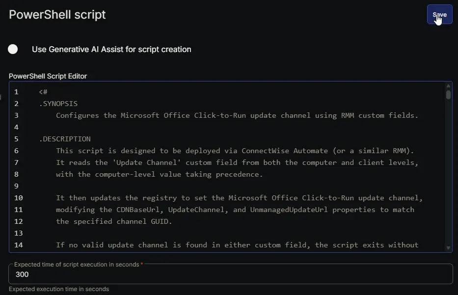
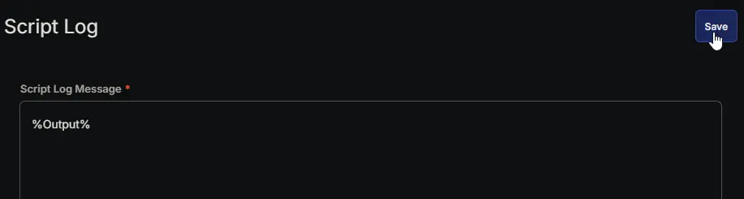
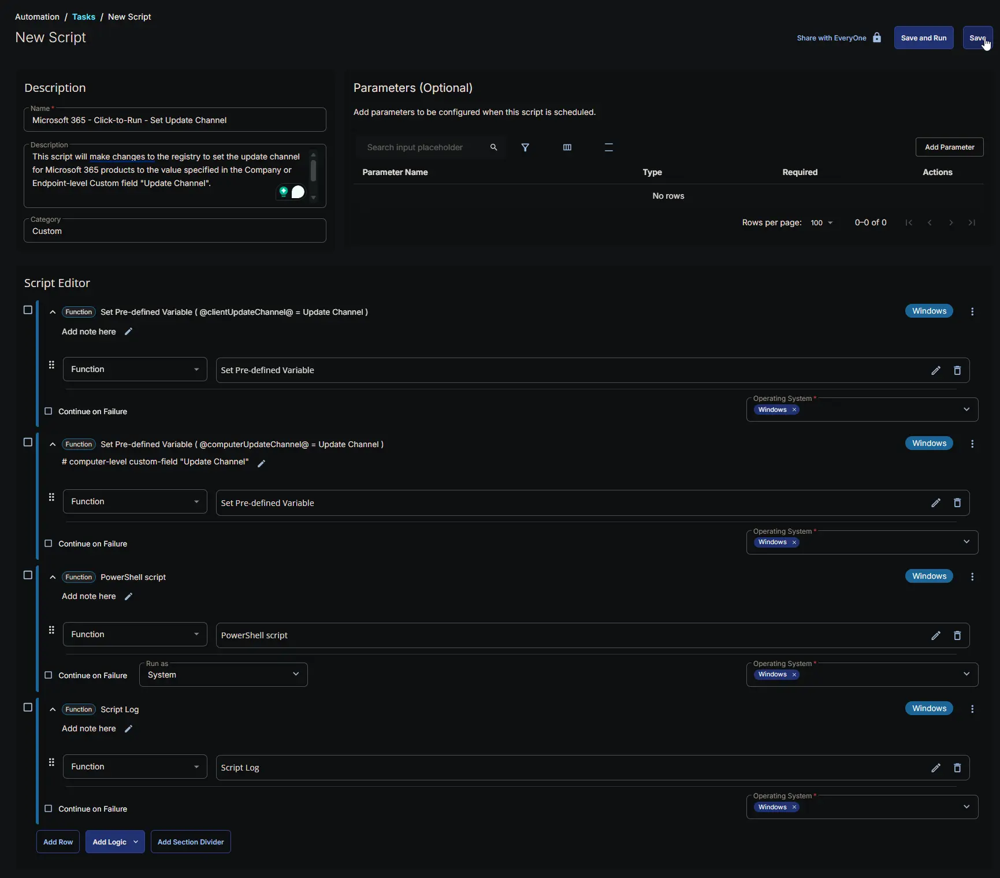

## Summary

Configures the Microsoft Office Click-to-Run update channel using custom fields.

> **Note:** Set the 'Update Channel' custom field at either the company or endpoint-level before running this task.

## Sample Run



## Dependencies

- [Custom Field - Client - Update Channel](/docs/656f037b-8dba-4e59-b135-33dcd5b0b7dc)
- [Custom Field - Endpoint - Update Channel](/docs/772c0498-4505-4f1c-afc4-46788294b3e2)
- [Solution - Microsoft 365 - Click-to-Run - Set Update Channel](/docs/b605b808-7016-4911-8c37-6b950de40919)

## Custom Fields

| Name                | Example                                   | Level   | Type | Required | Available Options | Description                 |
|---------------------|-------------------------------------------|---------|------|----------|--------------------|----------------------------|
| [Update Channel](/docs/656f037b-8dba-4e59-b135-33dcd5b0b7dc) | `Current Channel` | `Company` | Dropdown | Partially |   *(See below)*                  | Sets the default update channel for all endpoints at the company level. |
| [Update Channel](/docs/772c0498-4505-4f1c-afc4-46788294b3e2) | `Semi-Annual Enterprise Channel` | `Endpoint` | Dropdown | Partially |   *(See below)*                  | Overrides the company-level update channel for a specific endpoint. |

> **Note:** At least one of the above custom fields must be set before running this task. If both are set, the endpoint-level value takes precedence over the company-level value.

**Available Options:**  

- Current Channel
- Monthly Enterprise Channel
- Semi-Annual Enterprise Channel
- Beta Channel
- None

## Task Setup Path

- **Tasks Path:** `AUTOMATION` ➞ `Tasks`  
- **Task Type:** `Script Editor`  

## Task Creation

### Description

- **Name:** `Microsoft 365 - Click-to-Run - Set Update Channel`  
- **Description:**  

```PlainText
This script will make changes to the registry to set the update channel for Microsoft 365 products to the value specified in the Company or Endpoint-level Custom field "Update Channel".

https://content.provaltech.com/docs/3627ba40-ca53-4583-8435-bb09bdb03f20
```

- **Category:** `Custom`



### Script Editor

#### Row 1: Set Pre-defined Variable ( @clientUpdateChannel@ = Update Channel )

- **Notes:** `# client-level custom-field "Update Channel"`  
- **Variable Name:** `clientUpdateChannel`  
- **Type:** `Custom Field`  
- **Custom Field:** `Update Channel` *(Select the company-level custom field)*  
- **Continue on Failure:** `False`  
- **Operating System:** `Windows`



#### Row 2: Set Pre-defined Variable ( @computerUpdateChannel@ = Update Channel )

- **Notes:** `# computer-level custom-field "Update Channel"`  
- **Variable Name:** `computerUpdateChannel`  
- **Type:** `Custom Field`  
- **Custom Field:** `Update Channel` *(Select the endpoint-level custom field)*  
- **Continue on Failure:** `False`  
- **Operating System:** `Windows`



#### Row 3: PowerShell script

- **Notes:** `<Leave it Blank>`  
- **Continue on Failure:** `False`  
- **Run As:** `System`  
- **Operating System:** `Windows`  
- **Expected time of script execution in seconds:** 300  
- **PowerShell Script:**  

[PowerShell Script](https://github.com/ProVal-Tech/cw-rmm/blob/main/tasks/microsoft-365-click-to-run-set-update-channel/script.ps1)




#### Row 4: Script Log

- **Notes:** `<Leave it Blank>`  
- **Continue on Failure:** `False`  
- **Operating System:** `Windows`  
- **Script Log Message:** `%Output%`



## Completed Script



## Output

- Script Log

## Changelog

### 2026-06-16

- Enhanced PowerShell script
- Simplified the task
- Documentation

### 2025-04-10

- Initial version of the document

