## Summary

This task will make changes in the registry to set the update channel for Microsoft 365 products to the value set in the Client or Computer level Custom Fields `Update Channel`.

## Sample Run

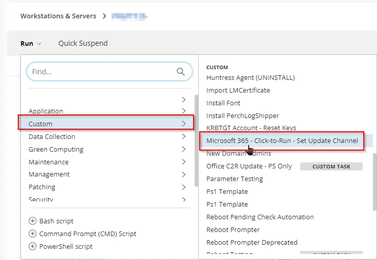

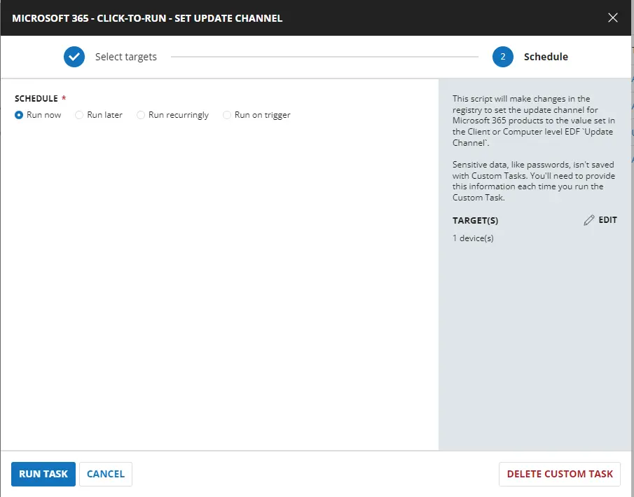

## Dependencies

[Microsoft 365 - Click-to-Run - Set Update Channel](/docs/b605b808-7016-4911-8c37-6b950de40919)

## Task Creation

Create a new `Script Editor` style script in the system to implement this task.


**Name:** Microsoft 365 - Click-to-Run - Set Update Channel

**Description:** This script will change the registry to set the update channel for Microsoft 365 products to the value set in the Client or Computer level EDF `Update Channel`.

**Category:** Custom

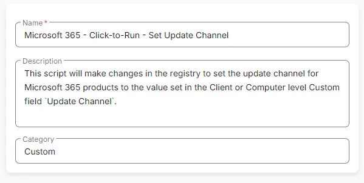

## Task

Navigate to the Script Editor Section and start by adding a row. You can do this by clicking the `Add Row` button at the bottom of the script page.


A blank function will appear.


### Row 1 Function: Set User Variable

Select `Set User Variable` from the dropdown menu.

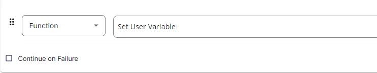

Set `UpdateChannel` as the variable name and `None` as the value.

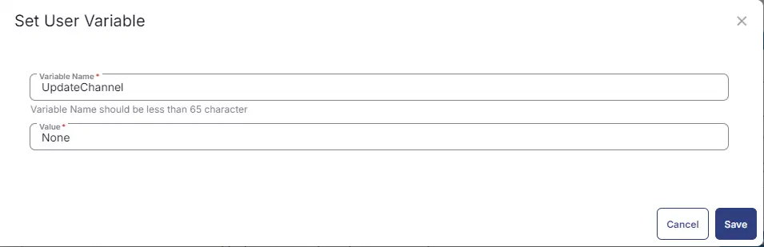

### Row 2 Logic: If/Then

Add a new `If/Then` logic from the Add Logic dropdown menu.


#### Row 2a Condition: Custom Field

Select Custom Field in place of Output from the dropdown menu.

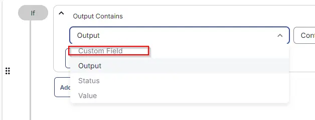

Select `Update Channel (ENUM - ENDPOINT)` in the search, `Does Not Contain` as Comparator, and set `None` in the Value.

#### Row 2b Function: Set Pre-Defined Variable

- Add another row and select `Set Pre-Defined Variable` from the dropdown menu.
- Set `UpdateChannel` in the Variable Name, choose `Custom Field`, and select `Update Channel (ENUM - ENDPOINT)` from the dropdown menu.

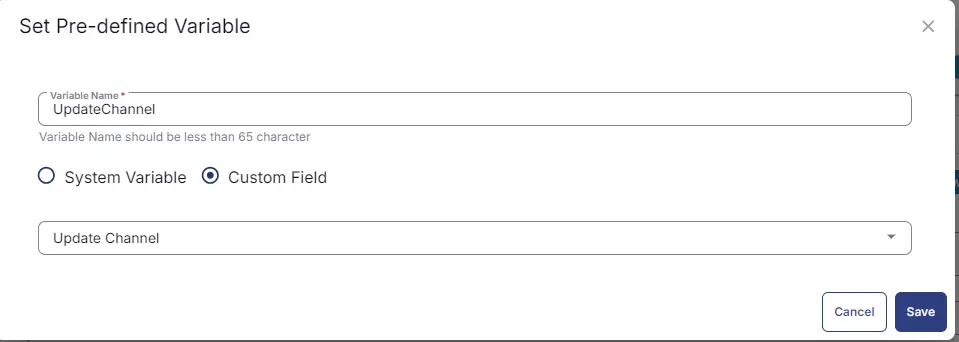

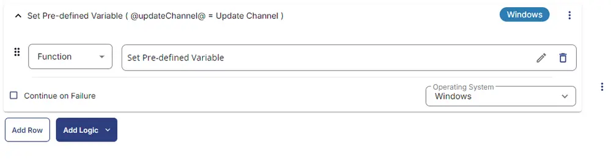

### Row 3 Logic: If/Then

Add a new `If/Then` logic from the Add Logic dropdown menu.

#### Row 3a Condition: Custom Field

Select Custom Field in place of Output from the dropdown menu.


Select `Update Channel (ENUM - Client)` in the search, `Does Not Contain` as Comparator, and set `None` in the Value.

#### Row 3b Function: Set Pre-Defined Variable

- Add another row and select `Set Pre-Defined Variable` from the dropdown menu.
- Set `UpdateChannel` in the Variable Name, choose `Custom Field`, and select `Update Channel (ENUM - Client)` from the dropdown menu.


### Row 4 Logic: If/Then

Add a new `If/Then` logic from the Add Logic dropdown menu.

#### Row 4a Condition: Value

Select `Value` in place of Output from the dropdown menu.

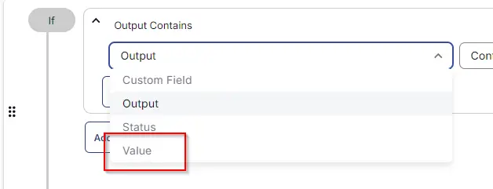

Select `@UpdateChannel@` in the Enter Value, `Equals` as Comparator, and set `None` in the Value.

#### Row 4b Function: Script Exit

Add another row by selecting the `ADD ROW` button.

- Search and select the `Script Exit` function.
- Input the following:

```
Please set the update channel either at the client level or computer level in the Custom Field `Update Channel` before running the script.
```

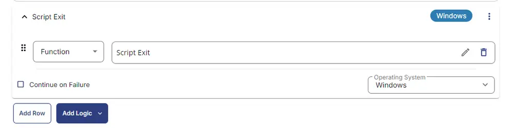

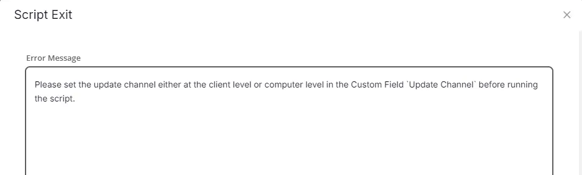

### Row 5 Function: PowerShell Script

Search and select the `PowerShell Script` function.


The following function will pop up on the screen:


Paste in the following PowerShell script and set the expected time of script execution to `900` seconds. Click the `Save` button.

```PowerShell
Function Set-M365UpdateChannel {[CmdletBinding()]
param (
    [Parameter(Mandatory)]
    [ValidateSet('Current Channel',
        'Monthly Enterprise Channel',
        'Semi-Annual Enterprise Channel',
        'Current Channel (Preview)',
        'Semi-Annual Enterprise Channel (Preview)',
        'Beta Channel',
        'LTSC Channel (upto Office 2019)',
        'LTSC Channel (Preview)',
        'LTSC 2021 Channel (Office 2021+)' )]
    [String]$updateChannel
)
# Variables
$guid = switch ($updateChannel) {
    'Current Channel' {
        '492350f6-3a01-4f97-b9c0-c7c6ddf67d60'
    }
    'Monthly Enterprise Channel' {
        '55336b82-a18d-4dd6-b5f6-9e5095c314a6'
    }
    'Semi-Annual Enterprise Channel' {
        '7ffbc6bf-bc32-4f92-8982-f9dd17fd3114'
    }
    'Semi-Annual Enterprise Channel (Preview)'{
        'b8f9b850-328d-4355-9145-c59439a0c4cf'
    }
    'Current Channel (Preview)' {
        '64256afe-f5d9-4f86-8936-8840a6a4f5be'
    }
    'Beta Channel' {
        '5440fd1f-7ecb-4221-8110-145efaa6372f'
    }
    'LTSC Channel (upto Office 2019)' {
        'f2e724c1-748f-4b47-8fb8-8e0d210e9208'
    }
    'LTSC Channel (Preview)' {
        '2e148de9-61c8-4051-b103-4af54baffbb4'
    }
    'LTSC 2021 Channel (Office 2021+)' {
        '5030841d-c919-4594-8d2d-84ae4f96e58e'
    }
    default {
        '492350f6-3a01-4f97-b9c0-c7c6ddf67d60'
    }
}
$path = 'HKLM:\SOFTWARE\Microsoft\Office\ClickToRun\Configuration'
$Strings = @('CDNBaseUrl', 'UpdateChannel', 'UnmanagedUpdateUrl')
$url = "http://officecdn.microsoft.com/pr/$guid"
# Process
Write-Information "Setting Update Channel to $updateChannel" -InformationAction Continue
foreach ( $string in $strings ) {
    if (( Get-ItemProperty -Path $path -Name $string -ErrorAction SilentlyContinue)."$String" -eq $url ) {
        Write-Information "$string is already set to $updateChannel" -InformationAction Continue
    } else {
        try {
            if ( !( Test-Path -Path $path ) ) {
                New-Item -Path $Path -Force -ErrorAction Stop | Out-Null
            }
            Set-ItemProperty -Path $path -Name $string -Value $url -ErrorAction Stop
            Write-Information "$string has been successfully set to $updateChannel" -InformationAction Continue
        } catch {
            Write-Information "Error: Failed to set $string to $updateChannel. Reason: $($Error[0].Exception.Message)" -InformationAction Continue
        }
    }
}
}
Set-M365UpdateChannel -updateChannel '@UpdateChannel@'
```

### Row 6: Function: Script Log

In the script log message, simply type `%output%` so that the script will send the results of the PowerShell script above to the output on the Automation tab for the target device.


## Completed Task

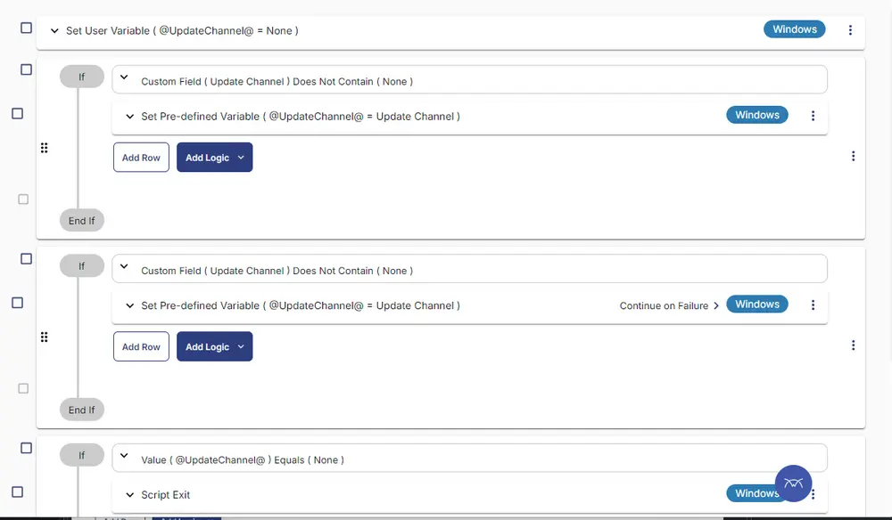

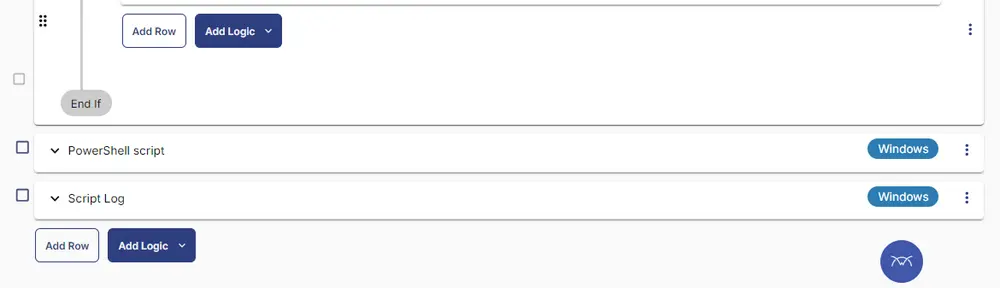

## Output

- Script Log