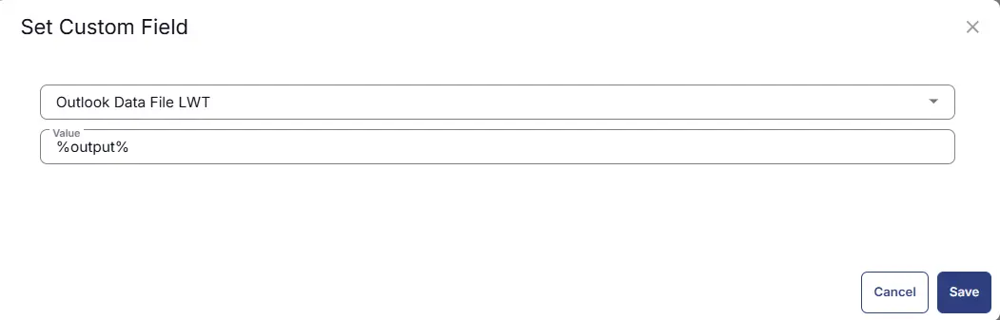

## Summary
This is the RMM implementation of [Microsoft Outlook - OST/PST - Audit](/docs/2029ecbe-c5f8-431e-9643-7aed63bec6d8) script. It collects all the OST/PST file names, sizes and last write time from Windows machines and stores them in Custom Fields.

## Sample Run


## Dependencies
[Endpoint-OSTPSTAudi](/docs/3eff4a8c-36c3-4fb4-9405-d6ca238b9e05)

## Task Creation
Create a new `Script Editor` style script in the system to implement this task.  
  


**Name:** Microsoft Outlook - OST/PST - Audit
**Description:** This task retrieve the file path and size details of OST and PST files from all Windows Workstations
**Category:** Custom  


## Task

Navigate to the Script Editor section and start by adding a row. You can do this by clicking the `Add Row` button at the bottom of the script page.  


A blank function will appear.  


### Row 1 Function: PowerShell Script

Search and select the `PowerShell Script` function.


The following function will pop up on the screen:


Paste in the following PowerShell script and set the expected time of script execution to `300` seconds. Click the `Save` button.

```powershell
$files = Get-ChildItem -Path C:\Users -Include *.ost, *.pst -Recurse -File -ErrorAction SilentlyContinue -Force
if ( $files ) {
    return 'File exists'
} else {
    return 'File Not Found.'
}
```
### Row 2: Function: Script Log

In the script log message, simply type `%output%` so that the script will send the results of the PowerShell script above to the output on the Automation tab for the target device.


## Step 3 Logic: If/Then

- Add a new `If/Then` logic from the Add Logic dropdown menu.  
  

## ROW 3a Condition: Output Contains

- Type `File exists` in the Value box.  


## ROW 3b Function: Powershell Script

- Add a new row in the If Section of the If-Else part by clicking the Add Row button  
- Search and select the `PowerShell Script` function.
- Paste in the following PowerShell script in the pop up box and set the expected time of script execution to 300 seconds. Click the Save button.

```powershell
$outputString = ''
$files = Get-ChildItem -Path C:\Users -Include *.ost, *.pst -Recurse -File -ErrorAction SilentlyContinue -Force
if ( $files ) {
    foreach ( $file in $files ) {
        $outputString += "$($file.fullname -replace "'", "\'" -replace "$([char]0x2018)|$([char]0x2019)", "\'")"
    }
    return $outputString.TrimEnd(',')
} else {
    return 'File Not Found.'
}
```


## ROW 3c Function: Set Custom Field
- Add a new row in the If Section by clicking the Add Row button  
- Search and select the `Set Custom Field` function.  


- Search and select the `Outlook Data File Paths` Custom Field.  
- Type `%output%` in the `Value` box and click the Save button.  

## ROW 3d Function: Powershell Script
- Add a new row in the If Section.
- Search and select the `PowerShell Script` function.
- Paste in the following PowerShell script in the pop up box and set the expected time of script execution to 300 seconds. Click the Save button.

```powershell
$outputString = ''
$files = Get-ChildItem -Path C:\Users -Include *.ost, *.pst -Recurse -File -ErrorAction SilentlyContinue -Force
if ( $files ) {
    foreach ( $file in $files ) {
        $outputString += "$([Math]::Round($file.Length / 1024 / 1024,2))"
    }
    return $outputString.TrimEnd(',')
} else {
    return 'File Not Found.'
}
```


## ROW 3e Function: Set Custom Field
- Add a new row in the If Section by clicking the Add Row button  
- Search and select the `Set Custom Field` function.  


- Search and select the `Outlook Data File Size` Custom Field.  
- Type `%output%` in the `Value` box and click the Save button. 

## ROW 3f Function: Powershell Script
- Add a new row in the If Section.
- Search and select the `PowerShell Script` function.
- Paste in the following PowerShell script in the pop up box and set the expected time of script execution to 300 seconds. Click the Save button.

```powershell
$outputString = ''
$files = Get-ChildItem -Path C:\Users -Include *.ost, *.pst -Recurse -File -ErrorAction SilentlyContinue -Force
if ( $files ) {
    foreach ( $file in $files ) {
        $outputString += "$($file.lastwritetime.ToString('yyyy-MM-dd HH:mm:ss'))"
    }
    return $outputString.TrimEnd(',')
} else {
    return 'File Not Found.'
}
```


## ROW 3g Function: Set Custom Field
- Add a new row in the If Section by clicking the Add Row button  
- Search and select the `Set Custom Field` function.  


- Search and select the `Outlook Data File LWT` Custom Field.  
- Type `%output%` in the `Value` box and click the Save button.  


## Completed Task


## Output
- Script Logs